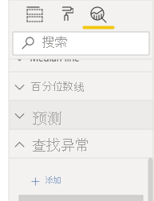
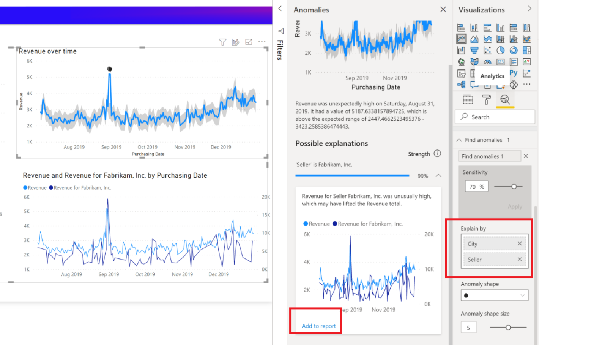

# 异常情况检测（预览版）

[!INCLUDE[consumer-appliesto-nyyn](../includes/consumer-appliesto-nyyn.md)]    

异常情况检测可通过自动检测时间序列数据中的异常来帮助优化折线图。 它还提供异常情况的说明，以帮助进行根本原因分析。  只需单击几下鼠标，就能轻松找到见解，而无需交叉分析数据。 可以在 Power BI Desktop 和 Power BI 服务中创建和查看异常情况。 本文中的步骤和图示来自 Power BI Desktop。

此功能处于预览状态，因此需要首先打开此功能开关。 转到“文件” > “选项和设置” > “选项” > “预览功能”，并确保“异常情况检测”处于开启状态    ：

:::image type="content" source="media/power-bi-visualization-anomaly-detection//preview-feature-switch.png" alt-text="显示如何启用异常情况检测预览功能开关的屏幕截图。":::
 
## 入门
本教程使用各种产品的在线销售数据。若要按照本教程进行操作，请下载联机销售方案的[示例文件](https://github.com/microsoft/powerbi-desktop-samples/blob/main/Monthly%20Desktop%20Blog%20Samples/2020/2020SU09%20Blog%20Demo%20-%20September.pbix)。

你可以通过选择图表并在分析窗格中添加“查找异常”选项来启用异常情况检测。 

 

 例如，此图表显示随时间推移的收入。 添加异常情况检测的结果是自动使用异常值和预期范围的值来丰富图表。 当值超出此预期范围时，将其标记为异常。 有关此异常检测器算法的详细信息，请查看此[技术博客](https://techcommunity.microsoft.com/t5/ai-customer-engineering-team/overview-of-sr-cnn-algorithm-in-azure-anomaly-detector/ba-p/982798)。

 
 
## 格式异常

这种体验的可定义程度高。 可以设置异常形状、大小和颜色，还可以设置预期范围的颜色、样式和透明度。 你还可以配置算法的参数。  如果提高敏感度，算法对数据的更改会更敏感。 在这种情况下，即使微小的偏差也会标记为异常。 如果降低敏感度，算法对异常的判断结果就更多样化。

 
 
## 说明
除了检测异常情况外，还可以自动解释数据异常。 选择异常后，Power BI 会对数据模型中的各个字段运行分析，以提供可能的解释。 它用自然语言对异常情况进行了说明，并提供与该异常情况相关的因素，按说明强度排序。 这里我看到 8 月 30 日的收入是 5187 美元，高于预期的 2447 美元到 3423 美元。 我可以打开这个窗格中的卡片来查看更详细的说明。

 
### 配置说明
你还可以控制用于分析的字段。 例如，通过将卖方和城市拖动到“说明依据”字段框，Power BI 将仅对这些字段进行分析。 在这种情况下，8 月 31 日的异常似乎与特定卖方和特定城市关联。 在此，卖方“Fabrikam”的强度为 99%。 Power BI 通过按维度筛选时期望值的偏差与总值偏差的比率来计算强度。 例如，异常点的组件时序 Fabrikam 的实际值减去预期值的结果与聚合时序总收入的实际值减去预期值的结果的比率 。 打开这张卡可以看到一个视觉对象，显示此卖方 8 月 31 日的收入猛增。 使用“添加到报表”选项可将此视觉对象添加到页面。

## 限制
- 只有“轴”字段中包含时序数据的折线图视觉对象才支持异常情况检测。
- 在折线图视觉对象中，图例、多值或辅助值不支持异常情况检测。
- 异常情况检测至少需要 12 个数据点。
- 预测线/最小值线/最大值线/平均值线/中值线/百分位数线不适用于异常情况检测。
- 不支持通过 SAP 数据源进行直接查询、Power BI 报表服务器、与 Azure Analysis Services 和 SQL Server Analysis Services 的实时连接。
- 异常情况说明不适用于“值显示方式”选项。
- 不支持向下钻取以转到层次结构的下一个级别。
