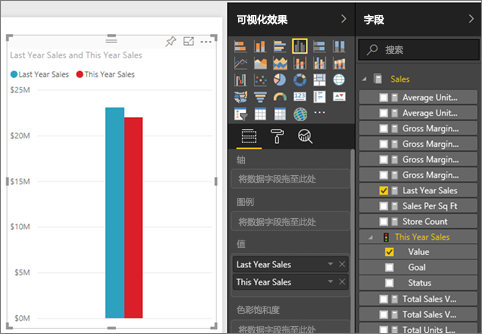
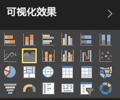
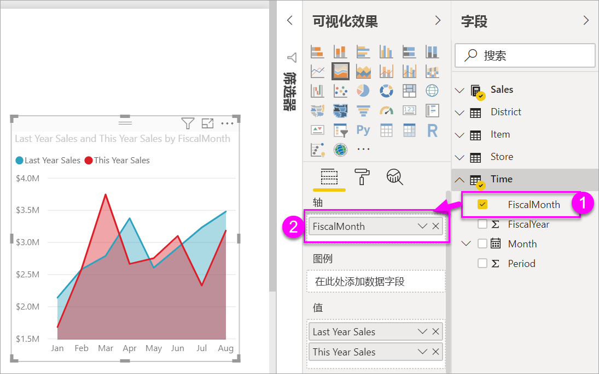

# 创建和使用基本面积图

[!INCLUDE[consumer-appliesto-nyyn](../includes/consumer-appliesto-nyyn.md)]

[!INCLUDE [power-bi-visuals-desktop-banner](../includes/power-bi-visuals-desktop-banner.md)]

基本分区图（又称为分层分区图）在折线图的基础上构建。 轴和行之间的区域使用颜色进行填充以指示量。 

分区图强调变化随时间推移的度量值，可以用于吸引人们关注某个趋势间的总值。 例如，可以在分区图中绘制表示随时间推移的利润的数据以强调总利润。

> [!NOTE]
> 与 Power BI 同事共享报表时，你和这位同事都应具有独立的 Power BI Pro 许可证，并且应将报表保存在 Premium 容量中。

## 何时使用基本面积图
基本分区图适用情况：

* 查看并比较各个时序间的量趋势 
* 对于表示可以物理方式计数的集合的各个序列

### 先决条件
本教程使用[零售分析示例 PBIX 文件](https://download.microsoft.com/download/9/6/D/96DDC2FF-2568-491D-AAFA-AFDD6F763AE3/Retail%20Analysis%20Sample%20PBIX.pbix)。

1. 在菜单栏的左上方，选择“文件” > “打开” 
   
2. 查找 **零售分析示例 PBIX 文件** 的副本

1. 在报表视图中打开 **零售分析示例 PBIX 文件**。

1. 选择  ，以添加新报表页。

## 创建基本面积图
 

1. 这些步骤有助于创建按月显示本年度销售额和上年度销售额的分区图。
   
   a. 在“字段”窗格中，依次选择“销售额”\>“去年销售额”，再依次选择“今年销售额 > 值” 。

   

   b.  在“可视化效果”窗格中，选择“分区图”图标，将图表转换为基本分区图。

   
   
   c.  选择“时间”\>“会计月”以将其添加到“轴”。   
   
   
   d.  若要按月显示图表，请选择“省略号”（视觉对象的右上角）并选择“按月排序”。 要更改排序顺序，请再次选择省略号并选择“升序排序”或“降序排序”。

## 突出显示和交叉筛选
有关使用筛选器窗格的信息，请参阅[向报表添加筛选器](../create-reports/power-bi-report-add-filter.md)。

若要突出显示图表中的特定分区，请选择相应分区或其上边框。  与其他可视化效果类型不同，如果同一页面上还有其他可视化效果，突出显示基本分区图不会交叉筛选报表页上的其他可视化效果。 但是，面积图是报表页上其他可视化效果触发的交叉筛选的目标。 

1. 通过选择分区图并将其复制到“新商店分析”报表页（CTRL-C 和 CTRL-V）来进行尝试。
2. 选择分区图中的其中一个阴影区域，然后选择另一个阴影区域。 你将注意到对页面上其他可视化效果的影响。
1. 现在选择一个元素。 请注意对分区图的影响：它将被交叉筛选。

     

若要了解详细信息，请参阅[报表中的视觉对象交互](../create-reports/service-reports-visual-interactions.md)

## 注意事项和疑难解答   
* [残障人士能够更轻松地访问报表](../create-reports/desktop-accessibility-overview.md)
* 基本面积图对于比较值无效，因为分层区域上是封闭的。 Power BI 使用透明度指示区域的重叠。 但是，它只适用于两个或三个不同区域。 需要将趋势与三个以上的度量值进行比较时，请尝试使用折线图。 需要将量与三个以上的度量值进行比较时，请尝试使用树状图。

## 下一步
[Power BI 中的报表](power-bi-visualization-card.md)  
