# <a name="best-design-practices-for-reports-and-visuals"></a>设计报表和视觉对象的最佳做法

本文介绍了在 Power BI 中设计报表的最佳做法。 其中介绍的设计原则适用于报表，以及组成报表的报表页和各个视觉对象。 其中许多最佳做法同样适用于设计仪表板。

> [!NOTE]
> 本文中提出的建议是在合理情况下适用的指南。 对于下述每个原则，通常有令人信服的理由才能“违反规则”。

希望本文可以成为你的起点，让你能够运用所学到的知识来设计你自己的报表和可视化效果，同时继续在 [Microsoft Power BI 社区](http://community.powerbi.com/)上进行对话交流。 BI 报表设计和可视化效果用法是当下的热门话题。 有许多思想领袖、博客主和网站拓展和深入研究了 BI 报表设计。 本文末尾列出了其中一些研究成果。

> 信息让我们不知所措，不是因为信息太多，而是因为我们不知道如何让信息为自己所用。 
-- Stephen Few

## <a name="a-look-at-the-landscape-and-terminology"></a>背景知识和术语概述

在 Power BI 中，报表可以有一个或多个报表页。 所有报表页统称为“报表”。 报表的基本元素是视觉对象（亦称为“可视化效果”）、独立图像和文本框。 从各个数据点到报表元素，再到报表页面本身，有数不清的格式选项可供选择。

我们将先介绍报表规划阶段，接着介绍基本的报表设计原则，然后介绍视觉对象设计原则，最后介绍各种视觉对象类型的最佳做法。

有关生成和使用 Power BI 报表的详细指南和说明，请访问[学习 Power BI](https://powerbi.microsoft.com/learning/)。

## <a name="before-you-build-your-first-visualization-focus-on-requirements"></a>生成首个可视化效果前，重点关注需求

报表生成工作从生成首个视觉对象之前就开始了。 优质报表需要提前计划。 请了解需要处理哪些数据，并记下要满足的报表需求。 请仔细想想以下问题：

* 业务需求是什么？

* 读者将如何使用此数据？

* 谁将使用此数据？

* 读者要根据此报表制定什么决策？

这些问题的答案决定了你的设计方向。 每个报表都需要向读者传达信息。 请确保所传达的信息能够满足业务需求。 我们可能很容易就会添加提供引人注目的见解的视觉对象，但如果这些见解无法满足业务需求，报表就没有用。 实际上，这些视觉对象可能会分散用户注意力。 此外，你可能还会发现无法从这样的数据中收集信息来制定决策。 此报表能用来满足你的度量需求吗？

报表可用于监视、发现、跟踪、预测、度量、管理、测试等用途。 例如，如果业务需求是生成可度量业绩的销售报表， 你可以设计下面这样的报表：研究当前销售额并将它与旧销售额进行比较，同时与竞争对手进行比较，并包含一些触发警报的 KPI。 读者可能会深入了解销售数据，以发现可能会影响销售额的店面关闭或供应链问题。 还有一种深入了解的方式是按商店、地区、产品、季节等因素查看销售额。

了解报表面向的客户。 设计的报表既要使用客户熟悉的术语，又要确保数据细化程度和复杂程度与客户的知识水平相当。 客户类型不止一种？ 没有一种对所有类型客户都适用的报表。 请设计各个以客户专长为依据的报表页。 请确保每个报表页都有清晰的标签，以便客户能够自我认定。 也可以使用切片器，以便客户能够根据自己的需求定制页面。 请在规划阶段仔细考虑客户需求，避免生成自以为客户需要的报表的错误做法。 如果你犯了这个错误，请准备重新开始并重复做。

确定业务需求、客户以及要添加的指标后，下一步便是选择合适的视觉对象来传达信息。 了解如何以最有效的方式来呈现这些视觉对象。 接下来，将先介绍一些报表设计基本原则。

## <a name="principles-of-report-design"></a>报表设计原则

报表页的空间有限，最困难的事情之一就是，要在此空间内呈现所需的全部元素，同时还仍易于读者理解所传达的信息。 此外，也不要低估视觉上吸引人的报表的价值。 关键在于，平衡报表的吸引力和实用性。

接下来，我们要了解布局、清晰度和美观。

### <a name="layout-of-the-report-canvas"></a>报表画布布局

报表画布的空间有限。 如果无法在一个报表页上呈现所有元素，请将报表划分成多个报表页。 可以定制面向特定受众（例如，人力资源、IT、销售、SLT）的报表页。 如果需要，可以将它定制为解决特定业务问题：

* “缺陷如何影响故障时间？”

* “市场营销活动对情绪有何影响？”

也许把它作为渐进式信息来传达会更好。 可以这样设计：报表第一页是概述或“勾住”客户的引人注目报表页，第二页继续传达数据信息，第三页更深入地探索要传达的信息，等等。 如果使用一个报表页就能呈现整个报表，那也不错。 如果不能，请创建对内容进行逻辑分块的各个报表页面。 别忘了为报表页命名有意义的实用名称。

想想我们是如何布置美术馆的。 你不会将 50 幅艺术作品放在一个小房间内，也不会在房间里放满椅子，更不会每面墙涂不同的颜色。 作为策展人，你只会选择有共同主题的作品。 你会把它们摆放在房间里，给参观者足够的空间去活动和思考。 甚至可以放置信息卡来描述参观者正在欣赏的作品。 这就是大多数现代美术馆采用素面墙的原因所在！

对于本文，我们将从有多处需要改进的示例报表入手。 在我们遵循最佳做法和设计原则修改报表后，我们的报表将会有所改进。


**图 1：此报表页面非常难看，有许多需要改进的地方**

上述示例存在许多与空间相关的（布局）设计问题，具体如下：

* 对齐、有序和使用邻近感应

* 空间和排序使用不当

* 杂乱无章

### <a name="alignment-order-and-proximity"></a>对齐、有序和邻近区域

报表元素布局不仅可以影响读者理解，还能引导读者浏览整个报表页。 元素的布置方式也在向读者传达信息。 传达的信息可能是“从这里开始，然后看这里”，也可能是“这三个元素彼此相关”。

* 在很多文化中，人们从左往右、从上往下进行浏览。 请将最重要的元素放置在报表左上角。 其余视觉对象的排列方式要有助于读者有逻辑地浏览和理解信息。

* 将需要读者选择的元素置于受读者选择影响的可视化效果的左侧：例如，切片器。

* 将与位置相关的元素相互靠近。 邻近感应暗示元素之间的关系。

* 另一种表示关系的方法是在相关元素周围添加边框或颜色背景。 相反，添加分隔条可以区分报表的不同部分。

* 使用空白区域在视觉上对报表页面的各部分进行分块。

* 填满整个报表页面。 如果发现有太多的空白空间，请放大可视化效果或缩小画布。

* 精心调整报表元素大小。 不要通过可用空间大小来决定可视化效果大小。

* 让重要元素大于其他元素，或添加视觉元素（如箭头），以吸引读者注意力。

* 在报表页面上以对称方式或精心设计的不对称方式对齐元素。

接下来，我们将进一步了解对齐。

#### <a name="alignment"></a>对齐

对齐并不意味着不同组件的大小必须相同。 也不意味着，报表的每一行都必须有相同数量的组件。 它只是意味着，报表页采用有助于读者浏览和提高可读性的结构。

可以看到，更新后的报表已对齐左边和右边的报表组件。 每个报表行还进行了水平对齐和垂直对齐。 切片器位于受其影响的视觉对象的左侧。


**图 2：改进并修改了难看的示例报表的布局**

Power BI 提供帮助你对齐视觉对象的工具。 在 Power BI Desktop 中，如果选择多个视觉对象，可以使用“视觉对象工具”  功能区选项卡上的“对齐”  和“分散”  选项来对齐视觉对象。

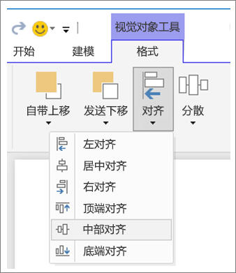

**图 3a：Power BI Desktop 中用于对齐视觉对象的工具**


**图 3b：Power BI 服务中用于对齐视觉对象的工具**

在 Power BI 服务和 Power BI Desktop 中，还可以精确控制视觉对象的大小和位置。 对于所有视觉对象，可以在“格式”  窗格的“常规”  选项卡上找到此类控件：

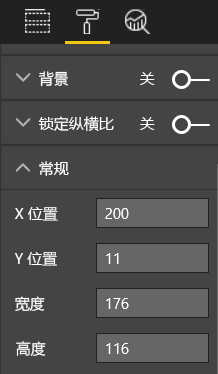

**图 4：设置视觉对象的确切位置**

在示例报表页（图 2）中，Power BI 在“X 位置”  为“200”处对齐两张卡片和一个大边框。

#### <a name="fit-to-the-space"></a>填满整个空间

请充分利用现有空间。 如果你知道读者将会如何查看和显示报表，请在设计时注意这一点。 减少空白区域，填满整个画布。 尽量不要对各个视觉对象使用滚动条。 在填满整个空间的同时，确保视觉对象看起来没有狭促感。

##### <a name="adjust-the-page-size"></a>调整页面尺寸

缩小页面后，各个元素相对于整个页面就会放大。 请取消选择报表页上的所有视觉对象，再使用“格式”  窗格中的“报表页大小”  选项卡。

下面展示的报表页先后采用了“4:3”  和“16:9”  两种报表页大小。 请注意，布局更适应 16:9。 甚至有足够的空间从第二个视觉对象中删除滚动条。

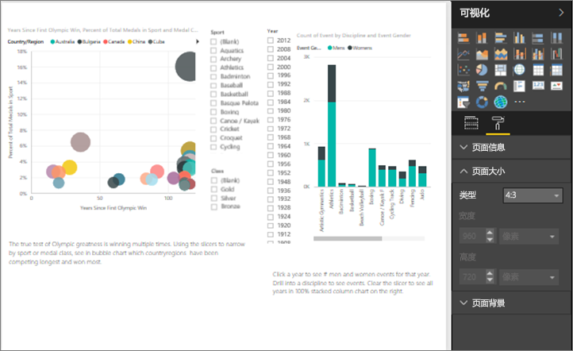

**图 5a：采用 4:3 页面宽高比的报表**

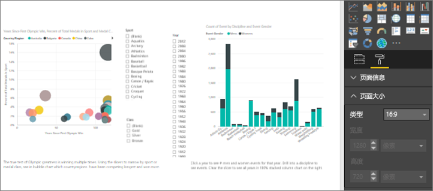

**图 5b：采用 16:9 报表页大小的报表**

读者是会以 4:3、16:9 还是其他纵横比来查看报表？ 小屏幕还是大屏幕？ 读者会在所有可能纵横比和尺寸的屏幕上查看报表吗？ 请在设计时注意这一点。

我们的示例报表页面看起来有点狭促。 在未选择任何视觉对象的情况下：

1. 选择 ， 以打开“格式”  窗格。

1. 展开“报表页大小”  。

1. 对于“类型”  ，选择“自定义”  。

1. 将“高度”  改为“900”  。

    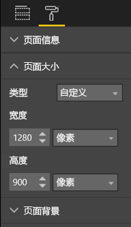

**图 6：增加页面高度**

#### <a name="reduce-clutter"></a>整齐有序

杂乱无章的报表页面很难一眼就理解，甚至可能会令读者感到不知所措，干脆不看。 请删除所有不必要的报表元素。 请勿添加不利于信息理解或浏览的功能。 报表页必须尽可能明确、快速、一致地传达信息。

Edward Tufte 在他的《定量信息的视觉显示》一书中将这称为“数据/墨迹比率”。  其实就是删除所有不必要的内容。

删除杂乱无章的内容将增加报表页上的空白空间。 这样就可以有更多空间来遵循[对齐、有序和使用邻近感应](#alignment-order-and-proximity)部分中介绍的最佳做法。

示例报表已经美观多了。 不仅删除了杂乱无章的内容，还添加了将元素组合在一起的形状。 背景图像没有了，不必要的箭头形状和文本框也没有了，一个视觉对象也被移到另一报表页了，等等。 为了增加空白空间，我们还延长了报表页大小。


**图 7：难看的示例报表变得整齐有序**

### <a name="tell-a-story-at-a-glance"></a>信息传达一目了然

总体测试应为，在事先完全不知道的情况下，无需其他人说明解释即可快速理解报表。 读者应该可以在快速概览后获取报表页以及每个图表/表所要传达的信息。

在查看报表时，读者应该首先关注你想让他们看到的元素。 然后，读者继续从左往右、从上往下进行浏览。 通过添加文本框标签、形状、边框、字号和颜色等视觉提示可以更改此行为。

#### <a name="text-boxes"></a>文本框

有时，可视化效果的标题不足以传达信息。 请添加文本框，向报表读者传达信息。 文本框可用于描述报表页（即一组视觉对象）或各个视觉对象。 文本框可以阐述结果，也可以更好地定义视觉对象、视觉对象中的组件或视觉对象之间的关系。 可以使用文本框根据文本框中突出显示的不同条件来吸引读者注意力。

在 Power BI 服务中，选择顶部菜单栏中的“文本框”  。 （在 Power BI Desktop 中，选择“**插入**”功能区中的“**文本框**”。）


**图 8：在 Power BI 服务中添加文本框**

在空框中输入文本。 然后，使用控件来设置字体、大小、对齐方式等设置。 使用图柄可调整文本框的大小。

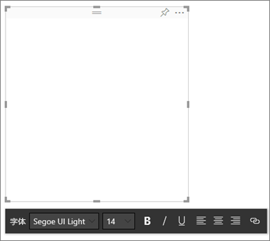

**图 9：设置文本框格式**

不过，也不要矫枉过正。 报表上的文本太多会有损视觉对象的效果。 如果发现报表页需要大量文本才能被读者理解，请重新开始。 能否选取其他视觉对象来更好地传达信息？ 能否调整视觉对象的原生标题，使其更易于理解？

#### <a name="text"></a>文本

请创建文字样式指南，应用于所有报表页面。 只选取少量字体、文本大小和颜色。 文本元素需要遵循此样式指南。 还可以在可视化效果中选择字体时遵循此指南。 请参阅[属于可视化效果的标题和标签](#titles-and-labels-that-are-part-of-the-visualizations)部分。 设置规则，规定何时使用粗体、斜体、增大字号、特定颜色等。 尽量避免全部字母大写或使用下划线。

#### <a name="shapes"></a>形状

形状也有助于信息浏览和理解。 形状可用于将相关信息组合到一起、突出显示重要数据，其中的箭头形状还可用于引导读者视线。 形状有助于读者了解从何处开始查看以及如何理解报表。 在设计术语中，这通常称为“对比”  。

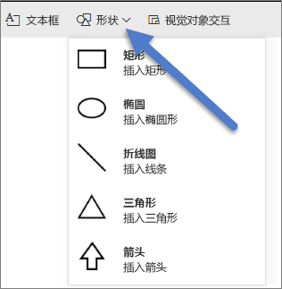

**图 10a：Power BI 服务中的“形状”**

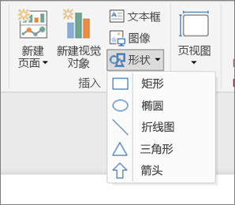

**图 10b：Power BI Desktop 中的“形状”**

我们的示例页面现在看上去怎么样？ 图 11 展示的报表页更加清晰明确、整齐有序，同时一致地使用了文本大小、字体和颜色。 左上角的页面标题对页面进行了介绍。


**图 11：应用了文本指南并添加了标题的示例报表**

示例报表在左上角（即读者首先查看的位置）添加了报表页标题。 标题的字号为 28 磅，字体为 Segoe Bold，有助于将它与报表页的其余内容区分开来。 文本样式指南要求不使用背景、使用黑色标题、图例和标签。 报表页上的所有视觉对象都尽可能地遵循此指南（不可编辑的组合图坐标轴和标签除外）。 此外，下面这些元素也已配置为遵循样式指南规范：

* 卡片：“类别标签”  设置为“关”  ，“标题”  设置为“开”  、12 磅、黑色和居中。

* 视觉对象标题：如果处于“开”  状态，设置为 12 磅和左对齐。

* 切片器：“标头”  设置为“关”  ，“标题”  设置为“开”  。 保留“项”   > “文本”  设置，即为灰色和 10 磅。

* 散点图和柱形图：如果使用，将 X 轴和 Y 轴以及对应标题设置为黑色字体。

#### <a name="color"></a>颜色

使用颜色是为了保持一致性。 下文中的[视觉对象设计原则](#principles-of-visual-design)将详细介绍颜色。 这里要说的是，选择颜色时要慎重。 这样颜色就不会妨碍读者快速理解报表。 过多明亮的颜色会妨碍理解。 这一部分更侧重于颜色使用禁忌。

#### <a name="backgrounds"></a>背景

设置报表页面的背景时，请选择不会令报表黯然失色、与页面上的其他颜色不冲突或一般不会引起眼部不适的颜色。 请注意某些颜色内在的固有含义。 例如，在美国，如果在报表中使用红色，通常会被理解为“坏”。

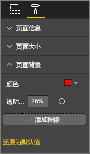

**图 12：设置报表背景**

你不是要创作艺术作品，而是要生成功能报表。 请选择可提高可读性并突出报表元素的颜色。 一项关于网页使用颜色和可视化效果的研究发现，颜色之间的对比度越高，读者的理解速度就越快。 下面两份白皮书探讨了这一主题：

* [文本和背景色对网页视觉对象搜索的影响](https://www.sciencedirect.com/science/article/pii/S0141938202000410)

* [确定用户对网页视觉对象复杂度和审美特征的感知](https://www.researchgate.net/publication/301362579_Determining_Users'_Perception_of_Web_Page_Visual_Complexity_and_Aesthetic_Characteristics)

示例报表（图 20 和 21）遵循了一些颜色最佳做法。 最值得注意的是，背景色改成了黑色。 黄色太明亮，会引起眼部不适。 此外，“按年份和奖牌等级划分的运动员姓名计数”  图表上的黄色条形部分也与黄色背景融为一体。 使用黑色（或白色）背景可实现最高对比度，让视觉对象成为焦点。

下面是我们为了改进示例报表所执行的其他步骤：

#### <a name="page-title"></a>报表页标题

当我们将背景更改为黑色时，标题会消失，因为文本框字段只允许黑色字体。 若要解决此问题，请改为添加文本框标题：

1. 选择文本框后，清除文本。

1. 在“可视化效果”  选项卡上，选择“标题”  ，并将它设置为“开”  。

1. 选择箭头，以展开“标题”  选项。

1. 在“标题文本”  字段中，输入“夏季奥运会”  。

1. 在“字体颜色”  中，选择白色。

    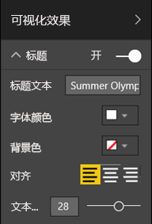

    **图 13：添加页面标题**

#### <a name="cards"></a>卡片

对于卡片视觉对象：

1. 选择 ， 以打开“格式”  窗格。

1. 将“背景”  设置为“开”  。

1. 选择白色，并将“透明度”  设置为“0%”  。

    

1. 然后，将“标题”  设置为“开”  。

1. 在“字体颜色”  中，选择白色；在“背景色”  中，选择黑色。

    

#### <a name="slicers"></a>切片器

到目前为止，两个切片器的格式不同。 这在设计上没有任何意义。 对于这两个切片器： 

1. 将背景色更改为水绿色。

    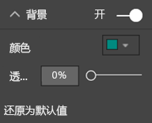

    **图 14：更改切片器背景色**

    最好选择水绿色，因为着色地图、树状图和柱形图使用了这种颜色，所以报表页调色板中也有这种颜色。

1. 添加细白框。

    

    **图 15：为切片器添加边框**

1. 由于在水绿色背景上灰色字体显示不清，因此，请将“项”  颜色更改为白色。

    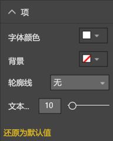

    **图 16：更改切片器字体颜色**

1. 最后，在“标题”  下方，将“字体颜色”  更改为白色，并添加黑色作为“背景色”  。

    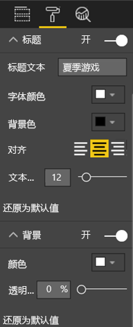

    **图 17：设置切片器标题格式**

#### <a name="rectangle-shape"></a>矩形形状

矩形也与黑色背景融为一体。 若要解决此问题，请执行以下操作：

1. 选择形状。

1. 在“设置形状格式”  窗格中，将“背景”  滑至“开”  。

    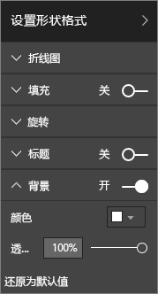

    **图 18：设置形状格式**

#### <a name="column-charts-bubble-chart-filled-map-and-treemap"></a>柱形图、气泡图、着色地图和树状图

为报表页面上的其余视觉对象添加白色背景。 在“格式”  窗格中：

1. 展开“背景”  选项。

1. 将“颜色”  设置为白色。

1. 将“透明度”  设置为“0%”。

    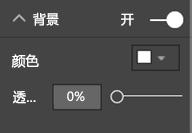

    **图 19：为其余可视化效果添加白色背景**

重新设置格式的报表如下所示：


**图 20：应用了颜色最佳做法（黑色背景）的示例报表**


**图 21：应用了颜色最佳做法（白色背景）的示例报表**

### <a name="aesthetics"></a>美观

上文已介绍我们要考虑的大部分美观问题，如对齐、颜色、字体选择和杂乱无章。 还有一些报表设计最佳做法值得介绍。 这些最佳做法针对的是报表整体外观。

请注意，报表的功能是为了满足业务需求，而不是为了追求美观。 不过，追求一定程度的美观还是有必要的，尤其是在涉及第一印象时。 Nashville 顾问 Tony Bodoh 解释道：“情绪先于逻辑产生。” 读者先会对报表页做出情绪化反应。 然后，他们才会花更多时间来深入挖掘信息。 如果报表页看起来杂乱无章、令人困惑或不专业，读者可能永远不会发现它要传达的重要信息。

博客主和 TechTarget 行业分析师 Wayne Eckerson 打了一个非常形象的比方。 设计报表就像是在装饰房间。 随着时间的推移，你会购买花瓶、沙发、茶几和油画。 所有这些元素单看起来你都很喜欢。 尽管选定的每个元素都有意义，但将这些对象放在一起来看便会产生冲突或分散注意力。

请以下面几点为重点：

* 创建报表的通用主题或外观，并将它应用于所有报表页。

* 使用独立图像和其他图形来帮助传达真实信息，而不分散读者注意力。

* 遵循本文到目前为止介绍的所有最佳做法。

## <a name="principles-of-visual-design"></a>可视对象设计原则

至此，已介绍报表设计原则，以及如何安排报表元素，以便读者能够轻松快速地获取报表所要传达的信息。 现在，我们将了解视觉对象本身的设计原则。 下一部分将深入介绍各个视觉对象，以及一些更常见类型视觉对象的最佳做法。

我们将暂时把示例报表页放在一边，看看其他示例。 在学习了视觉对象设计原则后，我们将再回到示例报表页，并遵循我们所学到的最佳做法。 文中将提供分步说明。

### <a name="planning--choose-the-right-visual"></a>规划 - 选择合适的视觉对象

每个视觉对象同样需要规划，就像开始生成报表前的规划一样重要。 请仔细想想“我要通过此视觉对象传达什么信息”，然后确定哪种类型的视觉对象能最有效地传达此信息。 虽然可以用条形图来显示销售周期进度，但瀑布图或漏斗图是不是能更有效地传达信息？ 若要获取此过程方面的帮助，请阅读本文的最后一部分[视觉对象类型和最佳做法](#visual-types-and-best-practices)。 其中介绍了一些更常见类型视觉对象的最佳做法。 经常出现的状况是，选择的第一个视觉对象类型到头来不是最佳选择，不必对此感到惊讶。 请尝试多种视觉对象类型，看看哪个才是最佳选择。

了解定量数据与分类数据的区别，以及哪种类型的视觉对象最适合传达哪种类型的数据信息。 定量数据通常称为“度量值”，一般是数值。 分类数据通常称为“维度”，可进行分类。 [选择合适的度量值](#choose-the-right-measure)部分对此进行了更深入的介绍。

避免只出于让报表更令人印象深刻的目的而使用花哨或更复杂的视觉对象类型。 只需选择能够传达信息的最简单选项即可。 水平条形图和简单的折线图就能快速传达信息。 这两种类型的图表为人们所熟悉，大多数读者都可以轻松理解。 还有一个好处就是，大多数受众都是从左往右和从上往下进行阅读，因此可以快速扫视这两种类型的图表并理解信息。

你选择的视觉对象是否需要通过滚动才能传达信息？ 请尽量避免使用滚动条。 请尝试应用筛选器，并利用层次结构/向下钻取。 如果这些元素无法删除滚动条，请考虑选择其他类型的视觉对象。 如果仍无法消除滚动，请注意，读者对水平滚动的容忍度高于垂直滚动。

即使选择的视觉对象绝对是最适合传达相应信息的，也仍可能需要借助其他元素的力量。 这就是需要设置标签、标题、菜单、颜色和字号的原因所在。 [设计元素](#design-elements)部分稍后将介绍这些设计元素。

### <a name="choose-the-right-measure"></a>选择合适的度量值

视觉对象要传达的信息是否引人入胜？ 这重要吗？ 不要为了构建视觉对象而构建视觉对象。 你或许会认为数据传达的信息非常吸引人，但事实并非如此。 不要害怕重新开始来尝试更吸引人的信息传达方式。 也许要传达的信息就在那里，但需要采用不同的度量方式。

假设要度量销售经理的业绩。 为此，你会使用什么度量值呢？ 最好的度量方式是以总销售额/总利润、同比增长，还是以目标实现率为依据呢？ 销售人员 Sally 创造的利润可能最高。 如果在条形图中按销售人员划分总利润（与其他销售人员进行比较），他们看起来就像是销售明星。 如果 Sally 的销售成本（差旅费、运费、制造成本等）非常高，仅关注销售额并不能最有效地传达信息。

#### <a name="reflect-reality-dont-distort-reality"></a>反映事实，不歪曲事实

构建的视觉对象可能会歪曲事实。 有一个网站，上面全是数据狂热分子共享的被视为歪曲事实的视觉对象。 评论中的常见主旋律是，对创建并分发此类视觉对象的公司感到十分失望。 歪曲事实的视觉对象传达出公司不可信的信息。

因此，不要创建有意歪曲事实以及按你的要求传达信息的视觉对象。 示例如下：


**图 22：歪曲事实的图表**

在此示例中，好像四家公司之间的差距巨大，而且公司 B 的业绩要远远高于其他三家公司。 请注意，X 轴并不是从 0 开始，所以各家公司之间的差距很可能就在误差范围之内。 下面是数据相同但 X 轴从 0 开始的图表。


**图 23：反映事实的图表**

读者往往认为 X 轴是从 0 开始的。 如果决定不从 0 开始，请确保这样做不会歪曲结果。 建议添加视觉提示或文本框来指出与标准的差异。

### <a name="design-elements"></a>设计元素

选择类型和度量值并创建视觉对象后，是时候微调外观以达到最佳效果了。 本部分介绍了：

* 布局、空间和尺寸

* 文本元素：标签、批注、菜单、标题

* 排序

* 可视交互

* 颜色

#### <a name="tweaking-visuals-for-best-use-of-space"></a>调整视觉对象，最大限度地利用空间

如果要尝试在报表中显示多个图表，最大限度地提高数据/墨迹比率将有助于突出显示要传达的数据信息。如上所述，Edward Tufte 首创了“数据/墨迹比率”这一概念。 目标是在不影响读者的数据理解能力前提下，从图表中删除尽可能多的标记。

在下面的第一组图表中，有多余的坐标轴标签：“2014 年 1 月”  、“2014 年 4 月”  等。 在标题中，“按日期”  是重复的。 每个图表的标题还需要占用图表中的专用水平空间。 通过删除图表标题和启用各个坐标轴标签，我们减少了一些墨迹，更好地利用了整体空间。 还可以删除前两个图表的坐标轴标签，进一步减少墨迹，为数据腾出更多空间。

若要突出显示特定时间段，可以在所有图表后面绘制线条或矩形。 这样有助于引导读者上下浏览并比较图表。

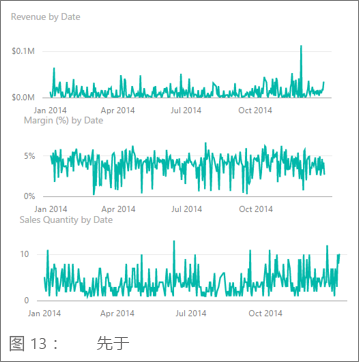

**图 24：改进前**


**图 25：改进后**

启用和禁用坐标轴标题的具体操作 

1. 选择视觉对象，使其处于活动状态。

1. 选择 ， 以打开“格式”  窗格。

1. 展开“X 轴”  或“Y 轴”  选项。

1. 将“标题”  滑块拖至“开”或“关”。

    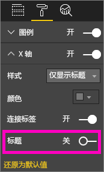

    **图 26：启用和禁用坐标轴标题**

##### <a name="to-turn-axis-labels-on-and-off"></a>启用和禁用坐标轴标签的具体步骤

1. 选择视觉对象，使其处于活动状态。

1. 选择 ， 以打开“格式”  窗格。

1. “X 轴”  和“Y 轴”  旁边为滑块。

1. 拖动滑块来启用或禁用坐标轴标签。

    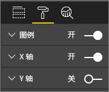

    **图 27：启用和禁用坐标轴标签**

    > [!TIP]
    > 一种可能禁用 Y 轴标签的情况是，已启用“数据标签”  。

##### <a name="to-remove-visual-titles"></a>删除视觉对象标题的具体步骤

1. 选择视觉对象，使其处于活动状态。

1. 选择 ， 以打开“格式”  窗格。

1. 将“标题”  滑块设置为“关”  。

    

    **图 28：从视觉对象中删除标题**

考虑一下读者将如何查看报表。 请确保视觉对象和文字足够大且颜色足够深，以方便读者阅读。 如果报表页上有一个所占比例较大的视觉对象，读者可能会认为它是最重要的。 请在视觉对象之间留有足够的空白区域，让报表看起来整齐有序、易于理解。 对齐视觉对象有助于引导读者视线。

##### <a name="to-resize-a-visual"></a>重设视觉对象大小的具体步骤

1. 选择视觉对象，使其处于活动状态。

1. 捕捉并拖动其中一个图柄来调整大小。

    

    **图 29：调整视觉对象大小**

##### <a name="to-move-a-visual"></a>移动视觉对象的具体步骤

1. 选择视觉对象，使其处于活动状态。

1. 选择并按住视觉对象顶部中间的控制手柄条

1. 将视觉对象拖到新位置。

    

    **图 30：移动视觉对象**

#### <a name="titles-and-labels-that-are-part-of-the-visualizations"></a>可视化效果的标题和标签

请确保标题和标签清晰可辨、直观明了。 标题和标签中的文本必须采用最适合的字号和对比鲜明的颜色。还记得样式指南（见本文前面介绍的[文本](#text)部分）吗？ 请限制颜色和字号的数量。太多不同的字号和颜色会让页面看起来有狭促感，且令人困惑。 建议对报表页上所有视觉对象的标题使用相同的字体颜色和字号。 此外，还对报表页上的所有标题选择相同的对齐方式。

**“格式”窗格**

若要执行下列各项格式设置更改，请选择“滚动油漆刷”图标 ， 以打开“格式”  窗格。

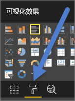

**图 31：打开“格式”窗格**

然后，选择要调整的视觉对象元素，并确保将它设置为“开”  。 视觉对象元素示例包括：X 轴  、Y 轴  、标题  、数据标签  和图例  。 以下示例展示了“标题”  元素。

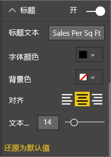

**图 32：设置视觉对象的标题格式**

##### <a name="set-the-text-size"></a>设置文本大小

可调整标题和数据标签的文本大小，但无法调整 X 轴/Y 轴或图例的文本大小。 对于具体的数据标签，可以使用“显示单位”  和“小数位数”  。 最终会找到最适合在报表上显示信息的详细程度。

##### <a name="set-the-text-alignment"></a>设置文本对齐方式

可以选择左对齐、右对齐或居中对齐标题。 请选择一种对齐方式，然后将同样的设置应用于页面上的所有视觉对象。

##### <a name="set-the-text-position"></a>设置文本位置

可以调整一些 Y 轴和图例的文本位置。 无论如何选择，请对报表页上的其他 Y 轴和其他任何图例进行相同的调整。

##### <a name="set-the-title-and-label-length"></a>设置标题和标签长度

请调整标题、坐标轴标题、数据标签和图例的长度。 如果决定显示下列任意元素，请调整长度（以及文本大小），以确保 Power BI 不会截断值：

* 对于“标题”  和“图例”  ，需要设置的是“标题文本”  。 输入将在视觉对象上显示的实际标题。

* 对于“X 轴”  和“Y 轴”  ，需要设置的是“样式”  ，可以下拉列表中进行选择。

* 对于“数据标签”  ，需要设置的是“显示单位”  和“小数位数”  。 使用“显示单位”  下拉列表选择度量单位，包括“百万”  、“千”  、“无”  、“自动”  等。 使用“小数位数”  字段可以指示 Power BI 显示多少位小数。

##### <a name="set-the-text-color"></a>设置文本颜色

可以调整标题、坐标轴和数据标签的文本颜色。

#### <a name="titles-and-labels-that-arent-part-of-the-visualizations"></a>不属于可视化效果的标题和标签

本文的前面部分介绍了如何向报表页添加文本框。 有时，可视化效果的标题不足以传达信息。 添加文本框可以向报表读者传达其他信息。

为了防止报表页面看起来太有狭促感或太令人困惑，请使用一致的文本框字体、字号、颜色和对齐方式。 若要更改文本框中的文本，请选择文本框来调出格式设置菜单。


**图 33：设置文本框中的字体格式**

#### <a name="sorting"></a>排序

一种更快速地提供见解的简单方式是，设置视觉对象排序。 例如，根据条形图中的值按降序或升序对条形图进行排序，可快速显示重要的增量信息，而无需占用更多实际空间。

若要对图表进行排序，请执行以下操作：

1. 选择图表右上角的省略号。

1. 选择“排序”  。

1. 选择要作为排序依据的字段和排序方向。

有关详细信息，请参阅[更改视觉对象的排序方式](../consumer/end-user-change-sort.md)。

#### <a name="chart-interaction-and-interplay"></a>图表交互和相互作用

Power BI 最具吸引力的功能之一就是，能够编辑图表的相互交互方式。 默认情况下，图表可交叉突出显示。也就是说，在你选择数据点后，其他图表中的相关数据会变亮，而不相关的数据则会变暗。 可以替换此行为，将任意图表用作实际筛选器。 这样可以节省报表页上的实际空间。 在 Power BI 服务中，选择菜单栏中的“视觉对象交互”  进行更改。


**图 34：视觉对象交互**

然后，对于报表页上的每个视觉对象，确定要让选定视觉对象进行筛选、突出显示，还是不执行任何操作。 无法突出显示所有视觉对象。 对于无法突出显示的视觉对象，突出显示控件将不可用。 有关详细信息，请参阅 [Power BI 中的视觉对象交互](../consumer/end-user-interactions.md)。

> [!TIP]
> 对于初次接触 Power BI 的读者，可能一下子还不知道可以选择报表与之交互。 请添加文本框，帮助他们了解可以选择哪些对象来获取更多见解。

#### <a name="the-use-of-color-in-visuals"></a>视觉对象中使用的颜色

本文的前面部分介绍了务必要对报表中使用的颜色进行提前计划。 本部分介绍的内容会有一些重复，但主要侧重的还是各个视觉对象中使用的颜色。 需要遵循相同的原则，即使用颜色让报表成为一个整体，并强调重要数据，以提高读者对视觉对象的理解。 使用太多不同的颜色可能会分散读者的注意力。 导致读者很难知道该从哪里开始看。 不要为了追求美观而牺牲读者对信息的理解。 只添加可促进理解的颜色。

> [!TIP]
> 了解受众和颜色内在的固有含义规则。 例如，在美国，绿色通常表示“好”，红色通常表示“坏”。

以下各部分介绍了：

* 数据颜色

* 数据标签颜色

* 分类值的颜色

* 数字值的颜色

##### <a name="use-colors-to-highlight-interesting-data"></a>使用颜色突出显示读者感兴趣的数据

使用颜色的最简单方法是，更改一个或多个数据点的颜色来吸引读者注意力。 在下面的示例中，4 年一届的夏季奥运会和 2 年一届的冬季奥运会的颜色不同。


**图 35：使用颜色传达信息**

可以在“格式”  窗格的“数据颜色”  选项卡中更改数据点颜色。 若要单独自定义各个数据点，请务必将“全部显示”  设置为“开”  。

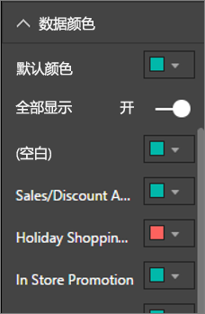

**图 36：设置数据点颜色**

> [!NOTE]
> Power BI 对报表视觉对象应用默认主题。 设计人员选择了主题颜色来确保多样性和对比度。 若不想使用默认主题调色板，请选择“自定义颜色”  。
>
> 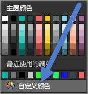
>
> **图 37：选择自定义颜色**

在 Power BI Desktop 中，甚至可以使用第二个序列来突出显示“离群值”  或一段线条：


**图 38：使用 Power BI Desktop 绘制离群值**

在此示例中，只有当平均 8 月温度低于 60，“离群值”  序列中才有值。 为此，使用了以下公式来创建 DAX 计算列：

```
Outliers = if(Editions[Temp]<60, Editions[Temp], BLANK())
```

示例中有三个离群值：“1952 年”  、“1956 年”  和“2000 年”  。

##### <a name="colors-for-labels-and-titles"></a>标签和标题的颜色

浏览所有可用的格式设置选项后，你会发现有许多不同的地方可以为标题和图例添加颜色。 例如，你可以更改数据标签和坐标轴标题的颜色。 不过要小心。 通常情况下，建议对所有视觉对象标题使用一种颜色。 与本文中的其他指南一样，总是存在打破规则的例外情况和原因。 如果真的决定要打破规则，理由就一定要充分。

##### <a name="colors-for-categorical-values"></a>分类值的颜色

包含序列的图表通常图例中有分类值。 例如，以下图例中的每种颜色分别代表不同类别的国家/地区。


**图 39：应用了默认颜色**

设计人员选择了 Power BI 使用的默认颜色，可以很好地从颜色上区分分类值，从而易于读者区分。 有时，为了与企业架构匹配等原因，有人会更改这些颜色，但这样做可能会导致问题出现。


**图 40：应用了一种颜色的不同色调**

此视觉对象只使用颜色浓度不同的一种色调，这会让读者误以为分类之间存在排序关系。 它会暗示深色调气泡在某方面高于或低于浅色调气泡。 与按字母顺序排序不同，这种分类值通常没有固有的排序顺序。

若要更改默认颜色，请选择 ， 以打开“格式”  窗格，再选择“数据颜色”  。

##### <a name="colors-for-numerical-values"></a>数字值的颜色

对于确实存在某种固有顺序的数值字段，你也可以按值对数据点进行着色。 按值对数据点进行着色有助于显示数据中值的分散情况，也可便于 Power BI 在一个图表上显示两个变量。 以下图表明确指出，尽管中国的奖牌数最多，但日本和泰国参加奥运会的次数更多。


**图 41：按值对数据点进行着色**

若要创建此图表，请执行以下操作：

1. 选择视觉对象，使其处于活动状态。

1. 选择 ， 以打开“格式”  窗格。

1. 依次选择“数据颜色”  >“选项”>“条件格式”  ：

    

    **图 42：选择“条件格式”**

1. 在“默认颜色 - 数据颜色”   对话框中调整这些颜色。

    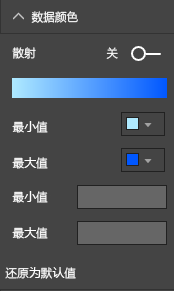

    **图 43：调整对饱和度使用的颜色**

此外，还可以使用颜色来强调与中间值的差异。 例如，将正值设置为绿色，将负值设置为红色。 向正值或负值分配颜色时，请注意文化差异。 并不是所有的文化都用红色表示“坏”，而用绿色表示“好”。


**图 44：强调与中间值偏差的着色**

### <a name="principles-of-visual-design--applied-to-example-report-page"></a>可视对象设计原则 - 应用于示例报表页面

现在，让我们将上文所述的可视对象设计原则应用于我们的示例报表。


**图 45：示例报表（改进前）**


**图 46：示例报表（改进后）**

#### <a name="what-did-we-do"></a>我们做了哪些改进？

| 项 | 说明 |
| ---- | ----------- |
| 切片器 | 通过添加报表页级别筛选器，并且只选择了“金牌”  、“银牌”  和“铜牌”  ，从切片器中删除了“空白”选项。 <br> 对于“单选”  和“全选”  ，将“选择控件”  更改为“关”  。 |
| 气泡图 | 图例项过多，屏幕无法显示全。 删除了图例，改为启用了“类别标签”  。 客户可以将鼠标悬停在气泡之上查看详细信息。<br> 缩短了标题并删除了“按国家/地区”，因为这一点显而易见。 <br> 为 X 轴和 Y 轴启用  了坐标轴标签，让图表更易于理解。 |
| 着色地图 | 更改了“数据颜色”  ，让它更加突出。 <br> 启用了“散射”  ，并将“最小”  设置为粉色，将“最大”  设置为红色。
| 树状图 | 删除了仅为美国设置的筛选器。 <br> 将“数据标签”  设置为显示 1 位小数。 <br> 视觉对象使用的“等级”  字段并不十分有用，因为它几乎对以下 3 种奖牌都始终显示 33%：金牌、银牌和铜牌。 <br> 选择了读者更感兴趣的其他字段，即“性别”  字段。 出于设计目的，将“水上运动”更改为蓝色，将“田径运动”更改为灰色。
| 上部条形图 | 缩短了标题，删除了数据标签，并禁用了图例标题。 <br> 为了与下面的图表匹配，更改了标题的字词顺序。
| 下部条形图 | 为了与上面的图表匹配，按年份进行升序排序。 <br> 更改了颜色以匹配等级。 <br> 更改了标题。 <br> 禁用了图例，为数据腾出更多空间。 <br> 启用了数据标签。 它们不会显示在报表中，因为视觉对象太小，标签不易于阅读。 如果读者以“焦点”  模式打开视觉对象，它们就会出现。 了解[焦点模式](../consumer/end-user-focus.md)。 <br> 向“工具提示”  添加了“比赛数(非重复)”  。 现在，如果你将鼠标悬停在堆积柱形之上，工具提示还会提示当年参赛者参加了多少项比赛。 |
| 视觉对象交互 | 对两张卡片禁用了交互，因为一直想让它们显示奥运会总届数和总比赛数。 |

## <a name="visual-types-and-best-practices"></a>视觉对象类型和最佳做法

Power BI 提供了许多本地视觉对象类型。 添加 Microsoft 和 Power BI 社区提供的自定义视觉对象的列表，你会发现所有选项太多了，本文无法全部收录。 接下来将介绍其中一些最常用的本地视觉对象类型。

### <a name="line-charts"></a>折线图


折线图是用于呈现一段时间内数据变化的一种强大方式。 实际上，表中数据无法让读者快速扫视峰值、谷值、周期和模式。 以下示例展示了获得的奖牌数和赢得这些奖牌的运动员人数的变化趋势。


**图 47：折线图**

#### <a name="best-practices"></a>最佳做法

* 查看折线图时，读者首先会注意到曲线形状。 因此，需要有让曲线有意义的 X 轴，如时间或分布类别。 如果你在 X 轴上设置产品或地理位置等分类字段，读者就不会对折线图感兴趣。 因为曲线形状不会提供任何有意义的信息。

* 如果选择将多个图表放在彼此的上方和下方，以便更容易地进行跨系列比较（如上），请将 x 轴对齐。 使用筛选器来确保 Power BI 显示相同范围的值。 若要显示日期范围，请确保多个图表的日期范围相同。 两个示例图表的日期范围均为“1896 年到 2012 年”。

* 请充分利用空间。 如果对数据有意义的话，请设置 Y 轴的“起点”  和“终点”  ，以消除图表顶部和底部的空白空间。 这样还有助于视觉对象以实际数据点为重点。 若要设置“起点”  和“终点”  ，请执行以下操作：

  1. 选择视觉对象，使其处于活动状态。

  1. 选择 ， 以打开“格式”  窗格。
  
  1. 展开“Y 轴”  区域，然后设置“起点”  和“终点”  。
  
      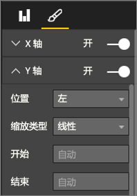
  
      **图 48：设置“起点”和“终点”**

* 明确设置“起点”  和“终点”  的另一个原因是，需要通过相同的 Y 轴字段比较同一报表页上的两个或多个图表。 例如，若要显示累积比赛数，而英国和澳大利亚的计数范围分别介于 1 和 70 以及 1 和 12 之间，那么这两个折线图将显示截然不同的 Y 轴（图 49）。 这样一来，就很难一目了然地进行比较。 请改为将图表设置为使用相同的 Y 轴范围（图 50）。
  
  
  
  **图 49：Y 轴不同的折线图**
  
  
  
  **图 50：Y 轴相同的折线图**

有关详细信息，请参阅：

* [自定义 X 轴和 Y 轴属性](power-bi-visualization-customize-x-axis-and-y-axis.md)

* [折线图和不规则区间：不兼容的合作关系](http://www.perceptualedge.com/articles/visual_business_intelligence/line_graphs_and_irregular_intervals.pdf)

* [数据可视化效果 101：折线图](http://www.columnfivemedia.com/data-visualization-101-line-charts)

### <a name="bar-and-column-charts"></a>条形图和柱形图


如果说折线图是用于呈现一段时间内数据变化的标准图表，那么条形图就是用于呈现不同类别的具体值的标准图表。 如果按数值对条形图进行排序，可立即了解最高值和分布情况。 水平条形图可以与长标签很好地搭配使用。


**图 51：水平条形图**

#### <a name="best-practices"></a>最佳做法

* 请显示值的数据标签。 这样更易于标识特定值。 若要显示数据标签，请执行以下操作： 

  1. 选择视觉对象，使其处于活动状态。

  1. 选择 ， 以打开“格式”  窗格。
  
  1. 将“数据标签”  设置为“开”  。

      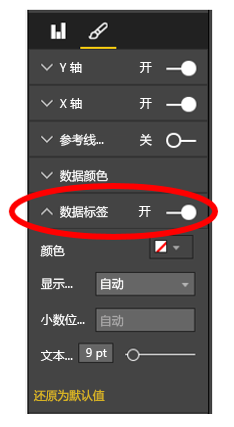

      **图 52：启用数据标签**

* 上面的条形图适用于在一个时间点比较一个度量值与多个度量值。 折线图展示了一段时间内的数据变化趋势，条形图则展示了一个类别在特定时间点的变化趋势。 在上面的条形图中，我们一眼就会发现西班牙是世界上失业率最高的国家之一，它的失业率高达 24.70%。

* 如果所分配的空间不够显示整个条形图或柱形图，Power BI 会添加滚动条。 如果可以，尽量构造能够显示整个图表的视觉对象和报表。 这样，读者可以概览整个分布。 遗憾的是，鉴于全世界有太多的国家/地区，示例还是需要使用滚动条。

  一种限制所包含的值的方法是使用筛选器。 例如，添加视觉对象级别  筛选器，仅显示失业率高于 20% 的国家/地区。

* 可以向下（然后再次向上）钻取条形图和柱形图。 这样可以在视觉对象中有效显示更多信息，而不额外占用实际空间。 以下示例采用了“地区 > 国家”层次结构。 双击地区条可以向下钻取到该地区内的各个国家。 若要详细了解钻取模式，请参阅 [Power BI 可视化效果中的钻取模式](../consumer/end-user-drill.md)。
  
  
  
  **图 53：向下钻取**

如需了解条形图和柱形图的更多详情，请参阅：

* [数据可视化效果 101：条形图](https://insights.newscred.com/data-visualization-101-bar-charts/)

* [数据可视化效果目录：条形图](http://www.datavizcatalogue.com/methods/bar_chart.html#.VYV-hY3bLJw)

* [数据可视化效果目录：多重集条形图](http://www.datavizcatalogue.com/methods/multiset_barchart.html#.VYV_gI3bLJw)

### <a name="stacked-bar-and-column-charts"></a>堆积条形图和堆积柱形图


通过在条形图或柱形图中堆积不同的类别，可以在条形图和柱形图中添加其他维度。 现在，图表既可呈现一种总体趋势（以高度和长度为依据），还可以显示各个类别对此趋势的影响。 下面的图表展示了 2014 年收入超过 60 亿的顶级足球队的整体增长情况。


**图 54：堆积柱形图**

此堆积柱形图显示“总收入”  随着时间的推移不断增长，而且“商业”  和“广播”  类别收入也随着时间的推移稳定增长，使得总收入不断增长。 不过，此图表难以比较三个类别的相互影响。 例如，“商业收入增长相比广播或比赛日的收入增长如何？” 最好使用折线图来呈现此数据，或将折线图用作此数据的伴随视觉对象。

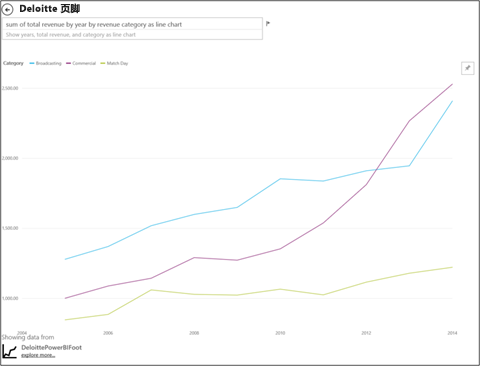

**图 55：转换成折线图**

在此折线图中，更容易看出商业收入增长的幅度最大，随后是广播和比赛日收入增长。

#### <a name="best-practices"></a>最佳做法

* 与柱形图和条形图一样，可以视需要选择水平显示或垂直显示。 如果有长标签，最好选择水平显示；如果有时序数据，最好选择垂直显示。

* 若要呈现一段时间内的变化趋势和其他变化模式，请避免使用堆积条形图/堆积柱形图。 其他图表（如折线图）的效果更好。

* 还可以让分布以总量或占总数的百分比为依据。

* 少数人指出：

    > *...难以比较堆积条形图的各段。如果各段并排排列，且所有段都是从相同的基线向上增长，就可以轻松比较各段的高度。不过，如果各段相互堆积，就难以比较了。此外，尽管（收入）的每月变化情况相当显而易见，但（收入）在其他（类别）中的变化情况则很难看出。*

* 如果总和为 100，最好使用百分比堆积图。 在以下示例中，我们看到的是按球队划分的类别分布。 百分比是相对的，以便我们能够一眼看出模式来。 Everton 的收入主要来自广播（超过 70%），而 PSG 的广播收入占比仅为 20%。 选择水平显示更易于适应球队标签显示和了解收入类型的影响。

  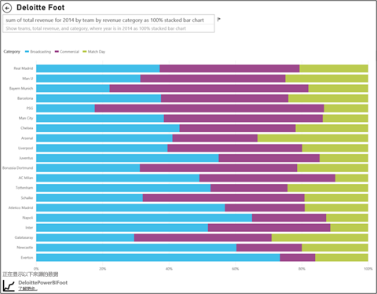

  **图 56：水平堆积图**

若要详细了解堆积图，请参阅：

* [数据可视化效果目录：堆积条形图](http://www.datavizcatalogue.com/methods/stacked_bar_graph.html#top)

* [百分比堆积条形图何时有用？](http://www.perceptualedge.com/blog/?p=2239)

### <a name="combo-bar-and-column-charts"></a>组合条形图和柱形图


在 Power BI 中，可以将柱形图和折线图合并到组合图中。 选项包括： 

* 折线图和堆积柱形图 

* 折线图和簇状柱形图

将两个单独的视觉对象合并为一个，可以节省宝贵的画布空间。

下面的两个屏幕截图展示了合并前后的情况。


 **图 57：两个单独的图表**

第一个屏幕截图中有两个单独的视觉对象，分别是呈现一段时间内人口变化情况的柱形图，以及呈现一段时间内 GDP 变化情况的折线图。 这两个图表非常适合合并到组合图中，因为它们的 X 轴（年）和值（2002 年到 2012 年）均相同。 为什么不通过合并这两个图表在一个视觉对象上比较这两大趋势呢？ 合并这两个图表后，可以更快速地比较数据。


 **图 58：一个组合图**

新的报表页上有一个视觉对象，即折线图和堆积柱形图的组合图。 我们本可以轻松地创建一个折线图和一个簇状柱形图。 现在，两种趋势之间的关系更加显而易见。 我们可以看出，2008 年前，人口和 GDP 的增长趋势类似。 但从 2009 年开始，人口增长变缓，GDP 更加多变。

#### <a name="best-practices"></a>最佳做法

* 当两个视觉对象至少有一个坐标轴相同时，组合图的效果最佳。

* 看看你的坐标轴吧！ 你的组合图是否易于阅读和理解？ 是否使用不同的范围和值？ 如果柱形图的 Y 轴比例尺比折线图的 Y 轴比例尺小得多，组合图便毫无意义。 请注意底部的第三条线（水绿色）。

   

   **图 59：不成功的折线图**

  同样，如果柱形图和折线图使用两个不同的度量值，而且你也没有创建双轴，那么组合图也将毫无意义。 例如，美元与百分比。 请务必添加双轴，这样有助于读者理解图表，同时还请考虑添加坐标轴标签。

  若要创建双轴，请执行以下操作：

    1. 选择视觉对象，使其处于活动状态。

    1. 选择 ， 以打开“格式”  窗格。

    1. 展开“Y 轴”  ，并将“显示副轴”  设置为“开”  。

          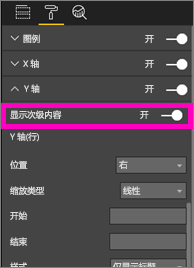

          **图 60：显示次坐标轴**

    1. 依次转到“Y 轴(柱形图)”   > “标题”  ，并设置为“开”  。

    1. 依次转到将“Y 轴(折线图)”   > “标题”  ，并设置为“开”  。

  图表如下所示：

  

  **图 61：改为创建组合图**

* 请充分利用双轴。 它可用于比较值范围不同的多个度量值。 它有助于在一个视觉对象中说明两个度量值之间的关联。

有关详细信息，请参阅：

* [Power BI 中的组合图](power-bi-visualization-combo-chart.md)

* [图表中的双比例尺坐标轴：它们是最佳解决方案吗？](http://www.perceptualedge.com/articles/visual_business_intelligence/dual-scaled_axes.pdf)

### <a name="scatter-chart"></a>散点图


有时，我们希望能够同时看到多个变量，而散点图就非常实用，可便于读者全面了解情况。 散点图显示 2 个（散点）或 3 个（气泡）定量度量值之间的关系。 散点图始终具有两个数值轴以显示水平轴上的一组数值数据和垂直轴上的另一组数值数据。 散点图在 x 和 y 数值的交叉处显示点，将这些值单独合并到各个数据点。 Power BI 可以跨水平轴均匀或不均匀地分布这些数据点。 具体视数据而定。

气泡图将数据点替换为气泡，用气泡大小表示数据的其他维度。

以下气泡图着眼于南美，按南美的各个国家/地区比较人均 GDP（Y 轴）、GDP 总值（X 轴）和人口。


**图 62：显示南美 GDP 和人口的气泡图**

气泡大小表示相应国家/地区的总人口。 巴西人口最多（气泡最大），在南美洲 GDP 中所占的份额也最大。 它位于 X 轴的最远端。 不过，请注意，乌拉圭、智利和阿根廷的人均 GDP 高于巴西。 它们位于 Y 轴的较远端。

如果添加播放轴，你就可以假装自己是 Hans Rosling 来讲述数据在一段时间内的变化情况：[从数据到见解和影响：通过 Microsoft 提供的 Power View 和 PPI 显示非洲进展](https://www.youtube.com/watch?v=PbaDBJWCeD4)。 若要添加播放轴，请将日期时间字段也拖到“播放轴”  中。

#### <a name="best-practices"></a>最佳做法

* 散点图和气泡图是很好的信息传达方式。 不过，若要浏览数据，便会发现这两种图表并不实用。 Stephen Few 指出：

    > *这种方法的优势在于传达信息。Rosling 讲述了在气泡移动和值变化时图表中所发生的情况，同时指向他希望我们看到的内容时，让信息成为动态信息。不过，当我们自己浏览和理解数据时，就会发现动态气泡图的效果不太好。我怀疑虽然 Rosling 使用这种方法发现信息，但传达的只是已知信息。我们一次顾不了多个气泡，因为它们在移动，因此我们不得不反复播放动画，试图了解所发生的情况。可以向选定气泡添加痕迹，这样就能审阅这些气泡的完整路径了。不过，如果对多个气泡使用痕迹，图表很快就会变得太杂乱无章。从根本上讲，我要表达的意思是，这不是显示信息以供浏览和分析的最佳方式。*

* 添加有助于传达信息的 X 轴和 Y 轴标签。 尤其是对气泡图，因为有很多组成部分在发挥作用，标签有助于读者理解视觉对象。

* 添加数据标签，让视觉对象更易于理解。 尤其是对气泡图，因为当有多个图例项时，可能很难区分相似的颜色。 在上面的视觉对象中，苏里南、哥伦比亚和厄瓜多尔的图例颜色就非常相似。

* 创建的散点图中是否只有一个聚合了 X 轴和 Y 轴上所有值的数据点？ 图表是否聚合了一条横线或竖线上的所有值？ 若要修复聚合，请将字段添加到“详细信息”  区域，以指示 Power BI 如何对值进行分组。 每个要绘制的点必须具有唯一的字段。 若要获取帮助，请参阅 [Power BI 散点图和气泡图教程](power-bi-visualization-scatter.md)。

### <a name="treemap-charts"></a>树状图


树状图非常实用，可便于有效概览一个整体中不同组成部分的相对大小，尤其是在按类别对它们进行分组时。 每当尝试理解新业务时，创建包含主要组成部分的树状图会非常有用，可方便了解总体分布情况。

在下面的第一个图表中，显而易见的是，巴西约占南美洲 GDP 的一半。 还可以看出，哥伦比亚和智利的 GDP 大致相同。

假设要有更广泛的上下文，并且仍希望了解 GDP 排名前几的国家/地区的影响。 创建将类别成员（国家/地区）嵌套在区域内的视觉对象层次结构。 第二个树状图主要展示了区域的相对大小。 然后，在每个区域中，可以看到 GDP 排名前几的国家/地区。 可以看到，有三个主要区域：欧洲、亚洲和北美。 在这些区域中，GDP 排名前几的国家/地区显而易见。

树状图的主要限制是，很难比较较小的矩形。 此图表非常适合信息概览，但若要更精确地了解不同组成部分的相对大小，柱形图和条形图的效果可能更好。

第一个树状图指明了 GDP 大小的大致顺序。 不过，很难确定国家/地区之间的具体差异，尤其是那些较小的未标记叶。 对于此类数据，若要比较一个分组，条形图或柱形图的效果可能更好。

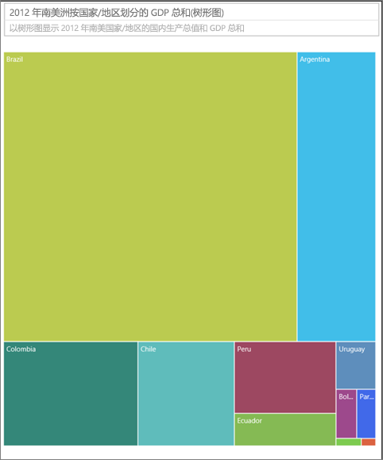

**图 63：比较南美洲 GDP 的树状图**

接下来，添加了“区域”作为另一个数据级别。 可以看到各区域在总 GDP 中的占比。 此外，还可以看到区域中的相对影响。 请务必使用非求和度量值（如平均值），因为汇总详细信息可能无法在聚合级别反映实际值。


**图 64：按地区和国家显示 GDP 的树状图**

若要详细了解树状图，请参阅：

* [使用树状图可视化效果发现商业智能](http://www.perceptualedge.com/articles/b-eye/treemaps.pdf)

* [数据可视化效果目录：树状图](http://www.datavizcatalogue.com/methods/treemap.html#.VYhylI3bL7Y)

### <a name="other-charts"></a>其他图表

#### <a name="pie-or-donut-charts"></a>饼图或环形图


一般情况下，条形图、柱形图和折线图可满足大多数需求。 众所周知，饼图和环形图很难正确理解。 事实上，这两种图表经常会歪曲数据。 请尽量避免使用这两种图表。 Stephen Few 在[把饼图留给甜点](https://www.perceptualedge.com/articles/08-21-07.pdf)中精彩介绍了饼图的发展历史和危害。

Stephen 有一次提及到饼图在比较部分与整体关系时非常有用。 它很少优于百分比堆积条形图。

[Darkhorse Analytics 站点](http://www.darkhorseanalytics.com/blog/salvaging-the-pie)上发布了另一篇有关饼图的有趣文章（和动画）。

#### <a name="radial-gauges--kpis"></a>径向仪表和 KPI


径向仪表是适合指示目标完成比例的视觉对象，常用于执行仪表板。 但存在两个方面的缺陷。 与饼图一样，与完整 180 度弧线或目标线相比，很难理解阴影区域的角度。 此外，径向仪表占用的空间大，但却只显示了一个度量值。

可以改为选择简单的 KPI 视觉对象：


KPI 占用的空间相同，但却显示了值、状态、目标、与目标的差异、趋势。 如果数据达不到目标，绿色会变成红色；如果数据达到某中间目标，绿色会变成黄色。 与仪表相比，它更易于阅读和理解。

有关详细信息，请参阅：

* [Power BI 中的径向仪表图](power-bi-visualization-radial-gauge-charts.md)

* [KPI 视觉对象](power-bi-visualization-kpi.md)

## <a name="conclusion"></a>结论

现在，是时候验证这些最佳做法了。 请与我们保持联系，分享你自己的最佳做法。 不同意我们的建议，或有充分的理由来打破规则？ 我们也很想听听你的这些经验。

更多问题？ [尝试参与 Power BI 社区](http://community.powerbi.com/)

### <a name="book-recommendations"></a>书籍推荐

现在有很多好书可以帮助团队更新他们关于视觉设计技术的知识。 Stephen Few 的《信息仪表板设计》  一书是必读的。 他们还在其他两本书中进行了深入探讨：《向我呈现数字》  和《现在如你所见》  。 Few 和其他作者均从 Edward R. Tufte 身上汲取灵感。Tufte 的《定量信息的视觉显示》被视为该领域的经典之作。  此外，Tufte 还编写了《视觉解释》、《构想信息》和《美丽的证据》。    Andy Kirk 的新书《数据可视化效果：*数据驱动设计手册》* 也是不错的选择。 其他一些推荐作者包括：Lachlan James、William McKnight、Boris Evelson (Forrester) 和 Darkhorse Analytics。
