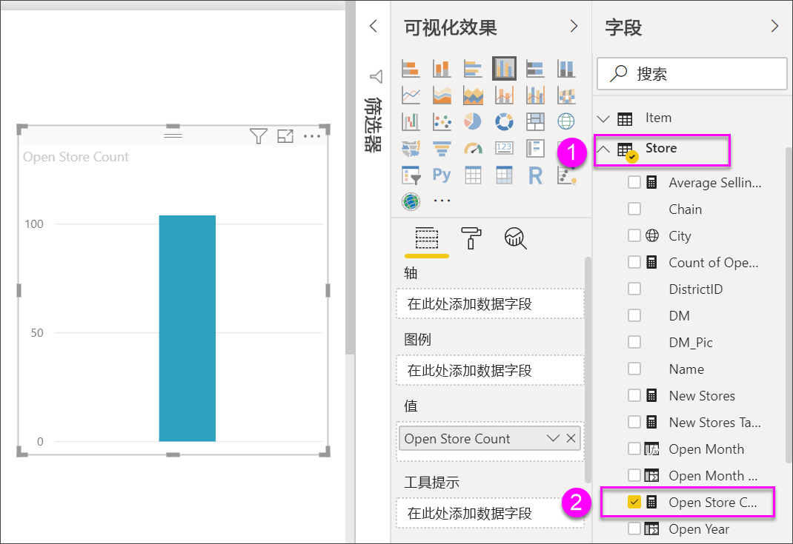
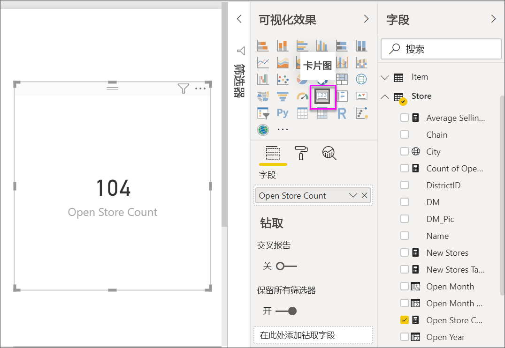
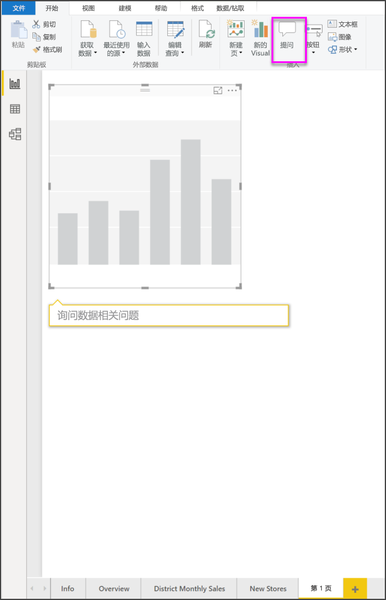
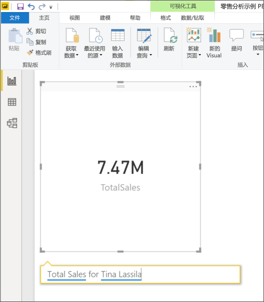
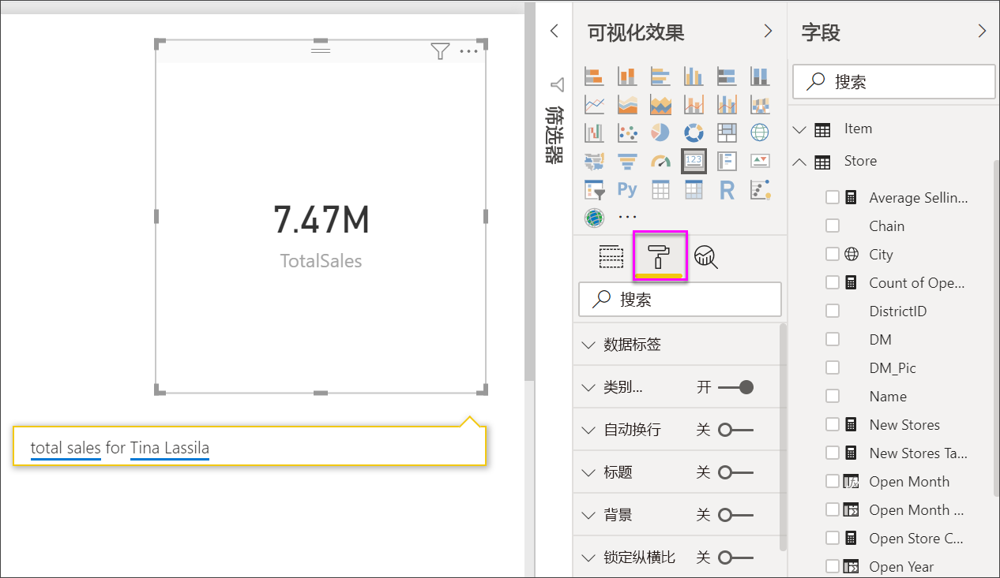
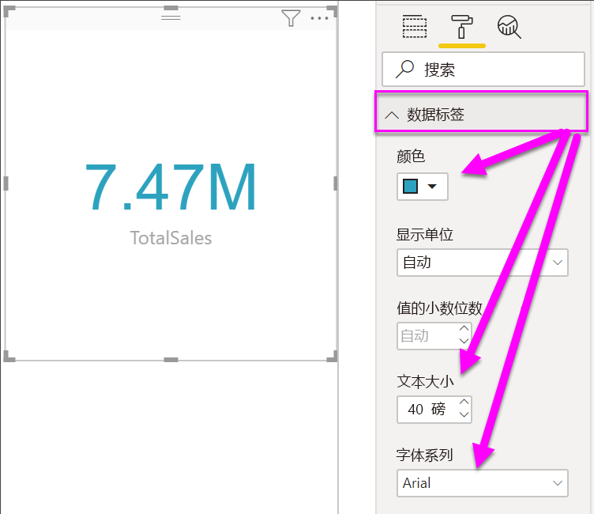
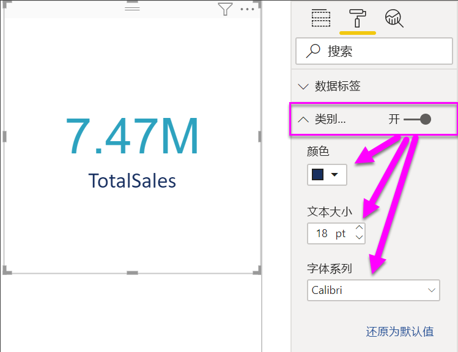
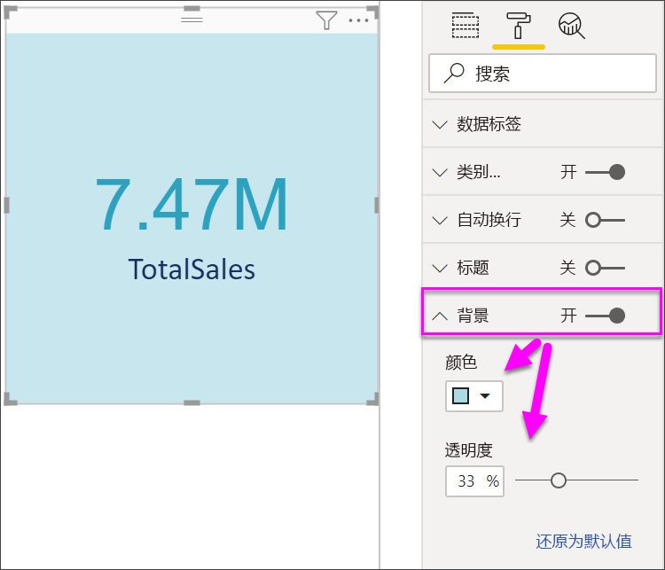

# 创建卡片可视化对象

[!INCLUDE[consumer-appliesto-nyyn](../includes/consumer-appliesto-nyyn.md)]

[!INCLUDE [power-bi-visuals-desktop-banner](../includes/power-bi-visuals-desktop-banner.md)]

有时在 Power BI 仪表板或报表中想要跟踪的最重要的信息就是一个数字，例如总销售额、同比市场份额或商机总数。 此类可视化对象称为“卡片”。  与几乎所有的本机 Power BI 可视化对象一样，可以使用报表编辑器或“问答”创建卡片。

> [!NOTE]
> 与 Power BI 同事共享报表时，你和这位同事都应具有独立的 Power BI Pro 许可证，并且应将报表保存在 Premium 容量中。

## 先决条件

本教程使用[零售分析示例 PBIX 文件](https://download.microsoft.com/download/9/6/D/96DDC2FF-2568-491D-AAFA-AFDD6F763AE3/Retail%20Analysis%20Sample%20PBIX.pbix)

1. 在菜单栏的左上方，选择“文件”\>“打开”  
   
2. 查找**零售分析示例 PBIX 文件**的副本

1. 在报表视图中打开**零售分析示例 PBIX 文件**。

1. 选择  ，以添加新报表页。

## 选项 1：使用报表编辑器创建卡片

创建卡片的第一种方法是使用 Power BI Desktop 中的报表编辑器。

1. 从空白报表页入手，依次选择“商店”\>“打开商店计数”字段   。

    Power BI 将创建一个包含一个数字的柱形图。

   

2. 在“可视化效果”窗格中，选择卡片图标。

   

现在，你已使用报表编辑器成功创建了卡片。 以下是创建卡片的第二种方法：使用“问答”问题框。

## 选项 2：通过“问答”问题框创建卡片
“问答”问题框是创建卡片时可使用的另一个选项。 Power BI Desktop 报表视图提供“问答”问题框。

1. 从空白报表页入手

1. 在窗口顶部，选择“提出问题”图标  。 

    Power BI 将为你的问题创建一张卡片和一个框。 

   

2. 例如，在问题框中键入“Tina 的销售总额”。

    问题框中会提供建议和重述，最后显示总数。  

   

   

现在，你已使用“问答”问题框成功创建了卡片。 以下是根据特定需求设置卡片格式的步骤。

## 格式化卡
可以使用许多选项来更改标签、文本、颜色等。 最佳学习方法是创建一张卡，然后浏览“格式”窗格。 下面提供了几个可用的格式选项。 

在报表中与卡交互时，可使用“格式设置”窗格。 

1. 首先选择油漆滚刷图标来打开“格式设置”窗格。 

    

2. 选择卡后，展开“数据标签”并更改颜色、大小和字体系列  。 如果你有数以千计的存储，则可以使用“显示单位”  来显示数以千计的存储量并控制小数位数。 例如，125.8K 而不是 125,832.00。

    

3.  展开“类别标签”  并更改颜色和大小。

    

4. 展开“背景”  并将滑块移至“开启”。  现在可以更改背景色和透明度。

    

5. 继续浏览格式设置选项，直到卡完全满足你的需要。 

## 注意事项和疑难解答
如果根本看不到问题框，请与系统管理员或租户管理员联系。    

## 后续步骤
[Power BI 中的组合图表](power-bi-visualization-combo-chart.md)

[Power BI 中的可视化效果类型](power-bi-visualization-types-for-reports-and-q-and-a.md)
