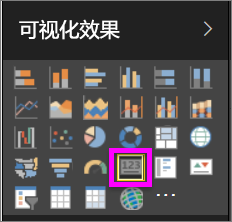
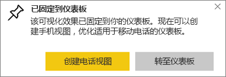
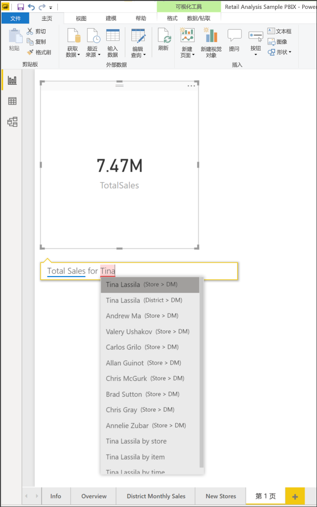
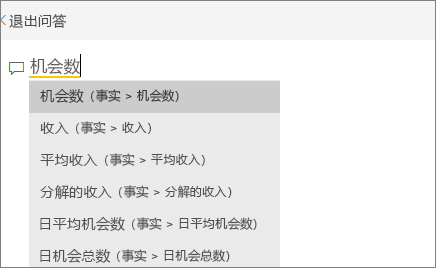
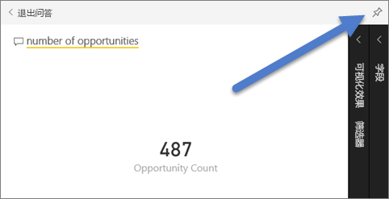
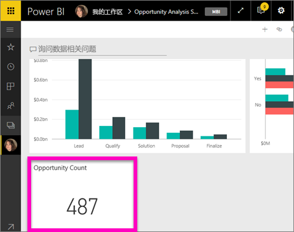
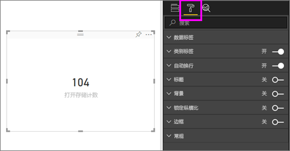
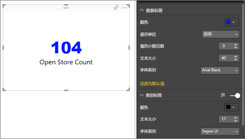
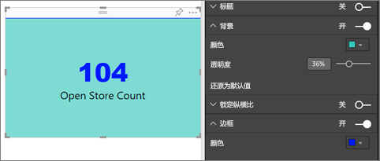

# 卡片可视化对象
有时在 Power BI 仪表板或报表中想要跟踪的最重要的信息就是一个数字，例如总销售额、同比市场份额或商机总数。 此类可视化对象称为“卡片”。 与几乎所有的本机 Power BI 可视化对象一样，可以使用报表编辑器或“问答”创建卡片。

## 使用报表编辑器创建卡片
以下说明使用零售分析示例。 若要继续学习，请[下载](../sample-datasets.md)适用于 Power BI 服务 (app.powerbi.com) 或 Power BI Desktop 的示例。   

1. 从空白报表页入手，依次选择“商店”\>“打开商店计数”字段。 如果使用的是 Power BI 服务，则需要在 [“编辑视图”](../service-interact-with-a-report-in-editing-view.md) 中打开报表。

    Power BI 将创建一个包含一个数字的柱形图。

   
2. 在可视化效果窗格中，选择“卡片”图标。

   
6. 将鼠标悬停在某个卡片上，选择固定图标 ，将可视化对象添加到仪表板。

   
7. 将磁贴固定到现有仪表板或新仪表板。

   * 现有仪表板：从下拉列表中选择仪表板的名称。
   * 新仪表板：键入新仪表板的名称。
8. 选择**固定**。

   会显示一条成功消息（右上角附近），告知你可视化效果已作为磁贴添加到你的仪表板中。

   
9. 选择“转到仪表板”。 在此处可以对已固定的可视化效果进行[编辑和移动](../service-dashboard-edit-tile.md)。

## 通过“问答”问题框创建卡片
最简单的方法是使用“问答”问题框制作卡片。 Power BI 服务的仪表板或报表和 Desktop 报表视图中提供了“问答”问题框。 以下步骤说明如何通过 Power BI 服务仪表板创建卡片。 若要在 Power BI Desktop 中使用“问答”创建卡片，请遵照适用于 Desktop 报表的“问答”预览功能的[这些说明](https://powerbi.microsoft.com/blog/power-bi-desktop-december-feature-summary/#QandA)。

1. 创建[仪表板](../service-dashboards.md)和[获取数据](../service-get-data.md)。 此示例使用[机会分析示例](../sample-opportunity-analysis.md)。

1. 在仪表板顶部，在提问框中键入你想要了解的有关你的数据的问题。 

   

> [!TIP]
> 从 Power BI 服务报表的编辑视图中，从顶部菜单栏中选择“提问”。 在 Power BI Desktop 报表中找到某个已打开的空间，然后双击打开问题框。

3. 例如，在问题框中键入“机会数”。

   

   问题框中会提供建议和重述，最后显示总数。  
4. 选择右上角的固定图标 ，将该卡片添加到仪表板。

   
5. 将卡片作为磁贴固定到现有仪表板或新仪表板。

   * 现有仪表板：从下拉列表中选择仪表板的名称。 你的选择仅限当前工作区中的这些仪表板。
   * 新仪表板：键入新仪表板的名称，它将被添加到当前工作区。
6. 选择“固定”。

   会显示一条成功消息（右上角附近），告知你可视化效果已作为磁贴添加到你的仪表板中。  

   
7. 选择“转到仪表板”以查看新磁贴。 可在该仪表板上进行[重命名、调整大小、添加超链接、重新定位磁贴等操作](../service-dashboard-edit-tile.md)。

   

## 注意事项和疑难解答
- 如果根本看不到问题框，请与系统管理员或租户管理员联系。    
- 如果使用的是 Desktop，而双击报表中的空白区域并未打开“问答”，则可能需要启用“问答”。  选择“文件”>“选项和设置”>“选项”>“预览功能”>“问答”，然后重启 Desktop。

## 格式化卡
可以使用许多选项来更改标签、文本、颜色等。 最佳学习方法是创建一张卡，然后浏览“格式”窗格。 下面提供了几个可用的格式选项。 

1. 首先选择油漆刷图标来打开“格式设置”窗格。 

    
2. 展开“数据标签”并更改颜色、大小和字体系列。 如果你有数以千计的存储，则可以使用“显示单位”来显示数以千计的存储量并控制小数位数。 例如，125.8K 而不是 125,832.00。

3.  展开“类别标签”并更改颜色和大小。

    

4. 展开“背景”并将滑块移至“开启”。  现在可以更改背景色和透明度。

    

5. 继续浏览格式设置选项，直到卡完全满足你的需要。 

    

## 后续步骤
[Power BI 中的组合图表](power-bi-visualization-combo-chart.md)

[Power BI 中的可视化效果类型](power-bi-visualization-types-for-reports-and-q-and-a.md)
