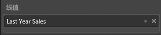
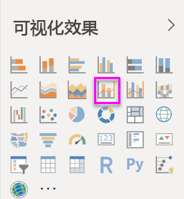
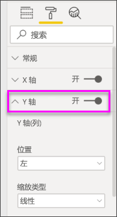
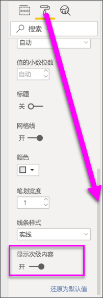

# Power BI 中的组合图

[!INCLUDE [power-bi-visuals-desktop-banner](../includes/power-bi-visuals-desktop-banner.md)]

在 Power BI 中，组合图是将折线图和柱形图合并在一起的单个可视化效果。 通过将两个图表合并为一个图表可以进行更快的数据比较。

组合图可以具有一个或两个 Y 轴。

## 何时使用组合图
组合图适用情况：

* 具有 X 轴相同的折线图和柱形图时。
* 比较具有不同值范围的多个度量值。
* 在一个可视化效果中说明两个度量值之间的关联。
* 检查一个度量值是否满足另一个度量值定义的目标
* 节省画布空间。

### 先决条件
本教程使用[零售分析示例 PBIX 文件](http://download.microsoft.com/download/9/6/D/96DDC2FF-2568-491D-AAFA-AFDD6F763AE3/Retail%20Analysis%20Sample%20PBIX.pbix)。

1. 在菜单栏的左上方，选择“文件” > “打开”  
   
2. 查找**零售分析示例 PBIX 文件**的副本

1. 在报表视图中打开**零售分析示例 PBIX 文件** 。

1. 选择  ，以添加新报表页。

## 创建基本的单轴组合图
观看如何使用销售和市场营销示例创建组合图。
   > [!NOTE]
   > 此视频使用较旧版本的 Power BI Desktop。
   > 
   > 
<iframe width="560" height="315" src="https://www.youtube.com/embed/lnv66cTZ5ho?list=PL1N57mwBHtN0JFoKSR0n-tBkUJHeMP2cP" frameborder="0" allowfullscreen></iframe>  

1. 从空白报表页入手，并创建按月显示本年度销售额和毛利的组合图。

    a.  从“字段”窗格，选择**销售额** \> **本年度销售额**  >  **值**。

    b.  将**销售额** \> **本年度毛利**拖动到**值**框。

    c. 选择**时间** \> **会计月份**以将它添加到**轴**框。

    
5. 在可视化效果的右上角选择省略号 (...)，然后选择“按会计月份排序”  。 要更改排序顺序，请再次选择省略号并选择  “升序排序”或“降序排序”  。 本示例将使用“升序排序”  。

6. 将柱形图转换为组合图。 提供了两个组合图表：  “折线图和堆积柱形图”和“折线图和簇状柱形图”  。 在选择了柱形图的情况下，从“可视化效果”  窗格中选择“折线和簇状柱形图”  。

    
7. 从**字段**窗格，将**销售额** \> **去年销售额**拖动到**行值**存储段。

   

   组合图应如下所示：

   

## 创建具有两个轴的组合图
在此任务中，我们会比较毛利和销售额。

1. 新建按“FiscalMonth”跟踪“去年毛利率”的折线图   。 选择省略号以按  “月”和“升序”  对其进行排序。  
一月的 GM% 是 35%，在四月达到峰值 45%，在七月下降，在八月再次达到峰值。 去年和本年度的销售额是否会呈现类似模式？

   
2. 将**本年度销售额 > 值**和**去年销售额**添加到折线图。 “去年毛利率”  的比例尺比“销售额”  的比例尺小得多，因此比较起来非常困难。      

   
3. 若要使视觉对象更易于查看和解释，请将折线图转换为折线和堆积柱形图。

   

4. 将**去年毛利率**从**列值**拖动到**行值**中。 Power BI 会创建两个坐标轴，这样就可以对数据集使用不同的比例尺；左侧度量值销售额是美元，右侧度量值是百分比。 我们找到了问题的答案；是的，我们确实找到了类似的模式。

       

## 向轴添加标题
1. 选择滚动油漆刷图标 
1.  ，以打开“格式设置”窗格。
1. 选择向下箭头以展开 **Y 轴**选项。
1. 对于“Y 轴(列)”，将“位置”设置为“左”，将“标题”设置为“打开”，将“样式”设置为“仅显示标题”，并将“显示单位”设置为“百万”          。

   
4. 在“Y 轴(列)”下，向下滚动，直至看到“显示次级内容”   。 由于 Y 轴的选项太多，可能必须同时使用两个滚动条。 “显示次级内容”部分显示用于设置组合图的折线图部分格式的选项。

   
5. 对于 **Y 轴（行）** ，将“**位置**”保留为“**右**”，将“**标题**”设置为“**打开**”，并将“**样式**”设置为“**仅显示标题**”。

   组合图现在显示双轴，它们都具有标题。

   

6. （可选）修改文本字体、大小和颜色，并设置其他格式选项，以提升图表的显示效果和可读性。

从这里你可能想要：

* [将组合图添加为仪表板磁贴](../service-dashboard-tiles.md)。
* [保存报表](../service-report-save.md)。
* [残障人士能够更轻松地访问报表](../desktop-accessibility.md)。

## 交叉突出显示和交叉筛选

突出显示组合图中的列或行可交叉突出显示和交叉筛选报表页上的其他可视化效果，反之亦然。 使用[视觉对象交互](../service-reports-visual-interactions.md)可以更改此默认行为。

## 后续步骤

[Power BI 中的圆环图](power-bi-visualization-doughnut-charts.md)

[Power BI 中的可视化效果类型](power-bi-visualization-types-for-reports-and-q-and-a.md)
