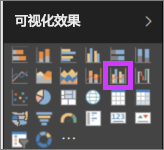
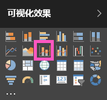

# Power BI 中的组合图

在 Power BI 中，组合图是将折线图和柱形图合并在一起的单个可视化效果。 通过将两个图表合并为一个图表可以进行更快的数据比较。

组合图可以具有一个或两个 Y 轴。

## 何时使用组合图

组合图适用情况：

* 如果有 X 轴相同的折线图和柱形图。

* 若要比较值范围不同的多个度量值。

* 若要在一个可视化效果中说明两个度量值之间的关联。

* 若要检查一个度量值是否达到另一个度量值定义的目标。

* 若要节省画布空间。

## 先决条件

Power BI 服务和 Power BI Desktop 均支持组合图。 本教程使用 Power BI 服务创建组合图。 请确保有登录 Power BI 所需的用户凭据。

观看如何使用销售和市场营销示例创建组合图。

<iframe width="560" height="315" src="https://www.youtube.com/embed/lnv66cTZ5ho?list=PL1N57mwBHtN0JFoKSR0n-tBkUJHeMP2cP" frameborder="0" allowfullscreen></iframe>  

## 创建基本的单轴组合图

若要跟着本教程一起操作，请打开 Power BI 服务，并连接到“零售分析示例”  。 若要创建你自己的组合图，请登录 Power BI 服务，并依次选择“获取数据”   > “示例”   > 零售分析示例”   > “连接”  。 此时，“零售分析示例”  仪表板显示。

1. 在“零售分析示例”仪表板中，选择“总商店数”  磁贴，以打开“商店销售额概览”  报表。

1. 选择**编辑报表**在编辑视图中打开报表。

1. 选择页面底部的“+”  ，以添加新报表页。

1. 创建按月显示今年销售额和毛利率的柱形图。

    1. 从“字段”窗格，选择**销售额** \> **本年度销售额**  >  **值**。

    1. 将**销售额** \> **本年度毛利**拖动到**值**框。

    1. 选择**时间** \> **会计月份**以将它添加到**轴**框。

        

1. 选择可视化效果右上角的省略号，再依次选择“排序依据”>“会计月份”  。 要更改排序顺序，请再次选择省略号并选择  “升序排序”或“降序排序”  。

1. 将柱形图转换为组合图。 提供了两个组合图表：  “折线图和堆积柱形图”和“折线图和簇状柱形图”  。 在选择了柱形图的情况下，从“可视化效果”  窗格中选择“折线和簇状柱形图”  。

    

1. 从“字段”  窗格，将“销售额”   > “去年销售额”  拖到“行值”  井中。

    

    组合图应如下所示：

    

## 创建具有两个轴的组合图

在此任务中，我们会比较毛利和销售额。

1. 新建按“月份”  跟踪“去年毛利率”  的折线图。 选择省略号以按  “月”和“升序”  对其进行排序。

    

     一月的 GM% 是 35%，在四月达到峰值 45%，在七月下降，在八月再次达到峰值。 去年和本年度的销售额是否会呈现类似模式？

1. 将“今年销售额”   > “值”  和“去年销售额”  添加到折线图中。 “去年毛利率”  的比例尺比“销售额”  的比例尺小得多。 所以很难比较。

    

1. 若要使视觉对象更易于查看和解释，请将折线图转换为折线和堆积柱形图。

    

1. 将**去年毛利率**从**列值**拖动到**行值**中。 

    

    Power BI 创建两个轴，可便于服务以不同方式缩放数据集。 左轴度量以美元为单位的销售额，右轴度量毛利率百分比。 问题的答案显而易见：是的，我们确实看到了类似模式。

## 向轴添加标题

1. 选择滚动油漆刷图标  ，以打开“格式设置”窗格。

1. 选择向下箭头以展开 **Y 轴**选项。

1. 对于“Y 轴(柱形图)”  ，选择以下选项：

    | 设置 | 值 |
    | ------- | ----- |
    | 位置 | 选择“左”  。 |
    | 显示单位 | 选择“百万”  。 |
    | 标题 | 将滑块移至“开”  。 |
    | 样式 | 选择“仅显示标题”  。 |
    | 显示次级内容 | 将滑块移至“开”  。  这会显示用于设置组合图的折线图部分格式的选项。 |

1. 对于“Y 轴(折线图)”  ，选择以下选项：

    | 设置 | 值 |
    | ------- | ----- |
    | 位置 | 选择“右”  。 |
    | 标题 | 将滑块移至“开”  。 |
    | 样式 | 选择“仅显示标题”  。 |

    组合图现在显示都有标题的双轴。

    

1. （可选）更改文本字体、大小和颜色，并设置其他格式设置选项，以提升图表的显示效果和可读性。

从这里你可能想要：

* [将组合图添加为仪表板磁贴](../service-dashboard-tiles.md)。

* [保存报表](../service-report-save.md)。

* [残障人士能够更轻松地访问报表](../desktop-accessibility.md)。

## 交叉突出显示和交叉筛选

突出显示组合图中的柱形或折线会交叉突出显示和交叉筛选报表页上的其他可视化效果。 使用[视觉对象交互](../service-reports-visual-interactions.md)可以更改此默认行为。

## 后续步骤

[Power BI 中的圆环图](power-bi-visualization-doughnut-charts.md)

[Power BI 中的可视化效果类型](power-bi-visualization-types-for-reports-and-q-and-a.md)