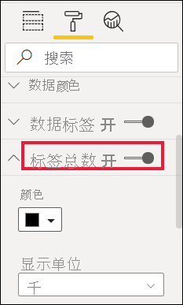
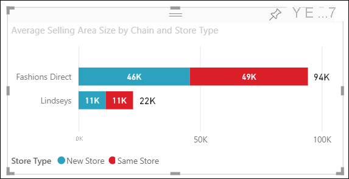

# 自定义可视化效果的标题、背景、标签和图例

[!INCLUDE[consumer-appliesto-nyyn](../includes/consumer-appliesto-nyyn.md)]

本教程将介绍几种自定义可视化效果的不同方式。 自定义可视化效果的方式有很多。 了解所有这些方式的最佳方法是，探索“格式”窗格（选择“滚动油漆刷”图标）。 为了帮助你入门，本文演示了如何自定义可视化效果的标题、图例、背景、标签、层以及如何添加主题。

无法自定义所有的可视化效果。 有关详细信息，请参阅可视化效果的[完整列表](#visualization-types-that-you-can-customize)。

## 先决条件

- Power BI 服务或 Power BI Desktop

- “零售分析示例”报表

> [!NOTE]
> 与 Power BI 同事共享报表时，你和这位同事都应具有独立的 Power BI Pro 许可证，并且应将报表保存在 Premium 容量中。 请参阅[共享报表](../collaborate-share/service-share-reports.md)。

## 在报表中自定义可视化效果标题

若要继续操作，请登录到 Power BI Desktop，并打开[零售分析示例](../create-reports/sample-datasets.md)报表。

> [!NOTE]
> 将可视化效果固定到仪表板时，它会成为仪表板磁贴。 还可以使用[新标题和副标题、超链接和重设大小](../create-reports/service-dashboard-edit-tile.md)来自定义磁贴本身。

1. 转到“零售分析示例”报表的“新商店数”报表页。

1. 选择“开店数(按开业月份和连锁店)”簇状柱形图。

1. 在“可视化效果”窗格中，选择“滚动油漆刷”图标来显示格式选项。

1. 选择“标题”，以展开此部分。

   

1. 将“标题”滑块移至“开”。

1. 若要更改标题，请在“标题文本”字段中输入“商店数(按开业月份)”。

    

1. 将“字体颜色”更改为白色，并将“背景色”更改为蓝色 。

    a. 选择下拉列表，并从“主题颜色”、“最近使用的颜色”或“自定义颜色”中选择颜色。

    

    b. 选择下拉列表，以关闭颜色窗口。

1. 将文本大小增加到“16 磅”。

1. 对图表标题进行的最后一项自定义是，让它在可视化效果中居中对齐。

    

    此时，在本教程中，簇状柱形图的标题如下所示：

    

保存所做的更改，并转到下一部分。

如果需要还原所有更改，请选择“自定义效果”窗格中“标题”底部的“还原为默认值”。

## 自定义可视化效果背景

选择相同的簇状柱形图后，展开“背景”选项。

1. 将“背景”滑块移至“开”。

1. 依次选择下拉列表和灰色。

1. 将“透明度”更改为“74%”。

此时，在本教程中，簇状柱形图的背景如下所示：

保存所做的更改，并转到下一部分。

如果需要还原所有更改，请选择“自定义效果”窗格中“背景”底部的“还原为默认值”。

## 自定义可视化效果图例

1. 打开“概览”报表页，并选择“总销售额差异(按会计月份和区域经理)”图。

1. 在“可视化效果”选项卡中，选择“滚动油漆刷”图标，以打开“格式”窗格。

1. 展开“图例”选项：

    

1. 将“图例”滑块移至“开”。

1. 将图例移动到可视化效果左侧。

1. 通过将“标题”切换为“开”，添加图例标题。

1. 在“图例名称”字段中，输入“经理”。

1. 将“颜色”更改为黑色。

保存所做的更改，并转到下一部分。

如果需要还原所有更改，请选择“自定义效果”窗格中“图例”底部的“还原为默认值”。

## 自定义堆积视觉对象的总标签数

堆积视觉对象可以显示数据标签和总计标签。 在堆积柱形图中，数据标签用于标识列每个部分的值。 总计标签显示整个聚合列的总值。 

查看 Rien 向堆积图添加总标签，然后按照以下步骤自行操作。

> [!VIDEO https://www.youtube.com/embed/OgjX-pFGgfM]

1. 打开“概述”报表页，然后选择“平均销售面积(按供应链和商店类型)”条形图。

1. 在“可视化效果”选项卡中，选择，将此条形图转换为堆积条形图。 请注意，视觉对象将保留其数据标签。

    

1. 在“可视化效果”选项卡中，选择“滚动油漆刷”图标，以打开“格式”窗格。

1. 将“总计标签”滑块移至“开”。 

    

1. （可选）设置总计标签的格式。 在此示例中，我们已将颜色更改为黑色，增加了字体大小，并选择将值显示为“千”。

    

## 自定义分层顺序

更改报表中视觉对象和形状的分层顺序。 分层顺序决定了在选定对象时，哪些对象位于最前面。 每当你在报表画布上选择一个对象时，该对象就会变为活动状态并移至顶层。 对于视觉对象，这使得与所选视觉效果的交互更加容易。 但是，对于形状和背景，你可能需要将它们固定到底层，以免意外选择它们并掩盖或遮挡报表视觉对象。 

Power BI 服务、Power BI Desktop、移动版和报表服务器提供了分层控件。 本文介绍如何在 Power BI 服务中更改分层顺序行为。

观看 Rien 更改分层顺序行为，然后按照以下步骤自行操作。

> [!VIDEO https://www.microsoft.com/videoplayer/embed/RE4IY3L]

1. 通过选择黄色加号添加新报表页。

1. 向画布中添加形状。 在这里，我们添加了一个蓝色矩形。

    

1. 从报表的其他页面复制并粘贴视觉对象。

    

    你已经有 2 个层，现在尝试选择饼图，然后选择背景。 选择饼图时，Power BI 会使该对象处于活动状态并显示其标题菜单。 选择矩形时，Power BI 会使该对象处于活动状态并将其放到最前面，在此位置它会遮住饼图。 你可以更改此默认行为。

1. 选择矩形并打开“格式设置”窗格。 展开“常规”并找到“维持分层顺序”开关。 保存报表更改并切换到“阅读视图”。

    

1. 在阅读视图中，当你选择蓝色矩形时，它会停留在底层。

## 使用主题自定义颜色

使用报表主题，你可以将设计更改应用于整个报表，如使用公司颜色、更改图标集或应用新的默认视觉对象格式。 在你应用某个报表主题后，报表中的所有视觉对象都会使用选定主题中的颜色和格式。

若要将某个主题应用到报表，请在菜单栏选择“切换主题”。 选择主题。  下面的报表使用“Solar”主题。

## 可以自定义的可视化效果类型

下面列出了可视化效果以及每个可视化效果可用的自定义选项：

| 可视化效果 | 标题 | 背景 | 图例 | 标签总数
|:--- |:--- |:--- |:--- |:--- |
| 分区图 | 是 | 是 |是 | 是  |
| 条形图 | 是 | 是 |是 | 是 |
| 卡片 | 是 | 是 |不适用 | 不适用 |
| 多行卡片 | 是 | 是 | 不适用 | 不适用 |
| 列 | 是 | 是 | 是 |  是 |
| 组合图 | 是 | 是 | 是 | 是 |
| 圆环图 | 是 | 是 | 是 | 不适用 |
| 着色地图 | 是 | 是 | 是 |不适用 |
| 漏斗图 | 是 | 是 | 不适用 |不适用 |
| 仪表 | 是 | 是 | 不适用 |不适用 |
| 关键影响因素 | 是 | 是 | 不适用 |不适用 |
| KPI | 是 | 是 | 不适用 |不适用 |
| 折线图 | 是 | 是 | 是 |不适用 |
| 地图 | 是 | 是 | 是 |不适用 |
| Matrix | 是 | 是 | 不适用 |是 |
| 饼图 | 是 | 是 | 是 |不适用 |
| 问答 | 是 | 是 | 不适用 |不适用 |
| 散点图 | 是 | 是 | 是 |不适用 |
| 形状 | 是 | 是 | 是 |不适用 |
| 切片器 | 是 | 是 | 不适用 |不适用 |
| 表 | 是 | 是 | 不适用 |是 |
| 文本框 | 否 | 是 | 不适用 |不适用 |
| 树状图 | 是 | 是 | 是 |不适用 |
| 瀑布图 | 是 | 是 | 是 |不适用 |

## 后续步骤

- [自定义 X 轴和 Y 轴属性](power-bi-visualization-customize-x-axis-and-y-axis.md)

- [颜色格式设置和轴属性入门](service-getting-started-with-color-formatting-and-axis-properties.md)

更多问题？ [尝试参与 Power BI 社区](https://community.powerbi.com/)
