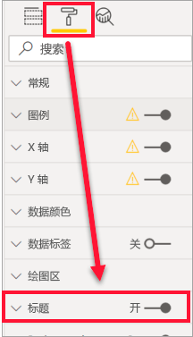
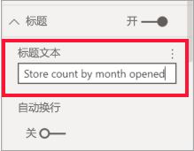
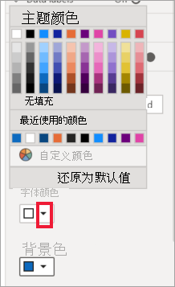
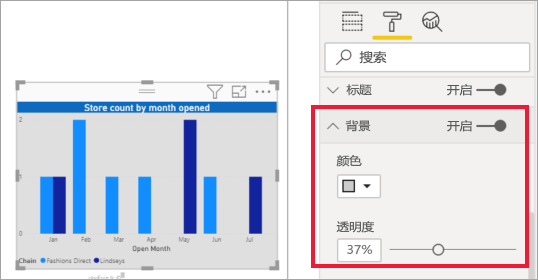
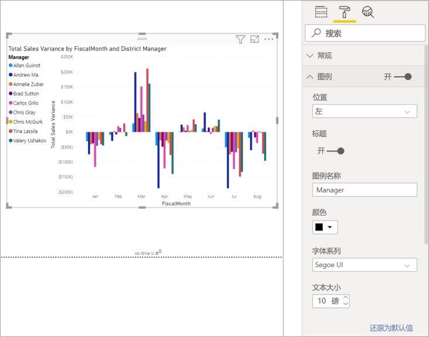

# 自定义可视化效果的标题、背景和图例

本教程将介绍几种自定义可视化效果的不同方式。 自定义可视化效果的方式有很多。 了解所有这些方式的最佳方法是，探索“格式”  窗格（选择“滚动油漆刷”图标）。 为了帮助你入门，本文演示了如何自定义可视化效果的标题、图例、背景以及如何添加主题。

无法自定义所有的可视化效果。 有关详细信息，请参阅可视化效果的[完整列表](#visualization-types-that-you-can-customize)。

## 先决条件

- Power BI 服务或 Power BI Desktop

- “零售分析示例”报表

## 在报表中自定义可视化效果标题

若要继续操作，请登录到 Power BI Desktop，并打开[零售分析示例](../sample-datasets.md)报表。

> [!NOTE]
> 将可视化效果固定到仪表板时，它会成为仪表板磁贴。 还可以使用[新标题和副标题、超链接和重设大小](../service-dashboard-edit-tile.md)来自定义磁贴本身。

1. 转到“零售分析示例”  报表的“新商店数”  报表页。

1. 选择“开店数(按开业月份和连锁店)”  簇状柱形图。

1. 在“可视化效果”  窗格中，选择“滚动油漆刷”图标来显示格式选项。

1. 选择“标题”  ，以展开此部分。

   

1. 将“标题”  滑块移至“开”  。

1. 若要更改标题，请在“标题文本”  字段中输入“商店数(按开业月份)”  。

    

1. 将“字体颜色”更改为白色，并将“背景色”更改为蓝色   。    

    a. 选择下拉列表，并从“主题颜色”  、“最近使用的颜色”  或“自定义颜色”  中选择颜色。

        

    b. 选择下拉列表，以关闭颜色窗口。

1. 将文本大小增加到“16 磅”  。

1. 对图表标题进行的最后一项自定义是，让它在可视化效果中居中对齐。

    

    此时，在本教程中，簇状柱形图的标题如下所示：

    

保存所做的更改，并转到下一部分。

如果需要还原所有更改，请选择“自定义效果”窗格中“标题”  底部的“还原为默认值”  。

## 自定义可视化效果背景

选择相同的簇状柱形图后，展开“背景”  选项。

1. 将“背景”  滑块移至“开”  。

1. 依次选择下拉列表和灰色。

1. 将“透明度”  更改为“74%”  。

此时，在本教程中，簇状柱形图的背景如下所示：

保存所做的更改，并转到下一部分。

如果需要还原所有更改，请选择“自定义效果”窗格中“背景”  底部的“还原为默认值”  。

## 自定义可视化效果图例

1. 打开“概览”  报表页，并选择“总销售额差异(按会计月份和区域经理)”  图。

1. 在“可视化效果”  选项卡中，选择“滚动油漆刷”图标，以打开“格式”窗格。

1. 展开“图例”  选项：

    

1. 将“图例”  滑块移至“开”  。

1. 将图例移动到可视化效果左侧。

1. 通过将“标题”  切换为“开”  ，添加图例标题。

1. 在“图例名称”  字段中，输入“经理”  。

1. 将“颜色”更改为黑色  。

保存所做的更改，并转到下一部分。

如果需要还原所有更改，请选择“自定义效果”窗格中“图例”  底部的“还原为默认值”  。

## 使用主题自定义颜色

使用报表主题，你可以将设计更改应用于整个报表，如使用公司颜色、更改图标集或应用新的默认视觉对象格式。 在你应用某个报表主题后，报表中的所有视觉对象都会使用选定主题中的颜色和格式。

若要将某个主题应用到报表，请在菜单栏选择“切换主题”  。 选择主题。  下面的报表使用“Solar”主题  。

 

## 可以自定义的可视化效果类型

下面列出了可视化效果以及每个可视化效果可用的自定义选项：

| 可视化效果 | 标题 | 背景 | 图例 |
|:--- |:--- |:--- |:--- |
| 分区图 | 是 | 是 |是 |
| 条形图 | 是 | 是 |是 |
| 卡片 | 是 | 是 |不适用 |
| 多行卡片 | 是 | 是 | 不适用 |
| 列 | 是 | 是 | 是 |
| 组合图 | 是 | 是 | 是 |
| 圆环图 | 是 | 是 | 是 |
| 着色地图 | 是 | 是 | 是 |
| 漏斗图 | 是 | 是 | 不适用 |
| 仪表 | 是 | 是 | 不适用 |
| 关键影响因素 | 是 | 是 | 不适用 |
| KPI | 是 | 是 | 不适用 |
| 折线图 | 是 | 是 | 是 |
| 地图 | 是 | 是 | 是 |
| 矩阵 | 是 | 是 | 不适用 |
| 饼图 | 是 | 是 | 是 |
| 问答 | 是 | 是 | 不适用 |
| 散点图 | 是 | 是 | 是 |
| 形状 | 是 | 是 | 是 |
| 切片器 | 是 | 是 | 不适用 |
| 表 | 是 | 是 | 不适用 |
| 文本框 | 否 | 是 | 不适用 |
| 树状图 | 是 | 是 | 是 |
| 瀑布图 | 是 | 是 | 是 |

## 后续步骤

- [自定义 X 轴和 Y 轴属性](power-bi-visualization-customize-x-axis-and-y-axis.md)

- [颜色格式设置和轴属性入门](service-getting-started-with-color-formatting-and-axis-properties.md)

更多问题？ [尝试参与 Power BI 社区](https://community.powerbi.com/)
