# 自定义 X 轴和 Y 轴属性

[!INCLUDE[consumer-appliesto-nyyn](../includes/consumer-appliesto-nyyn.md)]    

[!INCLUDE [power-bi-visuals-desktop-banner](../includes/power-bi-visuals-desktop-banner.md)]

本教程介绍自定义视觉对象的 X 轴和 Y 轴的多种不同方式。 并非所有视觉对象都有坐标轴。 例如，饼图就没有坐标轴。 而且，自定义选项也因视觉对象而异。 由于自定义选项太多，无法在一篇文章中一一介绍，我们将介绍一些最常用的自定义选项，并让你能够熟练使用 Power BI 报表画布中的视觉对象“格式”窗格。  

请观看下面的视频，Amanda 在其中介绍了如何自定义 X 轴和 Y 轴。 她还将演示在使用向下钻取和向上钻取时控制串联的不同方式。

> [!NOTE]
> 此视频使用较旧版本的 Power BI。

<iframe width="560" height="315" src="https://www.youtube.com/embed/9DeAKM4SNJM" frameborder="0" allowfullscreen></iframe>

## 先决条件

- Power BI Desktop

- [零售分析示例](https://download.microsoft.com/download/9/6/D/96DDC2FF-2568-491D-AAFA-AFDD6F763AE3/Retail%20Analysis%20Sample%20PBIX.pbix)

## 添加新的可视化效果

必须先生成可视化效果，然后才能自定义它。

1. 在 Power BI Desktop 中，打开零售分析示例。  

2. 在底部，选择黄色的加号图标以添加新页面。 

    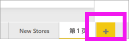

1. 在“可视化效果”窗格中，选择“堆积柱形图”图标。 这会将空模板添加到报表画布。

    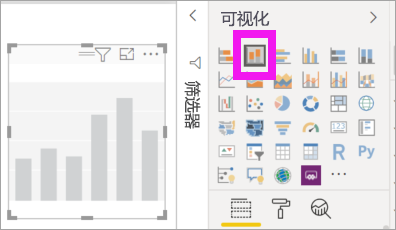

1. 若要设置 X 轴值，请在“字段”窗格中，依次选择“Time” > “FiscalMonth”  。

1. 若要设置 Y 轴值，请在“字段”窗格中，依次选择“Sales” > “Last Year Sales”，再依次选择“Sales” > “This Year Sales” > “Value”     。

    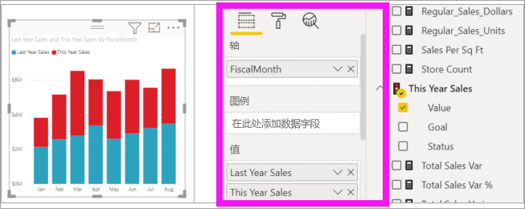

    现在可以自定义 X 轴。 Power BI 为可视化效果格式设置提供几乎无限的选项。 

## 自定义 X 轴
可为 X 轴自定义许多功能。 你可添加和修改数据标签及 X 轴标题。 对于类别，可修改条形图、柱形图、折线图和面积图的宽度、大小和填充。 对于值，可修改显示单位、小数位数和网格线。 下面的示例演示柱形图的自定义。 让我们添加一些自定义选项来帮助你熟悉它们，你随后可自行浏览其余内容。

### 自定义 X 轴标签
X 轴标签在图表中列的下方显示。 现在，它们是浅灰色的小标签，并且难以查看。 让我们来进行更改。

1. 在“可视化效果”窗格中，选择“格式”（滚动油漆刷图标  。 ）以显示自定义选项。

2. 展开 X 轴选项。

   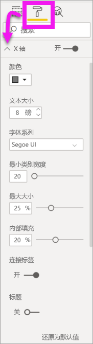

3. 将“X 轴”滑块移至“开” 。

    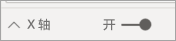

    可能需要将 X 轴设置为“关”的部分原因包括：可视化效果在没有标签的情况下直观明了；或报表页面中内容过多，需要腾出空间用于显示更多数据。

4. 设置文本颜色、大小和字体：

    - **颜色**：选择黑色

    - **文本大小**：输入“14”

    - **字体系列**：选择“Arial Black”

    - **内部填充**：输入“40%”

        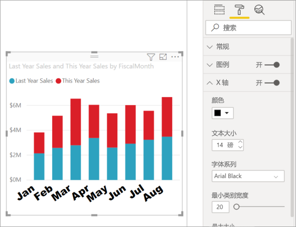
    
5. 你可能不喜欢 X 轴文本沿对角线显示。 你拥有几个选项。 
    - 将文本大小更改为小于 14。
    - 放大可视化效果。 
    - 显示更少的列，并通过增加“最小类别宽度”来添加滚动条。 
    
    在这里，我们选择第二个选项并通过获取其中一个调整大小栏来加宽可视化效果。 它现在可以容纳 14 磅大小的文本，而无需呈角度或使用滚动条显示文本。 

   

### 自定义 X 轴标题
当 X 轴标题为“开”时，X 轴标题在 X 轴标签下方显示。 

1. 首先，将 X 轴标题置于“开”。  

    

    首先注意到的是，可视化效果现在具有默认的 X 轴标题。  在此示例中，名称为“会计月份”。

   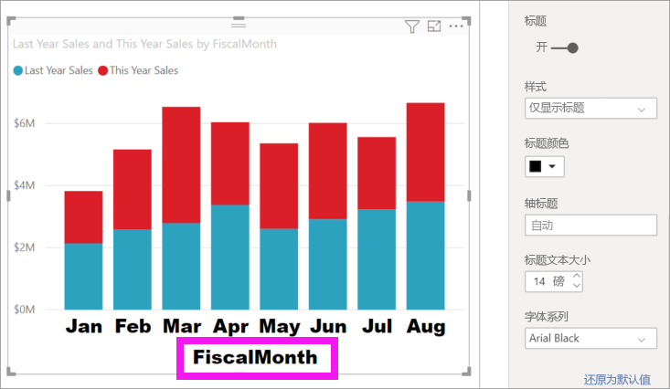

1. 设置标题文本颜色、大小和字体：

    - **标题颜色**：选择橙色

    - **坐标轴标题**：键入“Fiscal Month”（带空格）

    - **标题文本大小**：输入“18”

    完成自定义的堆积柱形图如下所示：

    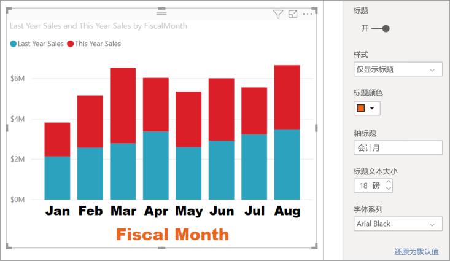

1. 保存所做的更改，并转到下一部分。 如果需要还原所有更改，请选择“自定义效果”窗格中“X 轴”底部的“还原为默认值”。 接下来，将自定义 Y 轴。

## 自定义 Y 轴
可为 Y 轴自定义许多功能。 你可添加和修改数据标签、Y 轴标题及网格线。 对于值，可修改显示单位、小数位数、起点和终点。 对于类别，可修改条形图、柱形图、折线图和面积图的宽度、大小和填充。 

我们在下面的示例中继续对柱形图进行自定义。 让我们进行一些更改来帮助你熟悉它们，你随后可自行浏览其余内容。

### 自定义 Y 轴标签
默认情况下，Y 轴标签在左侧显示。 现在，它们是浅灰色的小标签，并且难以查看。 让我们来进行更改。

1. 展开“Y 轴”选项。

   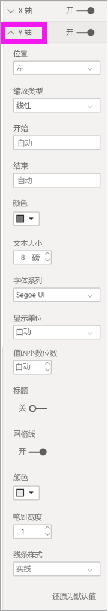

1. 将“Y 轴”滑块移至“开”。  

    

    可能需要禁用 Y 轴的一个原因是，为了节省空间以显示更多数据。

1. 设置文本颜色、大小和字体：

    - **颜色**：选择黑色

    - **文本大小**：输入“10”

    - **显示单位**：选择“百万”

    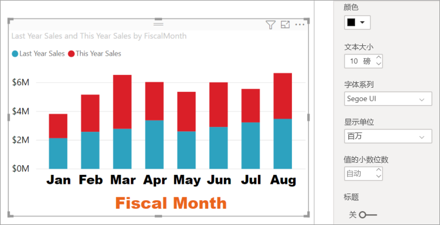

### 自定义 Y 轴标题
当 Y 轴标题为“开”时，Y 轴标题在 Y 轴标签旁边显示。 对于此可视化效果，显示 Y 轴标题并不会改进视觉对象，所以保持“标题”设置为“关”不变。 在本教程稍后部分，我们会将 Y 轴标题添加到双轴视觉对象。 

### 自定义网格线
接下来，将更改颜色并增加笔划，以突出显示网格线：

- **颜色**：选择橙色

- **笔划**：输入“2”

进行这些自定义之后，柱形图应如下所示：

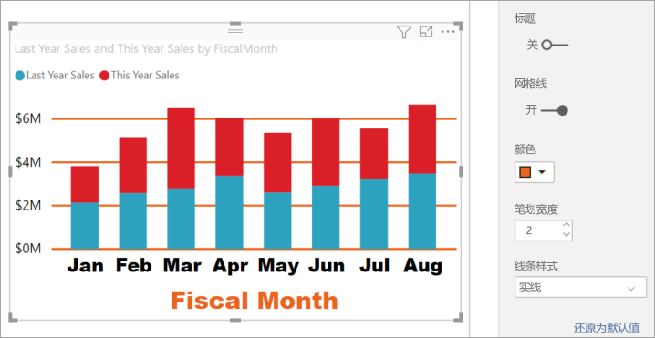

## 自定义具有双 Y 轴的可视化效果

某些可视化效果可从拥有两个 Y 轴获益。 组合图就是很好的示例。 在设置双 Y 轴的格式前，我们必须创建用于比较销售额和毛利率趋势的组合图。  

### 创建有两个 Y 轴的图

1. 选择柱形图，然后将其更改为 *折线和堆积柱形* 图。 这种视觉对象类型支持单个折线图值和多个可堆叠列值。 

    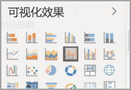
   

2. 将“Sales” > “Gross Margin Last Year %”从“字段”窗格拖到“行值”Bucket 中  。

    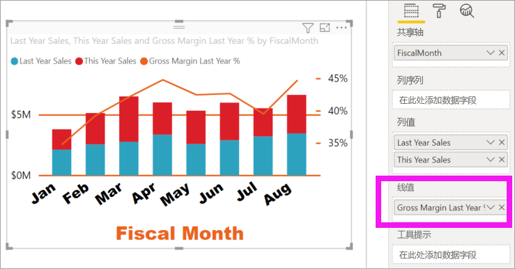

    
3. 重新设置可视化效果格式以删除呈角度显示的 X 轴标签。 

   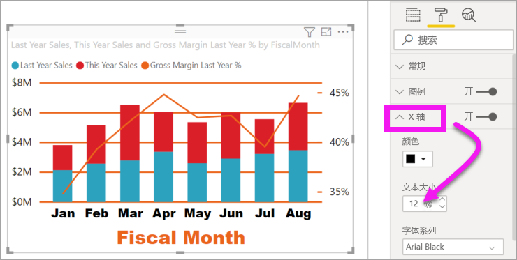

   Power BI 创建两个 Y 轴是为了让值能够以不同的方式缩放。 左轴度量以美元为单位的销售额，右轴度量毛利率百分比。

### 设置第二个 Y 轴的格式
由于我们从具有一个带格式的 Y 轴的可视化效果入手，Power BI 使用相同的设置创建第二个 Y 轴。 但我们可对此进行更改。 

1. 在“可视化效果”窗格中，选择“滚动油漆刷”图标，以显示格式选项。

1. 展开“Y 轴”选项。

1. 向下滚动到“显示副轴”选项。 验证它是否为“开”。 第二个 Y 轴表示折线图。

   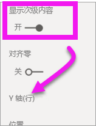

1. （可选）自定义两个轴的字体颜色、大小和显示单位。 如果切换列轴或行轴的 **位置**，则两个轴将交换位置。

### 向两个轴添加标题

对于复杂的可视化效果，添加轴标题会有所帮助。  标题可帮助你的同事了解可视化效果所表达的意思。

1. 将 **Y 轴（列）** 和 **Y 轴（行）** 的 **标题** 切换到 **打开**。

1. 将两个 Y 轴的“样式”均设置为“仅显示标题”。

   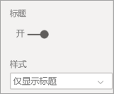

1. 组合图现在显示都有标题的双轴。

   

1. 设置标题格式。 在此示例中，我们已缩短其中一个标题，同时减小了二者的字号。 
    - 字号：**9**
    - 缩短第一个 Y 轴的“轴标题”（柱形图）：本年度销售额与上年度销售额。 
    
     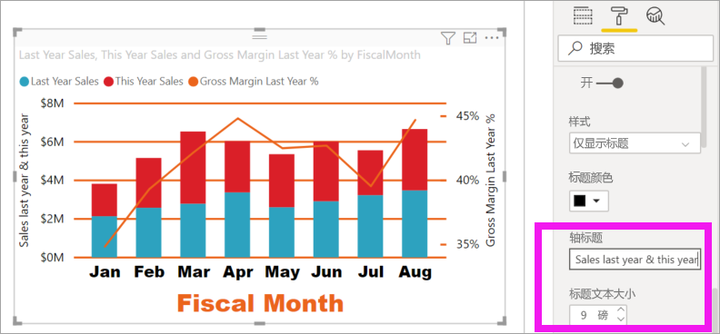

    有关详细信息，请参阅 [Power BI 中颜色格式设置的提示和技巧](service-tips-and-tricks-for-color-formatting.md)和[自定义可视化效果的标题、图例和背景](power-bi-visualization-customize-title-background-and-legend.md)。 
    

## 后续步骤

- [Power BI 报表中的可视化效果](power-bi-report-visualizations.md)

更多问题？ [尝试参与 Power BI 社区](https://community.powerbi.com/)
