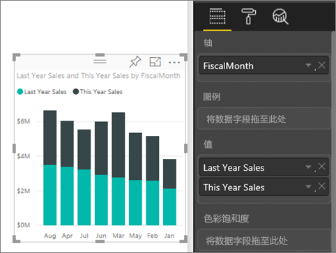
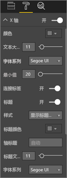
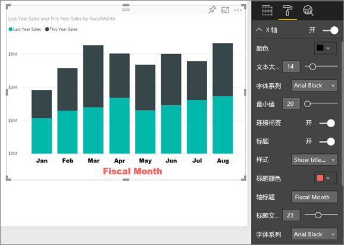
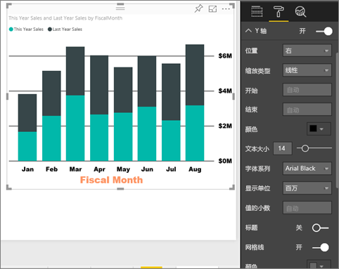
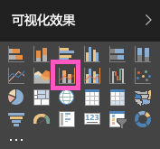
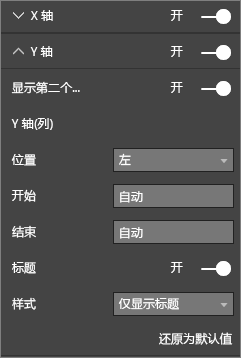

# 自定义 X 轴和 Y 轴属性

本教程将介绍许多种自定义视觉对象 X 轴和 Y 轴的不同方式。 并非所有视觉对象都有坐标轴。 例如，饼图就没有坐标轴。 而且，自定义选项也因视觉对象而异。 由于自定义选项太多，无法在一篇文章中一一介绍，因此本教程将介绍一些最常用的坐标轴自定义选项，并让你熟练使用 Power BI 报表画布中的视觉对象“格式”  窗格。  

> [!NOTE]
> 此页面适用于 Power BI 服务和 Power BI Desktop。 在 Power BI Desktop 中，选择“格式”  （“滚动油漆刷”图标 ）后，也可以使用这些自定义选项。

请观看下面的视频，Amanda 在其中介绍了如何自定义 X 轴和 Y 轴。 她将演示在使用向下钻取和向上钻取时控制串联的不同方式。

<iframe width="560" height="315" src="https://www.youtube.com/embed/9DeAKM4SNJM" frameborder="0" allowfullscreen></iframe>

## 先决条件

- Power BI 服务

- “零售分析示例”报表

## 自定义报表中的可视化效果 X 轴和 Y 轴

若要跟着本教程一起操作，请登录 [Power BI 服务](https://app.powerbi.com)，并在[“编辑报表”](../service-interact-with-a-report-in-editing-view.md)视图中打开[“零售分析示例”](../sample-datasets.md)报表。

### 创建堆积柱形图可视化效果

必须先生成可视化效果，然后才能自定义它。

1. 在 Power BI 服务中，展开“我的工作区”  。

1. 向下滚动，并选择“数据集”  列表中的“零售分析示例”  。

1. 在“可视化效果”  窗格中，选择“堆积柱形图”图标。

    

1. 若要设置 X 轴值，请在“字段”  窗格中，依次选择“时间”   > “会计月份”  。

1. 若要设置 Y 轴值，请在“字段”  窗格中，依次选择“销售额”   > “去年销售额”  ，再依次选择“销售额”   > “今年销售额”   > “值”  。

    

### 自定义 X 轴

现在可以自定义 X 轴了。

1. 在“可视化效果”  窗格中，选择“格式”  （“滚动油漆刷”图标 ），以显示自定义选项。

1. 展开 X 轴选项。

   

1. 将“X 轴”  滑块移至“开”  。

    

    禁用 X 轴的一个原因可能是，为了显示更多数据而节省空间。

1. 设置文本颜色、大小和字体：

    - **颜色**：选择黑色

    - **文本大小**：输入“14” 

    - **字体系列**：选择“Arial Black” 

1. 将“标题”  选项滑至“开”  ，以显示 X 轴的名称。 在此示例中，名称为“会计月份”  。

1. 设置标题文本颜色、大小和字体：

    - **标题颜色**：选择橙色

    - **坐标轴标题**：输入“会计月份” 

    - **标题文本大小**：输入“21” 

完成自定义的堆积柱形图如下所示：

保存所做的更改，并转到下一部分。

如果需要还原所有更改，请选择“自定义效果”窗格中“X 轴”  底部的“还原为默认值”  。

### 自定义 Y 轴

接下来，将自定义 Y 轴。

1. 展开“Y 轴”选项。

   

1. 将“Y 轴”  滑块移至“开”  。  

    

    禁用 Y 轴的一个原因可能是，为了显示更多数据而节省空间。

1. 将 Y 轴的“位置”  设置为“右”  。

1. 设置文本颜色、大小和字体：

    - **颜色**：选择黑色

    - **文本大小**：输入“14” 

    - **字体系列**：选择“Arial Black” 

1. 将“显示单位”  设置为“百万”  ，并将“值小数位数”  设置为“0”  。

1. 对于此可视化效果，显示 Y 轴标题并不会改进视觉对象，所以保持“标题”  设置为“关”  不变。  

1. 接下来，将更改颜色并增加笔划，以突出显示网格线：

    - **颜色**：选择深灰色

    - **笔划**：输入“2” 

进行这些自定义之后，柱形图应如下所示：

## 自定义有双 Y 轴的可视化效果

首先，创建研究商店数对销售额影响的组合图。 此图与[组合图教程](power-bi-visualization-combo-chart.md)中创建的组合图相同。 然后，设置双 Y 轴的格式。

### 创建有两个 Y 轴的图

1. 新建折线图，按“时间 > FiscalMonth”  跟踪“销售额 > 去年毛利率”  。

    

    > [!NOTE]
    > 如需获取按月排序方面的帮助，请参阅[使用其他条件进行排序](../consumer/end-user-change-sort.md#other)。

    1 月毛利率为 35%，4 月达到峰值45%，7 月跌落，8 月再次达到峰值。 去年和本年度的销售额是否会呈现类似模式？

1. 将**本年度销售额 > 值**和**去年销售额**添加到折线图。

    

    “去年毛利率(%)”  （沿“0%”  网格线一直延伸的蓝线）的比例尺比“销售额”  的比例尺小得多，所以很难比较。 而且，Y 轴标签百分比很不合理。

1. 若要让视觉对象更易于查看和理解，请将折线图转换为折线图和堆积柱形图组合图。

   

1. 将**去年毛利率**从**列值**拖动到**行值**中。

    

    现在就有了在第一部分中创建的堆积柱形图，其上叠加了折线图。 可以视需要利用上面学到的知识，设置坐标轴的字体颜色和文本大小。

   

   Power BI 创建两个 Y 轴是为了以不同方式缩放数据集。 左轴度量以美元为单位的销售额，右轴度量毛利率百分比。

### 设置副 Y 轴格式

1. 在“可视化效果”  窗格中，选择“滚动油漆刷”图标，以显示格式选项。

1. 展开“Y 轴”选项。

1. 向下滚动到“显示副轴”  选项。 验证它是否为“开”  。

   

1. （可选）自定义两个轴。 如果切换列轴或行轴的**位置**，则两个轴将交换位置。

### 向两个轴添加标题

对于十分复杂的可视化效果，添加坐标轴标题会有所帮助。  标题有助于同事理解可视化效果要传达的信息。

1. 将 **Y 轴（列）** 和 **Y 轴（行）** 的**标题**切换到**打开**。

1. 将两个 Y 轴的“样式”  均设置为“仅显示标题”  。

   

1. 组合图现在显示都有标题的双轴。

   

有关详细信息，请参阅 [Power BI 中的颜色格式设置提示和技巧](service-tips-and-tricks-for-color-formatting.md)。

## 注意事项和疑难解答

如果报表所有者将 X 轴分类为日期类型，“类型”  选项将显示，你可以在连续或分类之间进行选择。

## 后续步骤

- [Power BI 报表中的可视化效果](power-bi-report-visualizations.md)

- [自定义可视化效果的标题、图例和背景](power-bi-visualization-customize-title-background-and-legend.md)

- [颜色格式设置和轴属性入门](service-getting-started-with-color-formatting-and-axis-properties.md)

- [面向 Power BI 服务使用者的基本概念](../consumer/end-user-basic-concepts.md)

更多问题？ [尝试参与 Power BI 社区](http://community.powerbi.com/)
