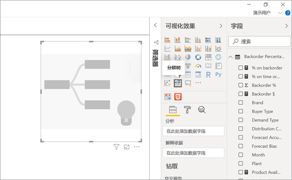
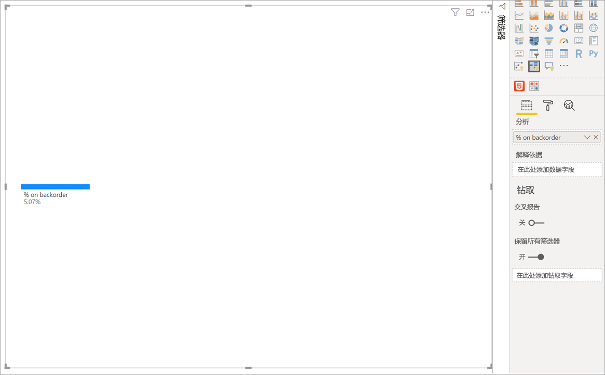
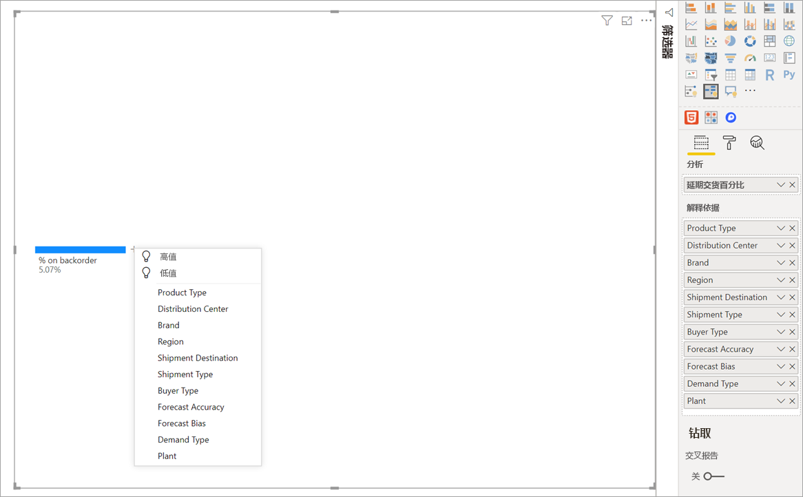
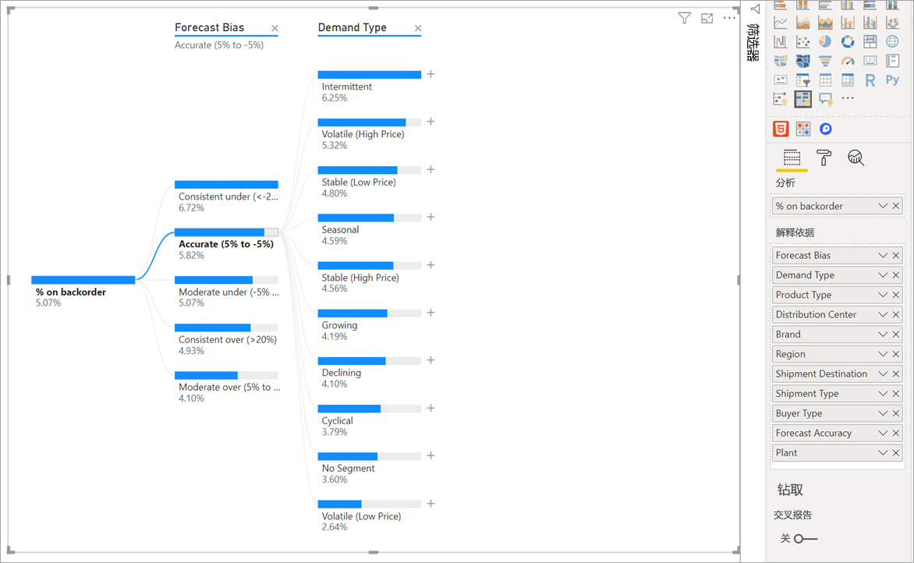
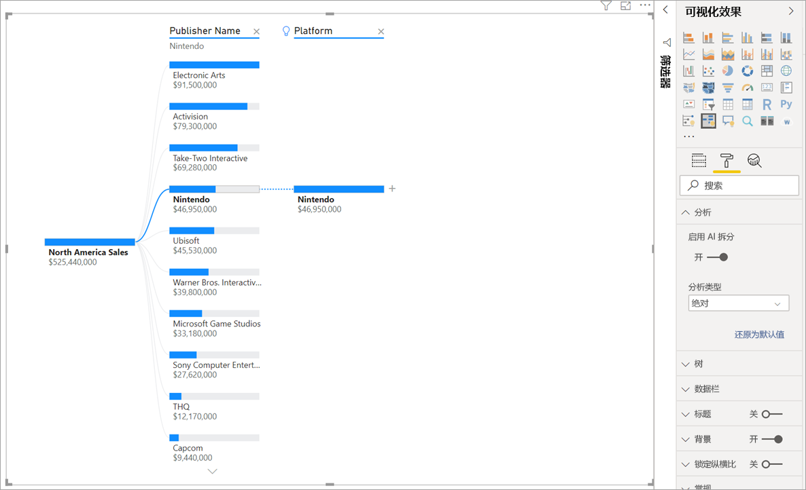
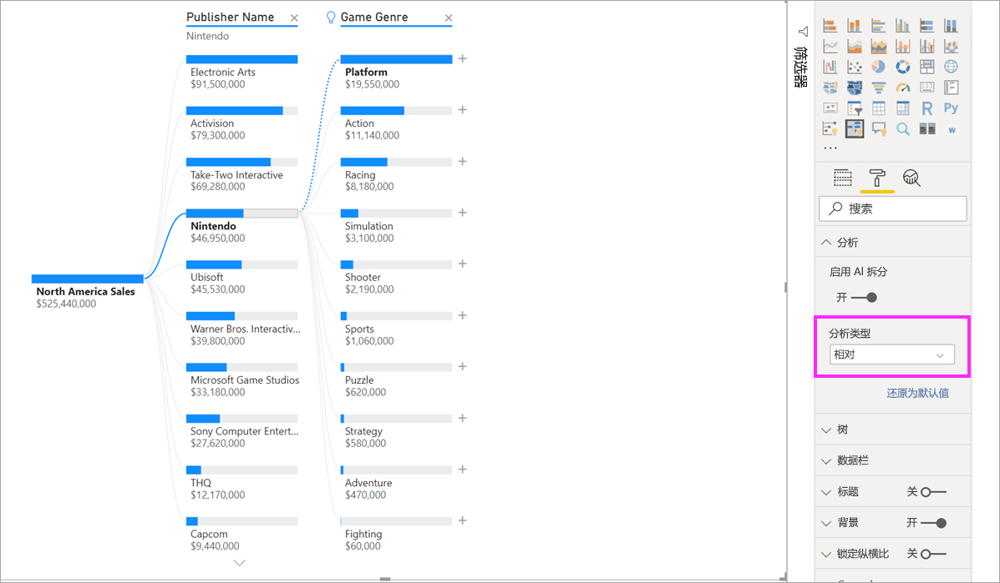
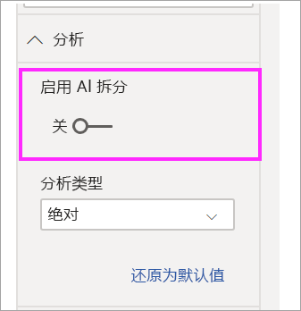

# 在 Power BI 中创建并查看分解树视觉对象

[!INCLUDE[consumer-appliesto-nyyn](../includes/consumer-appliesto-nyyn.md)]

[!INCLUDE [power-bi-visuals-desktop-banner](../includes/power-bi-visuals-desktop-banner.md)]

通过 Power BI 中的分解树视觉对象，可以在多个维度之间实现数据的可视化。 它可自动聚合数据，并按任意顺序向下钻取到各个维度中。 它也是一种人工智能 (AI) 可视化效果，因此可以要求它查找下一个维度，以根据特定条件向下钻取。 这使它成为具体探索和执行根本原因分析的有用工具。

本教程使用以下两个示例：

- 一个供应链方案，用于分析公司的延迟交货（脱销）产品的百分比。  
- 一个销售方案，按游戏流派和发行商等多种因素细分视频游戏销售情况。

可在此处找到供应链方案中使用的 pbix：[Supply Chain Sample.pbix](
https://github.com/microsoft/powerbi-desktop-samples/blob/master/Sample%20Reports/Supply%20Chain%20Sample.pbix)。

> [!NOTE]
> 与 Power BI 同事共享报表时，你和这位同事都应具有独立的 Power BI Pro 许可证，并且应将报表保存在 Premium 容量中。    

## 开始使用
从“可视化对象”窗格中，选择分解树图标。

可视化效果需要两种类型的输入：

 - **分析** – 要分析的指标。 这必须是度量值或聚合。  
 - **依据** – 要向下钻取到的一个或多个维度。

将度量值拖到字段后，视觉对象会更新展示聚合度量值。 在下面的示例中，我们将可视化延迟交货产品的平均百分比 (5.07%)。

下一步将引入要向下钻取到的一个或多个维度。 将这些字段添加到“解释依据”Bucket。 请注意，根节点旁边会出现一个加号。 选择“+”可选择要钻取到的字段（可以按所需的任意顺序向下钻取到字段）。

选择“预测偏差”会导致树展开并按列中的值细分度量值。 可以选择另一个要向下钻取到的节点来重复此过程。

从最后一个级别选择节点将交叉筛选数据。 选择先前级别的节点会更改路径。

与其他视觉对象交互会交叉筛选分解树。 级别中节点的顺序会因此而更改。
在下面的示例中，我们已通过 Ubisoft 对树进行交叉筛选。 路径进行更新，Xbox 销售从第一个位置移到第二个位置，位于 PlayStation 下面。 

如果随后按任天堂交叉筛选树，则 Xbox 销售为空，因为没有为 Xbox 开发任天堂游戏。 Xbox 及其后续路径将从视图中被筛选掉。

尽管路径消失，但现有级别（在本例中为“游戏流派”）仍固定在树中。 因此选择任天堂节点会自动将树展开到“游戏流派”。

## AI 拆分

可以使用“AI 拆分”来确定接下来应在数据中进行查找的位置。 这些拆分项显示在列表的顶部，并用灯泡标记。 拆分是为了帮助你在数据中自动查找高值和低值。

分析可以通过两种方式进行，具体取决于你的喜好。 默认行为如下：

 - **高值**：考虑所有可用字段，并确定要钻取到的字段，以获得要分析的度量值的最高值。  
 - **低值**：考虑所有可用字段，并确定要钻取到的字段，以获得要分析的度量值的最低值。  

在延迟交货示例中选择“高值”时，会产生以下结果：

产品类型旁显示一个灯泡，指示这是“AI 拆分”。 该树还提供了一条指示“患者监护”节点的虚线，因为它会导致最大延迟交货值 (9.2%)。 

将鼠标悬停在灯泡上即可看到工具提示。 在此示例中，工具提示为“产品类型为患者监护”时脱销百分比最高”。

可以配置视觉对象以查找“相对”AI 拆分，而不是“绝对”AI 拆分 。 

相对模式查找突出显示的高值（与列中的其余数据相比）。 为了说明这一点，我们来看一个示例：

在上面的屏幕截图中，我们可以看到北美的视频游戏销售额。 首先，将树按“发布者名称”拆分，然后钻取到“任天堂”。 选择“高值”会使平台扩展为“任天堂” 。 由于任天堂（发布者）仅针对任天堂控制台进行开发，只有一个值存在，因此理所当然是最高值。

尽管如此，更有趣的拆分就是查看相对于同一列中其他值而突出显示的高值。 如果将“分析类型”从“绝对”改为“相对”，则会得到以下任天堂结果 ：

这一次，推荐值是“游戏流派平台”。  平台不会产生比任天堂更高的绝对值（$19,950,000 与 $46,950,000）。 不过，这是一个值得注意的值。

更准确地说，由于有 10 个“游戏流派”值，因此，如果要均匀拆分，则平台的预期值为 $4.6M。 由于平台的值将近 $20M，因此这是一个有趣的结果，因为它比预期结果高四倍。

计算方式如下：

平台的北美销售额 / Abs(Avg(游戏流派的北美销售额))  
与  
任天堂的北美销售额 / Abs(Avg(平台的北美销售额))  

转换为：

19,550,000 / (19,550,000 + 11,140,000 + ... + 470,000 + 60,000 /10) = 4.25x  
与  
46,950,000/ (46,950,000/1) = 1x  

如果不想使用树中的任何 AI 拆分，还可以选择在“分析格式设置”选项下将其关闭：  

## 树与 AI 拆分的交互

你可以有多个后续 AI 级别。 还可以混用不同类型的 AI 级别（从高值到低值后返回高值）：

如果在树中选择另一个节点，则 AI 拆分会从头开始重新计算。 在下面的示例中，我们更改了“预测偏差”级别中的选定节点。 后续级别会变化以产生正确的高值和低值。

当你通过其他视觉对象交叉筛选分解树时，也会重新计算 AI 级别。 在下面的示例中，我们可以看到，第 0477 号工厂的脱销百分比最高。

但如果在条形图中选择“四月”，则最高级变为“产品类型为高级外科” 。 在这种情况下，不只是节点重新排序，而是会选中完全不同的列。 

如果希望 AI 级别的行为与非 AI 级别相同，请选择灯泡以将行为恢复为默认值。 

虽然多个 AI 级别可以链接在一起，但非 AI 级别不能与 AI 级别相连。 如果在 AI 拆分后执行手动拆分，则 AI 级别的灯泡将消失，级别转换为普通级别。 

## 锁定

内容创建者可以锁定报表使用者的级别。 当某个级别处于锁定状态时，不能删除或更改。 使用者可以浏览锁定级别内的不同路径，但无法更改级别本身。 作为创建者，你可以将鼠标悬停在现有级别上以查看锁定图标。 可以根据需要锁定任意多个级别，但锁定级别之前不能有解锁级别。

在下面的示例中，前两个级别被锁定。 这意味着报表使用者可以更改级别 3 和 4，甚至可以在以后添加新级别。 但不能更改前两个级别：

## 已知限制

树的最大级别数为 50。 一次最多可视化树中的 5000 个数据点。 截断级别以显示前 n 个。 目前每个级别的前 n 个设置为 10。 

在以下情况下，不支持分解树：  
-   本地 Analysis Services

在以下情况下，不支持 AI 拆分：  
-   Azure Analysis Services
-   Power BI 报表服务器
-   向网络发布
-   “分析”中的复杂度量值和扩展架构度量值

其他限制：
- 问答中的支持

## 后续步骤

[Power BI 圆环图](power-bi-visualization-doughnut-charts.md)

[Power BI 可视化效果](power-bi-report-visualizations.md)

