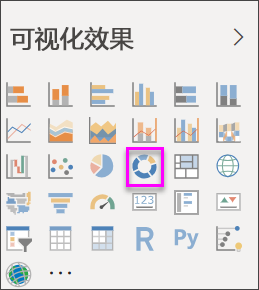
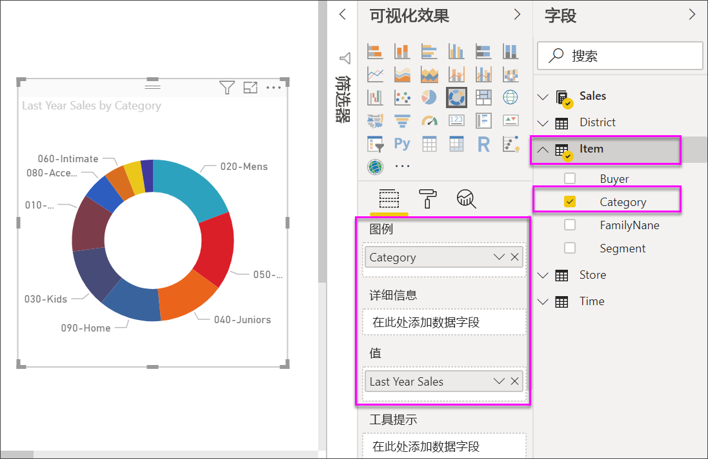

# 在 Power BI 中创建和使用圆环图

[!INCLUDE[consumer-appliesto-nyyn](../includes/consumer-appliesto-nyyn.md)]

[!INCLUDE [power-bi-visuals-desktop-banner](../includes/power-bi-visuals-desktop-banner.md)]

圆环图类似于饼图，因为它显示部分与整体的关系。 唯一的区别是中心为空，因而有空间可用于标签或图标。

## 先决条件

本教程使用[零售分析示例 PBIX 文件](https://download.microsoft.com/download/9/6/D/96DDC2FF-2568-491D-AAFA-AFDD6F763AE3/Retail%20Analysis%20Sample%20PBIX.pbix)。

1. 在菜单栏的左上方，选择“文件” > “打开”  
   
2. 查找**零售分析示例 PBIX 文件**的副本

1. 在报表视图中打开**零售分析示例 PBIX 文件**。

1. 选择  ，以添加新报表页。

> [!NOTE]
> 与 Power BI 同事共享报表时，你和这位同事都应具有独立的 Power BI Pro 许可证，并且应将报表保存在 Premium 容量中。    

## 创建圆环图

1. 从空白报表页入手，在“字段”窗格中选择“销售额”\>“去年销售额”   。  
   
3. 从可视化对象窗格中，选择圆环图的图标，将条形图转换为圆环图。 如果“去年销售额”不在“值”区域中，请将它拖动到其中。  
     
   

4. 依次选择“项”\>“类别”，将其添加到图例区域中    。 
     
    

5. （可选）[调整大小和图表文本的颜色](power-bi-visualization-customize-title-background-and-legend.md)。 

## 注意事项和疑难解答
* 圆环图值的总和相加必须达到 100%。
* 类别太多会难以查看和解释。
* 圆环图最适用于将特定部分与整体进行比较，而不是将各个部分相互比较。 

## 后续步骤
[Power BI 中的漏斗图](power-bi-visualization-funnel-charts.md)

[Power BI 中的可视化效果类型](power-bi-visualization-types-for-reports-and-q-and-a.md)

