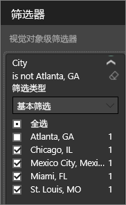
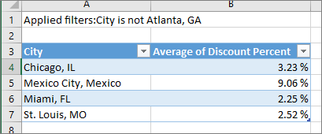
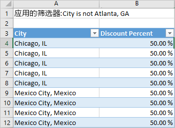

# 从可视化效果导出数据

若要查看 Power BI 用来创建可视化效果的数据，可以[在 Power BI 中显示此类数据](service-reports-show-data.md)。 还可以将此类数据以 .xlsx  或 .csv  文件形式导出至 Excel。 导出数据的选项需要 Pro 或 Premium 许可证以及对数据集和报表的编辑权限。

请观看下面的视频，Will 在其中导出自己报表中一个可视化效果内的数据，将数据保存为 .xlsx  文件，并在 Excel 中打开它。 然后可以按照视频下面的分步说明来自己尝试。

<iframe width="560" height="315" src="https://www.youtube.com/embed/KjheMTGjDXw" frameborder="0" allowfullscreen></iframe>

## 导出 Power BI 仪表板中的数据

1. 选择可视化效果右上角的省略号。

    

1. 选择“导出数据”  图标。

    

1. 此时，Power BI 会将数据导出至 .csv  文件。 如果你已筛选可视化效果，此应用会筛选已下载的数据。

1. 你的浏览器将提示你保存该文件。  保存后，在 Excel 中打开此 .csv  文件。

    

## 导出报表中的数据

为此，请打开“编辑视图”中的[采购分析示例报表](../sample-procurement.md)。 添加新的空白报表页。 然后按照以下步骤来添加聚合和可视化效果级别筛选器。

1. 新建一个堆积柱形图  。

1. 在“字段”  窗格中，依次选择“位置”>“城市”  和“发票”>“折扣百分比”  。  需要将“折扣百分比”  移到“值”  井中。

    

1. 将折扣百分比  的聚合从“计数”  更改为“平均”  。 在“值”  井中，选择“折扣百分比”  （可能显示的是“折扣百分比计数”  ）右侧的箭头，再选择“平均”  。

    

1. 向“城市”  添加筛选器，选中所有城市，再取消选中“亚特兰大”  。

    

   现在准备尝试使用两个选项导出数据。

1. 选择可视化效果右上角的省略号。 选择“导出数据”  。

    

    在 Power BI 联机版中，如果可视化效果有聚合（例如将“计数”  更改为“平均”  、“总和”  或“最小”  ），你可以使用下面两个选项：

    - **汇总数据**

    - **基础数据**

    Power BI Desktop 中仅提供“汇总数据”选项  。 如需有关了解聚合的帮助，请参阅 [Power BI 中的聚合](../service-aggregates.md)。

1. 在“导出数据”  中，选中“汇总数据”  ，再依次选择“.xlsx”  或“.csv”  和“导出”  。 Power BI 导出数据。

    

    如果你已将筛选器应用于可视化效果，已导出数据将作为筛选后的数据导出。 选择“导出”  时，浏览器会提示你保存文件。 保存后，在 Excel 中打开该文件。

    **汇总数据**：若要导出在相应视觉对象中看到的数据，请选中此选项。  这种类型的导出仅显示所选用于创建视觉对象的数据（列和度量值）。  如果视觉对象具有聚合，则将导出聚合数据。 例如，如果有一个条形图显示四个条形，就会导出四行数据。 汇总数据可以 .xlsx  和 .csv  形式导出。

    在此示例中，Excel 导出会显示每个城市的总计。 由于已筛选掉亚特兰大，因此它并不包含在结果中。 电子表格的第一行显示，Power BI 在提取数据时使用的筛选器。

    

1. 现在尝试选中“基础数据”  ，再依次选择“.xlsx”  和“导出”  。 Power BI 导出数据。 

    > [!NOTE]
    > 用于导出基础数据的选项不一定有，具体视报表设置而定。

    如果你已将筛选器应用于可视化效果，已导出数据将作为筛选后的数据导出。 选择“导出”  时，浏览器会提示你保存文件。 保存后，在 Excel 中打开该文件。

    >[!WARNING]
    >导出基础数据可便于用户查看所有详细数据（数据中的每一列）。 Power BI 服务管理员可以为自己的组织禁用此功能。 如果你是数据集所有者，可以将专有列设置为“隐藏”  ，这样它们就不会出现在 Power BI Desktop 或 Power BI 服务的“字段”  列表中。

    **基础数据**：若要查看视觉对象中的数据和模型中的其他数据，请选中此选项（有关详细信息，请参阅下图）。 如果可视化效果具有聚合，则选择基础数据  会删除聚合。 在你选择“导出”  后，Power BI 会将数据导出至 .xlsx  文件，浏览器会提示你保存此文件。 保存后，在 Excel 中打开该文件。

    在此示例中，Excel 导出文件的每一行显示数据集中每一个“城市”行，以及每个条目的折扣百分比。 Power BI 会合并数据， 但不会聚合数据。 电子表格的第一行显示，Power BI 在提取数据时使用的筛选器。  

    

## 导出基础数据的详细信息

选择基础数据  时看到的内容可能会有所不同。 若要理解这些详细信息，可能需要向管理员或 IT 部门寻求帮助。 在 Power BI Desktop 或 Power BI 服务的报表视图中，带有计算器图标  的度量值  显示在“字段”  列表中。 Power BI Desktop 可创建度量值， 而 Power BI 服务则无法创建。

| 视觉对象包含 | 将在导出中看到的内容  |
|---------------- | ---------------------------|
| 聚合 | 第一个  聚合和来自该聚合的整个表的非隐藏数据 |
| 聚合 | 相关数据 - 如果视觉对象使用的数据来自其他数据表，且这些表与包含聚合的数据表相关  （只要关系是 \*:1 或 1:1） |
| 度量值 | 视觉对象中的所有度量值，以及  任何包含视觉对象中所用度量值的数据表中的全部度量值 |
| 度量值 | 包含相应度量值的表中的所有非隐藏数据（只要关系是 \*:1 或 1:1） |
| 度量值 | 与包含度量值的一个或多个表相关的所有表中的全部数据（通过链 \*:1 或 1:1） |
| 仅度量值 | 所有相关表中的全部非隐藏列（以便展开度量值） |
| 仅度量值 | 模型度量值的任何重复行的汇总数据 |

### 设置导出选项

Power BI 报表设计器控制向使用者提供的数据导出选项的类型。 选项包括：

- 允许最终用户从 Power BI 服务或 Power BI 报表服务器导出汇总数据

- 允许最终用户从 Power BI 服务或 Power BI 报表服务器导出汇总数据和基础数据

- 禁止最终用户从 Power BI 服务或 Power BI 报表服务器导出任何数据

    > [!IMPORTANT]
    > 建议报表设计人员重新访问旧报表，并根据需要手动重置导出选项。

若要设置这些选项，请执行以下操作：

1. 启动 Power BI Desktop。

1. 在左上角选择“文件” > “选项和设置” > “选项”    。

1. 在“当前文件”  下，选择“报表设置”  。

    

1. 在“导出数据”  部分中，选中相应选项。

此外，还可在 Power BI 服务中更新此设置。

请务必注意，如果 Power BI 管理门户设置与报表的数据导出设置冲突，管理设置会替代数据导出设置。

## 限制和注意事项
这些限制和注意事项适用于 Power BI Desktop 和 Power BI 服务，包括 Power BI Pro 和 Power BI Premium。

- 必须[有权生成基础数据集](https://docs.microsoft.com/power-bi/service-datasets-build-permissions#build-permissions-for-shared-datasets)，才能导出视觉对象中的数据。

-  Power BI Desktop  和 Power BI 服务  最多可以将 30,000 行导出至 .csv  文件。

- 这些应用最多可以将 150,000 行导出至 .xlsx  文件。

- 在以下情况下，无法使用“基础数据”  导出数据：

  - 数据源是 Analysis Services 实时连接。

  - 版本低于 2016。

  - 模型中的表没有唯一键。
    
  -  管理员或报表设计人员已禁用此功能。

- 如果为 Power BI 要导出的可视化效果启用“显示不含数据的项”  选项，无法使用“基础数据”  导出数据。

- 使用 DirectQuery 时，Power BI 最多可以导出 16MB 数据。 可能出现的意外结果是，导出数据低于行数上限。 在以下情况下，可能会出现这样的结果：

    - 有许多列。

    - 有难以压缩的数据。

    - 其他因素导致文件大小增加，但 Power BI 可以导出的行数减少。

- 如果可视化效果使用多个数据表中的数据，但这些表在数据模型中没有任何关系，Power BI 只导出第一个表中的数据。

- 暂不支持自定义视觉对象和 R 视觉对象。

- 使用内部用户已与其共享的仪表板的组织外部用户无法导出数据。

- 在 Power BI 中，可以双击字段并键入新名称，从而重命名字段（列）。 Power BI 将新名称称为“别名”  。 虽然 Power BI 报表可以包含重复的字段名称，但 Excel 禁止重复。 因此，当 Power BI 将数据导出至 Excel 后，字段别名还原为原始字段（列）名称。  

- 如果 .csv  文件中有 Unicode 字符，Excel 中的文本可能无法正常显示。 Unicode 字符示例包括，货币符号和外来词。 可以在记事本中打开此文件，这样 Unicode 就能正确显示了。 若要在 Excel 中打开此文件，解决方法是导入 .csv  。 若要将此文件导入 Excel，请执行以下操作：

  1. 打开 Excel。

  1. 转到“数据”  选项卡。
  
  1. 依次选择“获取外部数据”   > “自文本”  。
  
  1. 转到存储此文件的本地文件夹，并选择“.csv”  。

- Power BI 管理员可以禁用数据导出功能。

更多问题？ [尝试咨询 Power BI 社区](http://community.powerbi.com/)