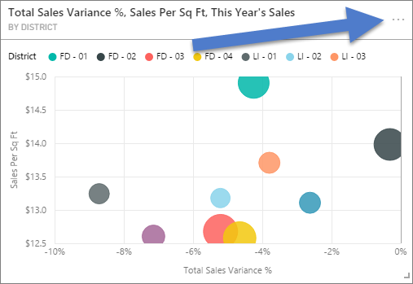
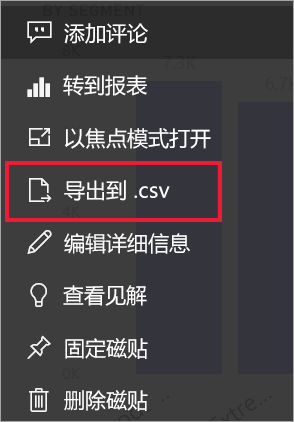
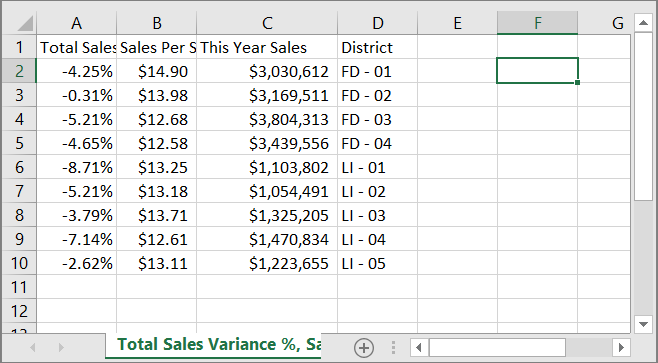
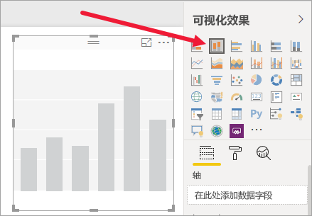
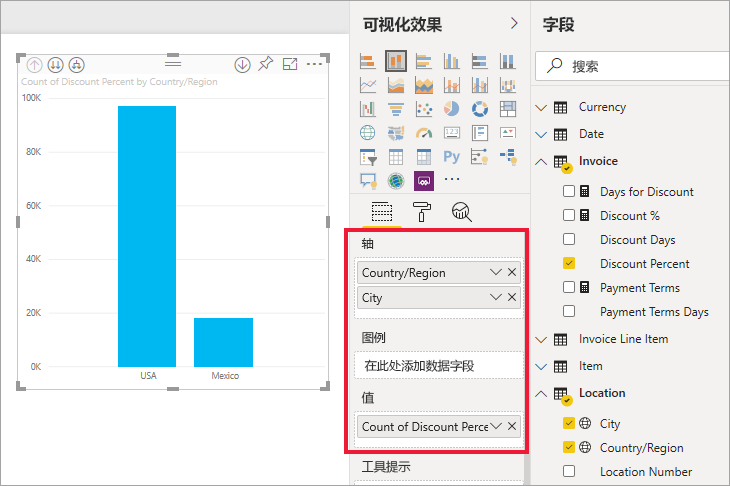
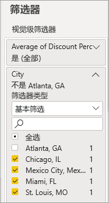
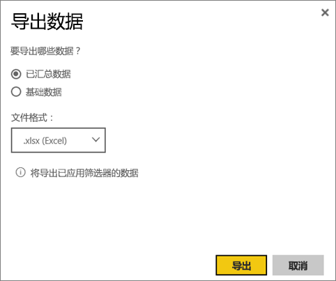
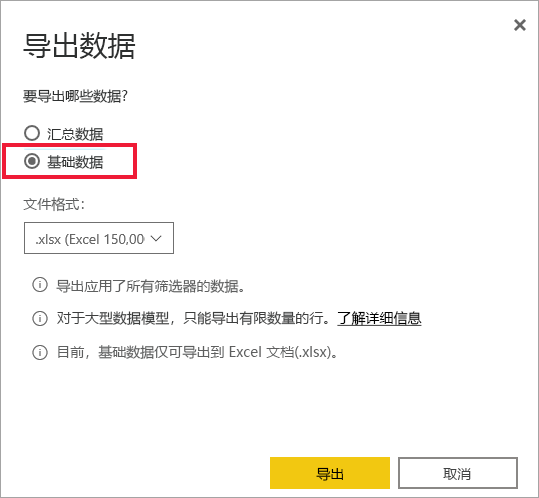
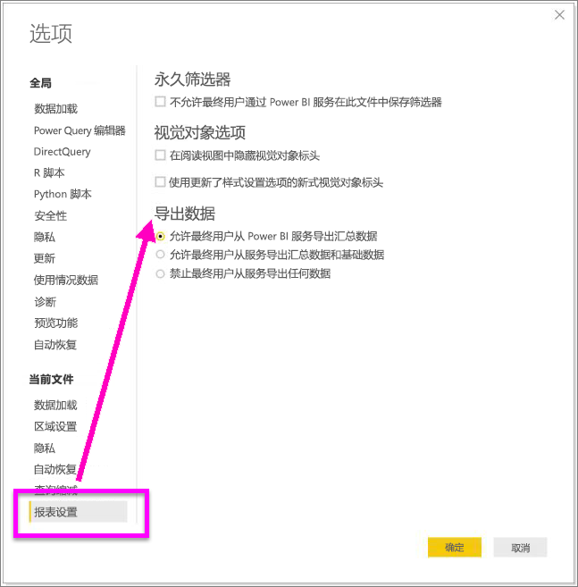

# 探索用于创建可视化效果的数据

> [!IMPORTANT]
> 并非所有用户都可以查看或导出所有数据。 报表设计人员和管理员在生成仪表板和报表时会使用一些安全措施。 某些数据受到限制、已被隐藏或为保密信息，如果没有特殊权限，将无法查看或导出这些数据。 

## 谁可以导出数据

如果你有权访问数据，则可以查看和导出 Power BI 用于创建可视化效果的数据。 通常，数据是保密的，或者仅特定用户可访问。 在这些情况下，你将无法查看或导出这些数据。 有关详细信息，请参阅本文档末尾的“限制和注意事项”部分。 

## 查看和导出数据

若要查看 Power BI 用来创建可视化效果的数据，可以[在 Power BI 中显示此类数据](service-reports-show-data.md)。 还可以将此类数据以 .xlsx 或 .csv 文件形式导出至 Excel。 导出数据的选项需要 Pro 或 Premium 许可证以及对数据集和报表的编辑权限。 如果你有权访问仪表板或报表，但数据被归类为“高度机密”，Power BI 将不允许你导出该数据。

请观看下面的视频，Will 在其中导出自己报表中一个可视化效果内的数据，将数据保存为 .xlsx 文件，并在 Excel 中打开它。 然后可以按照视频下面的分步说明来自己尝试。 请注意，此视频使用较旧版本的 Power BI。

<iframe width="560" height="315" src="https://www.youtube.com/embed/KjheMTGjDXw" frameborder="0" allowfullscreen></iframe>

## 导出 Power BI 仪表板中的数据

1. 从可视化效果的右上角选择“更多操作(...)”。

    

1. 选择“导出到 .csv”选项。

    

1. 此时，Power BI 会将数据导出至 .csv 文件。 如果你已筛选可视化效果，则也将筛选 .csv 导出。 

1. 你的浏览器将提示你保存该文件。  保存后，在 Excel 中打开此 .csv 文件。

    

## 导出报表中的数据

为此，请在 Power BI 服务的“编辑视图”中打开[采购分析示例报表](../create-reports/sample-procurement.md)。 添加新的空白报表页。 然后按照以下步骤来添加聚合、层次结构和可视化效果级别筛选器。

### 新建一个堆积柱形图

1. 新建一个堆积柱形图。

    

1. 在“字段”窗格中，依次选择“位置 > 城市”、“位置 > 国家/地区”和“发票 > 折扣百分比”   。  需要将“折扣百分比”移到“值”井中。

    

1. 将折扣百分比的聚合从“计数”更改为“平均”。 在“值”井中，选择“折扣百分比”（可能显示的是“折扣百分比计数”）右侧的箭头，再选择“平均”。

    

1. 向“城市”添加筛选器，选中所有城市，再取消选中“亚特兰大”。

    

   
1. 在层次结构中向下钻取一个级别。 启用钻取并向下钻取到“城市”级别。 

    

现在准备尝试使用两个选项导出数据。

### 导出汇总数据
如果希望导出在相应视觉对象中看到的数据，请选择“汇总数据”选项。  这种类型的导出仅显示用于创建视觉对象的数据（列和度量值）。  如果视觉对象具有聚合，则将导出聚合数据。 例如，如果有一个条形图显示四个条形，就会导出四行 Excel 数据。 汇总数据在 Power BI 服务中以 .xlsx 和 .csv 的形式提供，在 Power BI Desktop 中以 .csv 的形式提供 。

1. 选择可视化效果右上角的省略号。 选择“导出数据”。

    

    在 Power BI 服务中，由于可视化效果具有聚合（已将“计数”更改为“平均值”），因此有两个选项：

    - **汇总数据**

    - **基础数据**

    如需有关了解聚合的帮助，请参阅 [Power BI 中的聚合](../create-reports/service-aggregates.md)。

    > [!NOTE]
    > 在 Power BI Desktop 中，只能选择将汇总数据导出为 .csv 文件。 
    
    
1. 在“导出数据”中，选中“汇总数据”，再依次选择“.xlsx”或“.csv”和“导出”。 Power BI 导出数据。

    

1. 选择“导出”时，浏览器会提示你保存文件。 保存后，在 Excel 中打开该文件。

    

    在此示例中，Excel 导出会显示每个城市的总计。 由于已筛选掉亚特兰大，因此它并不包含在结果中。 电子表格的第一行显示，Power BI 在提取数据时使用的筛选器。
    
    - 会导出层次结构使用的所有数据，而不仅仅是用于视觉对象的当前钻取级别的数据。 例如，我们已向下钻取到城市级别，但导出也包含国家/地区数据。  

    - 导出的数据是聚合数据。 每个城市数据总共为一行。

    - 由于我们已将筛选器应用于可视化效果，导出数据将作为筛选后的数据导出。 请注意，第一行显示为“应用的筛选器：城市不是乔治亚洲亚特兰大”。 

### 导出基础数据

若要查看视觉对象中的数据和数据集中的其他数据，请选中此选项（有关详细信息，请参阅下图）。 如果可视化效果具有聚合，则选择基础数据会删除聚合。 在此示例中，Excel 导出文件的每一行显示数据集中每一个“城市”行，以及每个条目的折扣百分比。 Power BI 可以展开数据，但不会聚合数据。  

在你选择“导出”后，Power BI 会将数据导出至 .xlsx 文件，浏览器会提示你保存此文件。 保存后，在 Excel 中打开该文件。

1. 从可视化效果右上角选择省略号。 选择“导出数据”。

    

    在 Power BI 服务中，由于可视化效果具有聚合（已将“计数”更改为“平均值” ），因此有两个选项：

    - **汇总数据**

    - **基础数据**

    如需有关了解聚合的帮助，请参阅 [Power BI 中的聚合](../create-reports/service-aggregates.md)。

    > [!NOTE]
    > 在 Power BI Desktop 中，你只能选择导出汇总数据。 
    
    
1. 在“导出数据”中，选择“基础数据”，然后选择“导出”  。 Power BI 导出数据。

    

1. 选择“导出”时，浏览器会提示你保存文件。 保存后，在 Excel 中打开该文件。

    
    
    - 此屏幕截图仅显示了 Excel 文件的一小部分。该文件有 100,000 多行。  
    
    - 会导出层次结构使用的所有数据，而不仅仅是用于视觉对象的当前钻取级别的数据。 例如，我们已向下钻取到城市级别，但导出也包含国家/地区数据。  

    - 由于我们已将筛选器应用于可视化效果，导出数据将作为筛选后的数据导出。 请注意，第一行显示为“应用的筛选器：城市不是乔治亚洲亚特兰大”。 

## 自定义导出数据用户体验

有权访问报表的用户具有访问整个基础数据集的权限，除非[行级别安全性 (RLS)](../admin/service-admin-rls.md) 限制其访问权限。 报表作者和 Power BI 管理员可以使用下面所述的功能来自定义用户体验。

- 报表作者[决定](#set-the-export-options)用户可以使用的导出选项。  

- Power BI 管理员可为其组织关闭某些或所有数据导出选项。  

- 数据集所有者可以设置行级别安全性 (RLS)。 RLS 将限制对只读用户的访问。 但是，如果已配置应用工作区，并且授予给定成员编辑权限，则将不会对其应用 RLS 角色。 有关详细信息，请参阅[行级别安全性](../admin/service-admin-rls.md)。

- 报表作者可以隐藏列，使其不显示在“字段”列表中。 有关详细信息，请参阅[数据集属性](../developer/automation/api-dataset-properties.md)

这些自定义用户体验不会限制用户可以访问数据集中的哪些数据。在数据集中使用[行级别安全性 (RLS)](../admin/service-admin-rls.md)，以便每个人的凭据都可以确定他们可以访问的数据。

## 在将数据导出 Power BI 时保护数据

- 报表作者可以使用 Microsoft 信息保护[敏感度标签](../admin/service-security-data-protection-overview.md)对报表进行分类和标注。 如果敏感度标签具有保护设置，则在将报表数据导出到 Excel、PowerPoint 或 PDF 文件时，Power BI 将应用这些保护设置。 只有经过授权的用户才能打开受保护的文件。

- 安全管理员和 Power BI 管理员可以使用 [Microsoft Cloud App Security](../admin/service-security-data-protection-overview.md) 来监视用户访问和活动，执行实时风险分析，并设置标签特定的控件。 例如，组织可以使用 Microsoft Cloud App Security 来配置策略，防止用户将敏感数据从 Power BI 下载到非托管设备。

## 导出基础数据的详细信息

选择基础数据时看到的内容可能会有所不同。 若要理解这些详细信息，可能需要向管理员或 IT 部门寻求帮助。 

>

| 视觉对象包含 | 将在导出中看到的内容  |
|---------------- | ---------------------------|
| 聚合 | 第一个聚合和来自该聚合的整个表的非隐藏数据 |
| 聚合 | 相关数据 - 如果视觉对象使用的数据来自其他数据表，且这些表与包含聚合的数据表相关（只要关系是 \*:1 或 1:1） |
| 度量值* | 视觉对象中的所有度量值，以及任何包含视觉对象中所用度量值的数据表中的全部度量值 |
| 度量值* | 包含相应度量值的表中的所有非隐藏数据（只要关系是 \*:1 或 1:1） |
| 度量值* | 与包含度量值的一个或多个表相关的所有表中的全部数据（通过链 \*:1 或 1:1） |
| 仅度量值 | 所有相关表中的全部非隐藏列（以便展开度量值） |
| 仅度量值 | 模型度量值的任何重复行的汇总数据 |

\* 在 Power BI Desktop 或 Power BI 服务的报表视图中，带有计算器图标的度量值显示在“字段”列表中。 可以在 Power BI Desktop 中创建度量值。

### 设置导出选项

Power BI 报表设计器控制向使用者提供的数据导出选项的类型。 选项包括：

- 允许最终用户从 Power BI 服务或 Power BI 报表服务器导出汇总数据

- 允许最终用户从 Power BI 服务或 Power BI 报表服务器导出汇总数据和基础数据

- 禁止最终用户从 Power BI 服务或 Power BI 报表服务器导出任何数据

    > [!IMPORTANT]
    > 建议报表设计人员重新访问旧报表，并根据需要手动重置导出选项。

若要设置这些选项，请执行以下操作：

1. 启动 Power BI Desktop。

1. 在左上角选择“文件” > “选项和设置” > “选项”  。

1. 在“当前文件”下，选择“报表设置”。

    

1. 在“导出数据”部分中，选中相应选项。

此外，还可在 Power BI 服务中更新此设置。

请务必注意，如果 Power BI 管理门户设置与报表的数据导出设置冲突，管理设置会替代数据导出设置。

## 限制和注意事项
这些限制和注意事项适用于 Power BI Desktop 和 Power BI 服务，包括 Power BI Pro 和 Power BI Premium。

- 必须[有权生成基础数据集](https://docs.microsoft.com/power-bi/service-datasets-build-permissions)，才能导出视觉对象中的数据。

-  Power BI Desktop 和 Power BI 服务最多可以将 30,000 行从导入模式报表导出至 .csv 文件  。

- 这些应用程序最多可以将 150,000 行从导入模式报表导出至 .xlsx 文件。

- 在以下情况下，无法使用“基础数据”导出数据：

  - 版本低于 2016。

  - 模型中的表没有唯一键。
    
  -  管理员或报表设计人员已禁用此功能。

- 如果为 Power BI 要导出的可视化效果启用“显示不含数据的项”选项，无法使用“基础数据”导出数据。

- 使用 DirectQuery 时，Power BI 最多可以导出 16-MB 未压缩的数据。 可能出现的意外结果是，导出的行数小于最大行数 150,000。 在以下情况下，可能会出现这样的结果：

    - 有太多列。 请尝试减少列数并重新导出。

    - 有难以压缩的数据。

    - 其他因素导致文件大小增加，但 Power BI 可以导出的行数减少。

- 如果可视化效果使用多个数据表中的数据，但这些表在数据模型中没有任何关系，Power BI 只导出第一个表中的数据。

- 目前不支持 Power BI 视觉对象和 R 视觉对象。

- 在 Power BI 中，可以双击字段并键入新名称，从而重命名字段（列）。 Power BI 将新名称称为“别名”。 虽然 Power BI 报表可以包含重复的字段名称，但 Excel 禁止重复。 因此，当 Power BI 将数据导出至 Excel 后，字段别名还原为原始字段（列）名称。  

- 如果 .csv 文件中有 Unicode 字符，Excel 中的文本可能无法正常显示。 Unicode 字符示例包括，货币符号和外来词。 可以在记事本中打开此文件，这样 Unicode 就能正确显示了。 若要在 Excel 中打开此文件，解决方法是导入 .csv。 若要将此文件导入 Excel，请执行以下操作：

  1. 打开 Excel。

  1. 转到“数据”选项卡。
  
  1. 依次选择“获取外部数据” > “自文本”。
  
  1. 转到存储此文件的本地文件夹，并选择“.csv”。

- 导出到 .csv 时，某些字符会通过前导“'”进行转义。

- Power BI 管理员可以禁用数据导出功能。

更多问题？ [尝试咨询 Power BI 社区](https://community.powerbi.com/)
