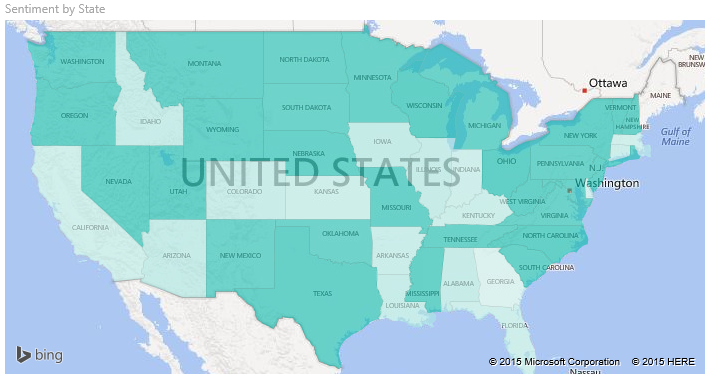
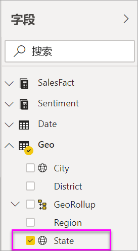
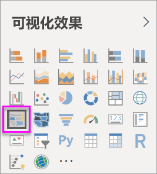
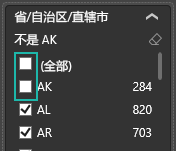
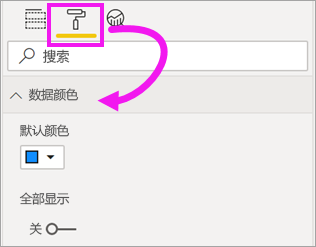
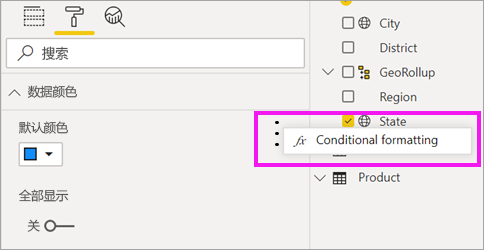
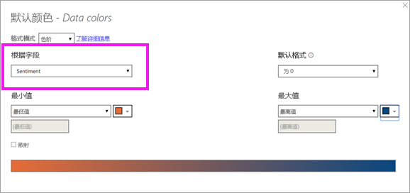
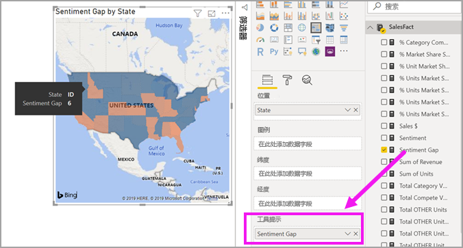
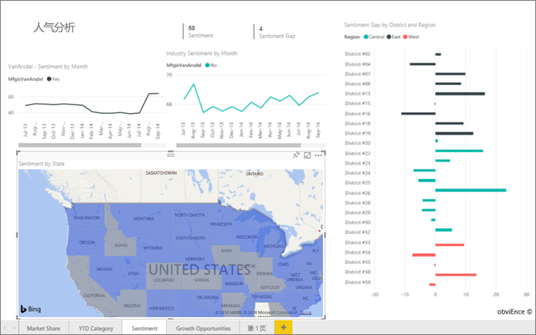
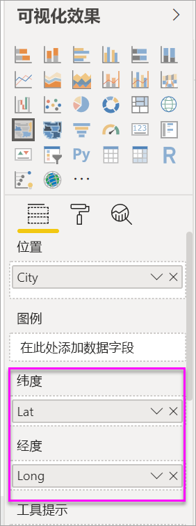

# 创建和使用 Power BI 中的着色地图（等值线图）

[!INCLUDE [power-bi-visuals-desktop-banner](../includes/power-bi-visuals-desktop-banner.md)]

着色地图使用明暗度、颜色或图案来显示不同地理位置或区域之间的值在比例上有何不同。  使用从浅（不太频繁/较低）到深（较频繁/较多）的明暗度快速显示这些相对差异。    

## 发动到必应的数据
Power BI 与必应相集成，提供默认地图坐标（一个称为地理编码的过程）。 在 Power BI 服务或 Power BI Desktop 中创建地图可视化效果时，“位置”、“纬度”和“经度”存储桶中的数据（用于创建该可视化效果）将发送到必应。

你或管理员可能需要更新防火墙，以允许访问必应用来地理编码的 URL。  这些 URL 是：
- https://dev.virtualearth.net/REST/V1/Locations    
- https://platform.bing.com/geo/spatial/v1/public/Geodata    
- https://www.bing.com/api/maps/mapcontrol

有关发送到必应的数据的详细信息，以及提高地理编码成功率的提示，请参阅[地图可视化效果的提示和技巧](power-bi-map-tips-and-tricks.md)。

## 何时使用着色地图
着色地图适用情况：

* 要在地图上显示定量信息。
* 要显示空间模式和关系。
* 你的数据已进行标准化处理。
* 处理社会经济数据时。
* 当定义的区域很重要时。
* 要获取跨地理位置的分布的概况。

### 先决条件
本教程使用[销售和市场营销示例 PBIX 文件](https://download.microsoft.com/download/9/7/6/9767913A-29DB-40CF-8944-9AC2BC940C53/Sales%20and%20Marketing%20Sample%20PBIX.pbix)。
1. 在菜单栏的左上部分，选择“文件” > “打开”
   
2. 找到“销售和市场营销示例 PBIX 文件”的副本

1. 在报表视图 中打开“销售和市场营销示例 PBIX 文件”。

1. 选择  ，以添加新报表页。

## 创建基本的着色地图
在此视频中，Kim 将创建基本地图并将其转换为着色地图。
   > [!NOTE]
   > 此视频使用较低版本的 Power BI Desktop。
   > 
   > 

[视频 https://www.youtube.com/embed/ajTPGNpthcg]

### 创建着色地图
1. 从“字段”窗格中，选择“地区”\>“状态”字段。    

   
2. [将图表转换](power-bi-report-change-visualization-type.md)为着色地图。 请注意，州现在位于位置框中。 必应地图使用位置框中的字段创建地图。  该位置可以是各种有效位置：国家/地区、州、县、市、邮政编码或其他邮政编码等。必应地图可提供世界各地的着色地图形状。 如果“位置”框中没有有效的条目，则 Power BI 无法创建着色地图。  

   
3. 筛选地图使其只显示美国大陆。

   a.  在“可视化效果”窗格左侧，找到“筛选器”窗格。 如果该窗格已最小化，则展开它

   b.  将鼠标悬停在“状态”上方，然后选择 v 形展开图标  
   

   c.  在“全部”旁边添加复选标记，并删除 AK 旁边的复选标记。

   
4. 选择“油漆滚刷”图标，打开“格式设置”窗格，然后选择“数据颜色”。

    

5. 单击三个竖直点，再择“条件格式设置”选项。

    

6. 通过“默认颜色 - 数据颜色”屏幕决定将如何设置着色地图的阴影。 可供使用的选项，其中包含阴影设置字段和阴影应用方式。 在本例中，我们使用的是“SalesFact > 情绪”字段，并将情绪的最小值设为橙色，将最大值设为蓝色。 介于最小值和最大值之间的值将显示橙色和蓝色阴影。 屏幕底部的图解显示了将要使用的颜色范围。 

    

7. 着色地图为绿色和红色，其中红色代表较低的消费意愿数值，绿色代表较高、较积极的消费意愿。  要显示其他详细信息，还请将字段拖动到工具提示。  此处我们添加了“SalesFact” > “情绪落差”。 突出显示爱达荷州 (ID) 指示情绪落差较低，其值为 6。
   

10. [保存报表](../service-report-save.md)。

Power BI 让你可以充分控制着色地图的外观。 使用这些数据颜色控件，直到你获得所需的外观。 

## 突出显示和交叉筛选
有关使用筛选器窗格的信息，请参阅[向报表添加筛选器](../power-bi-report-add-filter.md)。

突出显示着色地图中的某个位置可交叉筛选报表页上的其他可视化效果，反之亦然。

1. 要继续操作，请先选择“文件”>“保存”以保存此报表。 

2. 使用 CTRL-C 复制着色地图。

3. 从报表画布的底部，选择“情绪”选项卡以打开“情绪”报表页面。

    

4. 移动页面上的可视化效果并调整大小以腾出一些空间，然后按 CTRL-V 粘贴上一报表中的着色地图。 （请查看以下图像）

   

5. 在着色地图中选择一个州。  这样可以交叉突出显示并交叉筛选页面上的其他可视化效果。 例如，选择“德克萨斯州”，将交叉筛选卡片并交叉突出显示条形图。 从中可以看出，“情绪”为 75，并且德克萨斯州位于中区 #23。   
   
2. 在“VanArsdel - 人气（按月份）”折线图上选择一个数据点。 这会筛选着色地图，以显示 VanArsdel 的情绪数据，而不是他们的竞争对手。  
   

## 注意事项和疑难解答
地图数据可以是模棱两可的。  例如，可以有法国的巴黎，但也可以有德克萨斯州的巴黎。 地理数据可能存储在单独的列中 – 城市名称的列、州或省名称的列，等等 — 因此必应可能无法区分巴黎是哪个巴黎。 如果数据集已经包含纬度和经度数据，那么 Power BI 可以提供特殊的字段使地图数据不再模棱两可。 只需将包含纬度数据的字段拖放到“可视化效果”\>“纬度”区域。  对经度数据执行相同操作。    

如果你具有编辑 Power BI Desktop 中的数据集的权限，则观看该视频有助于解决地图数据的模糊性。

[视频 https://www.youtube.com/embed/Co2z9b-s_yM]

如果无法访问纬度和经度数据，但确实可以对数据集进行编辑，则[按照这些说明来更新数据集](https://support.office.com/article/Maps-in-Power-View-8A9B2AF3-A055-4131-A327-85CC835271F7)。

有关地图可视化效果的更多帮助，请参阅 [Tips and tricks for map visualizations（地图可视化效果的提示和技巧）](../power-bi-map-tips-and-tricks.md)。

## 后续步骤

[形状映射](desktop-shape-map.md)

[Power BI 中的可视化效果类型](power-bi-visualization-types-for-reports-and-q-and-a.md)