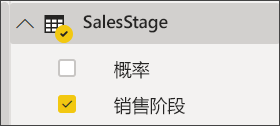

# 创建和使用漏斗图

[!INCLUDE[consumer-appliesto-nyyn](../includes/consumer-appliesto-nyyn.md)]

[!INCLUDE [power-bi-visuals-desktop-banner](../includes/power-bi-visuals-desktop-banner.md)]

漏斗图可帮助你可视化具有顺序连接的阶段的线性流程。 例如，销售漏斗图可跟踪各个阶段的客户：潜在客户 \> 合格的潜在客户 \> 预期客户 \> 已签订合同的客户 \> 已成交客户。  你可以一眼看出漏斗形状传达了你跟踪的流程的健康状况。

漏斗图的每个阶段代表总数的百分比。 因此，在大多数情况下，漏斗图的形状类似于一个漏斗 -- 第一阶段为最大值，每个后一阶段的值都小于其前一阶段的值。  梨形漏斗图也很有用 -- 它可以识别流程中的问题。  但是通常第一阶段，“进入”阶段为最大值。

> [!NOTE]
> 与 Power BI 同事共享报表时，你和这位同事都应具有独立的 Power BI Pro 许可证，并且应将报表保存在 Premium 容量中。    

## 何时使用漏斗图
漏斗图适用情况：

* 数据是有序的，经过至少 4 个阶段。
* 第一阶段“项目”数量预期大于最后一个阶段的数量。
* 要按阶段计算可能的值（收入/销售额/交易/等等）。
* 要计算并跟踪转化率和保留率。
* 要揭示线性流程中的瓶颈。
* 要跟踪购物车工作流。
* 要跟踪点击广告/市场营销活动的进度和成功率。

## 使用漏斗图
漏斗图：

* 可以进行排序。
* 支持多个漏斗图。
* 可以由相同报表页上的其他可视化效果来突出显示和交叉筛选。
* 可以用来突出显示和交叉筛选相同报表页上的其他可视化效果。
   > [!NOTE]
   > 观看这段视频了解如何使用销售和市场营销示例创建漏斗图。 然后使用机会分析 PBIX 示例文件，按照视频下面的步骤亲自尝试
   > 
   > 
## 先决条件

本教程使用[机会分析示例 PBIX 文件](https://download.microsoft.com/download/9/1/5/915ABCFA-7125-4D85-A7BD-05645BD95BD8/Opportunity%20Analysis%20Sample%20PBIX.pbix
)。

1. 在菜单栏的左上方，选择“文件” > “打开”  
   
2. 查找**机会分析示例 PBIX 文件**的副本

1. 在报表视图中打开**机会分析示例 PBIX 文件**。

1. 选择  ，以添加新报表页。

## 创建基本漏斗图
观看这段视频了解如何使用销售和市场营销示例创建漏斗图。

<iframe width="560" height="315" src="https://www.youtube.com/embed/qKRZPBnaUXM" frameborder="0" allow="autoplay; encrypted-media" allowfullscreen></iframe>

现在让我们创建自己的漏斗图，该图用于显示在每个销售阶段我们所拥有的机会数。

1. 从空白报表页入手，依次选择“SalesStage”\>“销售阶段”字段   。
   
    

1. 选择漏斗图标  以将柱形图转换为漏斗图。

2. 从“字段”窗格中选择“事实”\>“机会计数”    。
   
    
4. 将鼠标悬停在条形图上可显示大量的信息。
   
   * 阶段的名称
   * 当前在此阶段的机会数
   * 总体转化率（潜在客户的百分比） 
   * 一个阶段到另一个阶段的转化率（也称为丢弃率）是指占上一阶段的百分比（在本例中为建议阶段/解决方案阶段）
     
     

6. [保存报表](../service-report-save.md)。

## 突出显示和交叉筛选
有关使用筛选器窗格的信息，请参阅[向报表添加筛选器](../power-bi-report-add-filter.md)。

突出显示漏斗图中的某个条可交叉筛选报表页上的其他可视化效果，反之亦然。 若要遵循此示例，请向包含漏斗图的报告页中再添加几个视觉对象。

1. 在漏斗图中，选择“建议”  条。 这样可以交叉突出显示页面上的其他可视化效果。 使用 CTRL 键可选择多个。
   
   
2. 若要设置视觉对象如何相互交叉突出显示和交叉筛选的首选项，请参阅 [Visual interactions in Power BI（Power BI 中的可视化交互）](../service-reports-visual-interactions.md)

## 后续步骤

[Power BI 中的仪表](power-bi-visualization-radial-gauge-charts.md)

[Power BI 中的可视化效果类型](power-bi-visualization-types-for-reports-and-q-and-a.md)
