# 创建关键影响因素可视化效果

[!INCLUDE[consumer-appliesto-nyyn](../includes/consumer-appliesto-nyyn.md)]    

[!INCLUDE [power-bi-visuals-desktop-banner](../includes/power-bi-visuals-desktop-banner.md)]

关键影响因素视觉对象有助于理解驱动你所关注指标的因素。 它可分析数据，对重要因素进行排序，并将其显示为“关键影响因素”。 例如，假设你想要找出影响员工流动（也称为流失）的因素。 一大因素可能是就业合同时限，另一大因素可能是员工年龄。 
 
## 何时使用关键影响因素 
如果需要执行以下操作，可以选择关键影响因素视觉对象： 
- 看看哪些因素会影响所分析的指标。
- 对比这些因素的相对重要性。 例如，短期合同比长期合同对流失的影响更大吗？ 

## 关键影响因素视觉对象的功能

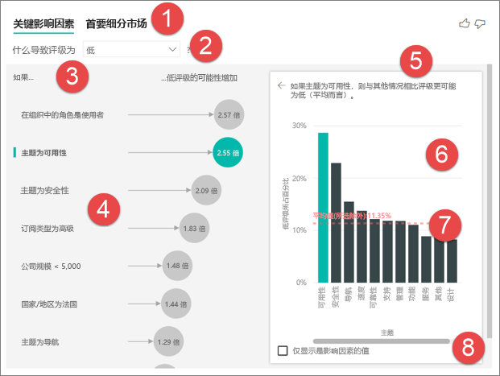

1. **选项卡**：选择选项卡以在视图之间进行切换。 “关键影响因素”显示对所选指标值影响最大的一些因素。 “首要区段”显示对所选指标值影响最大的一些区段。 “细分市场”由值的组合组成。 例如，一个区段可能是已成为客户至少 20 年并居住在西部地区的消费者。 

2. **下拉列表框**：正在调查的指标的价值。 在此示例中，请查看指标“评级”。 所选的值为“低”。

3. **重述**：帮助解释左窗格中的视觉对象。

4. **左窗格**：左窗格包含一个视觉对象。 在此情况下，左窗格显示首要关键影响因素列表。

5. **重述**：帮助解释右窗格中的视觉对象。

6. **右窗格**：右窗格包含一个视觉对象。 在此情况下，列图显示左窗格中已选中关键影响因素“主题”的所有值。 左窗格中 **可用性** 的具体值以绿色显示。 “主题”的所有其他值均以黑色显示。

7. **平均线**：除“可用性”（即选中的影响因素）以外，计算了“主题”的所有可能值的平均值 。 因此该计算适用于所有黑色的值。 它显示了其他低分“主题”的百分比。 本例中，11.35% 的主题获得了低分（虚线所示）。

8. **复选框**：筛选掉右侧窗格中的视觉对象，仅显示影响该字段的值。 本示例中，将按可用性、安全性和导航筛选视觉对象。

## 分析分类型指标
 
观看此视频，了解如何创建具有分类指标的关键影响因素视觉对象。 然后，执行以下步骤创建一个。 

   > [!NOTE]
   > 此视频使用较低版本的 Power BI Desktop。
   > 
   > 
<iframe width="560" height="315" src="https://www.youtube.com/embed/fDb5zZ3xmxU" frameborder="0" allow="accelerometer; autoplay; encrypted-media; gyroscope; picture-in-picture" allowfullscreen></iframe>

你的产品经理希望找出哪些因素会导致客户对云服务进行负面评论。 若要继续了解，请打开 Power BI Desktop 中的[客户反馈 .PBIX 文件](https://github.com/microsoft/powerbi-desktop-samples/tree/main/Monthly%20Desktop%20Blog%20Samples/2019/customerfeedback.pbix)。 也可以下载 [Power BI 服务 或 Power BI Desktop 的客户反馈 Excel 文件](https://github.com/microsoft/powerbi-desktop-samples/tree/main/Monthly%20Desktop%20Blog%20Samples/2019/customerfeedback.xlsx)。 选择任一链接，然后在打开的 GitHub 页面中选择“下载”。

> [!NOTE]
> 客户反馈数据集基于 [Moro et al., 2014] S. Moro, P. Cortez 和 P. Rita. “一种预测银行电话营销成功的数据驱动方法。” Decision Support Systems, Elsevier, 62:22-31, June 2014。 

1. 打开报表并选择“关键影响因素”图标。 

    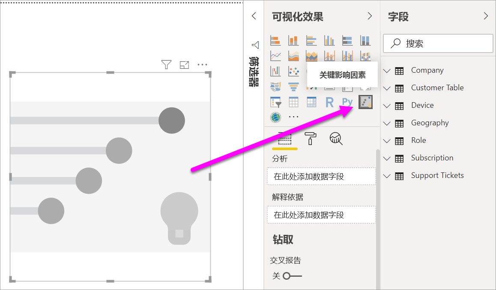

2. 将要研究的指标移动到“分析”字段。 若要查看导致客户对服务的评级较低的因素，请选择“客户表” > “评级” 。

3. 将认为可能影响“评级”的字段移动到“解释依据”区域 。 可以根据需要移动任意数量的字段。 在此例中从以下字段开始：
    - 国家/地区 
    - 在组织中的角色 
    - 订阅类型 
    - 公司规模 
    - 主题
    
4. 将“扩展方式”字段保留为空。 此字段仅在分析度量值或汇总字段时使用。 

5. 若要集中查看负面评级，请在“什么导致评级为”的下拉框中选择“低” 。  

    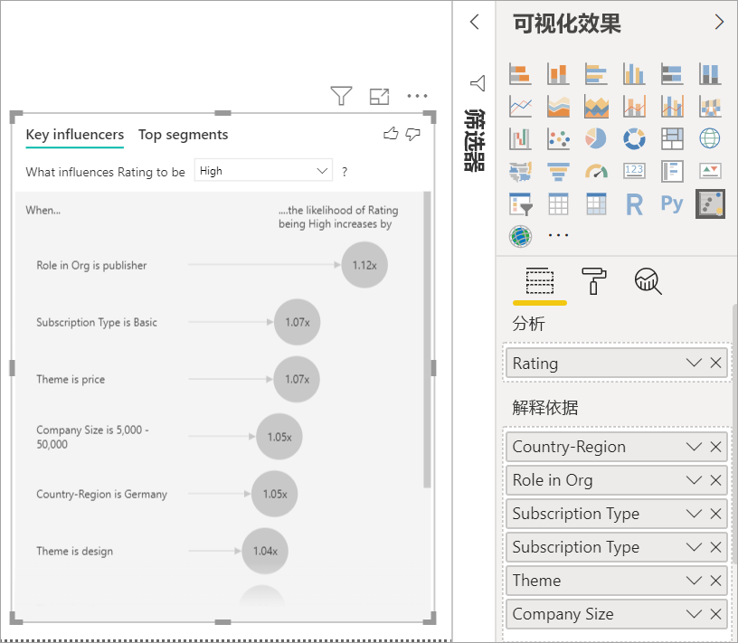

分析在所分析字段的表级别上运行。 在此例中，为“评级”指标。 该指标是在客户级别定义的。 每位客户都给出了一个高分数或低分数。 所有的解释因素都必须以客户级别进行定义，以便视觉对象可进行利用。 

在先前示例中，所有的解释因素与指标均为一对一或多对一关系。 在本例中，每个客户均为其评级分配了一个主题。 同样，来自同一国家/地区的客户在其组织中执行同一成员身份类型和同一角色。 解释因素已经是客户属性，无需转换。 视觉对象可以直接使用它们。 

本教程的后面部分将介绍更复杂的示例，其中具有一对多关系。 在这些情况下，必须首先将列向下聚合到客户级别，然后才能运行分析。 

用作解释因素的度量值和聚合也在“分析”指标的表级别进行评估。 本文后面部分将提供一些示例。 

## 解释分类关键影响因素 
我们来看看导致低评级的关键影响因素。 

### 影响低评级可能性的第一大因素

此示例中的客户可以使用三个角色：使用者、管理员和发布者。 客户是导致低评级的首要因素。 

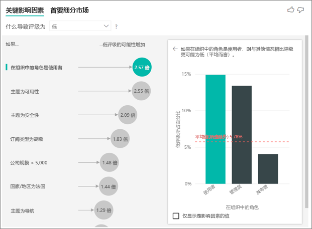

更准确地说，客户给服务留下负面评分的可能性是 2.57 倍。 关键影响因素图表先在左侧列表中列出“在组织中的角色是客户”。 选择“在组织中的角色是使用者”后，Power BI 会在右侧窗格中显示其他详细信息。 会显示各角色在导致低评级上的影响的比较分析。
  
- 14.93% 的客户给出低分。 
- 平均来看，5.78% 的所有其他角色给出了低分。
- 与其他角色相比，使用者给出低分的可能性高出 2.57 倍。 可以通过用绿色条数据除以红色虚线数据来确定。 

### 影响低评级可能性的第二大因素

关键影响因素视觉对象可比较许多不同变量的因素并对其进行排列。 第二影响因素与“在组织中的角色”无关。选择列表中的第二影响因素，即“主题为可用性”。 

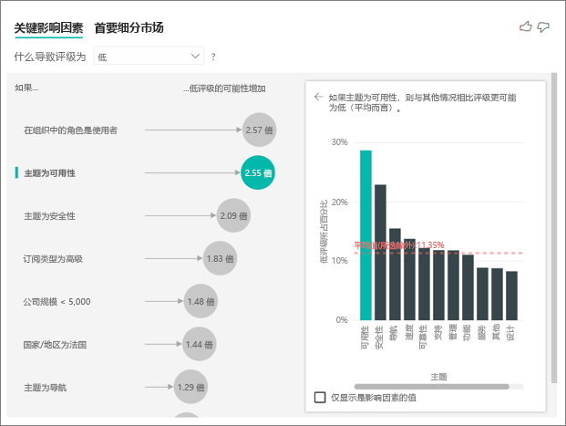

第二重要因素与客户评价的主题相关。 与对可靠性、设计或速度等其他主题发表评论的客户相比，对产品可用性发表评论的客户给出低分的可能性为 2.55 倍。 

在视觉对象中，由红色虚线显示的平均值从 5.78% 变为 11.34%。 平均值是动态的，因为该值基于所有其他值的平均值。 对于第一个影响因素，平均值排除了客户角色的影响。 对于第二个影响因素，排除了可用性主题。 
 
选择“仅显示是影响因素的值”复选框，仅使用有影响的值进行筛选。 在此例中，他们是导致低分的角色。 12 个主题减少为 4 个主题，Power BI 将这 4 个主题识别为导致低评级的主题。 

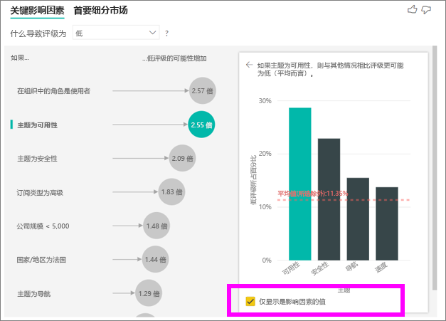

## 与其他视觉对象交互 
 
每当选择画布上的切片器、筛选器或其他视觉对象时，关键影响因素视觉对象就会重新运行对新数据部分的分析。 例如，可以将“公司规模”移动到报表，并用作切片器。 使用它来了解企业客户的关键影响因素是否不同于一般人群。 公司规模大于 50000 人。
 
选择“> 50000”会重新运行分析，可以看到影响因素已发生变化。 对于大型企业客户，低评级的首要影响因素具有与安全性相关的主题。 你可能需要进一步调查，从而了解是否存在大型客户不满意的特定安全功能。 

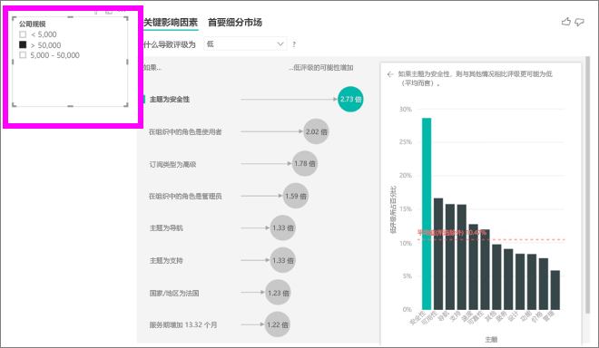

## 解释持续关键影响因素 
 
到目前为止，我们已了解如何使用视觉对象来探索不同类别字段影响低评级的方式。 “解释依据”字段中也可含有年龄、身高和价格等连续性因素。 让我们来看看将“服务期”从客户表移动到“解释依据”时会发生什么 。 “服务期”表明客户使用服务的时长。 
 
随着“服务期”变长，获得低评级的可能性也在增加。 这一趋势表明，长期客户更有可能给出负面评分。 这种见解很有趣，会使你想进行后续跟进。 
 
可视化效果显示，每当服务期延长 13.44 个月，低评级的可能性平均增加 1.23 倍。 在此情况下，13.44 个月表示服务期的标准差。 所以你得到的见解着眼于按标准数额（服务期标准差）增加服务期会如何影响收到低评级的可能性。 
 
右侧窗格中的散点图绘制了每个服务期值的低评级的平均百分比。 它用走向线突出显示了斜率。

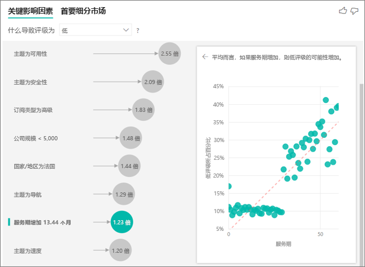

## 分箱的连续关键影响因素

在某些情况下，你可能会发现，连续因素会自动变为类别因素。 这是因为我们意识到变量之间的关系并非是线性的，因此我们不能简单地将此关系描述为增加或减少（就像我们在上述示例中所做的那样）。

我们运行相关性测试，以确定影响因素与目标之间相关性的线性程度。 如果目标属于连续目标，则运行 Perason 相关性测试，如果目标属于类别目标，则运行 Point Biserial 相关性测试。 如果我们检测到关系的线性不足，我们将执行监督式分箱并生成最多 5 个箱。为了弄清楚哪些箱最有意义，我们使用监督式分箱方法，该方法研究解释性因素与被分析的目标之间的关系。

## 将度量值和聚合值作为关键影响因素进行解释 
 
可以将度量值和聚合值用作分析中的解释因素。 例如，你可能想要了解客户支持工单计数或开放式工单的平均持续时间对所得评分的影响。 
 
在此情况下，你想知道客户拥有的支持工单数量是否会影响其给出的分数。 现在，从支持工单表中引入“支持工单 ID”。 由于客户可拥有多个支持工单，因此你可将 ID 聚合到客户级别。 聚合非常重要，因为分析在客户级别运行，因此必须在该粒度级别上定义所有因素。 
 
我们来看看 ID 计数。 每个客户行都有一个与之关联的支持工单计数。 在此情况下，随着支持工单计数的增加，低评级的可能性增加了 5.51 倍。 右侧视觉对象显示了按不同“评级”值（在客户级别上评估）划分的支持工单的平均计数。 

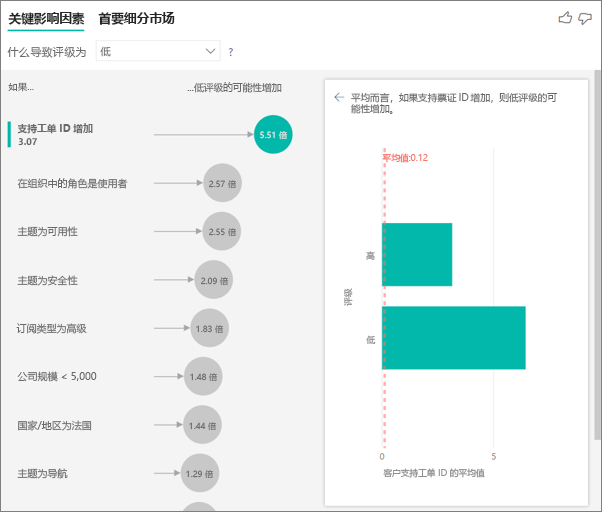

## 解释结果：首要细分市场 
 
可以使用“关键影响因素”选项卡分别评估每个因素。 还可以使用“首要区段”选项卡查看因素组合如何影响正在分析的指标。 
 
首要区段一开始会显示 Power BI 发现的所有区段的概述。 以下示例显示找到了六个区段。 这些区段是按区段内低评级的百分比进行排序的。 例如，区段 1 客户的低评级百分比为 74.3%。 气泡越高，低评级的比例就越高。 气泡尺寸表示该区段中的客户数量。 

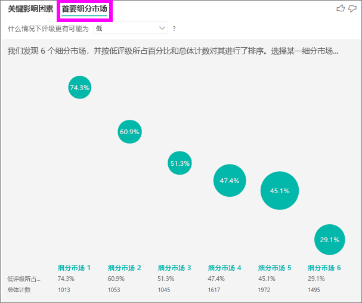

选择气泡可显示该区段的详细信息。 例如，如果选择“区段 1”，则会发现它由相对成熟的客户组成。 他们成为客户已经超过 29 个月，并拥有超过四张支持工单。 最后，他们并不是发布者，因此是客户或管理员。 
 
在这一组中，74.3% 的客户评价较低。 此时给出低评级的普通客户的百分比为 11.7%，所以此区段的低评级比例较高。 高出 63 个百分点。 区段 1 还包含大约 2.2% 的数据，因此可表示总体中的可处理部分。 

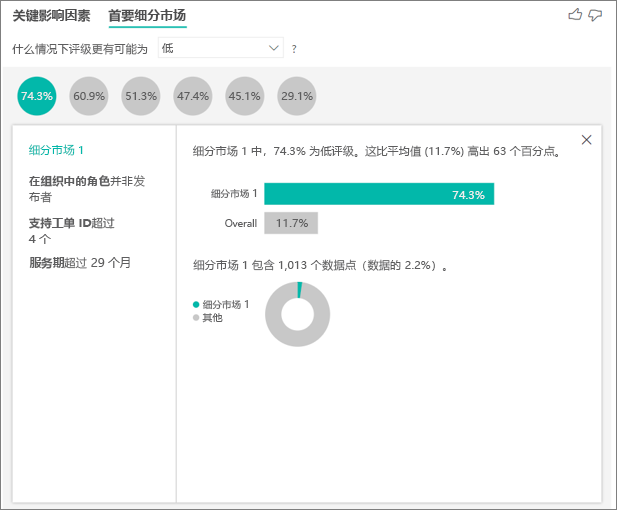

## 添加计数

有时，影响因素可以有很大的影响，但只代表极少的数据。 例如，“主题为可用性”是低分的第二大影响因素 。 但可能仅有少数客户抱怨可用性问题。 计数有助于对要关注的影响因素进行优先级排序。

可通过格式设置窗格中的“分析卡”启用计数。

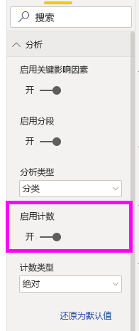

启用计数之后，每个影响因素的气泡周围将显示一个环，表示该影响因素所包含数据的大致百分比。 该环包围的气泡面积越大，其包含的数据就越多。 可以看到“主题为可用性”包含的数据比例非常小 。

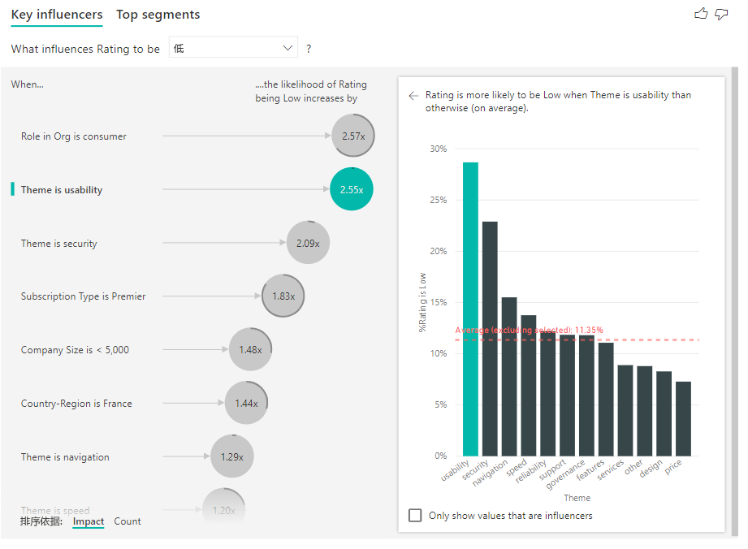

还可以使用视觉对象左下角的“排序方式”按钮，先按计数（而不是影响）对气泡进行排序。 “订阅类型为顶级”是基于计数的最大影响因素 。

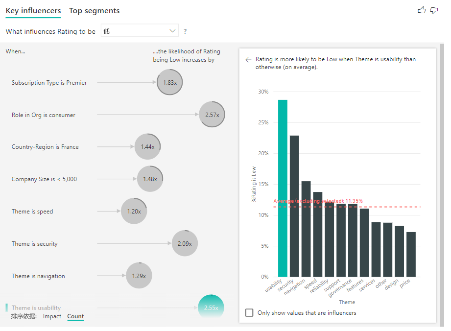

完整的圆环表示影响因素包含 100% 的数据。 可使用格式设置窗格上“分析卡”中的“计数类型”下拉菜单，将计数类型更改为与最大影响因素成比例 。 现在，具有最大数据量的影响因素将表示为完整的环，而其他所有计数都将与之成比例。

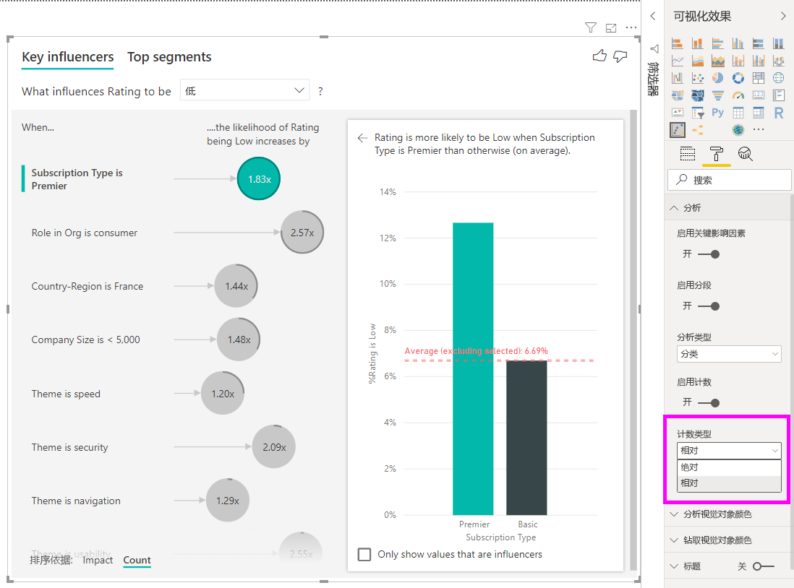

## 分析数值型指标

如果将未汇总的数值字段移动到“分析”字段，可以选择如何处理该场景。 可以通过进入“格式化窗格”并在“类别分析类型”和“连续分析类型”之间切换来更改视觉对象的行为  。

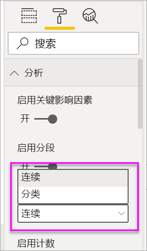

“类别分析类型”的行为如上所述。 例如，如果正在查看从 1 到 10 的调查分数，则可以问“是什么导致调查分数为 1？”

“连续分析类型”将问题更改为连续型问题。 在上述例子中，问题就变成了“是什么导致调查分数增加/减少？”

如果分析的字段中有许多唯一值，这一区别会非常有用。 以下示例以房价为例。 如果问“是什么导致房价是 156,214”，并无多大意义。 因为这个问题太具体，很可能没有足够的数据来推断出一种模式。

但我们可以问，“影响房价上涨的因素是什么？” 这样我们可以将房价视为一个范围而非具体的值。

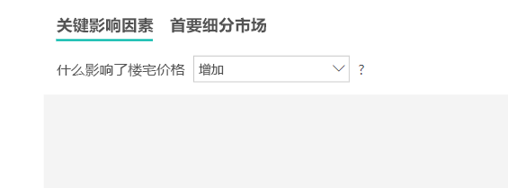

## 解释结果：关键影响因素 

在此方案中，我们关注“影响房价上涨的因素”。 我们会关注一些可能影响房价的解释性因素，如“建成年份”（房屋建成年份）、“KitchenQual”（厨房质量）和“YearRemodAdd”（房屋改造年份）  。 

在以下示例中，我们关注影响力最大的因素，即厨房质量非常好。 结果与我们分析类别指标时看到的结果非常相似，但有一些重要区别：

- 右侧的柱形图关注平均值而不是百分比。 因此，它向我们展示了拥有优质厨房的房屋的平均房价（绿色条）与没有优质厨房的房屋的平均房价（虚线）的对比
- 气泡中的数字仍然是红色虚线和绿色条之间的差额，但它表示为数字 ($158.49K) 而不是可能性 (1.93x)。 因此，平均而言，拥有优质厨房的房屋比没有优质厨房的房屋贵将近 16 万美元。

在以下示例中，我们关注连续型因素（房屋改造年份）对房价的影响。 以下显示了与类别指标持续性影响因素的分析方式之间的差异：

-   右侧窗格中的散点图绘制了每个不同改造年份的平均房价。 
-   气泡中的值显示了平均房价上涨的幅度（在本例中是 287 万美元），而房屋改造年份的增加幅度是其标准差（在本例中是 20 年）

最后，在度量值的例子中，我们关注房屋建成的平均年份。 分析如下：

-   右侧窗格中的散点图绘制了表中每个不同值的平均房价
-   气泡中的值显示了平均房价上涨的幅度（在本例中是 $1.35K），而平均年份增加幅度是其标准差（在本例中是 30 年）

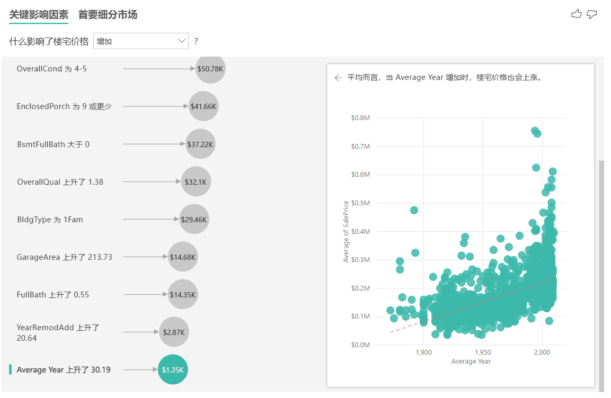

## 解释结果：首要区段

数值目标的首要区段显示平均房价高于整体数据集的组。 例如，下面我们可以看到“区段 1”包含符合后述特征的房屋：“GarageCars”（车库可容纳的汽车数量）大于 2，“RoofStyle”（屋顶风格）为“时尚”  。 具有这些特征的房屋的平均价格为 355,000 美元，而总体数据的平均值为 18 万美元。

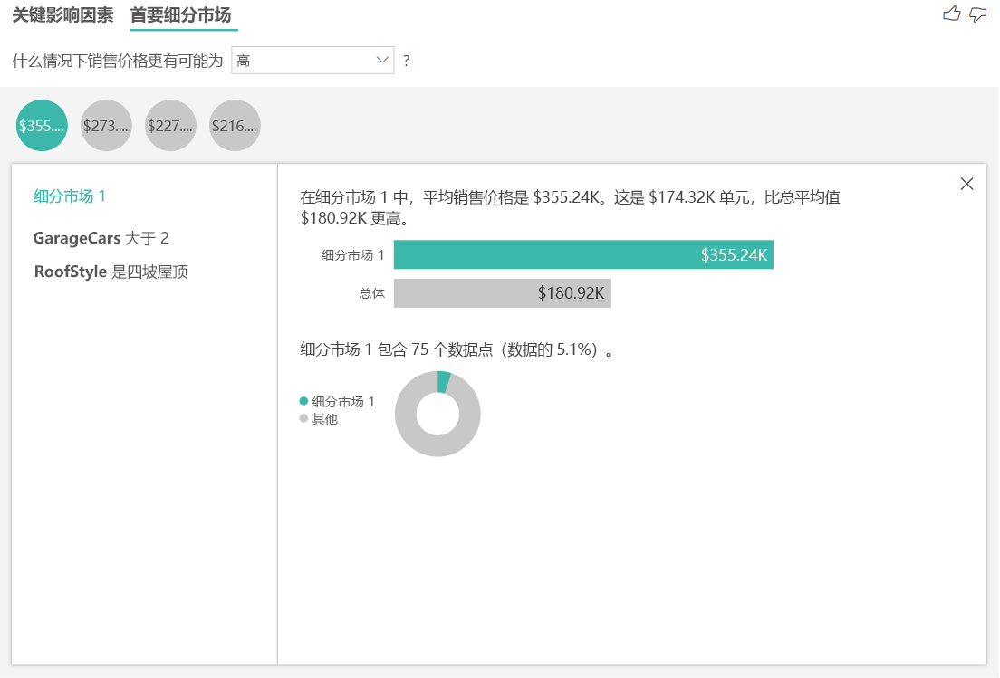

## 分析度量值或汇总列型指标

如果是度量值或汇总列，则分析默认为[上述](#analyze-a-metric-that-is-numeric)的“连续分析类型”。 这无法更改。 分析度量值/汇总列和分析未汇总数字列之间的最大区别在于分析运行的级别。

如果是未汇总列，分析总是在表级运行。 在上述房价示例中，我们分析了“房价”指标，以了解房价上涨/下跌的影响因素。 该分析在表级别自动运行。 表中每个房屋都有唯一的 ID，因此分析在房屋级别运行。

对于度量值和汇总列，无法立即确定在哪个级别进行分析。 如果将“房价”汇总为“平均”，则需要考虑要在哪个级别上计算此平均房价 。 是社区级别的平均房价？ 还是地区级别的？

在所用“扩展方式”字段的级别自动分析度量值和汇总列。 假设“扩展方式”中有三个我们感兴趣的字段：“厨房质量”、“楼宅类型”和“空调”  。 将计算这三个字段的每个独特组合的“平均房价”。 切换为表视图查看将评估的数据是什么样通常会有所帮助。

这种分析完全是总结性的，因此回归模型很难在数据中发现可学习的模式。 应在更详细的级别运行分析，以获得更好的结果。 如果想要在房屋级别分析房价，则需要将“ID”字段显式添加到分析。 但我们不想将房屋 ID 视为影响因素。 了解房价随房屋 ID 的增加而上涨没有意义。 这时，“扩展方式”字段格选项就很方便。 使用“扩展方式”，可添加要用于设置分析级别的字段，而无需寻找新的影响因素。

将“ID”添加到“扩展方式”之后，查看可视化效果 。 定义了想要评估度量值的级别之后，解释[未汇总数字列](#analyze-a-metric-that-is-numeric)的影响因素是完全相同的。

如果想要详细了解如何使用关键影响因素可视化效果分析度量值，请观看以下视频。 若要了解 Power BI 如何在后台使用 ML.NET 自然地推理数据和呈现见解，请参阅 [Power BI 使用 ML.NET 识别关键影响因素](https://dotnet.microsoft.com/apps/machinelearning-ai/ml-dotnet/customers/power-bi)。

<iframe width="1167" height="631" src="https://www.youtube.com/embed/2X1cW8oPtc8" frameborder="0" allow="accelerometer; autoplay; encrypted-media; gyroscope; picture-in-picture" allowfullscreen></iframe>

## 注意事项和疑难解答 
 
视觉对象的限制是什么？ 
 
关键影响因素视觉对象具有一些限制：

- 不支持直接查询
- 不支持与 Azure Analysis Services 和 SQL Server Analysis Services 的实时连接
- 不支持发布到 Web
- 需要 .NET Framework 4.6 或更高版本
- 不支持 SharePoint Online 嵌入

**我遇到错误：找不到任何影响因素或区段。这是为什么？** 

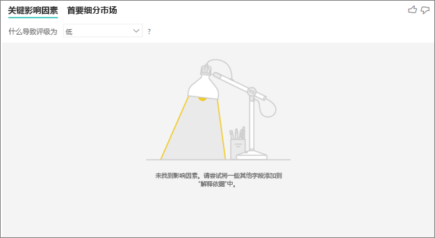

“解释依据”中已包含字段但未找到影响因素时，会出现此错误。 
- 同时在“分析”和“解释依据”中包含了所分析的指标 。 将其从“解释依据”中删除。 
- 解释字段具有太多类别，而只有少量观测数据。 这种情况使得可视化效果很难确定哪些因素是影响因素。 仅根据少数观察结果很难概括。 如果正在分析数值字段，可能会需要在“分析”卡下的“格式化窗格”中从“类别分析”切换到“连续分析”   。
- 解释因素具有足够的观测数据来进行归纳，但可视化效果并未发现任何有意义的相关性。
 
**出现了错误：我分析的指标没有足够数据运行分析。这是为什么？** 

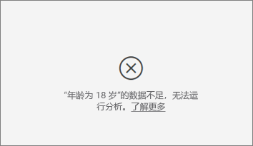

可视化的工作原理是将一个组的数据模式与其他组进行比较。 例如，它会查找所给评级较低的客户，而不是评级较高的客户。 如果模型中的数据只有少量观测数据，则很难发现模式。 如果可视化效果没有足够数据查找有意义的影响因素，将表示需要更多数据运行分析。 

建议为所选状态至少获取 100 个观测数据。 在此例中，状态是客户流失。 还需要为用于比较的状态获取至少 10 个观测数据。 在此例中，比较状态是客户未流失。

如果正在分析数值字段，可能会需要在“分析”卡下的“格式化窗格”中从“类别分析”切换到“连续分析”   。

**我看到一个错误：如果“分析”未汇总，则分析总是在其父表的行级运行。不允许通过“扩展方式”字段更改此级别。这是为什么？**

分析数值列或分类列时，分析总是在表级运行。 例如，如果分析的是房价，且表中包含 ID 列，则分析将自动在房屋 ID 级别运行。 

如果分析的是度量值或汇总列，则需要显式地声明想要分析在哪个级别运行。 可以使用“扩展方式”更改度量值和汇总列的分析级别，而不添加新的影响因素。 如果将“房价”定义为度量值，则可以向“扩展方式”添加房屋 ID 列，从而更改分析级别 。

**出现了错误：“解释依据”中的字段与包含所分析指标的表并不唯一相关。这是为什么？**
 
分析在所分析字段的表级别上运行。 例如，如果分析的是客户对服务的反馈，则可能具有一个表，该表可告知客户给出了高评级或低评级。 在此例中，分析会在客户表级别运行。 

如果具有相关表，同时该表是以比包含指标的表更精细的级别进行定义的，则会出现此错误。 下面的示例说明： 
 
- 你在分析导致客户对服务给出低评级的原因。
- 你想要查看客户使用服务的设备是否会影响给出的评价。
- 客户可以通过多种不同方式使用服务。
- 在下面的示例中，客户 10000000 同时使用浏览器和平板电脑与服务交互。

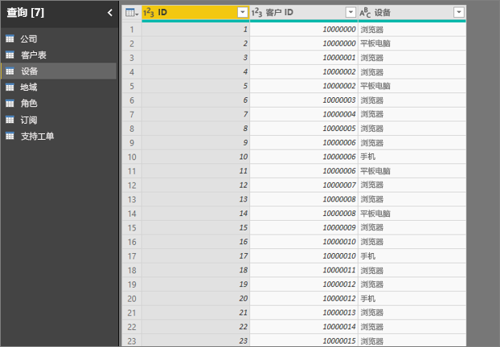

如果尝试使用设备列作为解释因素，则会出现以下错误： 

出现此错误是因为未在客户级别定义设备。 客户可以在多个设备上使用该服务。 若要使可视化效果可查找模式，设备必须是客户属性。 有几种解决方案，取决于你对业务的理解： 
 
- 可以更改要计数的设备的摘要。 例如，如果设备数量可能影响客户给出的分数，请使用计数。 
- 你可以透视设备列，查看在特定设备上使用服务是否会影响客户评级。
 
此示例对数据进行了透视，以便为浏览器、移动设备和平板电脑创建新列（请确保在透视数据后在建模视图中删除并重新创建关系）。 现在可以在“解释依据”中使用这些特定设备。 所有设备都是影响因素，而浏览器对客户评分的影响最大。

更准确地说，不通过浏览器使用服务的客户比通过浏览器使用服务的客户给出低分数的可能性高 3.79 倍。 列表中越往下走，这一数字越低，移动端的情况则完全相反。 使用移动应用的客户比不使用移动应用的客户更可能给出低分。 

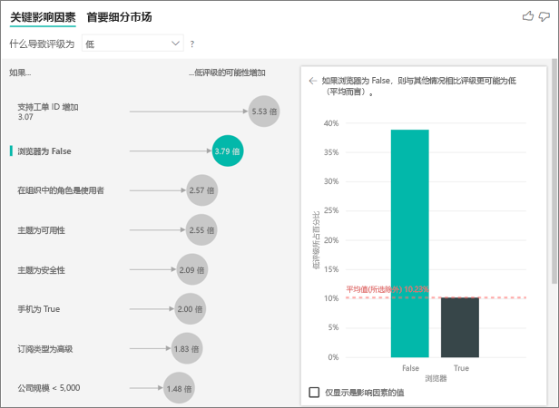

**出现了警告：度量值未包含在分析中。这是为什么？** 

分析在所分析字段的表级别上运行。 如果分析的是客户流失，可能会有表格告知是否有客户流失。 在此例中，分析会在客户表级别运行。
 
默认情况下，在该表级别分析度量值和聚合。 如果存在“每月平均支出”度量值，则将在客户表级别对其进行分析。 

如果客户表没有唯一标识符，则无法对度量值进行评估，分析中也会将其忽略。 若要避免这种情况，请确保包含指标的表具有唯一标识符。 在此例中，是客户表，其唯一标识符是客户 ID。 使用 Power Query 添加索引列也很轻松。
 
**出现了警告：所分析指标具有 10 个以上唯一值，这可能会影响分析质量。这是为什么？** 

AI 可视化效果可以分析类别字段和数值字段。 在类别字段的情况下，一个例子是“客户流失”为“是”或“否”，客户满意度为“高”、“中”或“低”。 增加要分析的类别数意味着每个类别的观察量会减少。 这种情况使可视化效果更难以在数据中找到模式。 

在分析数值字段时，可以选择将数值字段作为文本处理，在这种情况下，所运行的分析与类别数据的情况相同（“类别分析”）。 如果有大量不同的值，建议将分析切换为“连续分析”，因为这意味着可以通过数值增加或减少来推断模式，而不是将它们视为离散的值。 可以在“分析”卡下的“格式化窗格”中从“分类分析”切换到“连续分析”   。

为了查找更强的影响因素，建议将类似值组合到一个单元中。 例如，如果有价格指标，将类似价格分组为“高”、“中”、“低”类别，而不是使用单独的价格点，可能会获得更好的结果。 

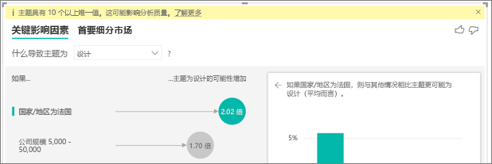

**数据中的一些因素看起来应该是关键影响因素，但并非如此。为何出现这种情况？**

在以下示例中，身份为使用者的客户导致评级较低，低评级占 14.93%。 管理员角色也有很高比例的低评级 (13.42%)，但未将其视为影响因素。 

得出此判断的原因是可视化效果在发现影响因素时也考虑了数据点的数量。 以下示例包含超过 29,000 个使用者和数量是使用者数量 10 分之 1 的管理员（约为 2,900 个）。 其中仅 390 人给出低评级。 视觉对象没有足够数据来确定是否凭借管理员评级找到了模式，或者是否只是偶然找到。 

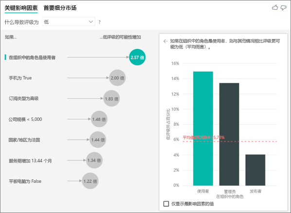

**关键影响因素的数据点限制是多少？**
我们对具有 10,000 个数据点的示例运行分析。 一侧的气泡显示我们找到的所有影响因素。 另一侧的柱形图和散点图遵循我们对于这些核心视觉对象的采样策略。

**如何计算类别分析的关键影响因素？**

AI 可视化效果使用 [ML.NET](https://dotnet.microsoft.com/apps/machinelearning-ai/ml-dotnet) 在后台运行逻辑回归来计算关键影响因素。 逻辑回归是统计模型，用于相互比较不同的组。 

如果想要找出导致低评级的原因，逻辑回归会查找给出低评级的客户与给出高评级的客户之间的区别。 如果有多个类别，例如高、中和低分，可以研究评分较低的客户与评分不低的客户的差异。 在此例中，评分低的客户与评分高或中等的客户有什么不同？ 
 
逻辑回归在数据中搜索模式，查找给出低评级的客户与给出高评级的客户之间的区别。 例如，逻辑回归可能会发现，与拥有很少或没有支持工单的客户相比，拥有更多支持工单的客户给出低评级的百分比要高得多。
 
逻辑回归还会考虑存在的数据点数量。 例如，如果具有管理员角色的客户给出负面分数的比例更高，但由于管理员数量很少，便不会将其视为影响因素。 得出此判断的原因是没有足够的数据点可用于推断模式。 统计检验（称为 Wald 检验）用于确定是否将某因素视为影响因素。 视觉对象使用 0.05 的 p 值确定阈值。 

**如何计算数值分析的关键影响因素？**

AI 可视化效果使用 [ML.NET](https://dotnet.microsoft.com/apps/machinelearning-ai/ml-dotnet) 在后台运行线性回归来计算关键影响因素。 线性回归是一种统计模型，它研究正在分析的字段结果如何基于解释性因素而变化。

例如，如果分析房价，那么线性回归关注优质厨房对房价的影响。 与没有优质厨房的房屋相比，拥有优质厨房的房屋通常具有更低还是更高的房价？

线性回归还考虑数据点的数量。 例如，如果带网球场的房屋价格较高，但带网球场的房屋很少，这个因素就不视为具有影响力。 得出此判断的原因是没有足够的数据点可用于推断模式。 统计检验（称为 Wald 检验）用于确定是否将某因素视为影响因素。 视觉对象使用 0.05 的 p 值确定阈值。 

**如何计算细分市场？**

AI 可视化效果使用 [ML.NET](https://dotnet.microsoft.com/apps/machinelearning-ai/ml-dotnet) 在后台运行决策树查找关注的子组。 决策树的目标是最终得到在关注的指标中相对高的数据点子组。 可能会是评级较低的客户或价格较高的房屋。

决策树采用每个解释因素，并试图推断出给出最佳“分支”的因素。 例如，如果将数据筛选为仅包含大型企业客户，是否可将给出高评级的客户与给出低评级的客户区分开来？ 或者，如果将数据筛选为仅包含评论了安全性的客户，情况是否可能更好？ 

决策树设置分支后，它会获取数据子组，并确定该数据的下一个最佳分支。 在此例中，子组是评论了安全性的客户。 每次创建分支后，还会考虑是否有足够的数据点使其成为具有足够代表性的组来推断模式，或者它是否只是数据中的异常情况，并非真正的区段。 另一种统计检验适用于 p 值为 0.05 时检查分支条件的统计学意义。 

决策树完成运行后，将采用所有分支（例如安全评论和大型企业）并创建 Power BI 筛选器。 此筛选器组合打包为视觉对象中的细分市场。 
 
**为什么将更多字段移动到“解释依据”字段时，某些因素会成为影响因素或不再是影响因素？**

可视化效果同时评估所有解释因素。 一个因素单独来看时可能是一个影响因素，但与其他因素一起考虑时，它可能就不是了。 假设需要分析导致房价高的原因，卧室和房子大小是解释因素：

- 就其本身而言，更多的卧室可能是房价高的驱动因素。
- 在分析中纳入房屋大小意味着，现在可以了解在房屋大小不变的情况下，卧室会有何变化。
- 如果房屋大小固定为 1,500 平方英尺，那么光增加卧室数量则不太可能使房价大幅提升。 
- 在将房屋大小纳入考虑之后，卧室作为一个因素的重要性可能会降低。 

与 Power BI 同事共享报表时，你和这位同事都应具有独立的 Power BI Pro 许可证，并且应将报表保存在 Premium 容量中。 请参阅[共享报表](../collaborate-share/service-share-reports.md)。

## 后续步骤
- [Power BI 中的组合图表](power-bi-visualization-combo-chart.md)
- [Power BI 中的可视化效果类型](power-bi-visualization-types-for-reports-and-q-and-a.md)
- [Power BI 如何使用 ML.NET 识别关键影响因素](https://dotnet.microsoft.com/apps/machinelearning-ai/ml-dotnet/customers/power-bi)