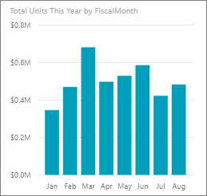
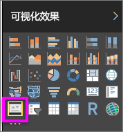

# KPI 视觉对象
关键绩效指标 (KPI) 是一个视觉提示，用于传达针对可度量目标已完成的进度。 有关 KPI 的详细信息，请参阅 [Microsoft Developer Network](https://msdn.microsoft.com/library/hh272050)。

如果未注册 Power BI，请[免费注册](https://app.powerbi.com/signupredirect?pbi_source=web)后再进行操作。

## 先决条件
* [Power BI Desktop 是免费的！](https://powerbi.microsoft.com/en-us/get-started/)
* [零售分析示例 PBIX 文件](http://download.microsoft.com/download/9/6/D/96DDC2FF-2568-491D-AAFA-AFDD6F763AE3/Retail%20Analysis%20Sample%20PBIX.pbix)

## 何时使用 KPI
当存在以下情况时，KPI 是一个不错的选择：

* 要衡量进度（我是超前了还是落后了？）
* 要衡量与目标的距离（我提前或落后了多少？）   

## KPI 要求
关键绩效指标 (KPI) 基于特定的指标值，旨在帮助你针对定义的目标评估指标的当前值和状态。 因此，KPI 视觉对象需要一个用于计算值的基础指标值、一个目标指标或指标值，以及一个阈值或目标。

目前 KPI 数据集需要包含 KPI 的目标值。 如果数据集不包含目标，则可以通过向数据模型或 PBIX 文件添加带目标的 Excel 工作表来创建目标。

## 如何创建 KPI
要继续学习，请打开 Power BI Desktop 中的[零售分析 .PBIX 文件](http://download.microsoft.com/download/9/6/D/96DDC2FF-2568-491D-AAFA-AFDD6F763AE3/Retail%20Analysis%20Sample%20PBIX.pbix)。 我们将创建一个 KPI 来衡量针对销售目标我们已完成的进度。

或观看 Will 介绍如何创建单个指标视觉：仪表、卡片和 KPI。

<iframe width="560" height="315" src="https://www.youtube.com/embed/xmja6EpqaO0?list=PL1N57mwBHtN0JFoKSR0n-tBkUJHeMP2cP" frameborder="0" allowfullscreen></iframe>

1. 在“报表”视图中打开报表，再选择黄色选项卡，以添加新页面。    
2. 从“字段”窗格，选择“销售额”>“本年度单位总额”。  这是指标。
3. 添加“时间”>“财政月”。  这用于表示趋势。
4. 重要说明：按财政月对图表进行排序。 在将可视化效果转换为 KPI 后，没有要进行排序的选项。

    
5. 在“可视化”窗格中选择 KPI 图标，以便将可视化效果转换为 KPI。
   
    
6. 添加目标值。 添加上年度销售额作为目标值。 将**上年度总单位数**拖到**目标**字段。
   
    
7. 你也可以根据需要选择滚动油漆刷图标打开“格式”窗格来设置 KPI 格式。
   
   * **指标** - 控制指标的显示单位和小数位数。
   * **趋势轴** - 当设置为**开**时，趋势轴显示为 KPI 视觉对象的背景。  
   * **目标值** - 当设置为**开**时，视觉对象将显示目标值和相对于目标的距离百分比。
   * **颜色编码 > 方向** - 一些 KPI 被视为值越高越好，一些则视为值越低越好。 例如，收入与等待时间。 通常更高的收入值好于更高的等待时间值。 选择“越高越好”，并选择性地更改颜色设置。

KPI 还可以在 Power BI 服务和移动设备中使用 – 让你始终保持与业务中心的联系。

## 注意事项和疑难解答
* 如果 KPI 并非如上所示，则可能是因为需要按财政月进行排序。 由于 KPI 没有排序选项，则需要先按财政月排序，然后将可视化效果转换为 KPI。

## 后续步骤

[Power BI 中的基本地图](power-bi-map-tips-and-tricks.md)

[Power BI 中的可视化效果类型](power-bi-visualization-types-for-reports-and-q-and-a.md)