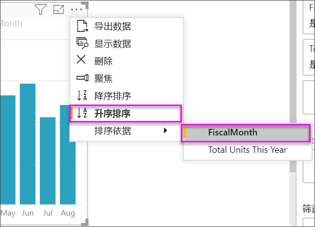

# 创建关键绩效指标 (KPI) 视觉对象

[!INCLUDE[consumer-appliesto-nyyn](../includes/consumer-appliesto-nyyn.md)]

[!INCLUDE [power-bi-visuals-desktop-banner](../includes/power-bi-visuals-desktop-banner.md)]

关键绩效指标 (KPI) 是一个视觉提示，针对可度量目标可以传达其完成的进度。 若要详细了解 KPI，请参阅 [PowerPivot 中的关键绩效指标 (KPI)](/previous-versions/sql/sql-server-2012/hh272050(v=sql.110))。

## 何时使用 KPI

当存在以下情况时，使用KPI 是一个不错的选择：

* 若要度量进度。 回答问题：“我是领先还是落后？”

* 若要度量与目标之间的距离。 回答问题：“我领先或落后了多远？”

## KPI 要求

设计人员将 KPI 视觉对象建立在特定的度量值基础之上。 KPI 旨在根据既定目标来评估当前指标的值和状态。配置 KPI 视觉对象需要用到评估当前值的基础度量值、目标度量值或值，以及阈值  或目标  。

KPI 数据集需要包含 KPI 目标值。 如果数据集不包含目标值，你可以创建它们，具体方法是向数据模型或 PBIX 文件添加含包含目标值的 Excel 工作表。

## 先决条件

本教程使用[零售分析示例 PBIX 文件](https://download.microsoft.com/download/9/6/D/96DDC2FF-2568-491D-AAFA-AFDD6F763AE3/Retail%20Analysis%20Sample%20PBIX.pbix)。

1. 在菜单栏的左上方，选择“文件” > “打开”  

1. 查找**零售分析示例 PBIX 文件**的副本

1. 在报表视图中打开“零售分析示例 PBIX 文件”  。 

1. 选择 + 来添加新页面  。 

> [!NOTE]
> 与 Power BI 同事共享报表时，你和这位同事都应具有独立的 Power BI Pro 许可证，并且应将报表保存在 Premium 容量中。    

## 如何创建 KPI

此示例将创建一个 KPI，用于度量在实现销售目标方面的进度。

1. 在“字段”  窗格中，依次选择“销售额”>“今年总销售单位数”  。  此值为指标。

1. 添加“时间”>“财政月”  。  此值表示趋势。

1. 选择视觉对象右上角的省略号，并检查 Power BI 是否按“会计月份”  升序方式对柱状图进行排序。

    > [!IMPORTANT]
    > 将可视化效果转换为 KPI 后，便无  排序选项。 必须现在进行正确排序。

    

    正确排序后，视觉对象如下所示：

    

1. 选择“可视化效果”  窗格中的“KPI”  图标，将视觉对象转换为 KPI。

    

1. 若要添加目标，请将“去年总销售单位数”  拖到“目标”  字段中。

    

1. 你也可以根据需要选择滚动油漆刷图标打开“格式”窗格来设置 KPI 格式。

    * **指标** - 控制指标的显示单位和小数位数。

    * **趋势轴** - 如果设置为“开”  ，视觉对象会将趋势轴显示为 KPI 视觉对象的背景。  

    * **目标** - 如果设置为“开”  ，视觉对象会显示目标，以及与目标距离的百分比。

    * **颜色编码 > 方向** - 人们会认为一些 KPI 值越高越好  ，而另一些 KPI 值则越低越好  。 例如，收入与等待时间。 通常更高的收入值好于更高的等待时间值。 选择“越高越好”  ，并视需要更改颜色设置。

KPI 也适用于 Power BI 服务和移动设备。 这样，可以始终与企业的关键信息数据保持连接。

## 注意事项和疑难解答

如果 KPI 并非如上所示，可能是因为你未按“会计月份”  进行排序。 KPI 没有排序选项。 必须重新开始，并先按“会计月份”排序，再将可视化效果转换为 KPI   。

## 后续步骤

* [关于 Power BI 地图可视化效果的提示和技巧](power-bi-map-tips-and-tricks.md)

* [Power BI 中的可视化效果类型](power-bi-visualization-types-for-reports-and-q-and-a.md)

更多问题？ [尝试参与 Power BI 社区](https://community.powerbi.com/)
