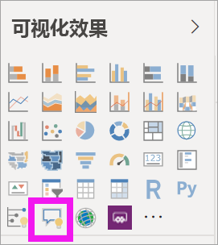
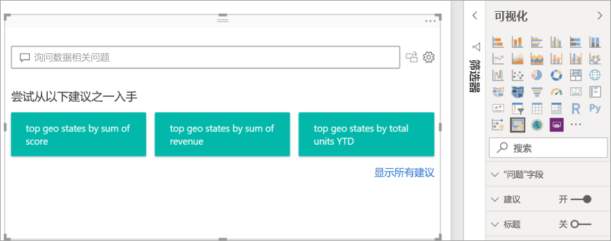
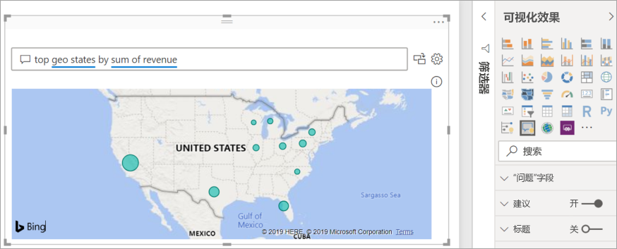
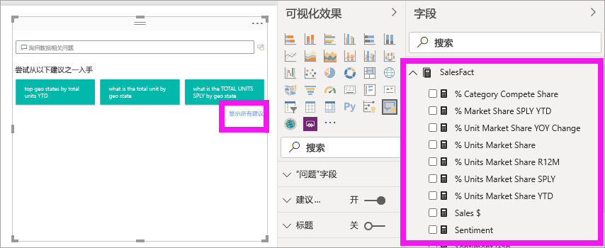
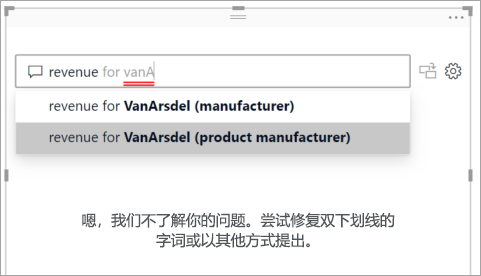
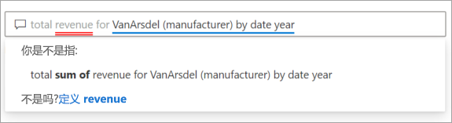
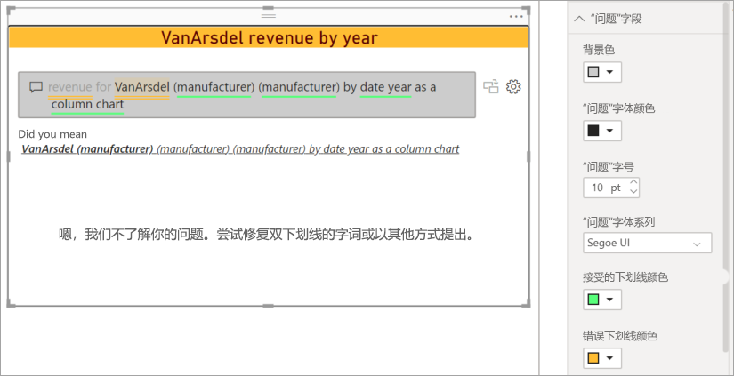
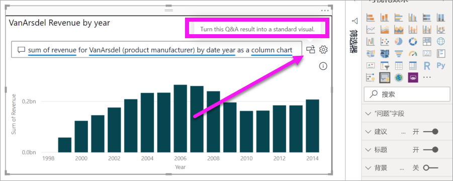
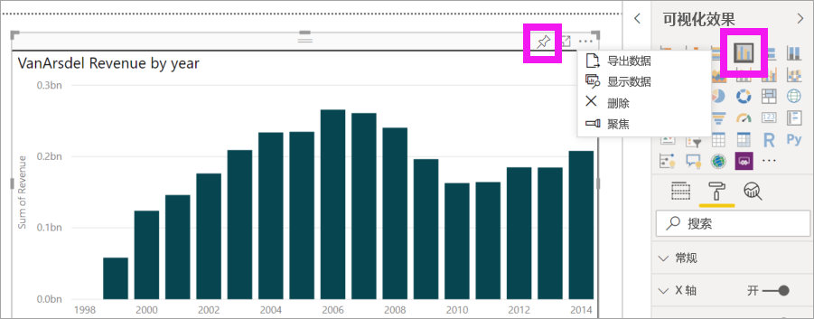
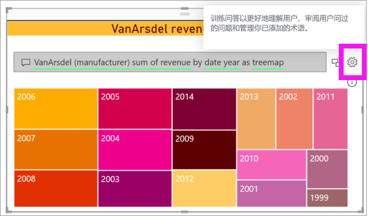

# 在 Power BI 中创建问答视觉对象

[!INCLUDE[consumer-appliesto-nyyn](../includes/consumer-appliesto-nyyn.md)]    

使用 Q&A 视觉对象，用户可以提出自然语言问题并以视觉对象的形式获得答案。 使用者可用它来快速获取其数据的答案。 设计人员还可用它来快速创建视觉对象。 如果你是报表设计人员，那么本文就是针对你的。 你可双击报表上的任何位置，使用自然语言开始操作。 在本文中，你将创建、自定义问答视觉对象并设置其格式。 该视觉对象支持 Power BI 中提供的主题和其他默认格式选项。 创建后，它的行为与任何其他视觉对象的类似，支持交叉筛选、交叉突出显示和书签。 

在查找有关 Power BI 中的问答的更多背景信息？ 请查看[问答简介](../natural-language/q-and-a-intro.md)。 

[!INCLUDE [power-bi-visuals-desktop-banner](../includes/power-bi-visuals-desktop-banner.md)]

问答视觉对象由 4 个核心部分组成：

- 问题框。 在这里，用户输入他们的问题，并向他们显示帮助完成问题的建议。
- 建议问题的预填充列表。
- 将 Q&A 视觉对象转换为标准视觉对象的图标。 
- 用于打开问答工具的图标，使设计人员能够配置基本的自然语言引擎。

## 先决条件

1. 下载[销售和市场营销示例 PBIX 文件](https://download.microsoft.com/download/9/7/6/9767913A-29DB-40CF-8944-9AC2BC940C53/Sales%20and%20Marketing%20Sample%20PBIX.pbix)跟进了解信息。

1. 在 Power BI Desktop 的左上部分，选择“文件” > “打开” 。
   
2. 查找“销售和市场营销示例 PBIX 文件”的副本。

1. 在报表视图中打开文件 .

1. 选择加号  ，以添加新报表页。

如果在创建问答视觉对象时遇到错误，请务必查看[问答限制](../natural-language/q-and-a-limitations.md)一文，了解数据源配置是否受支持。    

> [!NOTE]
> 若要与使用 Power BI 的同事共享报表，需要你们两人都有单独的 Power BI Pro 许可证，或者你将报表保存在 Premium 容量工作区中。 请参阅[共享报表](../collaborate-share/service-share-dashboards.md)。

## 使用建议的问题创建 Q&A 视觉对象
在本练习中，我们将选择一个建议的问题来创建我们的 Q&A 视觉对象。 

1. 从空白的报表页面开始，然后从“可视化效果”窗格中选择“Q&A 视觉对象”图标。

    

2. 拖动边框以调整视觉对象大小。

    

3. 若要创建视觉对象，请选择建议的问题之一或开始在问题框中键入内容。 在此示例中，我们已根据收入总和选择了排名靠前的地理位置。 Power BI 会尽量选择要使用的视觉对象类型。 在本例中，选择的是地图。

    

    但你可通过将 Power BI 添加到自然语言查询中来告知 Power BI 使用哪种视觉对象类型。 请记住，并非所有视觉对象类型都能对数据起作用或有意义。 例如，该数据不会产生有意义的散点图。 但它可以用作着色地图。

    

## 使用自然语言查询创建 Q&A 视觉对象
在上面的示例中，我们选择了一个建议的问题来创建我们的 Q&A 视觉对象。  在此练习中，我们将键入自己的问题。 键入问题时，Power BI 会帮助我们进行自动完成、建议和反馈。

如果不确定要使用哪种类型的问题类型或术语，请展开“显示所有建议”，或浏览画布右侧的“字段”窗格。 可通过“字段”窗格熟悉“销售和市场营销”数据库的术语和内容。

1. 在“Q&A”字段中键入问题。 Power BI 在其无法识别的字词上添加了红色下划线。 只要有可能，Power BI 都会帮助定义无法识别的字词。  在下面的第一个示例中，选择任何建议都将对我们有用。  

    

2. 当我们键入更多问题时，Power BI 遇到不理解的问题时会提示我们，并尝试提供帮助。 在下面的示例中，Power BI 问我们“你是指...”，并提出了一种使用数据集中术语表达问题的方法。 

    

5. 在 Power BI 的帮助下，我们能够提出所有可识别术语的问题。 Power BI 将结果显示为折线图。 

    

6. 让我们将视觉对象更改为柱形图。 

    

7.  向报表页添加更多视觉对象，并查看 Q&A 视觉对象如何与页面上的其他视觉对象交互。 在此示例中，Q&A 视觉对象已交叉筛选折线图和地图，并交叉突出显示条形图。

    

## 格式化和自定义 Q&A 视觉对象
可以使用格式窗格和应用主题来自定义 Q&A 视觉对象。 

### 应用主题
选择主题时，该主题将应用于整个报表页面。 有很多可供选择的主题，因此请先尝试，直到获得所需的外观为止。 

1. 在菜单栏中，选择“主页”选项卡，然后选择“切换主题” 。 

    

    
    
2. 在此示例中，我们选择了“更多主题” > “色盲安全” 。

    

### 格式化 Q&A 视觉对象
格式化 Q&A 视觉对象、问题字段和建议显示方式。 可以将所有内容从标题的背景色更改为悬停的颜色，以识别无法识别的字词。 在这里，我们为问题框添加了灰色背景，并将下划线更改为黄色和绿色。 标题居中，背景为黄色。 

## 将 Q&A 视觉对象转换为标准视觉对象
我们对色盲安全柱形图进行了一些格式化：添加了标题和边框。 现在，我们准备将其转换为报表中的标准视觉对象，并将其固定到仪表板。

选择图标“”以将此 Q&A 结果转换为标准视觉对象。

该视觉对象不再是 Q&A 视觉对象，而是标准柱状图。 可以固定在仪表板上。 在报表中，此视觉对象与其他标准视觉对象相同。 请注意，“可视化效果”窗格显示选择了“柱形图”图标而不是“Q&A 视觉对象”图标。

如果使用的是 Power BI 服务，现在可以通过选择固定图标将视觉对象固定到仪表板。 

## Q&A 视觉对象的高级功能
选择齿轮图标可打开“Q&A 视觉对象工具”窗格。 

使用“工具”窗格教导无法识别的 Q&A 术语、管理这些术语以及管理有关该数据集和报表的建议问题。 在“工具”窗格中，还可查看用户在此问答视觉对象中提出的问题，并查看用户已标记的问题。 若要了解详细信息，请参阅[培训 Power BI 问答的问答工具简介](../natural-language/q-and-a-tooling-intro.md)。

## 注意事项和疑难解答
Q&A 视觉对象与 Office 和 Bing 集成在一起，以尝试将无法识别的常用字词与数据集中的字段进行匹配。  

## 后续步骤

可通过多种方式集成自然语言。 有关详细信息，请参阅以下文章：

_ [Q&A 工具](../natural-language/q-and-a-tooling-intro.md)
* [Q&A 最佳做法](../natural-language/q-and-a-best-practices.md)
