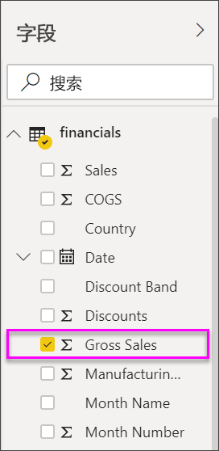
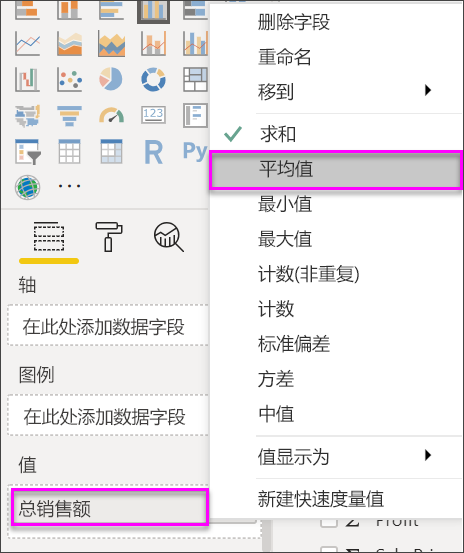
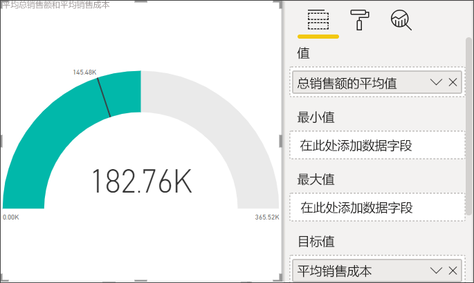
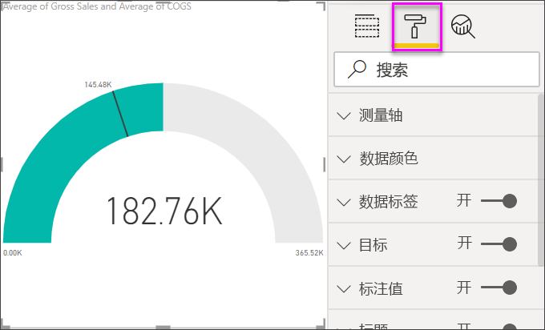
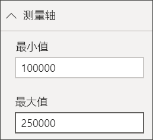
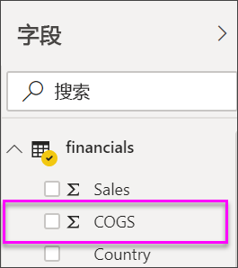
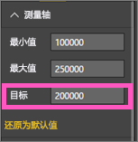
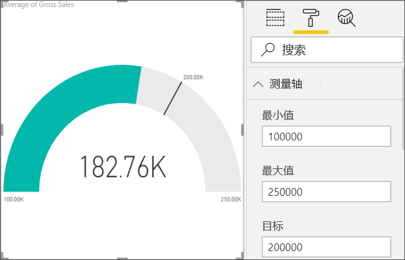

# Power BI 中的径向仪表图

[!INCLUDE[consumer-appliesto-nyyn](../includes/consumer-appliesto-nyyn.md)]

[!INCLUDE [power-bi-visuals-desktop-banner](../includes/power-bi-visuals-desktop-banner.md)]

径向仪表图在圆弧内显示一个值，用于度量在实现目标或关键绩效指标 (KPI) 方面的进度。 线（或指针）表示目标或目标值。 底纹表示在实现目标方面的进度。 圆弧内的值表示进度值。 Power BI 沿圆弧均匀分布所有可能的值，从最小值（最左边的值）到最大值（最右边的值）。

在上面的示例中，你是汽车零售商，需要跟踪销售团队的每月平均销量。 指针表示 140 辆汽车销量目标。 平均销量最小值为 0，最大值为 200。  蓝色底纹显示，销售团队本月的平均销量约为 120。 幸运的是，还有一周时间可以实现此目标。

> [!NOTE]
> 与 Power BI 同事共享报表时，你和这位同事都应具有独立的 Power BI Pro 许可证，并且应将报表保存在 Premium 容量中。

## 何时使用径向仪表盘

径向仪表适用情况：

* 若要显示在实现目标方面的进度。

* 若要表示百分比度量值（如 KPI）。

* 若要显示一个度量值的运行状况。

* 若要显示可以快速浏览并理解的信息。

## 先决条件

本教程使用[财务示例 Excel 文件](https://download.microsoft.com/download/9/6/D/96DDC2FF-2568-491D-AAFA-AFDD6F763AE3/Retail%20Analysis%20Sample%20PBIX.pbix)。

1. 在菜单栏的左上方，选择“获取数据” > “Excel” 
   
2. 查找 **财务示例 Excel 文件** 的副本

1. 在报表视图中打开 **财务示例 Excel 文件**。

1. 选择“financials”和“Sheet1” 

1. 单击“加载”

1. 选择  ，以添加新报表页。

## 创建基本的径向仪表盘

### 步骤 1：创建仪表盘来跟踪总销售额

1. 从空白报表页入手

1. 在“字段”窗格中，选择“总销售额”。

   

1. 将聚合函数更改为 **平均值** 。

   

1. 选择“仪表”图标  ，以将柱形图转换为仪表图。

    

    你看到的数字可能会与这些数字不一致，具体视你何时下载“财务示例”文件而定。

    > [!TIP]
    > 默认情况下，Power BI 创建的仪表图假定当前值（在此示例中，为“平均总销售额”）位于仪表的中间点。 由于“平均总销售额”的值为“$182.76K”，因此起始值（最小值）设为 0，终端值（最大值）设为当前值的两倍。

### 步骤 3：设置目标值

1. 将“字段”窗格中的“COGS”拖放到“目标值”井。

1. 将聚合函数更改为 **平均值** 。

   Power BI 添加了一个针用于表示我们的目标值 **$145.48K** 。

   

    请注意，我们已经超过了我们的目标。

   > [!NOTE]
   > 也可以手动输入目标值。 请参阅[“使用手动格式选项设置最小值、最大值和目标值”](#use-manual-format-options-to-set-minimum-maximum-and-target-values)部分。

### 步骤 4：设置最大值

在第 2 步中，Power BI 使用了“值”字段来自动设置最小值和最大值。 若要设置你自己的最大值，该怎么办？ 假设要将最大值设为数据集中的最高总销售额，而不使用当前值的两倍作为最大值。

1. 将“字段”窗格中的“总销售额”拖放到“最大值”井。

1. 将聚合函数更改为 **最大值** 。

   

   将重新绘制仪表盘，其新的结束值为总销售额 121 万。

   

### 步骤 5：保存报表

1. [保存报表](../create-reports/service-report-save.md)。

## 使用手动格式选项设置最小值、最大值和目标值

1. 将 **最大总销售额** 从 **最大值** 框中删除。

1. 选择“滚动油漆刷”图标，以打开“格式”窗格。

   

1. 展开“仪表轴”，并在“最小值”和“最大值”中输入值。

    

1. 取消选中“字段”窗格中的“COGS”选项，以删除目标值。

    

1. 当 **仪表盘轴** 下方显示 **目标值** 字段时，请输入一个值。

     

1. 或者，继续设置仪表盘的格式。

完成这些步骤后，便会得到如下所示的仪表图：

## 下一步

* [关键绩效指标 (KPI) 视觉对象](power-bi-visualization-kpi.md)

* [Power BI 中的可视化效果类型](power-bi-visualization-types-for-reports-and-q-and-a.md)

更多问题？ [尝试参与 Power BI 社区](https://community.powerbi.com/)

