# Power BI 中的切片器

[!INCLUDE [applies-to](../includes/applies-to.md)] [!INCLUDE [yes-desktop](../includes/yes-desktop.md)] [!INCLUDE [yes-service](../includes/yes-service.md)]

假设你希望报表读者能够查看总体销售指标，但同时突出显示各个地区经理和不同时间范围的业绩表现。 可以创建单独的报表或比较图表。 也可以使用切片器  。 切片器是另一种筛选方法，用于限制在报表的其他可视化效果中显示的部分数据集。 

本文介绍如何使用免费的[零售分析示例](../sample-retail-analysis.md)创建基本切片器并设置其格式。 它还演示了如何控制受切片器影响的视觉对象，以及如何与其他页面上的切片器进行同步。 下面是一些介绍如何创建特定类型的切片器的其他文章：

- [数值范围切片器](../desktop-slicer-numeric-range.md)。
- [相对日期切片器](desktop-slicer-filter-date-range.md)。
- 响应迅速、[可调整大小的切片器](../power-bi-slicer-filter-responsive.md)。
- 具有多个字段的[层次结构切片器](../create-reports/power-bi-slicer-hierarchy-multiple-fields.md)。

## 何时使用切片器
在要完成以下操作时，切片器非常有用：

* 在报表画布上显示常用或重要的筛选器，用以简化访问。
* 更轻松地查看当前筛选的状态，而无需打开下拉列表。 
* 按数据表中不需要的和隐藏的列进行筛选。
* 通过将切片器放置在重要的视觉对象旁边来创建更多报表。

Power BI 切片器不支持以下操作：

- 输入字段
- 向下钻取

## 创建切片器

此切片器按地区经理筛选数据。 如果要按照此过程进行操作，请下载[零售分析示例 PBIX 文件](https://download.microsoft.com/download/9/6/D/96DDC2FF-2568-491D-AAFA-AFDD6F763AE3/Retail%20Analysis%20Sample%20PBIX.pbix)。

1. 打开 Power BI Desktop，然后在菜单栏中选择“文件” > “打开”   。
   
1. 浏览到零售分析示例 PBIX.pbix 文件，然后选择“打开”   。

1. 在左侧窗格中，选择“报表”图标，在“报表”视图中打开文件  。

1. 在“概述”页上，报表画布上不选中任何内容，选择“可视化效果”窗格中的“切片器”图标来创建新的切片器    。 

1. 在选择新切片器后，从“字段”窗格中选择“地区” > “地区经理”来填充切片器    。 

    此时将使用地区经理名称及其选择框列表填充新切片器。
    
    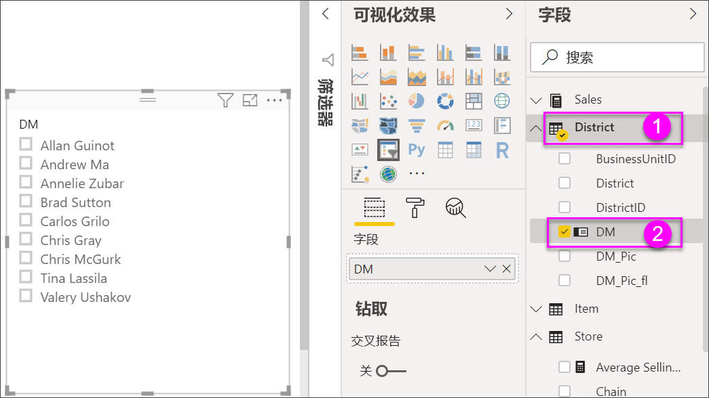
    
1. 调整大小并将元素拖至画布，以便为切片器腾出空间。 请注意，如果切片器的大小调整得过小，切片器项将被截断。 

1. 选择切片器上的名称，并注意对页面上其他可视化效果的影响。 再次选中名称以取消选择，或者按住 Ctrl 键选择多个名称  。 选择所有名称与不选择任何名称的效果相同。 

1. 也可以在“可视化效果”窗格中选择“格式”（滚动油漆刷图标）以设置切片器的格式   。 

   此处介绍了太多选项；请尝试并创建适合你的切片器。 在下图中，第一个切片器使用水平方向，并对项使用彩色背景。 第二个切片器使用垂直方向和彩色文本，以获得更标准的外观。

   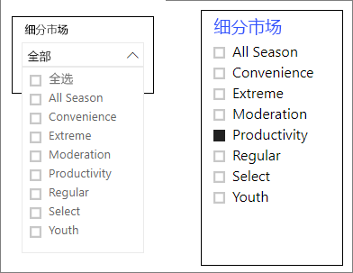

   >[!TIP]
   >默认情况下，切片器列表项按升序的方式进行排序。 若要按反向降序顺序进行排序，请选择切片器右上角的省略号 (...  )，然后选择“降序排序”  。

## 控制受切片器影响的页面视觉对象
默认情况下，报表页上的切片器会影响该页上的所有其他可视化效果，而且还会相互影响。 在刚创建的列表和日期滑块中选择值时，请注意对其他可视化效果的影响。 筛选后的数据是这两个切片器中所选值的交集。 

使用视觉对象交互来排除某些页面的可视觉化效果，以免受到其他可视化效果的影响。 在“概述”页上，“按财月和地区经理排列的总销售额方差”图表显示针对地区经理的按月总体比较数据，你希望此数据在任何时候都保持可见   。 使用视觉对象交互来阻止切片器选择筛选此图表。 

1. 转到报表的“概述”页，然后选择之前创建的“地区经理”切片器   。

1. 在 Power BI Desktop 菜单中，选择“可视化工具”下的“格式”菜单，然后选择“编辑交互”    。
   
   筛选器控件（其中每个控件都具有“筛选器”和“无”选项）都显示在页面中所有视觉对象的上方   。 最初，所有控件上都预先选择了“筛选器”选项  。
   
1. 选择“按财月和地区经理排列的总销售额方差”图表上方筛选器控件中的“无”选项，以停止“地区经理”切片器对其进行筛选    。 

1. 选择“OpenDate”切片器，然后选择“按财月和地区经理排列的总销售额方差”图表上的“无”选项，以停止此切片器对其进行筛选    。 

   现在，当你在切片器中选择名称和日期范围时，“按财月和地区经理排列的总销售额方差”图表将保持不变  。

有关编辑交互的详细信息，请参阅[在 Power BI 报表中更改视觉对象的交互方式](../service-reports-visual-interactions.md)。

## 同步切片器并在其他页面上使用
自 Power BI 2018 年 2 月更新起，可同步切片器并在报表的任意页面上使用。 

在当前报表中，“地区每月销售”页包含“地区经理”切片器，但如果我们还希望在“新商店”页上包含该切片器，该怎么办    ？ “新商店”页包含切片器，但仅提供“商店名称”信息   。 使用“同步切片器”窗格，可以在这些页面上同步“地区经理”切片器，以便任何页上的切片器选择会影响所有三个页面上的可视化效果   。

1. 在 Power BI Desktop“视图”菜单上，选择“同步切片器”   。

    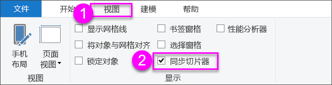

    “同步切片器”窗格显示在“筛选器”和“可视化效果”窗格之间    。

    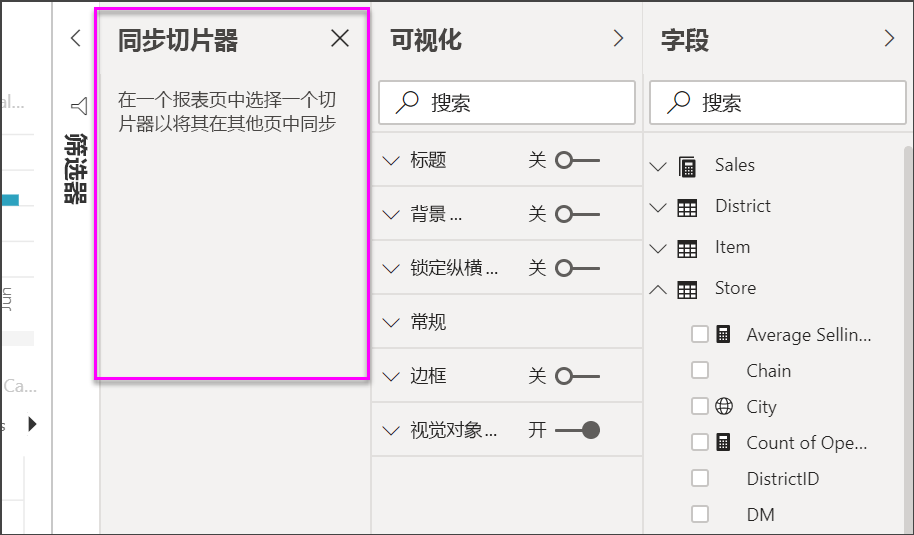

1. 在报表的“地区每月销售”页上，选择“地区经理”切片器   。 

    由于在“概述”页上创建了“地区经理”(DM) 切片器，因此“同步切片器”窗格如下所示     ：
    
    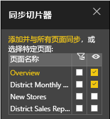
    
1. 在“同步切片器”窗格的“同步”列中，依次选择“概述”、“地区每月销售额”和“新商店”页面      。 

    此选择会使“地区每月销售额”切片器在这三个页面上实现同步  。 
    
1. 在“同步切片器”窗格的“可见”列中，选择“新商店”页    。 

    此选择会使“地区每月销售额”切片器在这三个页面上可见  。 “同步切片器”窗格现如下所示  ：

    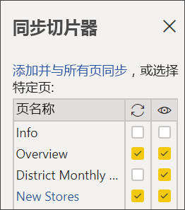

1. 观察同步切片器并使其在其他页上可见的影响。 在“地区每月销售额”页上，注意“地区经理”切片器现显示与“概述”页上的切片器相同的选择    。 在“新商店”页上，“地区经理”切片器现在可见，且该切片器的选择会影响“商店名称”切片器中可见的选择    。 
    
    >[!TIP]
    >尽管切片器最初以与原始页面相同大小和相同位置的方式出现在同步页面上，但你可以在不同页面上独立移动、调整大小和格式化同步切片器。 

    >[!NOTE]
    >如果将切片器同步到一个页面，但不让它在该页上可见，那么在其他页面上所做的切片器选择仍然会筛选该页上的数据。
 
## 筛选切片器
可以将视觉对象级筛选器应用于切片器以减少切片器中显示的值的列表。 例如，可以从列表切片器中筛选出空白值，或从范围切片器中筛选出特定日期。 执行此操作时，它只会影响切片器中显示的值  ，而不是在进行选择时切片器应用于其他视觉对象的筛选器  。 例如，假设将筛选器应用于范围切片器，以便仅显示特定日期。 对切片器的选择仅显示该范围中的第一个日期和最后一个日期，但仍会看到其他视觉对象中的其他日期。 更改切片器中的所选范围后，会看到其他视觉对象更新。 清除切片器会再次显示所有日期。

有关视觉对象级筛选器的详细信息，请参阅[筛选器类型](../power-bi-report-filter-types.md)。

## 格式化切片器
可用的不同格式化选项具体取决于切片器类型。 通过使用“水平”  方向、“响应式”  布局，和“项”  着色，可以生成按钮或磁贴，而不是标准列表项，并使切片器项调整大小以适应不同的屏幕大小和布局。  

1. 在任何页面上选择“区域经理”切片器后，在“可视化效果”窗格中选择“格式”图标以显示格式设置控件    。 
    
    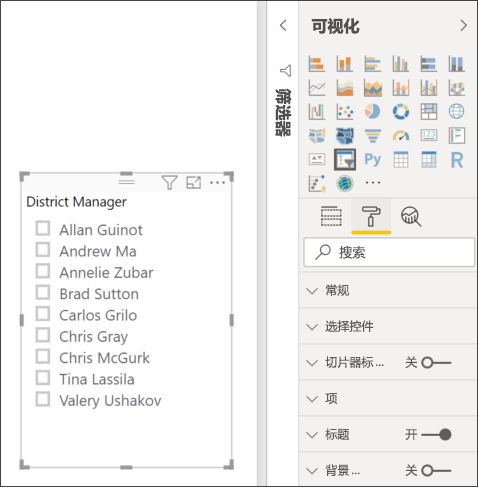
    
1. 选择每个类别旁边的下拉列表箭头，显示和编辑选项。 

### 常规选项
1. 在“格式”下选择“常规”，在“轮廓颜色”下选择红色，然后将“轮廓线粗细”更改为 2      。 

    此设置会更改标头以及项边框或下框线的颜色/粗细。

1. 对于“方向”，默认选择“垂直”   。 选择“水平”可以生成带水平排列磁贴或按钮的切片器，并滚动箭头访问切片器中不适合的项  。
    
    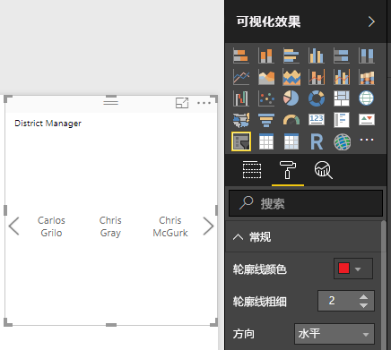
    
1. 启用“响应式”布局，根据屏幕和切片器大小更改切片器项的大小和排列方式   。 

    对于列表切片器，响应式布局可防止项在小屏幕上被截断。 它仅适用于水平方向。 对于范围滑块切片器，响应式格式设置更改滑块样式，并且可以更灵活地调整大小。 这两种类型的切片器都变成了小号的筛选器图标。
    
    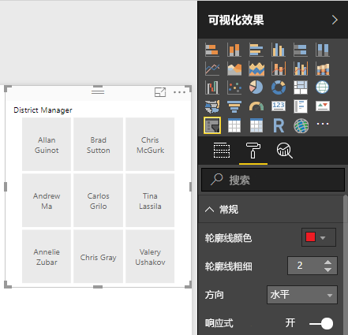
    
    >[!NOTE]
    >更改响应式布局后，可以会覆盖所设置的特定标题和项格式。 
    
1. 在“X 位置”、“Y 位置”、“宽度”和“高度”中，使用数值精度设置切片器位置和大小，或者直接在画布上移动切片器或调整其大小     。 

    尝试不同的项大小和布局，并注意响应式格式设置如何相应地更改。 仅当选择水平方向时，这些选项才适用。 

    

若要深入了解水平方向和响应式布局，请参阅[在 Power BI 中创建可调整大小的响应式切片器](../power-bi-slicer-filter-responsive.md)。

### 选择控件选项（仅列表切片器）
1. 在“选择控件”中，开启“显示‘全选’选项”，以便向切片器添加“全选”项     。 

    “显示‘全选’选项”默认为“关”   。 启用后，切换此选项会选择或取消选择所有项。 如果选择所有项，则选择一个项即可取消选择该项，从而实现“非”类型筛选器  。
    
    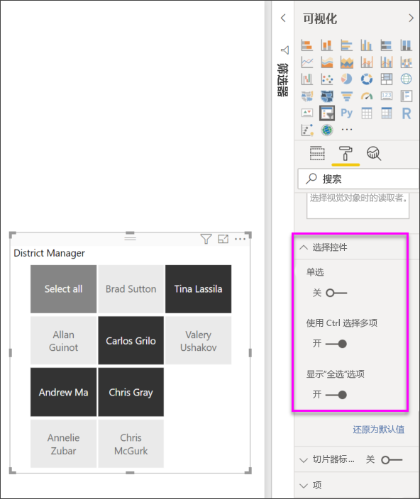
    
1. 关闭“单项选择”后，无需按 Ctrl 键即可选择多个项    。 

    默认启用“单项选择”   。 选择一个项即可将其选中，按住 Ctrl 键可选择多个项  。 再次选择该项即可取消选择。

### 标题选项
“标题”选项默认为“开”   。 此选择将在切片器顶部显示数据字段名称。 
- 对于本文，请按下面的方式设置标题文本的格式： 
   - 字体颜色：红色 
   - **文本大小**：14 磅 
   - 对齐方式  ：居中 
   - **字体系列**：Arial Black 

### 项选项（仅列表切片器）
1. 对于本文，请按下面的方式设置“项”选项的格式  ：
    - 字体颜色：黑色 
    - 背景颜色：浅红色 
    - **文本大小**：10 磅 
    - **字体系列**：Arial 
 
1. 在“边框”中，选择“框架”，在每个项周围添加带有在“常规”选项下设置的大小和颜色的边框线    。 
    
    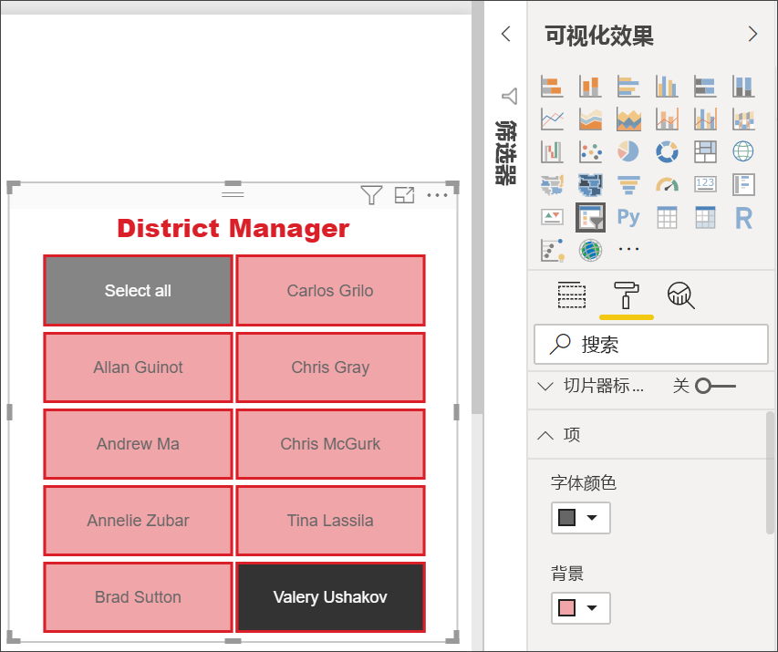
    
    >[!TIP]
    >- 选择“常规” > “方向” > “水平”后，取消选择的项显示已选文本和背景颜色，而所选项使用系统默认设置，通常是黑色背景和白色文本    。
    >- 选择“常规” > “方向 > 垂直”后，项始终显示选择的颜色，选择项时复选框始终为黑色   。 

### 日期/数值输入和滑块选项（仅范围滑块切片器）
- 对于列表切片器，“日期/数值输入”选项与“项”选项相同，但没有任何边框或下框线选项  。
- 滑块选项允许你设置范围滑块的颜色，或关闭滑块，仅保留数值输入   。

### 其他格式设置选项
其他格式设置选项默认为“关”  。 开启这些选项对其进行控制  ： 
- 背景颜色  ：将背景颜色添加到切片器并设置其透明度。
- 锁定纵横比  ：重新调整大小后，切片器的形状保持不变。
- 边框  ：在切片器周围添加边框并设置其颜色。 此切片器边框是单独的，不受“常规”设置影响  。 

## 后续步骤
有关详细信息，请参阅以下文章：

- [Power BI 中的可视化效果类型](power-bi-visualization-types-for-reports-and-q-and-a.md)

- [Power BI 中的表](power-bi-visualization-tables.md)

