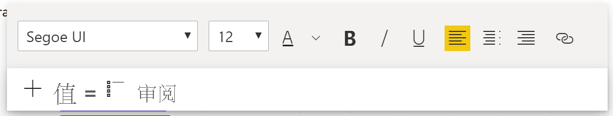
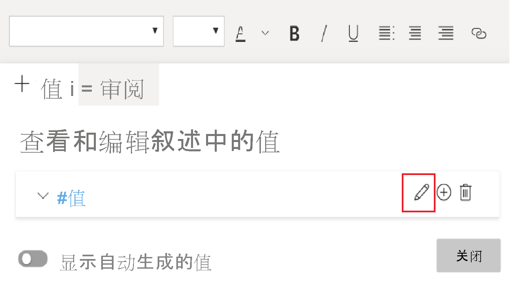
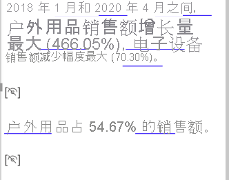

# 创建智能叙述（预览版）

[!INCLUDE[consumer-appliesto-nyyn](../includes/consumer-appliesto-nyyn.md)]    

[!INCLUDE [power-bi-visuals-desktop-banner](../includes/power-bi-visuals-desktop-banner.md)]

智能叙述可视化效果通过提供可自定义的相关现成见解来帮助快速汇总视觉对象和报表。

使用此功能创建器可以将叙述添加到报表中，用于解决要点，指出趋势，编辑语言并设置格式以适合特定受众。 他们现在可以将叙述添加到每次刷新时更新的报表中，而不是将报表的屏幕截图粘贴到已添加要点的 PowerPoint 中。 最终用户可以使用叙述来了解他们的数据，更快地进入要点，并向其他人解释这些数据。

>[!NOTE]
> 由于此功能处于预览状态，因此需要先通过转到“文件”>“选项和设置”>“选项”>“预览功能”来打开功能开关，并确保已打开“智能叙述视觉对象” ****  ：

可以在本文档中（[此处](https://github.com/microsoft/powerbi-desktop-samples/blob/master/Monthly%20Desktop%20Blog%20Samples/2020/2020SU09%20Blog%20Demo%20-%20September.pbix)）找到用于联机销售方案的 pbix。

## 开始操作 

单击“可视化效果”窗格中的“新建智能叙述”图标以自动生成摘要。

 你将看到根据页面上的所有视觉对象创建的叙述。 例如，可以单击该图标以自动生成在此报表中介绍收入、网站访问次数和销售额的视觉对象的摘要。 请注意，Power BI 会自动进行趋势分析，以表明收入和访问次数同时增长，甚至还会计算看到的增长类型 - 在本例中，增加了 72%。
 
 
 
 也可以右键单击该视觉对象，然后选择“汇总”。 这将生成该可视化对象的自动摘要。 例如，当你在显示各种事务的散点图上右键单击“-> 汇总”时，Power BI 会分析数据，并显示哪个城市/区域具有每个事务的最高收入以及最大事务数。 还会显示这些指标的预期值范围，因此你可以了解每个事务的收入在大多数城市中低于 $45，并且事务数少于 10 个。
 
  
 
 
 ## 编辑摘要
 
 摘要高度可自定义，你可以使用“常规”文本框中提供的相同控件添加新文本或编辑现有文本。 例如，可以将文本设置为粗体或更改文本颜色。
 
  
  
  还可以自定义摘要并通过添加动态值来添加你自己的见解。 可以将文本映射到现有字段和度量值，也可以使用自然语言定义要映射到文本的新度量值。 例如，如果要添加有关返回的项数的信息，则可以使用 gif 中所示的添加值体验。 我们已集成问答体验来添加动态值。 当你键入时，你会在下拉列表中获得建议，就像在问答视觉对象中一样，只需将其保存为值即可。  因此，除了能够在问答中询问数据问题以外，还扩展了范围以创建你自己的计算，甚至无需执行 DAX。 
  
   
  
  可以设置动态值的格式，例如，若要显示为货币，请指定小数位数、千位分隔符等。 
   
   
   
   为此，可以直接单击摘要中的值以设置其格式，或者单击与文本框控件的“查看”选项卡中的值相对应的“编辑”按钮。 
   
   
   
   还可以使用“查看”选项卡来查看、删除或重用以前定义的值。  单击加号图标将在摘要中插入值。 还可以通过切换底部的选项来显示自动生成的值。

有时，你将看到隐藏的摘要符号，指示“当前数据和筛选器无此值的结果”。 这是因为没有可说的内容，因此某些摘要可以为空。 例如，在折线图中显示高值和低值的摘要可能为空（如果它是平线），但在其他情况下可能不为空。 这些符号仅在尝试编辑摘要时可见。

   
   
   ## 视觉对象交互
   摘要是动态的，当交叉筛选时，会自动更新生成的文本和动态值。 例如，如果在环形图中选择电子产品，则报表的其余部分将交叉筛选，并且摘要也将交叉筛选，以便将焦点设置在电子产品上。  在这种情况下，访问次数和收入具有不同的趋势，因此，文本会进行更新以反映这种情况。 添加的返回值的计数将更新为 $4196。 当交叉筛选时，还可以更新某些空摘要。
   
   
   
   还可以执行更高级的筛选。 例如，如果你只关注显示多个不同产品趋势的视觉对象中的特定季度的趋势，则可以仅选择相关的数据点，以获取为该片段更新的摘要。
   
   
   
   ## 限制
   - 不支持固定到仪表板。
   - 不支持使用动态值和条件格式（例如，数据绑定标题）。
   - 不支持 Azure Analysis Services，即本地 AS。
   - KPI、卡片、多行卡片、地图、表、矩阵、R/Python 视觉对象、自定义视觉对象不支持汇总。 将来会添加其中一些视觉对象。
   - 不支持对具有按其他列进行分组的列以及基于“数据组”字段的列的视觉对象进行汇总。 
   - 不支持交叉筛选掉视觉对象。
   - 不支持重命名动态值或编辑自动生成的动态值。
   - 不支持实时计算（QnA 算术、占总计的百分比等）中包含的视觉对象的汇总。
   

