# Power BI 报表和仪表板中的表

[!INCLUDE[consumer-appliesto-nyyn](../includes/consumer-appliesto-nyyn.md)]

[!INCLUDE [power-bi-visuals-desktop-banner](../includes/power-bi-visuals-desktop-banner.md)]

表是以逻辑序列的行和列表示的包含相关数据的网格。 它还包含标头和合计行。 表非常适合定量比较，即研究一个类别的多个值。 例如，下表显示“类别”  的五个不同度量值。

可以在报表中创建表，并能将表内的元素与同一报表页上的其他视觉对象一起交叉突出显示。 可以选择行、列和各个单元格，并交叉突出显示。 还可以将选择的单个单元格和多个单元格复制并粘贴到其他应用程序。

## 何时使用表

在以下情况下选择表是不错的选择：

* 若要查看并比较详细数据和精确值（而不是视觉对象表示形式）。

* 若要以表格格式显示数据。

* 若要按类别显示数值数据。

## 先决条件

本教程使用[零售分析示例 PBIX 文件](https://download.microsoft.com/download/9/6/D/96DDC2FF-2568-491D-AAFA-AFDD6F763AE3/Retail%20Analysis%20Sample%20PBIX.pbix)。

1. 在菜单栏的左上方，选择“文件” > “打开”  
   
2. 查找 **零售分析示例 PBIX 文件** 的副本

1. 在报表视图中打开 **零售分析示例 PBIX 文件**。

1. 选择  ，以添加新报表页。

> [!NOTE]
> 与 Power BI 同事共享报表时，你和这位同事都应具有独立的 Power BI Pro 许可证，并且应将报表保存在 Premium 容量中。

## 创建表

你将创建本文开头所示的表，以按商品类别显示销售额值。

1. 在“字段”  窗格中，依次选择“商品”   > “类别”  。

    Power BI 会自动创建一个表，该表列出所有类别。

    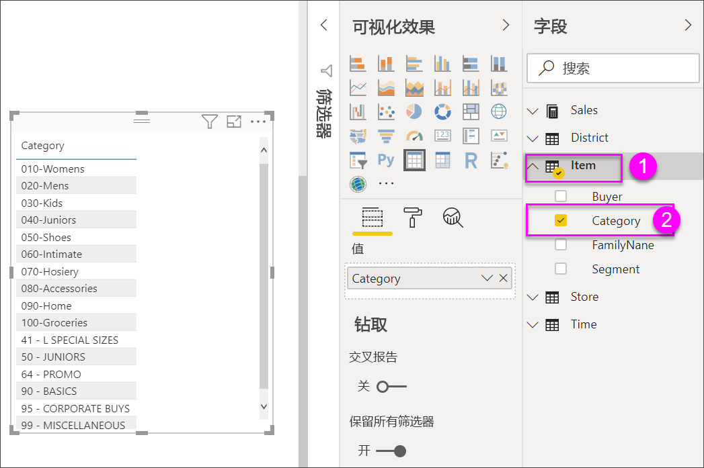

1. 依次选择“销售额”>“平均单价”  ，以及“销售额”>“去年销售额” 

1. 然后，依次选择“销售额”>“今年销售额”  ，并选择以下所有三个选项：“值”  、“目标”  和“状态”  。

1. 在“可视化效果”窗格中，找到“值”井并选择值，直到表列的顺序与本页中的第一个图像一致   。 如果需要，将值拖到井中。 “值”  井如下所示：

    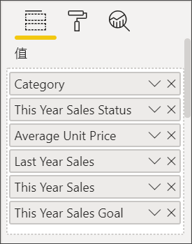

## 设置表格格式

设置表格式的方式有很多。 本文仅介绍了其中几种。 了解其他格式设置选项的绝佳方式是，打开“格式”  窗格（“滚动油漆刷”图标 ），并进行浏览。

* 尝试设置表格中网格的格式。 接下来，将添加蓝色垂直网格、为行添加空间，并增加边框和文本大小。

    

    

* 对于列标题，更改背景色、添加边框，并增加字体大小。

    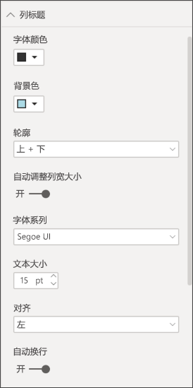

    

* 甚至可以将格式设置应用于单个列和列标题。 首先，展开“字段格式设置”  ，并从下拉列表中选择要设置格式的列。 根据列值，可以在“字段格式设置”  中进行以下设置：显示单位、字体颜色、小数位数、背景、对齐方式等。 在调整设置后，确定是否将这些设置应用到标头和总计行。

    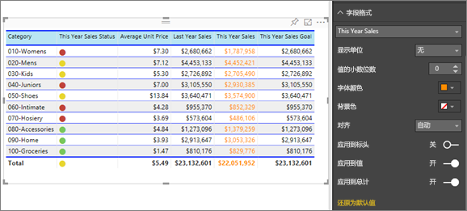

    

* 进行其他一些格式设置后，最终表如下所示。

    

### 条件格式

条件格式  是一种格式设置类型。 Power BI 可以向你添加到“可视化效果”窗格中“值”区的任何字段应用条件格式   。

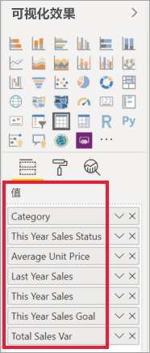

通过表的条件格式设置，可以根据单元格值指定图标、URL、单元格背景色和字体颜色，包括使用渐变色。

1. 在“格式”窗格中，打开“条件格式”卡   。

    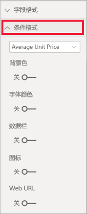

1. 选择要格式化的字段，并将“背景颜色”的滑块设置为“开”  。 Power BI 应用基于列中的值的渐变。 若要更改默认颜色，请选择“高级控件”  。

    如果选中“散射”  选项，还可以配置可选的“居中”  值。

    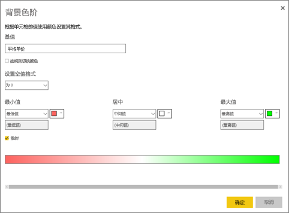

    我们将某些自定义格式设置应用于“平均单价”值。 选中“散射”  ，添加一些颜色，再选择“确定”  。

    
1. 将新字段添加到具有正值和负值的表中。 选择“销售额”>“总销售差额”  。

    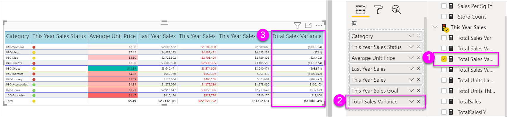

1. 通过将“数据条”滑块设置为“开”来添加数据条条件格式  。  

    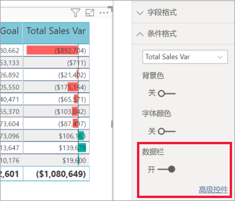

1. 若要自定义数据条，请选择“高级控件”  。 在随即显示的对话框中，依次设置“正数据栏”  和“负数据栏”  的颜色，选中“仅显示数据栏”  选项，并进行所需的其他任何更改。

    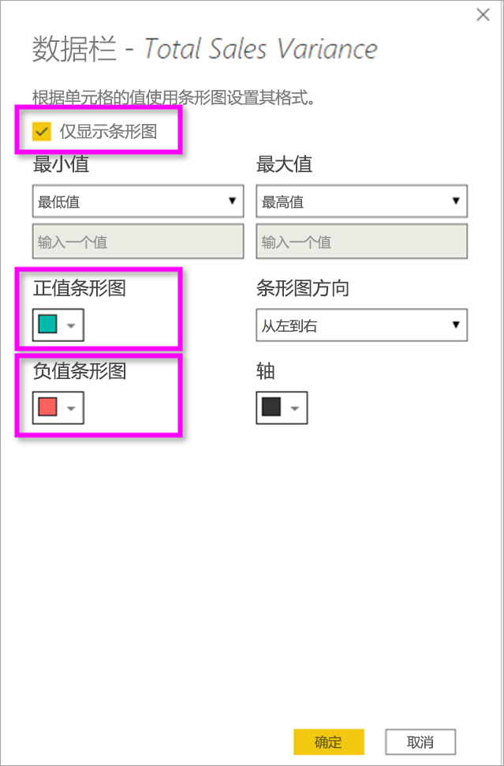

1. 选择“确定”。 

    数据栏会替换表中的数字值，让它更易于浏览。

    

1. 使用“条件图标”向表添加视觉提示  。  在“条件格式”卡中，从下拉菜单中选择“本年度销售额”   。 将“图标”滑块设置为“On”   。  若要自定义图标，请选择“高级控件”  。

    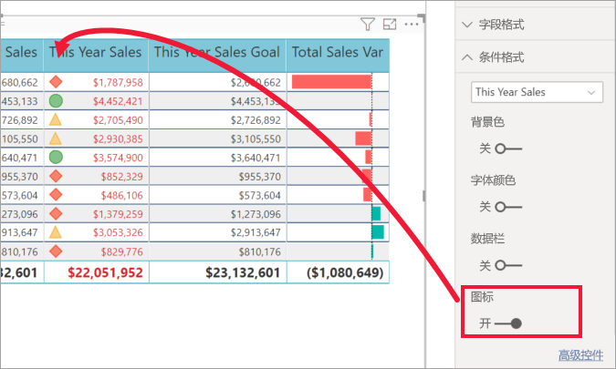

## 复制 Power BI 表中的值以供在其他应用程序中使用

表或矩阵可能具有你想要在其他应用程序中使用的内容，例如 Dynamics CRM、Excel、甚至其他 Power BI 报表。 在 Power BI 中，右键单击单元格后，可以将单个单元格或多个单元格的集合中的数据复制到剪贴板，并将数据粘贴到其他应用程序。

若要复制单个单元格的值，请执行以下操作：

1. 选择要复制的单元格。

1. 右键单击此单元格。

1. 依次选择“复制”   > “复制值”  。

    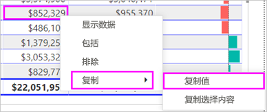

    借助剪贴板上的无格式单元格值，可以将它粘贴到其他应用程序。

若要复制多个单元格，请执行以下操作：

1. 选择一个单元格范围，或使用 Ctrl  来选择一个或多个单元格。

1. 右键单击已选择的单元格之一。

1. 依次选择“复制”   > “复制选择”  。

    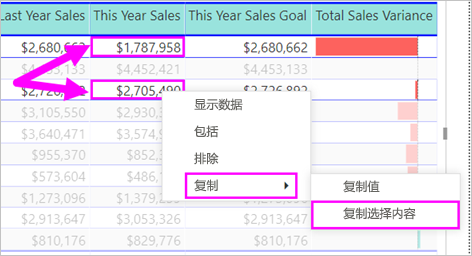

## 调整表的列宽度的大小

有时 Power BI 会截断仪报表中或仪表板上的列标题。 若要显示整个列名，请将鼠标悬停在标题右侧的空白之上，以显示双箭头，然后选择并拖动它。

## 注意事项和疑难解答

* 应用列格式时，每列只能选择一个对齐选项：“自动”  、“左对齐”  、“居中”  和“右对齐”  。 通常情况下，一个列包含的内容全部为文本或全部为数字，而不是二者的混合。 如果列中同时包含数字和文本，选择“自动”  选项会将文本左对齐，并将数字右对齐。 此行为支持从左往右阅读的语言。

* 如果表的单元格或标题中的文本数据包含换行符，则除非你在元素的相关格式设置窗格卡中启用“自动换行”选项，否则这些字符将被忽略。 

* Power BI 基于前二十列和前五十行计算最大单元格大小。 这些点之外的单元格可能未适当调整大小。

## 后续步骤

* [Power BI 中的树状图](power-bi-visualization-treemaps.md)

* [Power BI 中的可视化效果类型](power-bi-visualization-types-for-reports-and-q-and-a.md)
