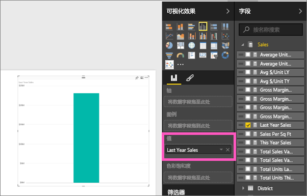
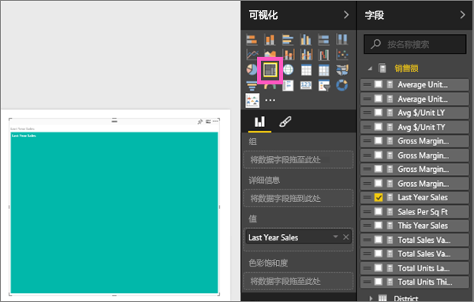

# Power BI 中的树状图

树状图将分层数据显示为一组嵌套矩形。 层次结构中的每个级别都由一个有色矩形（分支）表示，其中包含更小的矩形（叶）。 Power BI 根据度量值来确定每个矩形内的空间大小。 矩形按大小从左上方（最大）到右下方（最小）排列。

例如，若要分析销售情况，可能有服装类别作为顶级分支：城市  、乡村  、青年  和混合  。 Power BI 会将类别矩形拆分为叶（即服装类别内的服装制造商）。 这些叶根据销售量确定大小和底纹。

在上面的“城市”  分支中，销售了许多“VanArsdel”  服装。 销售的“Natura”  和“Fama”  服装较少。 “Leo”  服装仅销售了几件。 因此，在树状图的“城市”  分支中：

* “VanArsdel”  的矩形最大，位于左上角。

* “Natura”  和“Fama”  的矩形略小。

* 有其他许多矩形，代表已销售的其他所有服装。

* “Leo”  的矩形很小。

通过比较每个叶节点的大小和底纹，可以跨其他服装类别比较销量：矩形越大，颜色越深，值就越大。

想要先观看别人创建一个树状图？ 跳到此视频的 2:10 处观看 Amanda 创建一个树状图。

<iframe width="560" height="315" src="https://www.youtube.com/embed/IkJda4O7oGs" frameborder="0" allowfullscreen></iframe>

## 何时使用树状图

当存在以下情况时，树状图是一个不错的选择：

* 若要显示大量的分层数据。

* 如果条形图无法有效处理大量值。

* 若要显示每个部分与整体之间的比例。

* 若要跨层次结构中的每个类别级别显示度量值的分布模式。

* 若要使用大小和颜色编码来显示属性。

* 若要发现模式、离群值、最重要影响因素和异常。

## 先决条件

* Power BI 服务或 Power BI Desktop

* “零售分析示例”报表

## 获取“零售分析示例”报表

以下说明使用零售分析示例。 创建可视化效果需要对数据集和报表拥有编辑权限。 幸运的是，所有 Power BI 示例都是可以编辑的。 如果有人与你共享报表，你无法在报表中创建可视化效果。 若要跟着本教程一起操作，请获取[“零售分析示例”报表](../sample-datasets.md)。

获取“零售分析示例”  数据集后，可以开始操作了。

## 创建一个基本的树状图

你将创建报表，并添加基本树状图。

1. 在“我的工作区”  中，依次选择“数据集”   > “创建报表”  。

    

1. 在“字段”  窗格中，依次选择“销售额”   > “去年销售额”  度量值。

   

1. 选择“树状图”图标  ，以将图表转换为树状图。

   

1. 将**项目**  >  **类别**拖放到**组**中。

    Power BI 将创建一个树状图，其中矩形的大小基于总销售额，颜色代表类别。 实际上你已创建以可视化方式描述按类别的总销售额的相对大小的层次结构。 “男装”  类的销售额最高，“袜”  类销售额最低。

    

1. 将“商店”   >  “连锁店”  拖放到“详细信息”  以完成树状图。 现在你可以按类别和连锁店比较上年度的销售额。

   

   > [!NOTE]
   > 不能同时使用色彩饱和度和详细信息。

1. 将鼠标悬停在**连锁店**区域上方以显示**类别**中该部分的工具提示。

    例如，将鼠标悬停在“090-家居”  矩形中的 Fashions Direct  ，将显示家居类别 Fashions Direct 部分的工具提示。

   

1. 将树状图添加为[仪表板磁贴（固定视觉对象）](../service-dashboard-tiles.md)。

1. 保存[报表](../service-report-save.md)。

## 突出显示和交叉筛选

若要了解如何使用“筛选器”  窗格，请参阅[向报表添加筛选器](../power-bi-report-add-filter.md)。

突出显示树状图中的“类别”  或“详细信息”  可交叉突出显示和交叉筛选报表页上的其他可视化效果，反之亦然。 若要跟着本教程一起操作，请向此报表页添加一些视觉对象，或将树状图复制到此报表的其他一个报表页中。

1. 在树状图中，选择“类别”  或“类别”  中的“连锁店”  。 这会交叉突出显示报表页上的其他可视化效果。 例如，选择“050-Shoes”  显示去年的鞋子销售额为 $3,640,471  ，其中 Fashions Direct  贡献了 $2,174,185  的销售额。

   

1. 在按连锁店的上年度销售额  饼图中，选择“Fashions Direct”  切片，交叉筛选树状图。
   

1. 若要管理图表如何相互交叉突出显示和交叉筛选，请参阅[更改 Power BI 报表中视觉对象的交互方式](../service-reports-visual-interactions.md)。

## 后续步骤

* [Power BI 中的瀑布图](power-bi-visualization-waterfall-charts.md)

* [Power BI 中的可视化效果类型](power-bi-visualization-types-for-reports-and-q-and-a.md)
