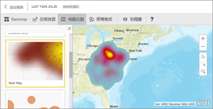
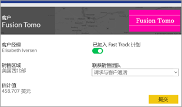
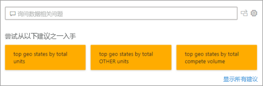
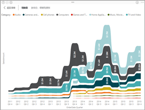
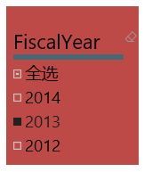
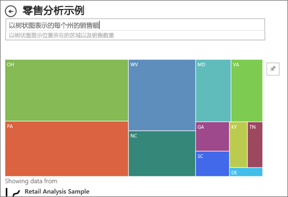

# Power BI 中的可视化效果类型
## Power BI 可视化效果
我们将添加新的可视化效果，请继续关注！

同时可以浏览 [Microsoft AppSource](https://appsource.microsoft.com/marketplace/apps?product=power-bi-visuals)，上面有不断扩增的 [Power BI 视觉对象](../developer/visuals/power-bi-custom-visuals.md)列表。可以下载这些视觉对象并在自己的仪表板和报表中使用。 有创造性的点子？ [了解如何创建并将自己的视觉对象添加到此社区网站](../developer/visuals/office-store.md)。  

## Power BI 中可用的可视化效果列表
所有这些可视化效果可以被添加到 Power BI 报表、在问答中指定和固定到仪表板。

### 分区图：基本（分层）和堆积

>[!TIP]
>基本分区图是在折线图的基础上增加了坐标轴和填充的线之间的区域。

有关详细信息，请参阅[基本分区图](power-bi-visualization-basic-area-chart.md)。

### 条形图和柱形图

 

>[!TIP]
>条形图是查看跨不同类别的特定值的标准格式。

### 卡片：多行

### 卡片：单个数字

有关详细信息，请参阅[创建卡片（大数字磁贴）](power-bi-visualization-card.md)。

### 组合图

>[!TIP]
>组合图将柱形图和折线图结合在一起。 请在折线图和堆积柱形图和折线图和簇状柱形图中选择。

有关详细信息，请参阅 [Power BI 中的组合图](power-bi-visualization-combo-chart.md)。

### 圆环图

>[!TIP]
>圆环图类似于饼图。  它们显示部分与整体的关系。

有关详细信息，请参阅 [Power BI 中的圆环图](power-bi-visualization-doughnut-charts.md)。

### 漏斗图

>[!TIP]
>漏斗图用于可视化包含阶段和从一个阶段按顺序流到下一个阶段的项目的流程。  当阶段之间存在顺序流时使用漏斗图，例如销售过程以潜在客户为起点，以购买完成为终点。

有关详细信息，请参阅 [Power BI 中的漏斗图](power-bi-visualization-funnel-charts.md)。

### 仪表盘

>[!TIP]
>显示相对于目标的当前状态。

有关详细信息，请参阅 [Power BI 中的仪表图](power-bi-visualization-radial-gauge-charts.md)。

### 关键影响因素图表

关键影响因素图表显示所选结果或值主要参与者。

有关详细信息，请参阅 [Power BI 中的关键影响因素图表](power-bi-visualization-influencers.md)

### KPI

>[!TIP]
>显示可衡量目标的进程。

有关详细信息，请参阅 [Power BI 中的 KPI](power-bi-visualization-kpi.md)。

### 折线图

>[!TIP]
>强调一系列值的整体形状，通常以时间的推移来显示。

### 地图：基本地图

>[!TIP]
>用于将分类和定量信息与空间位置相关联。

有关详细信息，请参阅[映射视觉对象的提示和技巧](power-bi-map-tips-and-tricks.md)。

### 地图：ArcGIS 地图

有关详细信息，请参阅 [Power BI 中的 ArcGIS 地图](power-bi-visualizations-arcgis.md)。

### 地图：着色地图（等值线图）

>[!TIP]
>颜色越深表示值越大。

有关详细信息，请参阅 [Power BI 中的着色地图](power-bi-visualization-filled-maps-choropleths.md)。

### 地图：形状地图

>[!TIP]
>将区域的颜色进行比较。

有关详细信息，请参阅 [Power BI 中的形状图](desktop-shape-map.md)。

### Matrix

>[!TIP]
>表支持两个维度，但使用矩阵，可以更轻松地跨多个维度有目的地显示数据，因为它支持梯级布局。 矩阵自动聚合数据，并启用向下钻取。 

有关详细信息，请参阅 [Power BI 中的 Matrix 视觉对象](desktop-matrix-visual.md)。

### 饼图

>[!TIP]
>饼图显示部分与整体的关系。 

### Power Apps 视觉对象

报表设计器可以创建一个 Power App，并将其作为视觉对象嵌入到 Power BI 报表中。 使用者可以在 Power BI 报表中与该视觉对象进行交互。 

有关详细信息，请参阅[向报表添加 Power Apps 视觉对象](power-bi-visualization-powerapp.md)。

### 问答视觉对象

>[!TIP]
>与[仪表板上的问答体验](../create-reports/power-bi-tutorial-q-and-a.md)相似，借助“问答”视觉对象，可以使用自然语言提出有关数据的问题。 

有关详细信息，请参阅 [Power BI 中的问答视觉对象](power-bi-visualization-q-and-a.md)。

### R 脚本视觉对象

>[!TIP]
>使用 R 脚本创建的视觉对象通常称为“R 视觉对象”，它可以借助 R 丰富的分析和可视化效果功能来呈现高级数据整理和分析（如预测）。R 视觉对象可以在 Power BI Desktop 中创建，并发布到 Power BI 服务。   

有关详细信息，请参阅 [Power BI 中的 R 视觉对象](service-r-visuals.md)。

### 带状图

>[!TIP]
>功能区图表显示具有最高排名（最大值）的数据类别。 功能区图表能够高效地显示排名变化，并且会在每个时间段内始终将最高排名（值）显示在最顶部。

有关详细信息，请参阅 [Power BI 中的功能区图](desktop-ribbon-charts.md)。

### 散点图和气泡图

>[!TIP]
>显示两个（散点）或三个（气泡）量化指标之间的关系 -- 是否存在关系，按什么顺序等等

有关详细信息，请参阅 [Power BI 中的散点图](power-bi-visualization-scatter.md)。

### 高密度散点图

>[!TIP]
>视觉对象上过多的数据点可能会阻碍它，因此使用复杂的采样算法来确保可视化效果的准确性。

有关详细信息，请参阅 [Power BI 中的高密度散点图](../create-reports/desktop-high-density-scatter-charts.md)。

### 切片器

有关详细信息，请参阅 [Power BI 中的切片器](power-bi-visualization-slicers.md)。

### 独立图像

有关详细信息，请参阅 [Add an image widget to a dashboard（将图像小组件添加到仪表板）](../create-reports/service-dashboard-add-widget.md)。

### 表

>[!TIP]
>适用于多种类别项目之间的定量比较。

有关详细信息，请参阅[使用 Power BI 中的表](power-bi-visualization-tables.md)。

### 树状图

有关详细信息，请参阅 [Power BI 中的树状图](power-bi-visualization-treemaps.md)。

>[!TIP]
>包含带颜色的矩形的图，用矩形大小表示值。  具有层次结构，主矩形内可以嵌套矩形。

### 瀑布图

>[!TIP]
>瀑布图显示随着值的增加或减少的不断变化的总数。

有关详细信息，请参阅 [Power BI 中的瀑布图](power-bi-visualization-waterfall-charts.md)。

## 告知问答要使用哪个可视化效果
使用 Power BI 问答键入自然语言查询时，可以在查询中指定可视化效果类型。  例如：

“***以树状图表示的每个州的销售额***”

如果仪表板没有 Q&A 字段，它可能已经被你的 Power BI 管理员禁用了。 

## 后续步骤
[Power BI 报表中的可视化效果](power-bi-report-visualizations.md)    
[sqlbi.com 中正确的视觉对象引用](https://www.sqlbi.com/wp-content/uploads/videotrainings/dashboarddesign/visuals-reference-may2017-A3.pdf)

