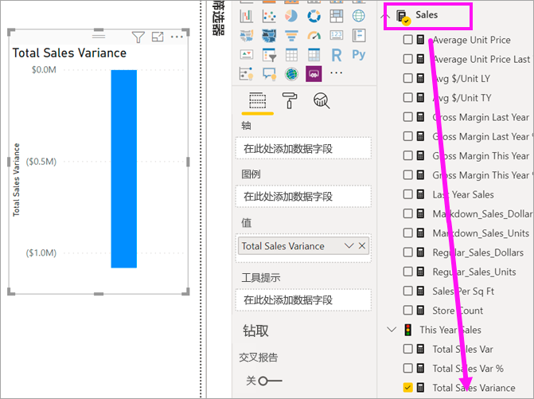
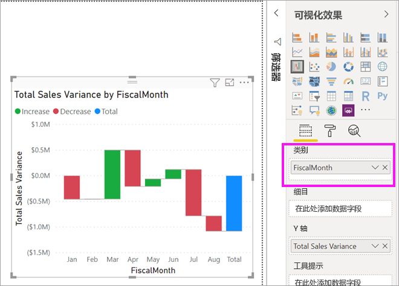
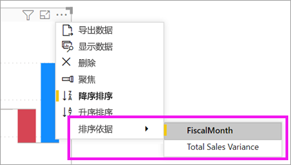
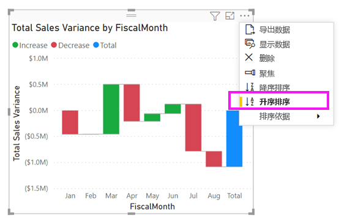
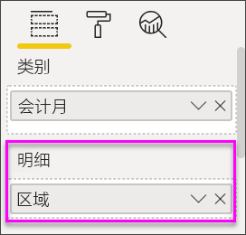
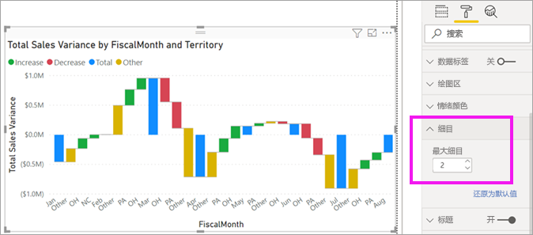

# Power BI 中的瀑布图

[!INCLUDE [power-bi-visuals-desktop-banner](../includes/power-bi-visuals-desktop-banner.md)]

瀑布图显示随 Power BI 加上或减去值而不断变化的总计。 此类图可用于了解一系列正更改和负更改如何影响初始值（如净收入）。

柱形使用颜色编码，这样就可以快速区分增加和减少。 初始值列和最终值列通常[从水平轴开始](https://support.office.com/article/Create-a-waterfall-chart-in-Office-2016-for-Windows-8de1ece4-ff21-4d37-acd7-546f5527f185#BKMK_Float "在水平轴上启动")，而中间值为浮动列。 由于这种样式，瀑布图亦称为“桥图”。

   > [!NOTE]
   > 此视频使用较旧版本的 Power BI Desktop。
   > 
   > 

<iframe width="560" height="315" src="https://www.youtube.com/embed/qKRZPBnaUXM" frameborder="0" allow="autoplay; encrypted-media" allowfullscreen></iframe>

## 何时使用瀑布图

瀑布图适用情况：

* 若要跨时间、序列或不同类别更改度量值。

* 若要审核对总计值有贡献的主要更改。

* 若要通过显示各种收入来源来绘制公司的年利润图，并计算出总利润（或损失）。

* 若要说明一年中公司的起始和结束员工数。

* 若要直观呈现每月收入和支出，以及帐户不断变化的余额。

## 先决条件

本教程使用[零售分析示例 PBIX 文件](https://download.microsoft.com/download/9/6/D/96DDC2FF-2568-491D-AAFA-AFDD6F763AE3/Retail%20Analysis%20Sample%20PBIX.pbix)。

1. 在菜单栏的左上方，选择“文件” > “打开”
   
2. 查找**零售分析示例 PBIX 文件**的副本

1. 在报表视图中打开**零售分析示例 PBIX 文件**。

1. 选择  ，以添加新报表页。

## 创建瀑布图

你将创建按月显示销售额差异（估计销售额与实际销售额）的瀑布图。

### 生成瀑布图

1. 在“字段”窗格中，依次选择“销售额” > “总销售额差异”。

   

1. 选择“瀑布图”图标 

    

1. 依次选择“时间” > “会计月份”，以将它添加到“类别”井中。

    

### 对瀑布图进行排序

1. 请确保 Power BI 按时间顺序（月份）对瀑布图进行排序。 选择图表右上角的“更多选项”(…)。

    对于本示例，请选择“排序依据”并选择“FiscalMonth”。 选择项旁边的黄色指示器指示应用选择选项的时间。

    
    
    若要按时间顺序显示月份，请选择“升序排序”。 与上一步一样，检查“升序排序”的左侧是否有黄色指示器。 这表示正在应用选定的选项。

    

    

    请注意，对于 FiscalMonth，你的图表将按一月至八月排序。  

### 浏览瀑布图

进一步了解每月发生变化的最主要原因。

1.  选择“商店” > “区域”，这会将“区域”添加到“细分”存储桶中。

    

    Power BI 使用“细分”中的值将其他数据添加到可视化效果中。 Power BI 按月将前五个影响因素添加到每个会计月的增减变化中。 例如，这意味着二月份有六个数据点，而不是只有一个。  

    

    假设你只关注前两个影响因素。

1. 在“格式”窗格中，选择“细目”，并将“最大细目数”设置为“2”。

    

    快速审阅发现，在瀑布图中，俄亥俄州和宾夕法尼亚州是正负变化的最大两个影响因素。

    

## 后续步骤

* [更改 Power BI 报表中视觉对象的交互方式](../service-reports-visual-interactions.md)

* [Power BI 中的可视化效果类型](power-bi-visualization-types-for-reports-and-q-and-a.md)
