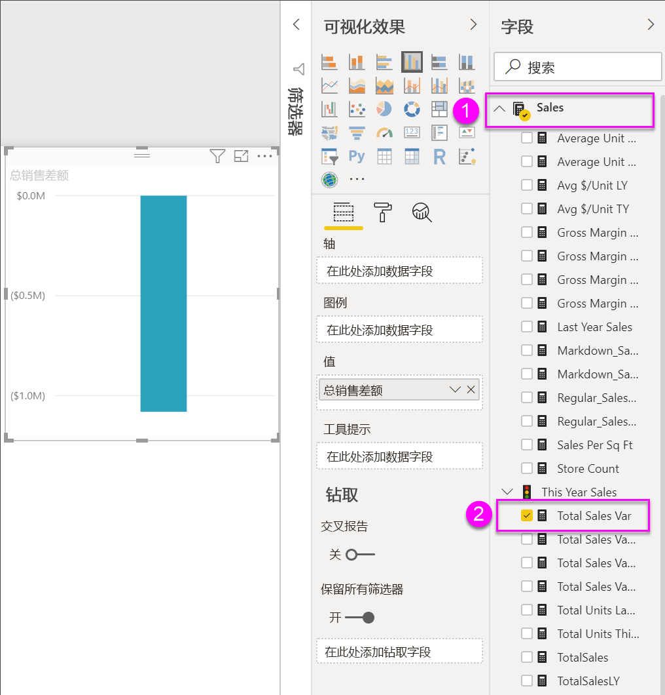
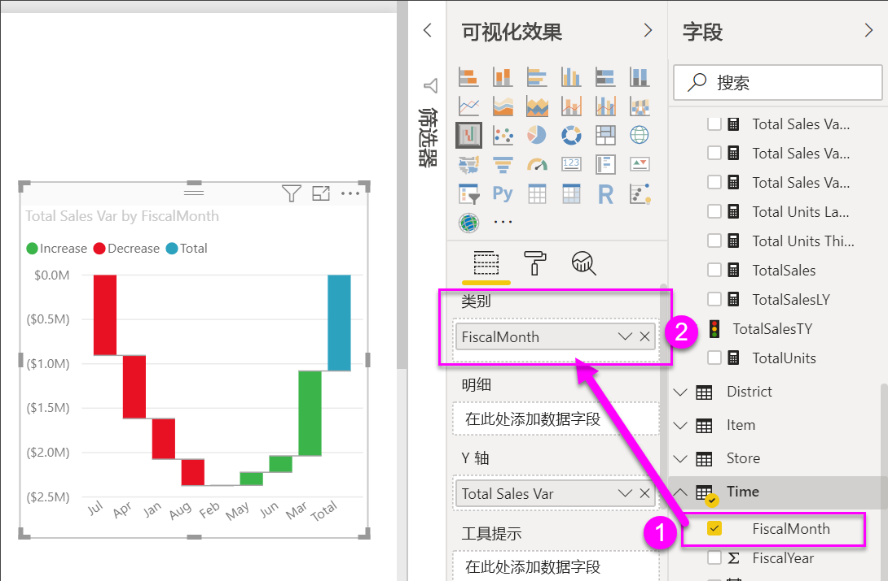
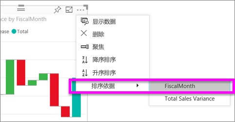

# Power BI 中的瀑布图

瀑布图显示随 Power BI 加上或减去值而不断变化的总计。 此类图可用于了解一系列正更改和负更改如何影响初始值（如净收入）。

柱形使用颜色编码，这样就可以快速区分增加和减少。 初始值列和最终值列通常[从水平轴开始](https://support.office.com/article/Create-a-waterfall-chart-in-Office-2016-for-Windows-8de1ece4-ff21-4d37-acd7-546f5527f185#BKMK_Float "从水平轴开始")，而中间值为浮动列。 由于这种样式，瀑布图亦称为“桥图”。

<iframe width="560" height="315" src="https://www.youtube.com/embed/qKRZPBnaUXM" frameborder="0" allow="autoplay; encrypted-media" allowfullscreen></iframe>

## 何时使用瀑布图

瀑布图适用情况：

* 若要跨时间、序列或不同类别更改度量值。

* 若要审核对总计值有贡献的主要更改。

* 若要通过显示各种收入来源来绘制公司的年利润图，并计算出总利润（或损失）。

* 若要说明一年中公司的起始和结束员工数。

* 若要直观呈现每月收入和支出，以及帐户不断变化的余额。

## 先决条件

* Power BI 服务或 Power BI Desktop

* “零售分析示例”报表

## 获取“零售分析示例”报表

以下说明使用零售分析示例。 创建可视化效果需要对数据集和报表拥有编辑权限。 幸运的是，所有 Power BI 示例都是可以编辑的。 如果有人与你共享报表，你无法在报表中创建可视化效果。 若要跟着本教程一起操作，请获取[“零售分析示例”报表](../sample-datasets.md)。

获取“零售分析示例”  数据集后，可以开始操作了。

## 创建瀑布图

你将创建按月显示销售额差异（估计销售额与实际销售额）的瀑布图。

1. 在“我的工作区”  中，依次选择“数据集”   > “创建报表”  。

    

1. 在“字段”  窗格中，依次选择“销售额”   > “总销售额差异”  。

   

1. 选择“瀑布图”图标  ，以将图表转换为瀑布图。

    如果“总销售额差异”  不在“Y 轴”  区域中，请将它拖到其中。

    

1. 依次选择“时间”   > “会计月份”  ，以将它添加到“类别”  井中。

    

1. 请确保 Power BI 是按时间顺序对瀑布图进行排序的。 选择瀑布图右上角的省略号 (...)。

    检查“按升序排序”  和“会计月份”  选项的左侧是否有黄色指示器

    

    还可以查看 X 轴值，看看它们是否是按从 1 月  到 8 月  的顺序排序。

    进一步了解每月发生变化的最主要原因。

1. 将“应用商店”   > “区域”  拖动到“细目”  桶中。

    

    默认情况下，Power BI 按月将前五个影响因素添加到增加变化或减少变化中。

    

    你只关注前两个影响因素。

1. 在“格式”  窗格中，选择“细目”  ，并将“最大细目数”  设置为“2”  。

    

    快速审阅发现，在瀑布图中，俄亥俄州和宾夕法尼亚州是正负变化的最大两个影响因素。

    

    这个结果很有意思。 俄亥俄州和宾夕法尼亚州有如此显著的影响，是不是因为这两个区域的销售额远高于其他区域？ 你可以验证一下。

1. 创建一个按区域显示今年和去年销售额的地图。

    

    地图支持你的理论。 地图显示，这两个区域去年（气泡大小）和今年（气泡底纹）的销售额最高。

## 突出显示和交叉筛选

若要了解如何使用“筛选器”  窗格，请参阅[在编辑视图中向报表添加筛选器](../power-bi-report-add-filter.md)。

突出显示瀑布图中的柱形可交叉筛选报表页上的其他可视化效果，反之亦然。 不过，“总计”  柱形不会触发突出显示或响应交叉筛选。

## 后续步骤

* [更改 Power BI 报表中视觉对象的交互方式](../service-reports-visual-interactions.md)

* [Power BI 中的可视化效果类型](power-bi-visualization-types-for-reports-and-q-and-a.md)
