# 在 Power BI 中创建 ArcGIS 地图

[!INCLUDE[consumer-appliesto-yyyn](../includes/consumer-appliesto-yyyn.md)]    

> [!NOTE]
> 可以在 Power BI Desktop 和 Power BI 服务中创建并查看这些视觉对象。 本文中的步骤和图示来自 Power BI Desktop。

本概述是从 ArcGIS Maps for Power BI 创建者的角度撰写的。 设计者与同事共享 ArcGIS Map for Power BI 地图后，此同事便可以查看相应的地图并与之交互，但无法保存更改。 若要详细了解如何查看 ArcGIS 地图，请参阅[浏览 ArcGIS Maps for Power BI](https://doc.arcgis.com/en/maps-for-powerbi/use/explore-maps.htm)。

ArcGIS 地图和 Power BI 的结合将超越地图点表示法的地图绘制技术提升到全新水平。 从基本地图、位置类型、主题、符号样式和引用层中进行选择，创建丰富多彩的信息性地图可视化效果。 地图上权威数据层与空间分析的结合可传达出可视化效果中数据的更深层次的理解。 虽然无法在移动设备上创建 ArcGIS Maps for Power BI 地图，但可以查看它并与之交互。

> [!NOTE]
> ArcGIS Maps for Power BI 暂无法用于 Power BI 报表服务器。

> [!TIP]
> GIS 指的是地理信息系统。

下面的示例使用深灰色画布针对 2016 年可支配收入中间值的人口统计层以热度地图形式显示区域销售情况。 随着继续往下阅读，你将会发现使用 ArcGIS Maps for Power BI 可提供增强的地图功能、人口统计数据和更具吸引力的地图可视化效果，这样就可以最有效的方式传递信息。

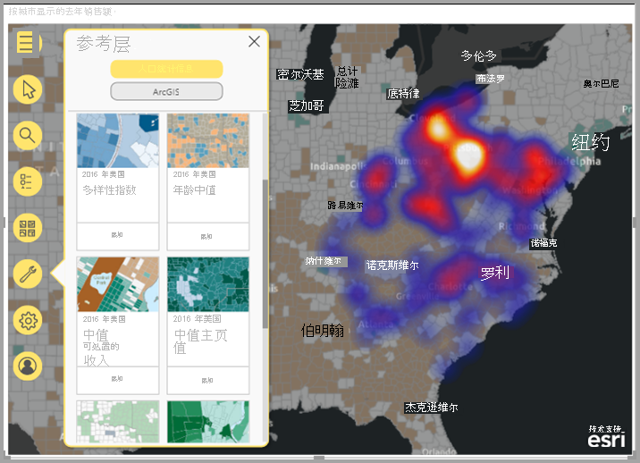

> [!TIP]
> 请访问 [Esri 上的 ArcGIS Maps for Power BI 页](https://www.esri.com/powerbi)，以查看多个示例，并阅读用户感言。 还请查看 Esri 上的 [ArcGIS Maps for Power BI 联机](https://doc.arcgis.com/en/maps-for-powerbi/get-started/about-maps-for-power-bi.htm)帮助。

## 用户同意

ArcGIS Maps for Power BI 是由 Esri ([https://www.esri.com](https://www.esri.com/)) 提供。 使用 ArcGIS Maps for Power BI 时，必须遵守 Esri 的[条款](https://go.microsoft.com/fwlink/?LinkID=826322)和[隐私策略](https://go.microsoft.com/fwlink/?LinkID=826323)。 若要使用 ArcGIS Maps for Power BI 视觉对象，Power BI 用户必须接受同意对话框。 此对话框只会在你首次使用 ArcGIS Maps for Power BI 时显示。

## 先决条件

本教程使用 Power BI Desktop 和 PBIX [零售分析示例](https://download.microsoft.com/download/9/6/D/96DDC2FF-2568-491D-AAFA-AFDD6F763AE3/Retail%20Analysis%20Sample%20PBIX.pbix)。 还可以使用 Power BI 服务创建 ArcGIS Maps for Power BI。

1. 在菜单栏的左上角，依次选择“文件” > “打开报表”。
2. 查找保存在本地计算机中的 PBIX 文件 Retail Analysis Sample。
3. 在报表视图  中，打开“Retail Analysis Sample”。
4. 选择  向报表添加新报表页。

## 创建 ArcGIS Maps for Power BI 地图可视化效果

若要将地图添加到报表中，请按以下步骤操作：

1. 从“可视化效果”窗格中选择 ArcGIS Maps for Power BI 图标。

    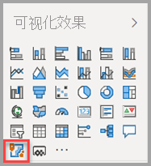

2. Power BI 向报表画布中添加空模板。 在本概述中，我们将使用 Power BI 随附的 Standard 版本。 如果你使用适当的许可登录有效的 ArGIS 帐户，你将有权访问更多功能；有关详细信息，请参阅 [ArcGIS Maps for Power BI 联机帮助](https://doc.arcgis.com/en/maps-for-powerbi/get-started/account-types.htm)。

    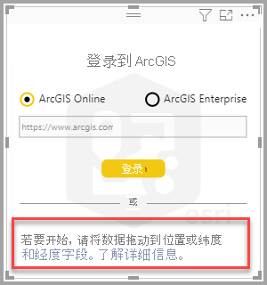

3. 从“字段”窗格中，将数据字段拖到“位置”字段中，或将坐标拖到相应的“纬度”和/或“经度”桶中。 在此示例中，我们使用“存储 > 城市”。

    > [!NOTE]
    > ArcGIS Maps for Power BI 会自动检测你选择的字段是显示为地图上的形状还是显示为点的效果最佳。 可以在设置中调整默认值（请参阅[设置 ArcGIS Maps for Power BI 可视化效果的格式](#format-the-arcgis-maps-for-power-bi-visualization)）。

    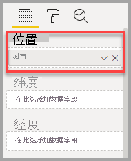

4. 从“字段”窗格中，拖动一个度量值到“大小”框，以调整数据的显示方式。 在本示例中，我们使用“销售额 > 去年销售额”。

    

你已为 Power BI 地图创建第一个 ArcGIS 地图。 现在，让我们使用基本地图、位置类型、主题等改进地图并设置其格式。

## 设置 ArcGIS Maps for Power BI 可视化效果的格式

若要访问 ArcGIS Maps for Power BI 的格式化功能，请执行以下操作：

1. 在“可视化效果”窗格中，单击“格式”选项卡，以查看格式设置选项。

    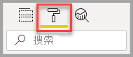

    ArcGIS Maps 格式设置选项包括：

    * 层：更改“层”列表的标题 (ToC)、启用或禁用“层”列表、在地图上定位列表、定义已定位列表的位置。 “层”列表默认是启用的，可通过单击展开的“地图工具”中的  使用。
    * 地图工具：启用或禁用导航工具、将地图范围锁定在其当前位置、定义信息图卡在地图上的位置。 “放大”和“缩小”按钮默认是禁用的。
    * 位置类型：指定数据所在的国家/地区有助于提高地图上位置的准确度。 如果数据位于一个国家/地区中，请从下拉列表中选择此国家/地区。 如果数据是全球的，请选择“世界”。
    * 搜索：启用或禁用“搜索”功能、更改图钉的默认颜色。 “搜索”默认是启用的，可通过单击展开的“地图工具”中的  使用。

### 编辑 ArcGIS Maps for Power BI 地图

当你将数据添加到地图可视化效果后，“地图工具”就可用了。

> [!NOTE]
> 本教程只介绍了 Standard版本 ArcGIS Maps for Power BI 中可用的功能和选项。 如果你使用适当的许可登录有效的 [ArcGIS 帐户](https://doc.arcgis.com/en/maps-for-powerbi/get-started/account-types.htm)，你将有权访问更多功能。

若要展开“地图工具”，请执行以下操作：

1. 单击“地图工具”按钮，以展开工具。

    

“地图工具”展开以显示可用功能。 当选择每个功能时，可打开相应的任务窗格，其中提供详细的选项。

> [!TIP]
> Esri 提供了关于如何使用 ArcGIS Maps for Power BI 的[综合文档](https://go.microsoft.com/fwlink/?LinkID=828772)。

#### 更改基础地图

基础地图为地图中的数据提供了背景或视觉对象上下文。 例如，显示街道的基础地图可以为地址数据提供上下文。 使用 Standard 帐户时，提供了四个基础地图：暗灰色画布、浅灰色画布、OpenStreetMap 和街道。

若要更改基础地图，请按以下步骤操作：

1. 单击“基础地图”按钮 ，以显示库。
2. 选择“Dark Gray Canvas”基础地图。

    

    地图使用新的基础地图进行更新。

有关详细信息，请参阅 ArcGIS Maps for Power BI 联机帮助中的[更改基础地图](https://doc.arcgis.com/en/maps-for-powerbi/design/change-the-basemap.htm)。

#### 显示地图层

在 ArcGIS Maps for Power BI 中，可以通过层处理地理数据。 层是用于创建地图的地理数据的逻辑集合；它们也是地理分析的基础。

若要显示“层”列表，请单击“地图工具”中的“层” 按钮。

“层”列表显示构成地图的每一层，每一层都有自己的一组选项，以帮助你自定义和处理地图。 菜单中显示的选项因所选层的类型而异；例如，可以为使用 Power BI 数据创建的层（如为此示例创建的“城市”层）更改“符号表示法”和“位置类型”，但这些选项不可用于参考层或行驶时间层。

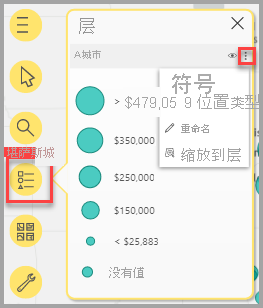

有关详细信息，请参阅 ArcGIS Maps for Power BI 联机帮助中的[使用层](https://doc.arcgis.com/en/maps-for-powerbi/design/work-with-layers.htm)。

#### 指定位置类型

ArcGIS Maps for Power BI 使用其功能强大的地理位置支持技术来准确地在地图上定位数据，并根据数据类型自动将项默认呈现为点或边界。 例如，经纬度坐标呈现为地图上的点，而状态字段则呈现为边界或多边形。 可以通过指定位置类型来更改位置的呈现方式。

使用“位置类型”功能可提高地图上位置的准确度。 可以快速指定位置类型，方法为在可视化效果的“格式”窗格中选择国家/地区（展开“位置类型”类别并选择相应的国家/地区），或使用“层选项”窗格中的完整“位置类型”功能来访问更多选项。

完整“位置类型”功能可通过“层选项”菜单访问，这样除了可以指定数据所在的国家/地区外，还可以选择是将数据表示为点还是表示为边界（多边形）。 边界通常定义为标准地理区域，如国家/地区、省/自治区/直辖市、邮政编码等。 如果你为数据位置选择边界和特定的国家/地区，则可以从各种标准边界（如县、人口普查区、地区或市政当局）中进行选择。 每个国家/地区都有不同的可用位置类型。

若要修改数据的位置类型，请按以下步骤操作：

1. 在“层”列表中，选择要处理的数据层。
2. 单击“层选项”按钮，然后选择“位置类型”。

    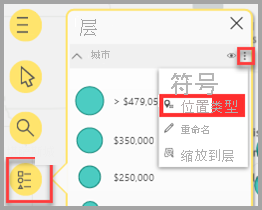

    接受默认值，以将位置呈现为地图上的点，然后依次指定“一个国家/地区”>“美国”。

    

有关详细信息，请参阅 ArcGIS Maps for Power BI 联机帮助中的[指定位置类型](https://doc.arcgis.com/en/maps-for-powerbi/design/specify-location-type.htm)。

#### 自定义地图的符号表示法

ArcGIS Maps for Power BI 使用“字段”窗格中的值来智能地确定它应如何在地图上呈现位置。 通过“符号表示法”功能，可以修改默认样式，以更好地传递信息。 可以选择不同的地图主题，并自定义用于表示地图上的位置的符号和颜色。 可用的地图主题和样式选项因你添加到地图视觉对象的“字段”窗格中的值而异。

若要更改层的符号表示法，请按以下步骤操作：

1. 在“层”列表中，选择要处理的数据层。

2. 单击“层选项”按钮，然后选择“符号表示法”。

此时，“符号表示法”窗格显示，其中展开了“地图主题”类别。

##### 更改地图主题

在此示例中，由于我们已将值添加到“位置”和“大小”字段，因此地图默认使用“大小”主题。

若要更改地图主题，请按以下步骤操作：

1. 选择一些其他的地图主题，以查看地图是如何变化的。

    

2. 选择“大小”主题。

有关详细信息，请参阅 ArcGIS Maps for Power BI 联机帮助中的[更改地图主题](https://doc.arcgis.com/en/maps-for-powerbi/design/change-the-map-theme.htm)。

##### 层透明度

如果地图包含多个层，那么用某种程度的透明度来呈现层会很有用，这样其他层上的项就仍然可见。

若要设置层的透明度值，请按以下步骤操作：

1. 在“符号表示法”窗格中，展开“透明度”类别。

2. 在文本框中键入百分比，或将滑块向左（不太透明）或向右（更透明）滑动。

##### 符号样式

使用符号样式，可以微调数据在地图上的呈现方式。 默认符号样式基于所选的“位置类型”和“地图主题”，可用的样式选项因哪些字段井包含值以及这些值的性质而异。

若要更改符号样式，请按以下步骤操作：

1. 在“符号表示法”窗格中，展开“符号样式”类别。

2. 根据需要更改符号设置。 选择符号形状、颜色、透明度和边框颜色、粗细和透明度。 展开“符号大小”类别可以更改这些选项；显示的选项因数据性质和所选的地图主题而异。

    下面的示例展示了如何将地图主题设置为“大小”，以及对透明度、样式和大小进行多项符号样式调整。

    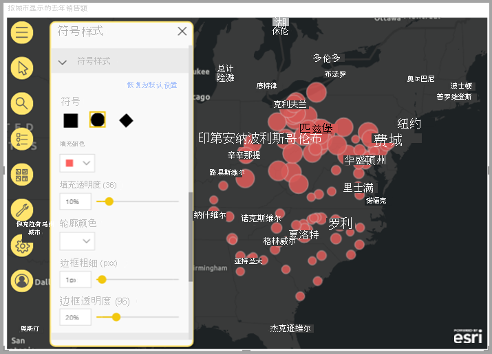

3. 设置完样式选项后，关闭“符号表示法”窗格。

### 分析数据

ArcGIS Maps for Power BI 提供了多种工具，可便于你发现数据中的模式，并使用地图有吸引力地传递信息。

分析功能包括：

- 在地图上选择位置
- 搜索特定地址、位置或兴趣点
- 添加参考层来提供更多上下文
- 在指定的半径或行驶时间区域内查找位置
- 添加卡来显示地图上所显示的区域的人口统计详细信息

#### 选择位置

ArcGIS Maps for Power BI 提供了几种不同的选择工具来帮助你在地图上选择位置。 显示的工具因当前在“层”列表中选择的层类型而异。

若要显示选择工具，请按以下步骤操作：

1. 在“地图工具”中，单击“选择工具”按钮 ，以展开工具集。

    有四种选择工具可用；“选择工具”菜单中显示的工具因当前处于活动状态的层的类型而异。 由于此示例中的地图只包含数据层，因此只显示“单项选择”和“框选择”工具。
    
    | **工具** | **说明** |
    | --- | --- |
    |  | 单项选择 - 这是可用于单击各个位置的“单项选择”工具；它是默认的选择工具。 按 Ctrl 并单击可以选择多个位置。单击地图上的数据位置会选择它们，并触发与其他可视化效果的交互。单击参考层上的图钉或位置会显示它的工具提示。 |
    |   | 框选择 - 拖动矩形选择器可以选择多个位置，也可以通过单击各个位置来选择它们。与“单项选择”工具一样，单击参考层上的图钉或位置也会显示它的工具提示。当“框选择”工具处于活动状态时，无法平移地图。 |
    |   | 参考层选择 - 如果已向地图添加[参考层](https://doc.arcgis.com/en/maps-for-powerbi/design/add-a-reference-layer.htm)，则使用此工具通过单击参考层上的区域来选择位置。 参考层上定界区域内的位置会突出显示；地图上其他区域中的位置不可用。仅当地图包含一个或多个参考层，且参考层当前处于活动状态时，此工具才会显示。 |
    |   | 行驶时间选择 - 如果已向地图添加[行驶时间区域](https://doc.arcgis.com/en/maps-for-powerbi/design/find-nearby-locations.htm)，则使用行驶时间区域选择工具来选择所定义区域内的数据位置。 |
    
2. 选择地图上的一个或多个位置。 一次最多可以选择 250 个数据点。

有关详细信息，请参阅 ArcGIS Maps for Power BI 联机帮助中的[在地图上选择位置](https://doc.arcgis.com/en/maps-for-powerbi/design/select-features-on-the-map.htm)。

#### 固定位置

在地图上固定特定地址、位置或兴趣点。 对于此示例，你将搜索 Pittsburgh International Airport。

若要固定位置，请按以下步骤操作：

1. 在“地图工具”中，单击“搜索”按钮 ，以打开“搜索”窗格。
2. 在搜索框中，键入关键字“Pittsburgh international”。

    关键字可以包括地址、位置或兴趣点。 当你键入时，类似的最近搜索或基于类似关键字的建议就会出现。

3. 从结果列表中，选择“Pittsburgh International Airport”，然后单击“关闭”。

    地图上会显示一个符号，并会自动缩放到相应位置。 图钉只在当前会话期间保留在地图上；无法将已固定的位置与地图一起保存。 已固定的位置也作为“层”列表中的层显示；你可以重命名此层、显示或隐藏它，也可以将它从地图中删除，就像可以对其他层执行的操作一样。

4. 若要更改图钉的颜色，请在地图视觉对象的“格式”窗格中展开“搜索”类别，然后选择新颜色。

> [!NOTE]
> “搜索”功能取代了 ArcGIS Maps for Power BI 中之前提供的“图钉”功能。

有关详细信息，请参阅 ArcGIS Maps for Power BI 联机帮助中的[固定位置](https://doc.arcgis.com/en/maps-for-powerbi/design/pin-locations.htm)。

#### 添加引用层

参考层为已经显示在地图上的 Power BI 数据提供上下文。 参考层可以包括人口统计数据，如家庭收入、年龄或受教育程度。 还可以包括 ArcGIS Online 上公开共享的特征层，这些特征层可以提供关于地图上位置的周围区域的更多信息。

##### 添加人口统计层

Standard 版本 ArcGIS Maps for Power BI 帐户包括精选的美国人口统计层，这些层有助于对 PowerBI 中的数据进行情境化。

若要添加人口统计层，请按以下步骤操作：

1. 在“地图工具”中，单击“分析工具”按钮 ，以展开工具集。
2. 单击“参考层”按钮 。

    此时，“参考层”窗格出现，其中显示“人口统计”选项卡及其选择的层。

3. 滚动库，然后单击要添加到地图中的层的缩略图上的“添加”。

    对于此示例，查找“2016 USA Average Household Income”层，然后单击“添加”。
    
    此时，地图更新为显示新层。
    
    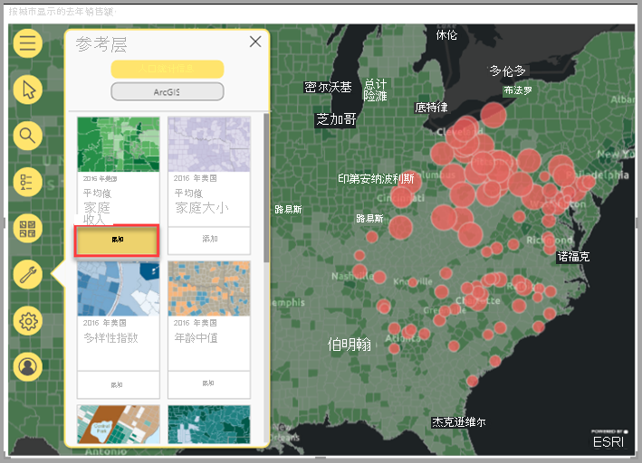
    
人口统计参考层是交互式的；单击区域可以查看包含详细信息的工具提示。 也可以使用“参考层选择”工具，[在地图上选择属于参考层的区域](https://doc.arcgis.com/en/maps-for-powerbi/design/select-features-on-the-map.htm)。

##### 从 ArcGIS 添加参考层

通过 ArcGIS Maps for Power BI，可以搜索 ArcGIS 上公开共享的特征层，这样就能访问数以千计的参考层，这些层提供了数据层上位置的周围区域的相关信息。 在使用有效的 ArcGIS 帐户登录 ArcGIS Maps for Power BI 后，可以搜索组织中的内容、组织的组或公共内容。 在此示例中，由于你使用的是 Standard 帐户，因此搜索结果中只出现公开共享的内容。

若要添加 ArcGIS 参考层，请按以下步骤操作：

1. 在“参考层”窗格中，单击“ArcGIS”选项卡。

2. 在搜索字段中，键入“USA Congressional districts”，然后按 Enter。

    此时，库中填充了几种可能的结果。

3. 找到“USA 116th Congressional Districts”层，然后单击“添加”。

    此时，地图更新为显示新层。
    
    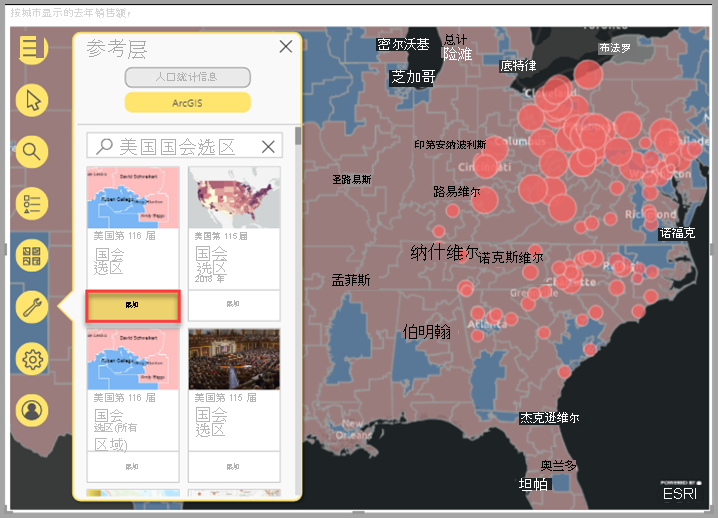
    
ArcGIS 参考层是交互式的；单击区域可以查看包含详细信息的工具提示。 也可以使用“参考层选择”工具，[在地图上选择属于参考层的区域](https://doc.arcgis.com/en/maps-for-powerbi/design/select-features-on-the-map.htm)。

#### 查找附近位置

可以使用地图上的位置（包括已固定的位置）作为在地图上查找并选择附近位置的起点。 例如，如果搜索感兴趣的特定位置，可以在地图上选择位于此位置的指定行驶时间或距离内的位置。

在此示例中，你将使用之前固定的 Pittsburgh International Airport 作为起点，以在距离此机场 100 英里内查找位置。 使用类似的步骤在指定的行驶时间内查找位置。

若要在距离原点特定行驶距离内查找位置，请按以下步骤操作：

1. 在“地图工具”中，单击“分析工具”按钮 ，以展开工具集。

2. 单击“行驶时间”按钮 。

    此时，“行驶时间”窗格显示。

3. 单击“单项选择”工具，然后在地图上选择之前固定的“Pittsburgh International Airport”位置。
4. 从“搜索区域”下拉菜单中，选择“半径”，然后指定“100”英里的距离。
5. 单击“确定”  。

    此时，地图显示以已固定机场位置为圆心的圆圈。 “行驶时间”窗格展开，以显示行驶距离区域的样式选项。
    
    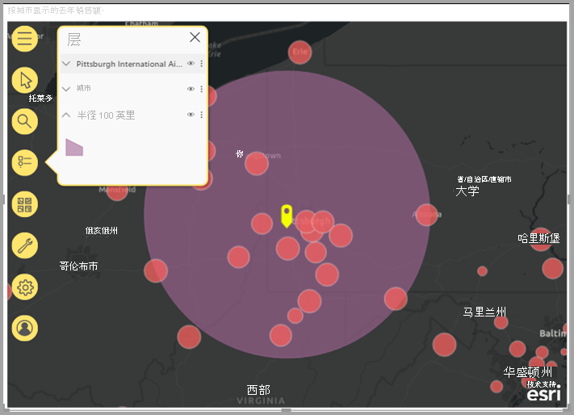
    
    行驶距离区域也作为“层”列表中的层显示；你可以重命名此层、显示或隐藏它，也可以将它从地图中删除，就像可以对其他层执行的操作一样。

6. 当“行驶时间”层在“层”列表中处于活动状态时，使用“行驶时间选择”工具单击行驶距离区域。

    搜索区域内的位置被选择；地图上未被选择的位置会变得更小或更透明。 其他可视化效果更新为反映所选位置。

有关详细信息，请参阅 ArcGIS Maps for Power BI 联机帮助中的[查找附近位置](https://doc.arcgis.com/en/maps-for-powerbi/design/find-nearby-locations.htm)。

#### 添加信息图卡

像参考层一样，信息图卡提供了地图上区域的额外详细信息。 信息图卡位于地图的顶部，并显示紧邻所选位置的周围区域的或当前地图范围中显示的常规区域的特定人口统计信息。 有关详细信息，请参阅 ArcGIS Maps for Power BI 联机帮助中的[添加信息图卡](https://doc.arcgis.com/en/maps-for-powerbi/design/add-infographics.htm)。

### 获取帮助

Esri 提供了关于 ArcGIS Maps for Power BI 的综合联机文档。

若要从可视化效果中访问 ArcGIS Maps for Power BI 联机帮助，请按以下步骤操作：

1. 在“地图工具”中，单击“设置”按钮 。

2. 在“设置”窗格中，单击“帮助”按钮。
3. 在随即显示的确认窗口中，单击“确定”。

    此时，ArcGIS Maps for Power BI 联机帮助在浏览器窗口中打开。
    
    - 在 ArcGIS Maps for Power BI 联机帮助中，查找[常见问题解答](https://doc.arcgis.com/en/maps-for-powerbi/get-started/pbi-faq.htm#anchor5)。
    - 可以在[与 ArcGIS Maps for Power BI 相关的 Power BI 社区对话](https://go.microsoft.com/fwlink/?LinkID=828771)中提问、查找最新信息、报告问题和查找答案。
    - 如果有改进建议，可以将建议提交到 [Power BI 建议列表](https://ideas.powerbi.com/)。
    
### 在组织中管理 ArcGIS Maps for Power BI 的使用

借助 Power BI，设计者、Power BI 管理员和用户管理员可以管理 ArcGIS Maps for Power BI 的使用。 下面各部分概述了每个角色可以执行的操作。

#### 设计器选项

在 Power BI Desktop 中，设计者可以在“安全”选项卡上禁用 ArcGIS Maps for Power BI。先依次选择“文件”  >  “选项和设置”，再依次选择“选项”  >  “安全性”。 禁用后，默认不会加载 ArcGIS Maps。

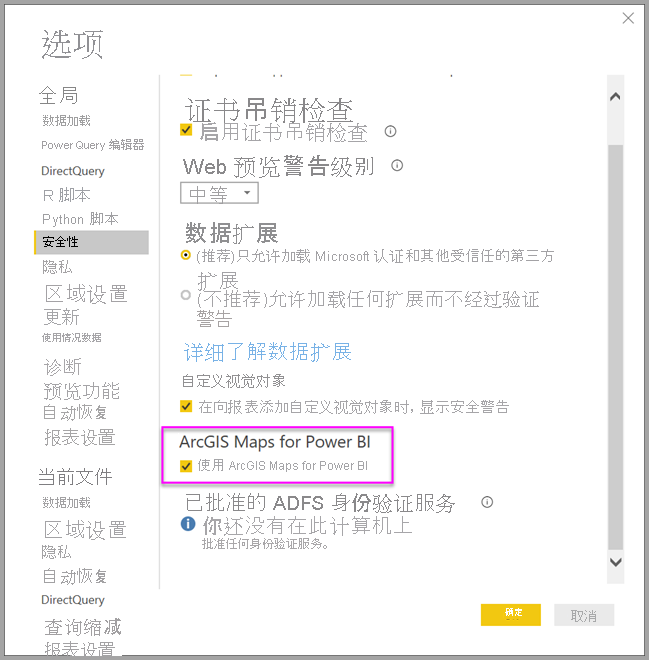

#### 管理员选项

在 Power BI 服务中，管理员可以为所有用户禁用 ArcGIS Maps for Power BI。 选择“设置” > “管理门户” > “租户设置”  。 禁用后，Power BI 不再能在“可视化效果”窗格中显示 ArcGIS Maps for Power BI 图标。

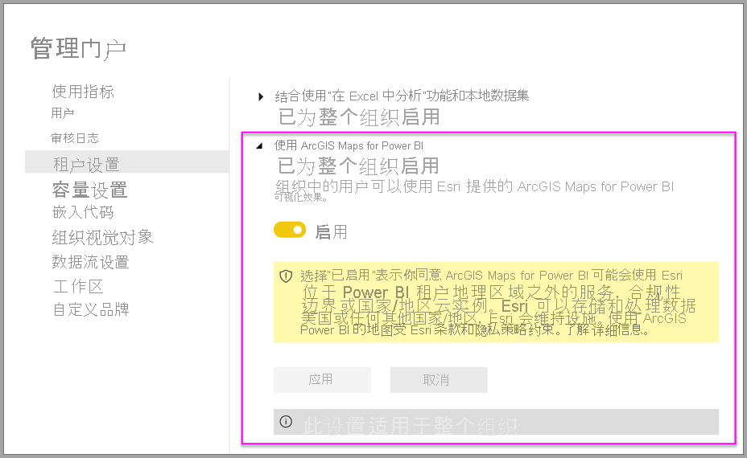

#### 用户管理员选项

Power BI Desktop 支持使用**组策略**在整个组织内的已部署计算机上禁用 ArcGIS Maps for Power BI。

| **Attribute** | **值** |
| --- | --- |
| 密钥 | Software\Policies\Microsoft\Power BI Desktop |
| 值名称 | EnableArcGISMaps |

值为 1（十进制），启用 ArcGIS Maps for Power BI。

如果值为 0（十进制），则禁用 ArcGIS Maps for Power BI。

## 注意事项和限制

以下服务和应用支持适用于 Power BI 的 ArcGIS 地图：

| 服务/应用程序 | 是否支持 |
| --- | --- |
| Power BI Desktop | 是 |
| Power BI 服务 (powerbi.com) | 是 |
| Power BI 移动应用程序\* | 是 |
| Power BI 发布到 Web | 否 |
| Power BI Embedded | 否 |
| Power BI 服务嵌入 (powerbi.com) | 否 |
| Power BI 报表服务器 | 否 |

\*在移动环境中，可以查看使用 Power BI（[Standard 帐户](https://doc.arcgis.com/en/maps-for-powerbi/get-started/account-types.htm)）随附的 ArcGIS Maps for Power BI 可视化效果创建的地图。 移动环境不支持包含 ArcGIS 中高级内容的地图。

在不支持适用于 Power BI 的 ArcGIS 地图的服务或应用中，可视化效果将显示为带 Power BI 徽标的空视觉对象。

下表比较了所有 Power BI 用户可用的标准功能与已登录 ArcGIS 用户可用的标准功能：

|  Standard（Power BI 随附） |   使用 ArcGIS 帐户 |
| --- | --- | --- |
| 基础地图 |
| 4 个基础地图 | 所有 Esri 基础地图，以及对组织的基础地图的访问权限，包括自定义基础地图 |
| 地理编码 |
| 每个地图 3,500 个位置 | 每个地图 10,000 个位置 |
 | 每月 10,000 个位置 | 无月度限制 |
| 引用层 |
| 10 个参考层，其中包含美国人口统计 | 访问 ArcGIS 组织中所有 Web 地图和层 |
 | ArcGIS 中公开共享的特征层 | ArcGIS 中公开共享的特征层 |
 | 访问 ArcGIS Living Atlas of the World 地图和层（特征服务） |
| 信息图 |
| 美国人口统计变量的精选库（7 个类别） | 对 ArcGIS GeoEnrichment 数据浏览器的完全访问权限，包括美国和全球人口统计变量 |
|

## 后续步骤

- [与已与你共享的 ArcGIS 地图交互](https://doc.arcgis.com/en/maps-for-powerbi/use/explore-maps.htm)
- [宣布推出 ArcGIS maps for Power BI 的博客文章](https://www.esri.com/arcgis-blog/?s=#ArcGIS%20Maps%20for%20Power%20BI)最新动态
- 更多问题？ [尝试咨询 Power BI 社区](https://community.powerbi.com/)