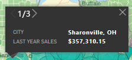
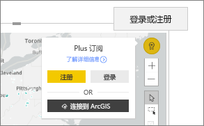

# 在 Power BI 中与 ArcGIS 地图交互
本主题从在 Power BI 服务、Power BI Desktop 或 Power BI 移动版中使用 ArcGIS 地图的人员的角度进行编写。 设计器与你共享 ArcGIS map for Power BI 视觉对象后，便可以通过多种方式与相应视觉对象进行交互。  若要详细了解如何创建 ArcGIS 地图，请参阅 [ESRI ArcGIS 地图教程](../visuals/power-bi-visualization-arcgis.md)。

ArcGIS 地图和 Power BI 的结合将超越地图点表示法的地图绘制技术提升到全新水平。 报表设计器从地图开始，并将人口统计数据层附加到该地图。 将地图上基于此位置的数据层（如人口统计数据）与空间分析相结合，可以让用户更深入地了解可视化效果中的数据。

> [!TIP]
> GIS 指的是地理信息系统。
> 

这幅 ArcGIS map for Power BI 视觉对象按城市显示了去年的销售额，并使用了街道基础地图和平均家庭收入参考层。 此地图包含两个大头针（红色和黄色）和一个驾驶时间半径区域（紫色）。

> [!TIP]
> 请访问 [Power BI 上的 ESRI 页面](https://www.esri.com/powerbi)，查看多个示例并阅读推荐证明。 然后查看 Esri 的 [ArcGIS Maps for Power BI 地图入门页](https://doc.arcgis.com/en/maps-for-powerbi/get-started/about-maps-for-power-bi.htm)。
> 
> 

## 用户须知

同事首次与你共享 ArcGIS 地图时，Power BI 会显示一条许可提示。 ArcGIS Maps for Power BI 由 Esri (https://www.esri.com) 提供，使用 ArcGIS Maps for Power BI 时，必须遵守 Esri 的条款和隐私政策。 若要使用适用于 Power BI 的 ArcGIS 地图视觉对象，Power BI 用户必须接受同意对话框。

## 了解层

ArcGIS Maps for Power BI 视觉对象可以有多种不同类型的人口统计位置信息层。

### 基本地图

每个 ArcGIS Maps for Power BI 视觉对象都从基本地图开始。 将基本地图视为数据的画布。 基本地图可能是基本的深色或浅色画布，

 

或带有街道和交通详情的画布。 

  

基本地图会完全应用于画布，当进行平移和缩放时，地图将更新。 放大可查看更加详细的街道和交通信息。 从一个洲平移到另一个洲，详细程度保持不变。 现在，我们已从波尔图平移到北京。

  

### 引用层

报表“设计器”可以添加一个引用层  。 参考层由 Esri 托管，并提供有关位置的附加人口统计信息层。 下面的示例具有一个人口密度引用层。 较深的颜色代表较高的密度。

  

### 信息图

报表“设计器”可以添加多个信息图层  。 信息图是显示在视觉对象画布右侧的快速可视指示器。 信息图由 Esri 托管，并提供有关位置的附加人口统计信息层。 下面的示例应用了三个信息图。 它们不会显示在地图上，而是显示在卡片上。 当你缩放、平移并选择地图上的区域时，信息图卡就会更新。

  

### 固定

别针表示精确的位置，如城市或地址。 有时，“设计器”报表使用具有驾驶时间半径的别针  。 此示例显示北卡罗来纳州夏洛特 50 英里半径内的商店。

 

## 与 ArcGIS Maps for Power BI 视觉对象交互
可以使用的功能取决于与你共享报表的方式和 Power BI 帐户类型。 如果有疑问，请与系统管理员联系。 ArcGIS Maps for Power BI 视觉对象的行为与报表中的其他视觉对象非常相似。 你将能够[显示用于创建可视化效果的数据](../consumer/end-user-show-data.md)，在[焦点模式和全屏模式](../consumer/end-user-focus.md)中查看地图，通过“设计器”报表[添加注释](../consumer/end-user-comment.md)、[与筛选器进行交互](../consumer/end-user-report-filter.md)等等  。 ArcGIS 视觉对象可以交叉筛选报表页面上的其他视觉对象，反之亦然。

将鼠标悬停在基本地图位置（例如，气泡）上以显示工具提示。 此外，使用 ArcGIS 视觉对象选择工具显示其他工具提示，并在基本地图或参考层上进行特定选择。  

### 选择工具

ArcGIS Maps for Power BI 有五种选择模式。 一次最多可选择 250 个数据点。

#### 单项选择工具

 

从引用层中选择数据点、气泡、别针或单个数据点。 Power BI 将显示一个工具提示，其中包含有关所选内容的详细信息。 根据你的选择，单项选择交叉筛选报表页面上的其他视觉效果，并更新所选区域的信息图卡。 

现在，我们从基本地图中选择了一个棕色气泡数据点。 Power BI：
- 突出显示所选内容，
- 显示该数据点的工具提示， 
- 更新信息图卡以显示我们选择的数据，以及
- 交叉高亮显示柱形图。

如果地图有引用层，请选择要在工具提示中显示详细信息的位置。 在这里，我们选择了 Seneca 县，并从“设计器”报表添加到地图的引用层（人口密度）中查看数据  。 在此示例中，我们的数据点包括两个不同的县，因此我们的工具提示有两页。 每页都有一个图表。 选择图表上的条形图以显示其他详细信息。 

> [!TIP]
  > 有时，可以通过放大以选择特定位置来减少工具提示页的数目。  否则，如果位置重叠，Power BI 可能会一次显示多个工具提示。 选择箭头可以切换工具提示
  > 
  > 

#### 多选工具

 

在地图上绘制一个矩形框来选择包含的数据点。 按 CTRL 可以选择多个矩形区域。 “多选”将更新所选区域的信息图卡，并根据所选内容交叉突出显示报表页上的其他视觉对象。

 

#### 引用层工具

 

利用引用层中的边界或多边形来选择所包含的数据点。 很难看到，但是引用层有一个黄色的轮廓。 与单项选择工具不同，我们没有工具提示。 但我们具有该轮廓的边界内包含的任何数据点的相关数据。 在此示例中，我们的选择确实包含一个用于 Winston Salem 的 Lindseys 商店的数据点。

 

#### 缓冲区工具

 

允许使用缓冲层选择数据点。 例如，使用此工具选择驾驶时间半径并继续与报表的其余部分交互。 驾驶时间半径保持活动状态，信息图卡继续反映驾驶时间半径，但选择地图上的其他数据点会交叉筛选报表页上的其他视觉对象。

 

#### “查找相似”工具

 

允许查找具有相似属性的位置。 首选一个或多个兴趣点或引用位置，定义最多五个要在分析中使用的维度。 “查找相似”，然后计算地图上与你定义的引用位置最相似的 10 个位置。 然后，你可以使用信息图卡详细了解每个结果的人口统计信息，创建驾驶时间区域以了解这些位置的驾驶距离范围内的信息，甚至可以使用“查找相似”工具本身筛选报表并获得更多见解。 最重要的是，所有计算都在计算机本地完成，因此可以确保机密数据仍然受到保护。

## 注意事项和限制
以下服务和应用支持适用于 Power BI 的 ArcGIS 地图：

|服务/应用  |是否支持  |
|---------|---------|
|Power BI Desktop     |     是    |
|Power BI 服务 (app.powerbi.com)     |    是     |
|Power BI 移动应用程序     |  是      |
|Power BI 发布到 Web     |  否       |
|Power BI Embedded     |     否    |
|Power BI 服务嵌入 (PowerBI.com)  | 否 |

## ArcGIS Maps for Power BI 如何运作？
ArcGIS Maps for Power BI 由 Esri (https://www.esri.com) 提供。 使用 ArcGIS Maps for Power BI 时，必须遵守 Esri 的[条款](https://go.microsoft.com/fwlink/?LinkID=8263222)和[隐私策略](https://go.microsoft.com/fwlink/?LinkID=826323)。 Power BI 用户如果希望使用适用于 Power BI 的 ArcGIS 地图视觉对象，则需要接受同意对话框（有关详细信息，请参阅《用户同意》）。  使用 Esri 的 ArcGIS Maps for Power BI 时，必须遵守 Esri 的条款和隐私策略，同意对话框具有相关链接。 每个用户在首次使用 ArcGIS Maps for Power BI 之前，必须同意条款和隐私策略。 一旦用户接受同意，绑定到视觉对象的数据至少会发送到 Esri 的服务以进行地理编码，这意味着将位置信息转换为可以在地图中表示经度和纬度的信息。 应该假定可以将绑定到数据可视化效果的任意数据发送到 Esri 的服务。 Esri 提供基本地图、空间分析和地理编码之类的服务。ArcGIS Maps for Power BI 视觉对象与使用 SSL 连接的这些服务进行交互，该连接由 Esri 提供和维护的证书保护。 可以从 Esri 的 [ArcGIS Maps for Power BI 产品页](https://www.esri.com/powerbi)获取 ArcGIS Maps for Power BI 的其他信息。

### Power BI Plus

当用户通过 ArcGIS Maps for Power BI 注册由 Esri 提供的 Plus 订阅时，他们与 Esri 建立了直接关系。 Power BI 不向 Esri 发送有关用户的个人信息。 用户使用自己的 AAD 身份登录并信任 Esri 提供的 AAD 应用程序。 通过此操作，用户直接与 Esri 共享其个人信息。 一旦用户将 Plus 内容添加到 ArcGIS Maps for Power BI 视觉对象，想要查看或编辑该视觉对象的同事也需要 Esri 的 Plus 订阅。 

有关 ArcGIS Maps for Power BI 的工作原理的详细技术问题，请通过其支持站点与 Esri 联系。

## 注意事项和疑难解答

**ArcGIS 地图未显示**    
在不支持适用于 Power BI 的 ArcGIS 地图的服务或应用中，可视化效果将显示为带 Power BI 徽标的空视觉对象。

**地图上并非显示我的所有信息**    
在地图上对维度/经度进行地理编码时，将显示最多 30,000 个数据点。 在对邮政编码或街道地址等数据点进行地理编码时，将仅对前 15,000 个数据点进行编码。 对地名或国家/地区进行地理编码时，没有前 1500 个地址限制。

使用适用于 Power BI 的 ArcGIS 地图需要付费吗？ 

所有 Power BI 用户都可以使用适用于 Power BI 的 ArcGIS 地图，无需额外付费。 此组件由 Esri  提供，应在本文前面所述的由 Esri  提供的使用条款及隐私政策的限制下使用此组件。 如果订阅 ArcGIS Plus  ，将收取费用。

**我看到关于缓存已满的错误消息**

此行为是要解决的 bug。  在此期间，请选择错误消息中的链接，了解如何清除 Power BI 缓存。

是否能够离线查看 ArcGIS 地图？ 

否，Power BI 需要网络连接才能显示地图。

## 后续步骤
获取帮助：Esri  针对 ArcGIS Maps for Power BI  的功能集提供[综合文档](https://go.microsoft.com/fwlink/?LinkID=828772)。

可以在 [Power BI 社区中与**适用于 Power BI 的 ArcGIS 地图**相关的帖子](https://go.microsoft.com/fwlink/?LinkID=828771)中提问题和查找最新信息，报告问题并查找答案。

[适用于 Power BI 的 ArcGIS 地图产品页](https://www.esri.com/powerbi)
