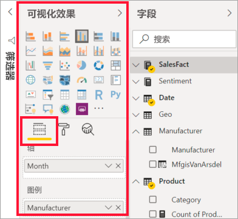
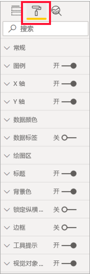
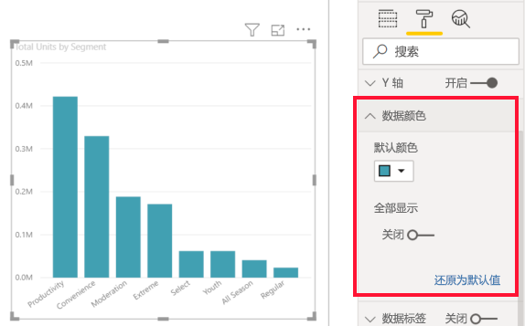
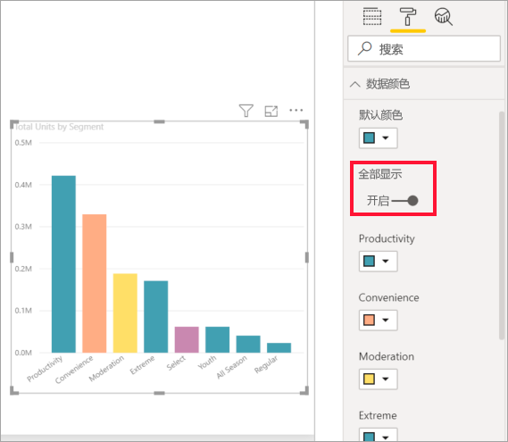
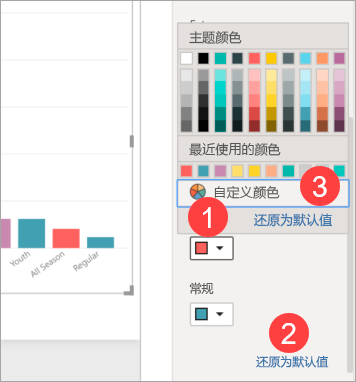
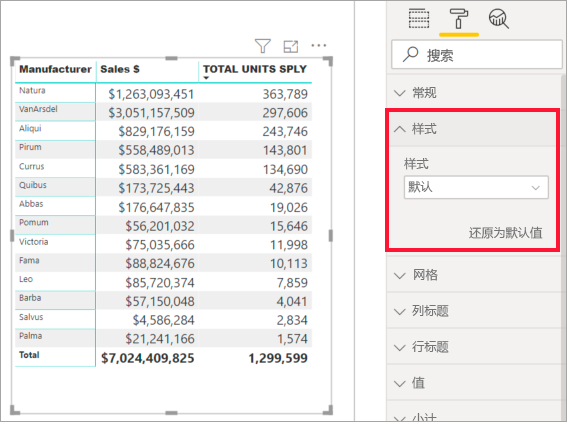
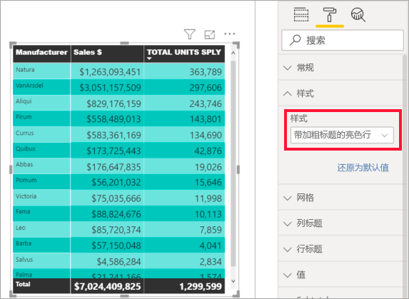
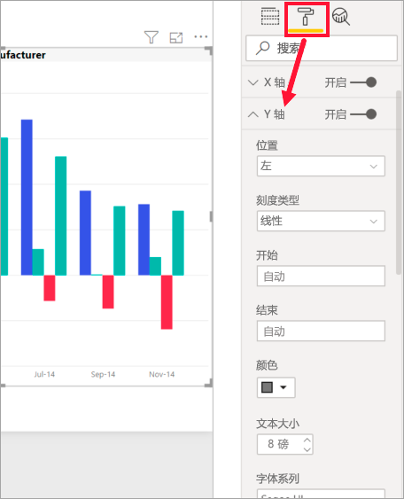
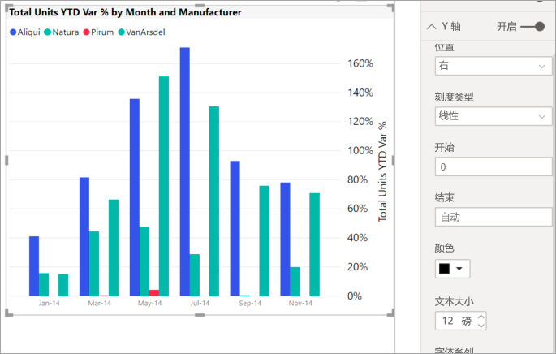

# “格式设置”窗格入门
如果对报表具有编辑权限，则可以使用许多可用的格式设置选项。 在 Power BI 报表中，可以更改数据系列、数据点的颜色，甚至可以更改可视化效果的背景。 可以更改 x 轴和 y 轴的显示方式。 甚至可以对可视化效果、形状和标题的字体属性进行格式设置。 使用 Power BI，你可以全面控制报表的显示方式。

若要开始，请在 Power BI Desktop 或 Power BI 服务中打开报表。 两者都提供几乎相同的格式设置选项。 在 Power BI 服务中打开报表时，请确保从菜单栏中选择“编辑”  。 

在编辑报表时，选中可视化效果后，将显示“可视化效果”  窗格。 可使用此窗格更改可视化效果。 “可视化效果”的正下方有三个图标：“字段”图标（叠放的条形）、“格式”图标（滚动油漆刷）和“分析”图标（放大镜）。     以下图像中，“字段”  图标处于选中状态，图标下方以黄色栏指示。

当选择“格式”  时，图标下方的区域将显示适用于当前所选可视化效果的自定义选项。  

可以自定义每个可视化效果的多个元素。 可用选项取决于所选视觉对象。 其中一些选项包括：

* 图例
* X 轴
* Y 轴
* 数据颜色
* 数据标签
* 形状
* 绘图区
* 标题
* 背景
* 锁定纵横比
* 边框
* 工具提示
* 视觉对象标头
* 形状
* 位置    
等等。

> [!NOTE]
>  
> 你将不会看到每个可视化效果类型的所有这些元素。 你选择的可视化效果将会对可用的自定义项有影响；例如，如果你选择了饼图，则不会看到 X 轴，因为饼图没有 X 轴。

另请注意，如果没有选择任何可视化效果，**筛选器**将会在图标的位置出现，这让你可以将筛选器应用于页面上的所有可视化效果。

了解如何使用“格式设置”选项的最佳方式是试用它们。可以随时撤消更改或还原为默认值。 我们提供了大量的可用选项，并会持续添加新选项。 一篇文章无法介绍所有格式设置选项。 但作为入门指引，让我们一起看看其中几个选项吧。 

1. 更改视觉对象中使用的颜色   
2. 应用样式    
3. 更改轴属性    
4. 添加数据标签    

## 处理颜色

让我们逐步完成自定义可视化效果颜色所必需的步骤。

1. 选择可视化组件并将其激活。

2. 选择滚动油漆刷图标，打开“格式”选项卡。“格式设置”选项卡显示了对所选视觉对象可用的所有格式设置元素。

    

3. 选择“数据颜色”  以展开其可用自定义项。  

    

4. 将“全部显示”  切换为“开”，并为各列选择不同的颜色。

    

下面介绍处理颜色的一些有用提示。 下面列表中的数字也会在以下屏幕上显示，用于指示可以访问或更改这些有用元素的位置。

1. 不喜欢这个颜色？ 没关系，只需选择“还原为默认值”  ，所选内容就会恢复为默认设置。 

2. 不喜欢任何颜色更改？ 从“数据颜色”选区的底部选择“还原为默认值”，即可将所有颜色还原为默认设置。   

3. 想要调色板中没有的颜色？ 只需选择**自定义颜色**，然后从色谱进行选择即可。  

   

不喜欢你刚刚进行的更改？ 使用 **CTRL+Z** 撤销操作，就像你之前操作的那样。

## 向表应用样式
某些 Power BI 可视化效果具有“样式”  选项。 一键单击，即可同时向可视化效果应用一组格式设置选项。 

1. 选择表或矩阵以将其激活。   
1. 打开“格式设置”选项卡并选择“样式”。 

   

1. 从下拉列表中选择样式。 

   

即使在应用样式后，也可继续对该可视化效果的各属性（包括颜色）进行格式设置。

## 更改轴属性

修改 X 轴或 Y 轴通常很有用。 与处理颜色类似，可以通过选择想要更改的轴的左侧的向下箭头来修改轴，如下图所示。  

在以下示例中，我们对 Y 轴进行了以下格式设置：
- 将标签移动到可视化效果右侧

- 将起始值改为零

- 将标签字体颜色改为黑色

- 将标签字号增大到 12

- 添加 Y 轴标题

    

通过切换“X 轴”或“Y 轴”旁边的单选按钮，可以完全删除轴标签。   还可以通过选择**标题**旁的单选按钮来选择是否打开或关闭轴标题。  

## 添加数据标签    

在你开始自行探索之前，我们再看最后一个格式设置示例。  向分区图添加数据标签。 

这是进行格式设置之前的图片  。 

这是进行格式设置之后的图片  。

我们选择了可视化效果以使其处于活动状态，并打开了“格式设置”选项卡。我们选择了“数据标签”  并将其打开。 然后，将字号增加到 12，将字体系列改为 Arial Black，将“显示背景”  设置为“开”，并将背景色改为白色、透明度 5%。

以上只是可以进行的格式设置任务中的少数几个。 在“编辑”模式下打开报表，并任意探索“格式设置”窗格，可创建外观精美、信息丰富的可视化效果。

## 后续步骤
有关详细信息，请参阅以下文章：  

* [Power BI 中颜色格式设置的提示和技巧](service-tips-and-tricks-for-color-formatting.md)  
* [表格中的条件格式设置](../desktop-conditional-table-formatting.md)

