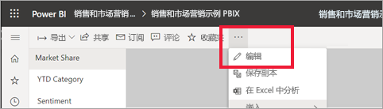
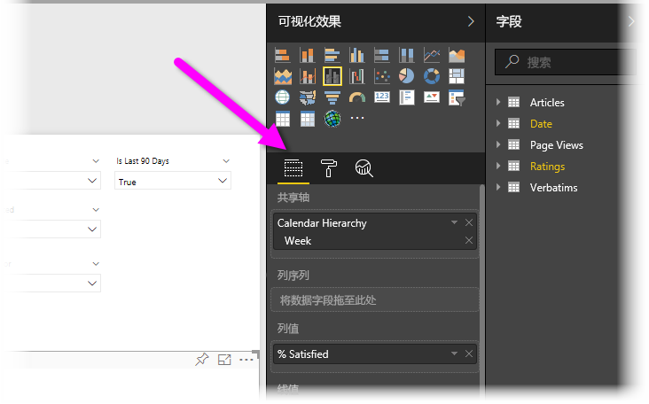
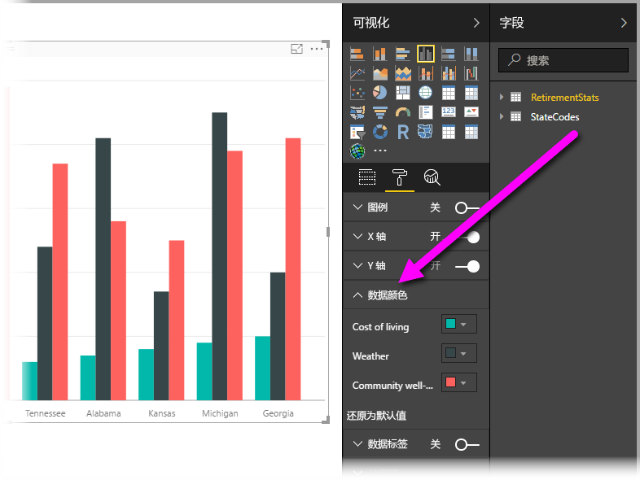
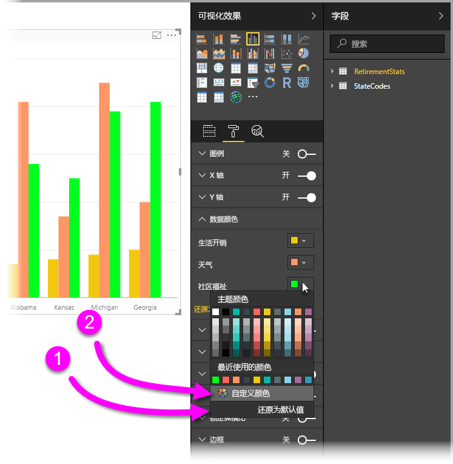
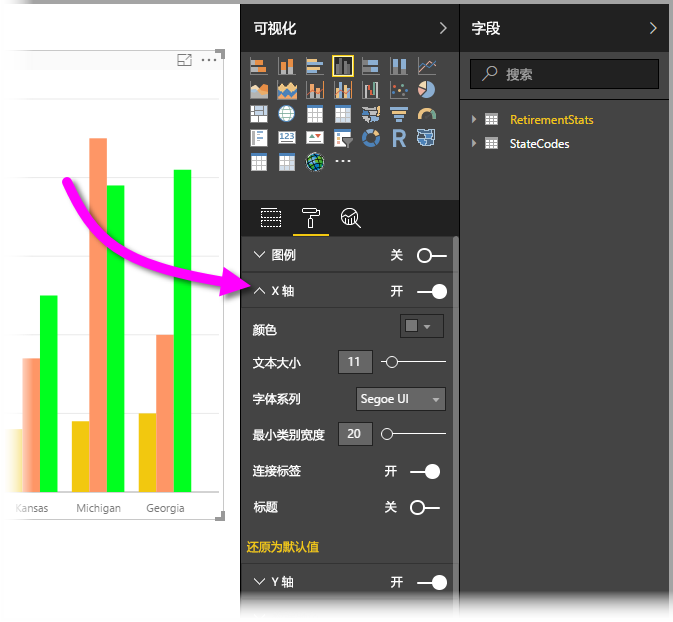

# “格式设置”窗格入门
如果对报表具有编辑权限，则可以使用许多可用的格式设置选项。 在 Power BI  报表中，可以更改数据系列、数据点的颜色，甚至可以更改可视化效果的背景。 可以更改 x 轴和 y 轴的显示方式。 甚至可以设置可视化效果、形状和标题的字体属性的格式，从而完全控制报表的显示方式。

若要开始，请在 Power BI Desktop 或 Power BI 服务中打开报表。 两者都提供几乎相同的格式设置选项。 在 Power BI 服务中打开报表时，请确保从菜单栏中选择“编辑报表”  。  

在你编辑报表并已经选择了可视化效果时，将出现让你可添加或更改可视化效果的**可视化效果**窗格。 可用可视化效果的正下方有三个图标：“字段”  图标（叠放的条形）、“格式”  图标（滚筒刷）和“分析”  图标（放大镜）。 以下图像中，**字段**图标处于选中状态，图标下方以黄色栏指示。

当选择**格式**时，图标下方的区域将显示适用于当前所选可视化效果的颜色和轴自定义选项。  

你可以自定义每个可视化效果的多个元素：

* 图例
* X 轴
* Y 轴
* 数据颜色
* 数据标签
* 形状
* 绘图区
* 标题
* 背景
* 锁定纵横比
* 边框

> [!NOTE]
>  
> 你将不会看到每个可视化效果类型的所有这些元素。 你选择的可视化效果将会对可用的自定义项有影响；例如，如果你选择了饼图，则不会看到 X 轴，因为饼图没有 X 轴。

另请注意，如果没有选择任何可视化效果，**筛选器**将会在图标的位置出现，这让你可以将筛选器应用于页面上的所有可视化效果。

我们来看两个示例：一个处理颜色，另一个更改轴的属性。 此处你应该随时准备好自定义颜色、轴和标签。

## 处理颜色

让我们逐步完成图表上自定义颜色所必需的步骤。

1. 我从报表画布中选择**簇状柱形图**。
2. 接下来，我选择**格式**图标来显示可用的自定义项。
3. 然后，我选择**数据颜色**自定义项左侧的向下小箭头。 这将显示我可以自定义数据颜色的方式，以及特定于我所选的可视化效果的选项。
4. **数据颜色**将向下展开以显示其可用的自定义项。  
   

我们来做一些更改。 我可以选择颜色旁边的向下箭头来对每个可用的数据系列进行更改。 我将“生活费用”  设为黄色，将“天气”  设为橙色，并将“社区福祉”  设为绿色。 以下屏幕将在上一步，即更改**生活成本**向我显示。  

所做的更改显示于下图。 哇，这个图表真鲜艳。 以下是处理颜色时需要注意的几个有用的元素。 下面列表中的数字也会在以下屏幕上显示，用于指示可以访问或更改这些有用元素的位置。

1. 不喜欢这些颜色吗？ 没关系，只需选择**恢复为默认**，然后你的选择将恢复为默认设置。 你可以对一种颜色或对整个可视化效果进行该操作。
2. 想要调色板中没有的颜色？ 只需选择**自定义颜色**，然后从色谱进行选择即可。  
   

不喜欢你刚刚进行的更改？ 使用 **CTRL+Z** 撤销操作，就像你之前操作的那样。

## 更改轴属性

修改 X 轴或 Y 轴通常很有用。 与处理颜色类似，可以通过选择想要更改的轴的左侧的向下箭头来修改轴，如下图所示。  

如果你想要折叠 **X 轴**选项，只需选择**X 轴**旁边的向上箭头图标。

通过切换 X 轴  旁边的单选按钮，可以完全删除 X 轴标签。 还可以通过选择**标题**旁的单选按钮来选择是否打开或关闭轴标题。  

有各种类型的颜色可供选择，并且可以对 Power BI 报表和仪表板应用更多的自定义项。

> [!NOTE]
>  
> 这些颜色、轴以及相关的可用自定义项在选中**格式**图标时可用，在 Power BI Desktop 中也可用。

## 设置文本值颜色

从 2018 年 8 月版 Power BI Desktop 更新开始，对于给定报表元素，可按文本值设置颜色  。 有关详细信息，请参阅[表格中的条件格式设置](../desktop-conditional-table-formatting.md)。

## 后续步骤
有关详细信息，请参阅以下文章：  

* [Power BI 中颜色格式设置的提示和技巧](service-tips-and-tricks-for-color-formatting.md)  
* [表格中的条件格式设置](../desktop-conditional-table-formatting.md)

