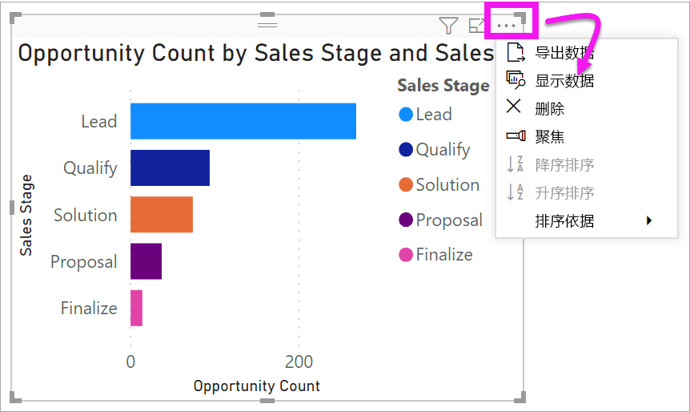
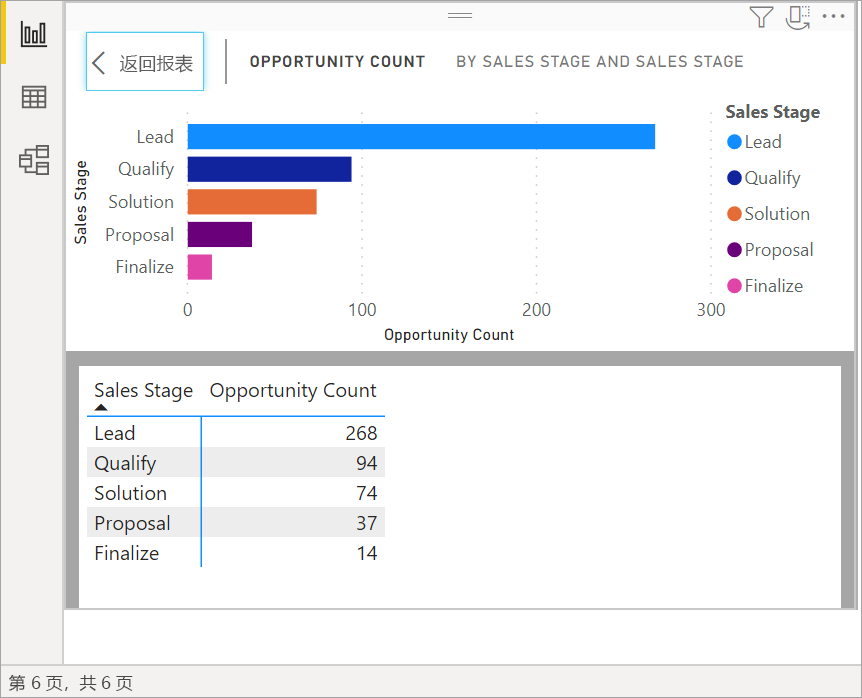
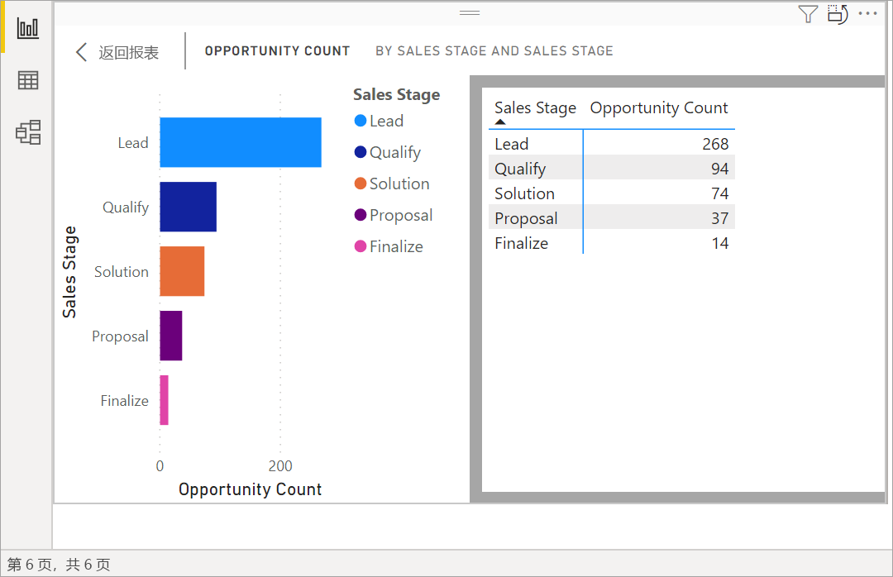
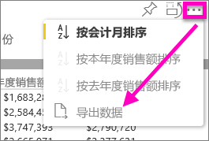
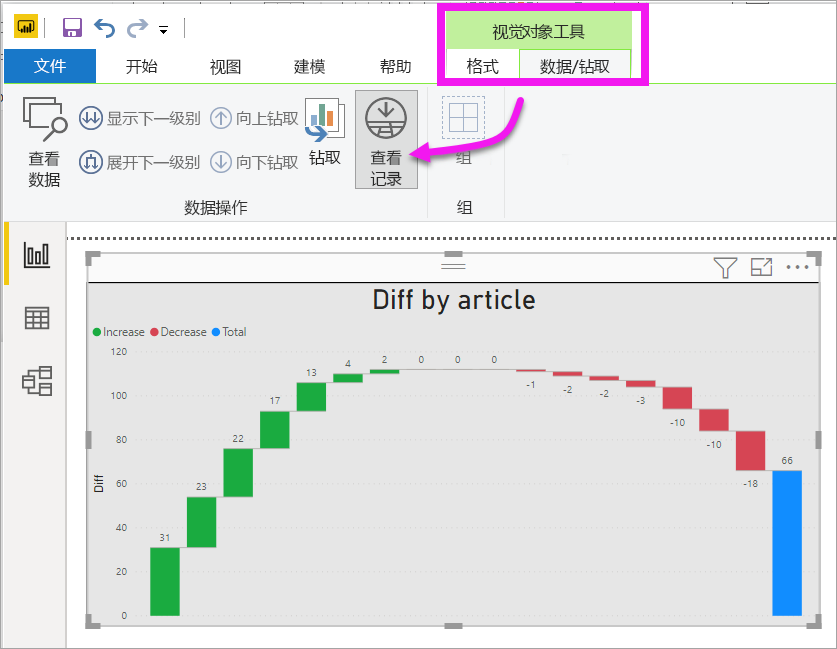
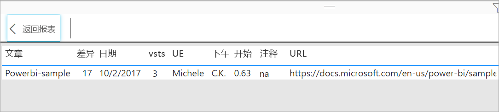

# 显示可视化效果的基础数据

[!INCLUDE[consumer-appliesto-yyyn](../includes/consumer-appliesto-nyyn.md)]    

## 显示数据
Power BI 可视化效果是使用数据集中的数据创建的。 如果你对幕后感兴趣，可以使用 Power BI *显示* 用于创建视觉对象的数据。 在用户选择“显示数据”后，Power BI 在可视化效果下方（或旁边）显示数据。

还可以导出正在用于创建为.xlsx 或.csv 文件的可视化效果的数据，并在 Excel 中查看该数据。 有关详细信息，请参阅[从 Power BI 可视化效果导出数据](power-bi-visualization-export-data.md)。

> [!NOTE]
> “显示数据”和“导出数据”在 Power BI 服务和 Power BI Desktop 中均可用。 不过，Power BI Desktop 还进一步提供了其他详细信息；[显示记录显示数据集中的实际行](../create-reports/desktop-see-data-see-records.md)。
> 
> 

## 使用“显示数据” 
1. 在 Power BI Desktop 中，选择可视化组件并将其激活。

2. 选择“更多操作”(...)，然后选择“显示数据” 。 
    

3. 默认情况下，该数据将显示在视觉对象下方。
   
   

4. 若要更改显示方向，可从可视化效果的右上角选择垂直布局  。
   
   
5. 若要将数据导出到 .csv 文件中，请依次选择省略号和“**导出数据**”。
   
    
   
    有关将数据导出到 Excel 的详细信息，请参阅[从 Power BI 可视化效果导出数据](power-bi-visualization-export-data.md)。
6. 若要隐藏数据，请依次取消选择“浏览” > “显示数据”。

## 使用“显示记录”
还可以重点关注可视化效果中的一个数据记录，然后深入了解此记录的数据。 

1. 若要使用“查看记录”，选择可视化组件并将其激活。 

2. 在“桌面”功能区中，选择“可视化工具” > “数据/钻取” > “查看记录”选项卡  。 

    

3. 选择可视化效果上的数据点或行。 本示例中，我们选择了左侧的第四列。 Power BI 显示此数据点的数据集记录。

    

4. 选择“返回到报表”以返回到“桌面”报表画布。 

## 注意事项和疑难解答

- 如果功能区中的“查看记录”按钮处于禁用状态并灰显，则意味着所选可视化效果不支持“查看记录”。
- 无法更改“查看记录”视图中的数据并将其保存回报表。
- 如果视觉对象使用多位模型中的计算度量值，则不能使用“查看记录”。
- 连接到实时多维 (MD) 模型时无法使用“查看记录”。  

## 后续步骤
[从 Power BI 可视化效果导出数据](power-bi-visualization-export-data.md)    

更多问题？ [尝试参与 Power BI 社区](https://community.powerbi.com/)

