# 报表中格式设置的提示和技巧

[!INCLUDE[consumer-appliesto-nyyn](../includes/consumer-appliesto-nyyn.md)]    

Power BI 提供了自定义报表的多种方法。 本文详细介绍了一些技巧，可以让你的 Power BI 可视化效果更引人注目、生动有趣，并可根据你的需求进行自定义。

本文提供以下技巧。 还有更好的技巧？ 太棒了！ 请将其发送给我们，我们会考虑将其添加到此列表中。

* 将主题应用于整个报表
* 更改单个数据点的颜色
* 条件格式
* 根据数值设置图表的颜色
* 根据字段值设置数据点的颜色
* 在色阶中自定义使用的颜色
* 使用发散色阶
* 向表行添加颜色
* 如何在 Power BI 中撤消操作

若要进行任何更改，必须具有报表的编辑权限。 在 Power BI Desktop 中，在“报表”视图中打开报表。 在 Power BI 服务中，这意味着打开报表并从菜单栏中选择“编辑”，如下图所示。

当“筛选器”和“可视化效果”窗格出现在报表画布的右侧时，即可开始进行自定义操作 。 如果未显示这些窗格，可选择右上角的箭头将其打开。

## 应用主题
使用报表主题，你可以将设计更改应用于整个报表，如使用公司颜色、更改图标集或应用新的默认视觉对象格式。 在你应用某个报表主题后，报表中的所有视觉对象都会使用选定主题中的颜色和格式。 若要了解详细信息，请参阅[使用报表主题](../create-reports/desktop-report-themes.md)

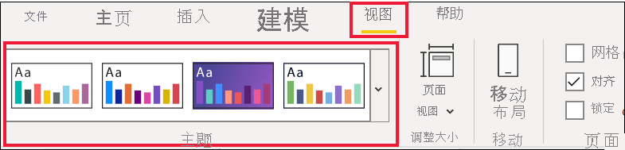

此处我们已将“创新”主题应用到“销售和市场营销”报表中。

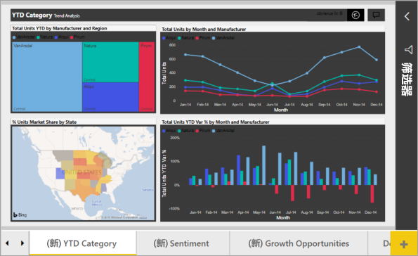

## 更改单个数据点的颜色
有时你想突出显示某个特定的数据点。 该数据点可能是推出的新产品的销售数据，或是推出新计划后增加的质量分数。 使用 Power BI 可以通过更改其颜色来突出显示某个特定的数据点。

以下可视化效果对按产品细分销售的单位进行排名。 

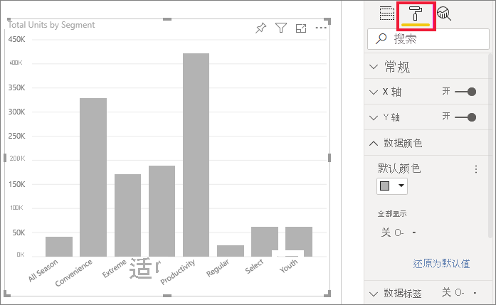

现在，假设你想通过使用颜色来调出“便利性”细分，以展示这个全新细分的效果。 步骤如下：

展开“数据颜色”卡，然后启用“全部显示”滑块。 此操作将显示可视化效果中每个数据元素的颜色。 现在可以修改任意数据点。

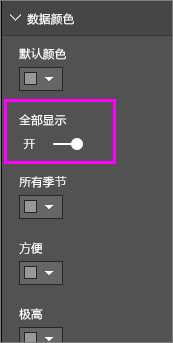

将“便利性”设置为橙色。 

选择颜色后，“便利性”数据点将显示为美丽的橙色阴影，自然就很显眼了。

即使更改了可视化效果类型，返回时 Power BI 仍会记住你的选择，并将“便利性”保留为橙色。

可以更改可视化效果中的一个、多个或全部数据元素的数据点颜色。 也许你希望视觉对象模拟企业颜色中的黄色、绿色和蓝色。 

可以使用颜色进行各种操作。 在下一部分中，我们将介绍条件格式。

## 视觉对象的条件格式设置
可以根据字段的数值动态设置颜色，这样可以让可视化效果发挥出巨大作用。 通过执行此操作，除了表示条形图大小的数值之外，还能显示其他的值，并且可以在单个图表中显示两个值。 或者可以通过此操作来突出显示高于（或低于）特定值的数据点 - 例如突出显示盈利能力较低的区域。

以下部分演示了根据数值设置颜色的不同方式。

### 根据数值设置数据点的颜色
若要基于某个值更改颜色，请选择可视化效果以使其处于活动状态。 选择油漆滚筒图标，然后选择“数据颜色”卡片，以打开“格式设置”窗格。 在“默认颜色”下选择 fx 图标。  

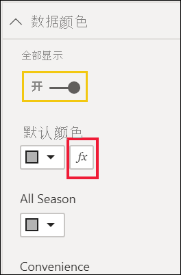

在“默认颜色”窗格中，使用下拉列表标识要用于条件格式的字段。 在此示例中，我们选择了“销售事实” > “总单位数”字段，并为“最低值”选择了浅蓝色，为“最高值”选择了深蓝色   。 

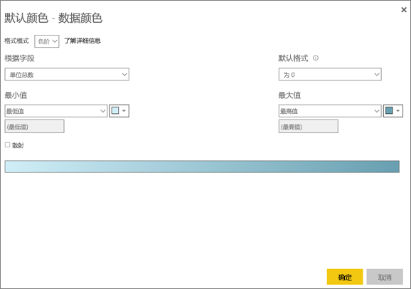

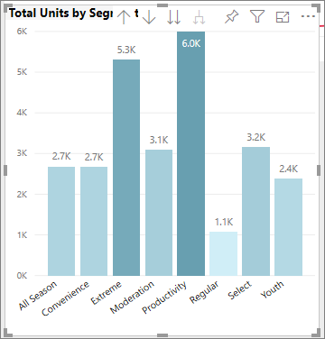

还可以使用不属于视觉对象的字段来设置视觉对象颜色的格式。 下图中使用的是 **%Market Share SPLY YTD**。 

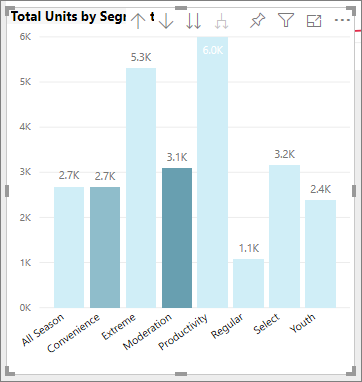

可以看出，尽管销售的“Productivity”和“Extreme”的单位数更多（其柱形更高），但“Moderation”的“%Market Share SPLY YTD”更大（其柱形的色彩饱和度更高）   。

### 在色阶中自定义使用的颜色
你还可以更改数值对应这些颜色的方式。 在下图中，已分别将 **最小值** 和 **最大值** 设置为橙色和绿色。

在第一张图片中，请注意图表中的条形图是如何反映渐变栏中的渐变的；最高的值为绿色，最低的值为橙色，中间的条形图都以介于绿色和橙色之间的色谱着色。

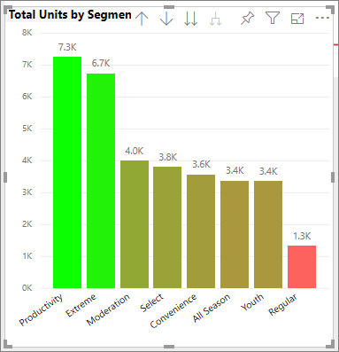

现在，让我们看看如果在“最小值”和“最大值”框中提供数值，会发生什么 。 选择“最小值”和“最大值”的 DropBox 中的“自定义”，将“最小值”设置为 3500，将最大值设置为 6000    。

设置这两个值后，渐变将不再应用于图表上低于 **最小值** 或高于 **最大值** 的值；任何高于 **最大值** 的条形图都会以绿色显示，并且任何低于 **最小值** 的条形如都会以红色显示。

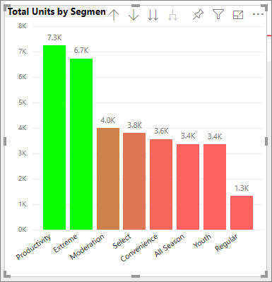

### 使用发散色阶
有时你的数据可能有自然的发散色阶。 例如，温度范围有自然的中间点（冻结点），盈利能力分数有自然的中间点（零）。

若要使用发散色阶，请选择“发散”复选框。 当“发散”处于开启状态时，将出现另一个颜色选择器，称为“中间点”，如下图所示 。

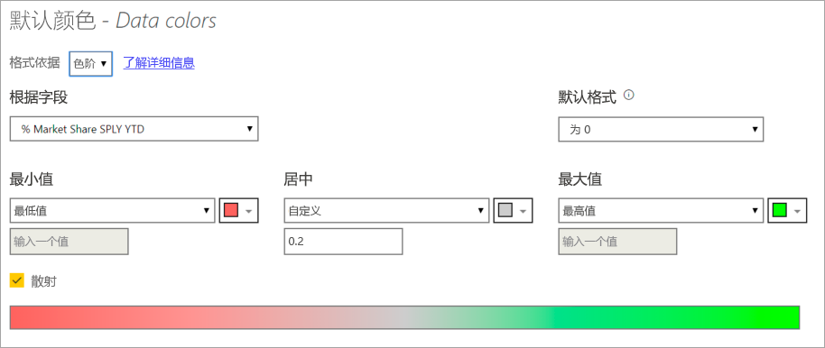

当 **发散** 处于开启状态时，你可以单独设置 **最小值**、**最大值** 和 **中间点** 的颜色。 在下图中，为 **% Market Share SPLY YTD** 将“中间点”设置为 0.2，因此值高于 0.2 的条形图将显示为渐变的绿色，值低于 0.2 的条形图则显示为红色。

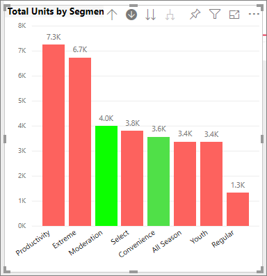

## 向表行添加颜色
表和矩阵提供了许多有关颜色格式的选项。 

将颜色应用于表或矩阵的最快捷的方法之一是打开“格式”选项卡，然后选择“样式”。  在下图中，我们选择了“带加粗标题的有格式行”。

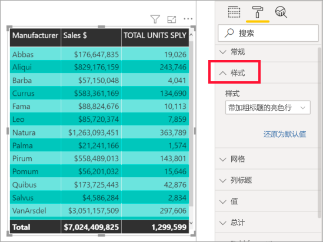

尝试其他颜色格式设置选项。 在此图中，我们更改了“列标题”下的背景色，并更改了“值”（行）的“背景色”和“替代背景色”。

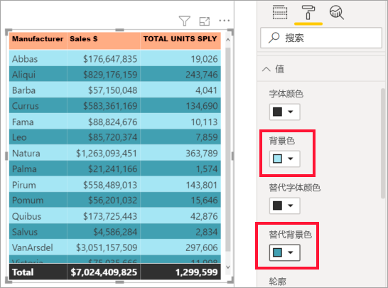

## 如何在 Power BI 中撤消操作
与许多其他 Microsoft 服务和软件相类似，Power BI 提供了撤消上一项命令的简单方法。 例如，假设你更改了某个数据点或一系列数据点的颜色，但当其出现在可视化效果中时你不喜欢该颜色。 你不记得之前它是什么颜色，但是你知道你想用回之前的颜色！

若要“撤消”上一次操作或最近几次操作，只需要按一下 Ctrl+Z。

若要放弃在“格式”卡上所做的所有更改，请选择“恢复为默认值”。

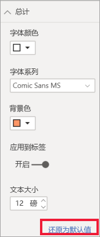

## 向我们提供反馈
你是否拥有想要共享的技巧？ 请将其发送给我们，我们会考虑将其列在此处。

## 后续步骤
[颜色格式设置和轴属性入门](service-getting-started-with-color-formatting-and-axis-properties.md)

[共享报表](../collaborate-share/service-share-reports.md)。

