# 使用 Azure Active Directory B2B 将 Power BI 内容分发给外部来宾用户

**摘要：** 这是一项技术白皮书，其中概述了如何使用 Azure Active Directory 企业到企业（Azure AD B2B）的集成，将内容分发给组织外部的用户。

**编写器：** Lukasz Pawlowski，Kasper de Jonge

**技术审阅者：** Adam Wilson、Sheng Liu、Qian Liang、Sergei Gundorov、Jacob Grimm、Adam Saxton、Maya Shenhav、Nimrod Shalit、Elisabeth Olson

> [!NOTE]
> 可以从浏览器中选择“打印”，然后选择“另存为 PDF”文件，以保存或打印此白皮书。

## 介绍

Power BI 为组织提供了360度的业务视图，并使这些组织中的每个人都可以使用数据做出明智的决策。 其中的许多组织都具有与外部合作伙伴、客户和承包商的强大信任关系。 这些组织需要提供对这些外部合作伙伴中的用户 Power BI 的仪表板和报表的安全访问。

Power BI 与[Azure Active Directory 企业到企业（AZURE AD B2B）](https://docs.microsoft.com/azure/active-directory/b2b/what-is-b2b)集成，以允许将 Power BI 内容安全地分发给组织外的来宾用户-同时仍保持控制和控制对内部数据的访问。

本白皮书介绍 Power BI 与 Azure Active Directory B2B 集成所需的所有详细信息。 我们涵盖了最常见的用例、设置、许可和行级别安全性。

> [!NOTE]
> 在此白皮书中，我们将 Azure Active Directory 称为 Azure AD 并 Azure Active Directory 企业 Azure AD B2B。

## 方案

Contoso 是一家汽车制造商，可与许多不同的供应商合作，为其提供运行其生产操作所需的所有组件、材料和服务。 Contoso 想要简化其供应链物流，并计划使用 Power BI 来监视其供应链的关键性能指标。 Contoso 想要以一种安全且可管理的方式与外部供应链合作伙伴分析共享。

Contoso 可以使用 Power BI 和 Azure AD B2B 为外部用户启用以下体验。

### 每项共享临时

Contoso 与为 Contoso 汽车构建 radiators 的供应商合作。 通常，他们需要使用 Contoso 的所有汽车中的数据来优化 radiators 的可靠性。 Contoso 的分析师使用 Power BI 与供应商的工程师共享 radiator 可靠性报告。 工程师会收到一封电子邮件，其中包含用于查看报告的链接。

如上所述，此即席共享由业务用户根据需要进行。 Power BI 发送给外部用户的链接是一个 Azure AD B2B 邀请 "链接。 当外部用户打开该链接时，系统会要求他们将 Contoso 的 Azure AD 组织加入为来宾用户。 接受邀请后，该链接将打开特定的报表或仪表板。 Azure Active Directory 管理员会将邀请外部用户的权限委派给组织，并选择用户接受邀请后可以执行的操作，如本文档的 "管理" 部分所述。 Contoso 分析员只能邀请 Guest 用户，因为 Azure AD 管理员允许该操作和 Power BI 管理员允许用户邀请来宾查看 Power BI 租户设置中的内容。

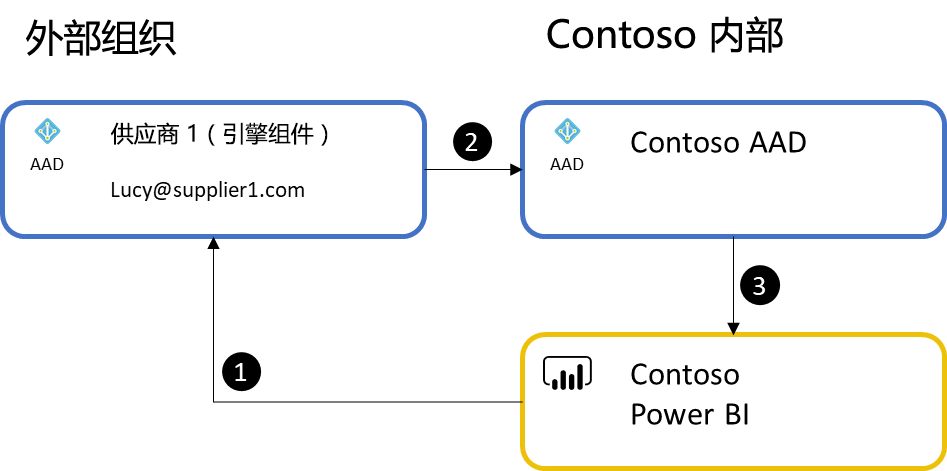

1. 该过程从 Contoso 内部用户开始，该用户与外部用户共享仪表板或报表。 如果外部用户在 Contoso 的 Azure AD 中还不是来宾，则会被邀请。 电子邮件将发送到其电子邮件地址，其中包含 Contoso Azure AD 的邀请
2. 接收方接受邀请到 Contoso 的 Azure AD，并在 Contoso 的 Azure AD 中添加为来宾用户。
3. 然后，将接收方重定向到用户的只读 Power BI 仪表板、报表或应用。

此过程被视为是临时的，因为 Contoso 中的业务用户需要执行邀请操作以实现其业务目的。 共享的每个项都是一个链接，外部用户可以访问它来查看内容。

邀请外部用户访问 Contoso 资源后，可能会在 Contoso Azure AD 中为其创建阴影帐户，而无需再次邀请他们。  当他们第一次尝试访问 Contoso 资源（如 Power BI 仪表板）时，他们将经历许可过程，兑换邀请。  如果他们没有完成同意，他们将无法访问 Contoso 的任何内容。  如果他们通过提供的原始链接兑换其邀请时出现问题，Azure AD 管理员可以为其重新发送特定邀请链接进行兑换。

### 每项共享计划

Contoso 与转包商合作来执行 radiators 的可靠性分析。 转包商团队有10名用户需要访问 Contoso Power BI 环境中的数据。 Contoso Azure AD 管理员参与邀请所有用户，并在转包商发生变化时处理任何添加/更改。 Azure AD 管理员为转包商的所有员工创建安全组。 Contoso 的员工可以使用安全组来轻松管理对报表的访问权限，并确保所有必需的转包人员均可访问所有必需的报表、仪表板和 Power BI 应用。 Azure AD 管理员还可以通过选择将邀请权限委托给 Contoso 或转包商的受信任员工，来避免邀请过程中涉及邀请，以确保及时进行人员管理。

某些组织需要更好地控制何时添加外部用户、邀请外部组织中的许多用户或许多外部组织。 在这些情况下，计划共享可用于管理共享规模、强制实施组织策略，甚至还可以委派受信任人员邀请和管理外部用户的权限。 Azure AD B2B 支持计划的邀请[由 IT 管理员直接从 Azure 门户](https://docs.microsoft.com/azure/active-directory/b2b/add-users-administrator)发送，或通过[使用邀请管理器 API](https://docs.microsoft.com/azure/active-directory/b2b/customize-invitation-api) （其中一组用户可在一个操作中受邀请）通过 PowerShell 进行发送。 使用计划的邀请方法，组织可以控制谁可以邀请用户和实施审批流程。 像动态组这样的高级 Azure AD 功能可以轻松地自动维护安全组成员身份。

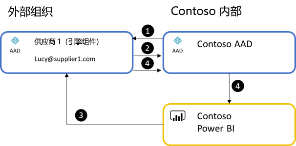

1. IT 管理员可以通过手动或通过 Azure Active Directory 提供的 API 来邀请来宾用户的过程星
2. 用户接受邀请到组织。
3. 用户接受邀请后，Power BI 中的用户可以与外部用户或其所在的安全组共享报表或仪表板。 与中的常规共享一样 Power BI 外部用户会收到一封电子邮件，其中包含指向该项目的链接。
4. 当外部用户访问该链接时，其目录中的身份验证将传递给 Contoso 的 Azure AD，并用于获取 Power BI 内容的访问权限。

### Power BI 应用的临时或计划内共享

Contoso 有一组报表和仪表板需要与一个或多个供应商共享。 为了确保所有必需的外部用户都可以访问此内容，将其打包为 Power BI 应用。 外部用户可以直接添加到应用访问列表中，也可以通过安全组添加。 Contoso 的某人然后将应用 URL 发送给所有外部用户，例如，在电子邮件中。 当外部用户打开该链接时，他们将看到一个易于导航的内容。

使用 Power BI 应用，Contoso 可以轻松地为其供应商构建 BI 门户。 单个访问列表控制对所需的所有内容的访问，从而减少检查和设置项目级别权限所需的时间。 Azure AD B2B 使用供应商的本机标识维护安全访问权限，因此用户无需额外的登录凭据。 如果将计划的邀请与安全组结合使用，则会简化对应用进行的访问管理。 安全组中的成员身份手动或通过使用[动态组](https://docs.microsoft.com/azure/active-directory/b2b/use-dynamic-groups)，使来自供应商的所有外部用户自动添加到相应的安全组。

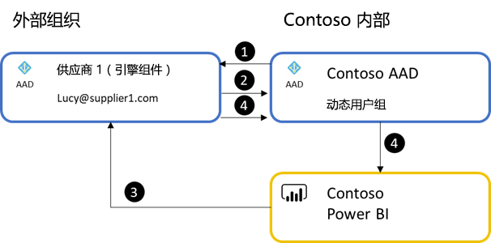

1. 此过程由用户通过 Azure 门户或 PowerShell 邀请到 Contoso Azure AD 组织
2. 用户可以添加到 Azure AD 中的用户组。 可以使用静态或动态用户组，但动态组可帮助减少手动工作。
3. 通过用户组向外部用户授予对 Power BI 应用的访问权限。 应用 URL 应直接发送到外部用户，或放置在他们有权访问的站点上。 Power BI 尽力将包含应用链接的电子邮件发送到外部用户，但在使用成员身份可能更改的用户组时，Power BI 不能发送到通过用户组管理的所有外部用户。
4. 当外部用户访问 Power BI 应用 URL 时，会通过 Contoso 的 Azure AD 对其进行身份验证，为用户安装应用，并且用户可以在应用中查看所有包含的报告和仪表板。

应用还具有独特的功能，该功能允许应用作者自动为用户安装应用程序，因此在用户登录时可用。 此功能仅自动安装在发布或更新应用程序时已成为 Contoso 组织一部分的外部用户。 因此，最好与计划的邀请方法一起使用，并且依赖于用户添加到 Contoso 的 Azure AD 后要发布或更新的应用程序。 外部用户始终可以使用应用程序链接安装应用程序。

### 在组织中注释和订阅内容

由于 Contoso 继续与分包商或供应商合作，外部工程师需要与 Contoso 的分析师密切合作。 Power BI 提供了几种协作功能，可帮助用户传达他们可使用的内容。 "仪表板" 注释（并且不久报告注释）允许用户讨论他们看到的数据点，并与报表作者联系以提出问题。

目前，外部来宾用户可以通过留言并阅读回复来参与注释。 但是，与内部用户不同，来宾用户不能 @mentioned 并且不会收到他们收到评论的通知。 在撰写本文时，来宾用户不能使用 Power BI 中的订阅功能。 在即将发布的版本中，将会提升这些限制，并且来宾用户会在 @mentions 注释时收到一封电子邮件，或者将订阅发送到其电子邮件，其中包含指向 Power BI 中内容的链接。

### 访问 Power BI 移动应用中的内容

在即将发布的版本中，当 Contoso 的用户与其外部来宾共享报表或仪表板时，Power BI 将发送一封电子邮件通知来宾。 当来宾用户在其移动设备上打开指向报表或仪表板的链接时，如果安装了这些内容，内容将在其设备上的本机 Power BI 移动应用中打开。 然后，来宾用户可以在外部租户中与他们共享的内容之间导航，然后在其主租户中导航回来的内容。

> [!NOTE]
> 来宾用户无法打开 Power BI 移动应用并立即导航到外部租户，它们必须以指向外部租户中的项的链接开头。 本文档后面的 "将[链接链接到父组织的 Power BI 中的内容](#distributing-links-to-content-in-the-parent-organizations-power-bi)" 一节中介绍了常见的解决方法。

### 跨组织编辑和管理 Power BI 内容

Contoso 及其供应商和分包商在一起合作。 通常，转包商需要将其他指标或数据可视化效果添加到 Contoso 与他们共享的报表中。 数据应驻留在 Contoso 的 Power BI 租户中，但外部用户应该能够对其进行编辑、创建新内容，甚至可以将其分发给适当的个人。

Power BI 提供了一个选项，使**外部来宾用户可以编辑和管理**组织中的内容。 默认情况下，外部用户具有只读的面向消费的体验。 但是，这种新设置允许 Power BI 管理员选择哪些外部用户可以在其自己的组织中编辑和管理内容。 允许外部用户在工作区中编辑报表、仪表板、发布或更新应用，并连接到他们有权使用的数据。

此方案将在本文档后面的 "使外部用户在 Power BI 中编辑和管理内容" 一节中详细描述。

## 使用 Power BI 和 Azure AD B2B 的组织关系

如果 Power BI 的所有用户都是组织内部的，则无需使用 Azure AD B2B。 但是，一旦两个或更多的组织想要对数据和见解进行协作，Power BI 对 Azure AD B2B 的支持可让你轻松、经济高效地执行此操作。

下面通常会遇到组织结构，它们非常适合于 Power BI 中的 Azure AD B2B 样式跨组织协作。 Azure AD B2B 在大多数情况下都很好，但在某些情况下，我们可以考虑使用本文档末尾介绍的常见替代方法。

### 案例1：组织间的直接协作

Contoso 与 radiator 供应商的关系是组织之间直接协作的一个示例。 由于 Contoso 及其供应商相对较少的用户需要访问 radiator 的可靠性信息，因此，使用基于 Azure AD B2B 的外部共享是理想之选。 它易于使用，并且易于管理。 这也是咨询服务中的一种常见模式，顾问可能需要为组织生成内容。

通常，此共享最初使用即席每项共享进行。 但是，随着团队增长或关系加深，计划的每项共享方法将成为降低管理开销的首选方法。 此外，Power BI 应用的即席共享或计划内共享、注释和订阅跨组织的内容、对移动应用中的内容的访问权限也会成为一项工作，并跨组织编辑和管理 Power BI 内容。 重要的是，如果两个组织的用户在各自的组织中都有 Power BI Pro 许可证，则他们可以在彼此的 Power BI 环境中使用这些 Pro 许可证。 这提供了有益的许可，因为邀请的组织可能不需要为外部用户支付 Power BI Pro 许可证。 本文档后面的 "许可" 部分将对此进行更详细的讨论。

### 案例2：父节点及其子公司或子公司

某些组织结构更复杂，包括部分或全部拥有的子公司、附属公司或托管服务提供商关系。 这些组织拥有一个父组织（例如控股公司），但底层组织在半自治的情况下运行，有时会受到不同地区的要求。 这会导致每个组织都有其自己的 Azure AD 环境和单独的 Power BI 租户。

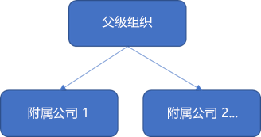

在此结构中，父组织通常需要将标准化见解分发到其子公司。 通常，此共享按照下图所示的 Power BI 应用程序的临时或计划内共享进行，因为它允许将标准化的权威内容分发给广大受众。 在实践中，将使用本文档前面提到的所有方案的组合。

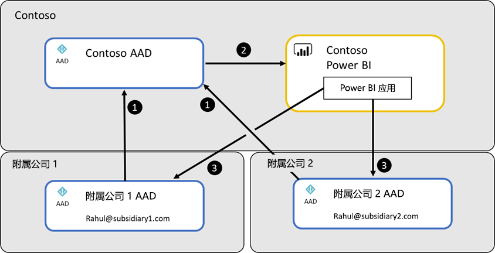

这将遵循以下过程：

1. 每个子公司的用户受邀加入 Contoso 的 Azure AD
2. 然后，会发布 Power BI 应用，以使这些用户能够访问所需的数据
3. 最后，用户通过提供的链接打开应用程序以查看报表

此结构中的组织面临几项重要挑战：

- 如何将链接分发到父组织的 Power BI 中的内容
- 如何允许子公司用户访问父组织托管的数据源

#### 将链接分发到父组织的 Power BI 中的内容

通常使用三种方法来分发内容链接。 第一个也是最基本的方法是将应用程序的链接发送给所需的用户或将其放在可从中打开它的 SharePoint Online 站点中。 然后，用户可以在浏览器中为链接添加书签，以便更快地访问所需的数据。

第二种方法依赖于跨组织编辑和管理 Power BI 内容功能。 父组织允许子公司的用户访问其 Power BI，并控制他们可通过权限访问的内容。 这将提供对 Power BI Home 的访问权限，其中，来自于子公司的用户在父组织的租户中看到与他们共享的内容的完整列表。 然后，将向子公司的用户提供父组织的 Power BI 环境的 URL。

最终方法使用在每个子公司 Power BI 租户中创建的 Power BI 应用。 Power BI 应用包含一个仪表板，其中包含使用[external link 选项配置的磁贴](https://docs.microsoft.com/power-bi/service-dashboard-edit-tile#hyperlink)。 用户按下磁贴时，它们将被转到父组织的 Power BI 中的相应报表、仪表板或应用。 此方法的优点是，可以为子公司中的所有用户自动安装应用程序，并在用户登录到自己的 Power BI 环境时对其可用。 此方法的一个优点是它与可在本地打开链接的 Power BI 移动应用程序很好地配合工作。 你还可以将其与第二种方法结合使用，以便在 Power BI 环境之间更轻松地进行切换。

#### 允许子公司用户访问父组织托管的数据源

通常，分支机构中的分析人员需要使用父组织提供的数据来创建自己的分析。 在这种情况下，通常使用云数据源来解决该问题。

第一种方法是利用[Azure Analysis Services](https://docs.microsoft.com/azure/analysis-services/analysis-services-overview)来构建一个企业级数据仓库，该数据仓库满足整个家长及其子公司的分析人员需求，如下图所示。 Contoso 可以托管数据并使用行级别安全性等功能，以确保每个子公司的用户只能访问其数据。 每个组织的分析师可以通过 Power BI Desktop 访问数据仓库，并将所得到的分析发布到各自 Power BI 租户。

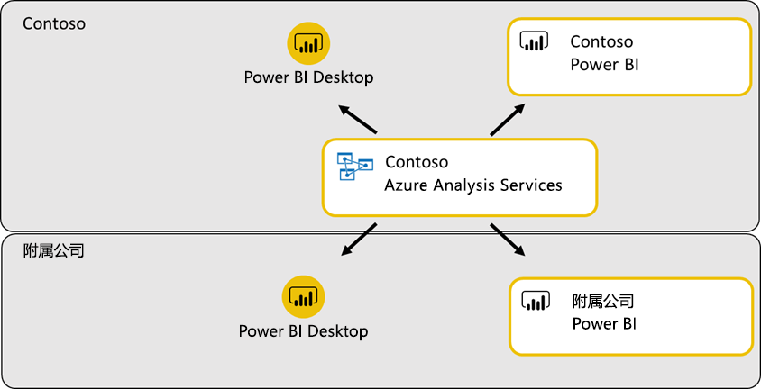

第二种方法利用[AZURE SQL 数据库](https://azure.microsoft.com/services/sql-database/)来构建关系数据仓库，以提供对数据的访问。 这与 Azure Analysis Services 方法的工作方式相同，但某些功能（例如行级别安全性）可能更难跨子公司进行部署和维护。

此外，还可以使用更复杂的方法，但这是最常见的方法。

### 案例3：跨伙伴共享环境

Contoso 可能进入与竞争对手的合作关系，以在共享的程序集线上共同构建汽车，但要在不同品牌或不同区域中分布汽车。 这需要跨组织的数据、智能和分析的广泛协作和共同拥有权。 此结构在咨询服务行业中也很常见，其中一组顾问可以对客户端执行基于项目的分析。

在实践中，这些结构是复杂的，如下图所示，需要维护人员。 为有效，此结构依赖于跨组织编辑和管理 Power BI 内容功能，因为它允许组织重用为各自 Power BI 租户购买的 Power BI Pro 许可证。

若要建立共享 Power BI 租户，需要创建一个 Azure Active Directory 并且需要为该 Active Directory 中的用户购买至少一个 Power BI Pro 用户帐户。 此用户邀请所需的用户到共享组织。 重要的是，在此方案中，Contoso 的用户在共享组织的 Power BI 内操作时，会被视为外部用户。

此过程如下所示：

1. 共享组织建立为新 Azure Active Directory，并在新组织中创建至少一个用户帐户。 应为该用户分配 Power BI Pro 许可证。
2. 然后，此用户建立 Power BI 租户，并邀请 Contoso 和合作伙伴组织所需的用户。 用户还建立任何共享数据资产，如 Azure Analysis Services。 Contoso 和合作伙伴的用户可以作为来宾用户访问共享组织的 Power BI。 如果允许编辑和管理中的内容 Power BI 外部用户可以使用 Power BI home、使用工作区、上传或编辑内容和共享报表。 通常，所有共享资产都是从共享组织存储和访问的。
3. 根据各方同意协作的方式，每个组织都可以使用共享数据仓库资产开发自己的专用数据和分析。 他们可以使用内部 Power BI 租户将这些用户分配给各自的内部用户。

### 案例4：分发到数百或数千个外部合作伙伴

尽管 Contoso 为一个供应商创建了 radiator 可靠性报表，但现在 Contoso 希望为数百个供应商创建一组标准化报表。 这允许 Contoso 确保所有供应商具有进行改进或修复制造缺陷所需的分析。

当组织需要将标准化数据和见解分发给许多外部用户/组织时，他们可以使用 Power BI 应用方案的即席或计划内共享来快速构建 BI 门户，而不会产生大量的开发成本。 使用 Power BI 应用构建此类门户的过程将在案例研究：使用 Power BI + 创建 BI 门户 Azure AD B2B –本文档后面的分步说明中介绍。

这种情况的一个常见变体是，当组织正在尝试与使用者共享见解时，尤其是在想要将 Azure B2C 与 Power BI 一起使用时。 Power BI 不能以本机方式支持 Azure B2C。 如果正在评估此情况的选项，请考虑在本文档后面的 "常见备用方法" 部分中使用替代选项2。

## 案例研究：使用 Power BI + Azure AD B2B 构建 BI 门户–分步说明

Power BI 与 Azure AD B2B 的集成为 Contoso 提供一种无缝且无障碍的方式为来宾用户提供对其 BI 门户的安全访问。 Contoso 可以通过三个步骤进行此设置：

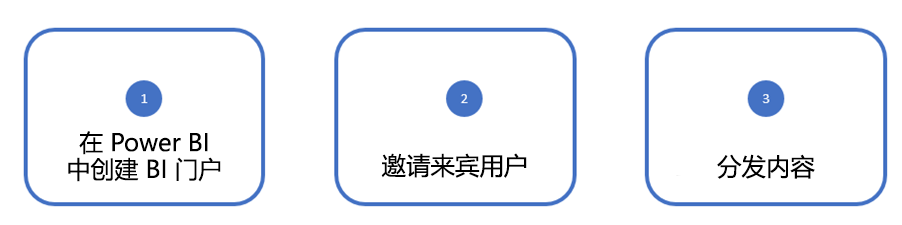

1. 在 Power BI 中创建 BI 门户

    Contoso 的第一个任务是在 Power BI 中创建其 BI 门户。 Contoso 的 BI 门户将包含一系列专门构建的仪表板和报表，这些仪表板和报表将提供给许多内部用户和来宾用户。 在 Power BI 中执行此操作的建议方法是生成 Power BI 应用。 详细了解[Power BI 中的应用](https://powerbi.microsoft.com/blog/distribute-to-large-audiences-with-power-bi-apps/)。

- Contoso 的 BI 团队在 Power BI 中创建一个工作区

    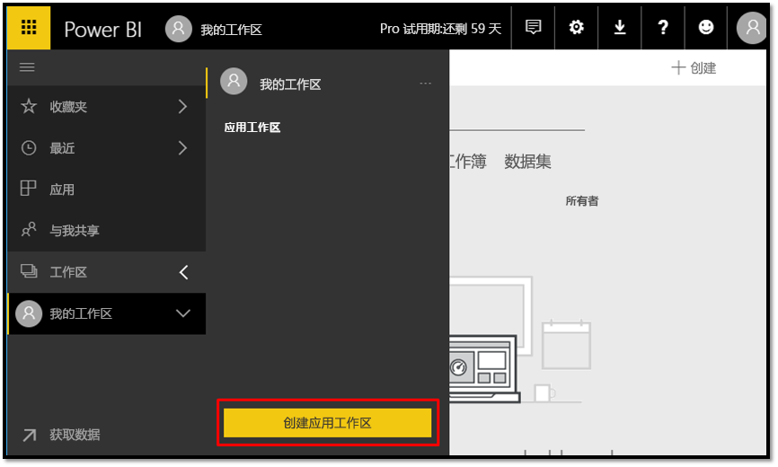
    

- 其他作者已添加到工作区

    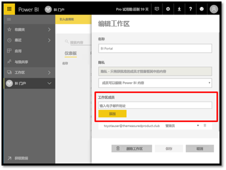

- 内容在工作区中创建

    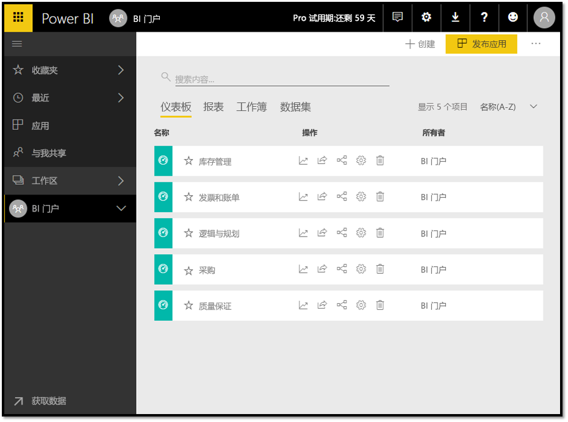

    现在，内容已在工作区中创建，Contoso 已准备好邀请合作伙伴组织中的来宾用户使用此内容。

2. 邀请来宾用户

    Contoso 可以通过两种方式将来宾用户邀请到 Power BI 中的 BI 门户：

    * 计划的邀请
    * 即席邀请

    **计划的邀请**

    在此方法中，Contoso 提前邀请来宾用户的 Azure AD，然后将 Power BI 内容分发给他们。 Contoso 可以从 Azure 门户或使用 PowerShell 邀请来宾用户。 下面是从 Azure 门户邀请来宾用户的步骤：

    - Contoso 的 Azure AD 管理员导航到**Azure 门户 > Azure Active Directory > 用户和组 > 所有用户 > 新的来宾用户**

    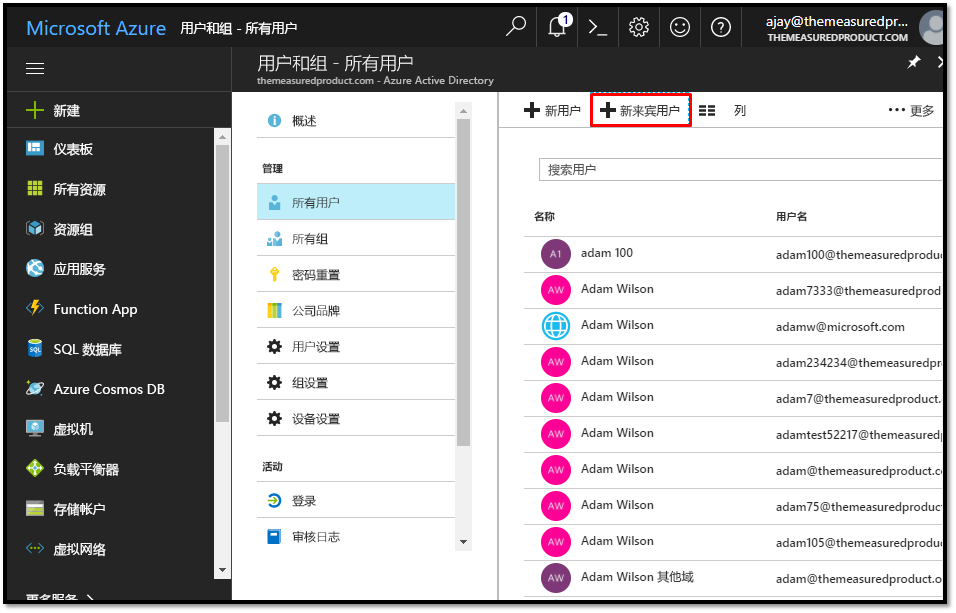

    - 添加来宾用户的邀请消息，并单击 "邀请"

    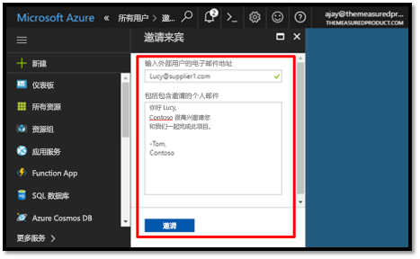

    > [!NOTE]
    > 若要从 Azure 门户邀请来宾用户，你需要拥有租户 Azure Active Directory 的管理员。

    如果 Contoso 想邀请多个来宾用户，可以使用 PowerShell 来完成。 Contoso 的 Azure AD 管理员在 CSV 文件中存储所有来宾用户的电子邮件地址。 下面是[AZURE ACTIVE DIRECTORY B2B 协作代码和 PowerShell 示例](https://docs.microsoft.com/azure/active-directory/b2b/code-samples)和说明。

    邀请后，来宾用户将收到一封包含邀请链接的电子邮件。

    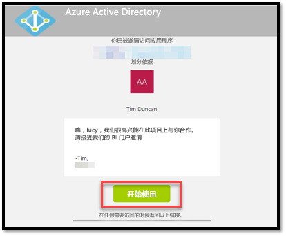

    来宾用户单击该链接后，即可访问 Contoso Azure AD 租户中的内容。

    > [!NOTE]
    > 可以使用[此处](https://docs.microsoft.com/azure/active-directory/active-directory-b2b-invitation-email)所述的 Azure AD 品牌功能更改邀请电子邮件的布局。

    **即席邀请**

    如果 Contoso 不知道自己想要邀请的所有来宾用户该怎么办？ 或者，如果 Contoso 中创建 BI 门户的分析人员想要亲自向来宾用户分发内容，该怎么办？ 我们还在与即席邀请 Power BI 中支持此方案。

    分析师在发布应用程序时，只需将其添加到应用的访问列表。 来宾用户收到邀请，一旦接受邀请，会自动将其重定向到 Power BI 内容。

    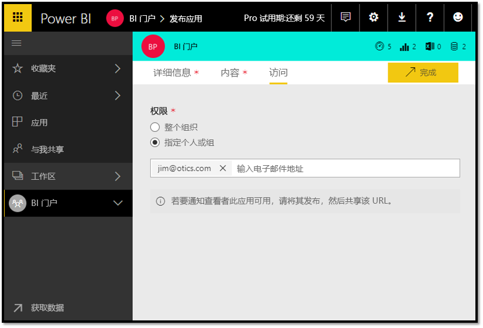

    > [!NOTE]
    > 只有在第一次将外部用户邀请到你的组织时，才需要邀请。

3. 分发内容

    由于 Contoso 的 BI 团队已创建 BI 门户和邀请的来宾用户，因此他们可以通过向来宾用户授予对应用程序的访问权限并将其发布，来将其门户分发给最终用户。 Power BI 以前添加到 Contoso 租户的来宾用户的自动完成名称。 此时还可添加其他来宾用户的即席邀请。

    > [!NOTE]
    > 如果使用安全组来管理外部用户对应用的访问，请使用计划的邀请方法，并直接与必须访问的每个外部用户共享应用链接。 否则，外部用户可能无法从应用程序中安装或查看内容。

    来宾用户会收到一封电子邮件，其中包含指向应用的链接。

    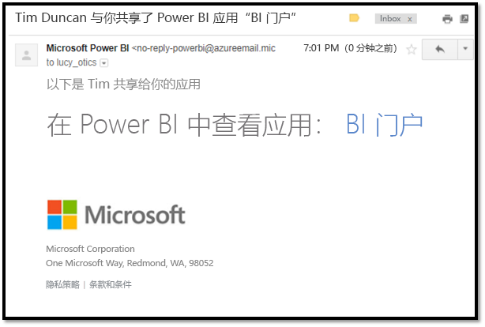

    单击此链接时，系统将要求来宾用户通过其组织的标识进行身份验证。

    

    成功通过身份验证后，它们将被重定向到 Contoso 的 BI 应用。

    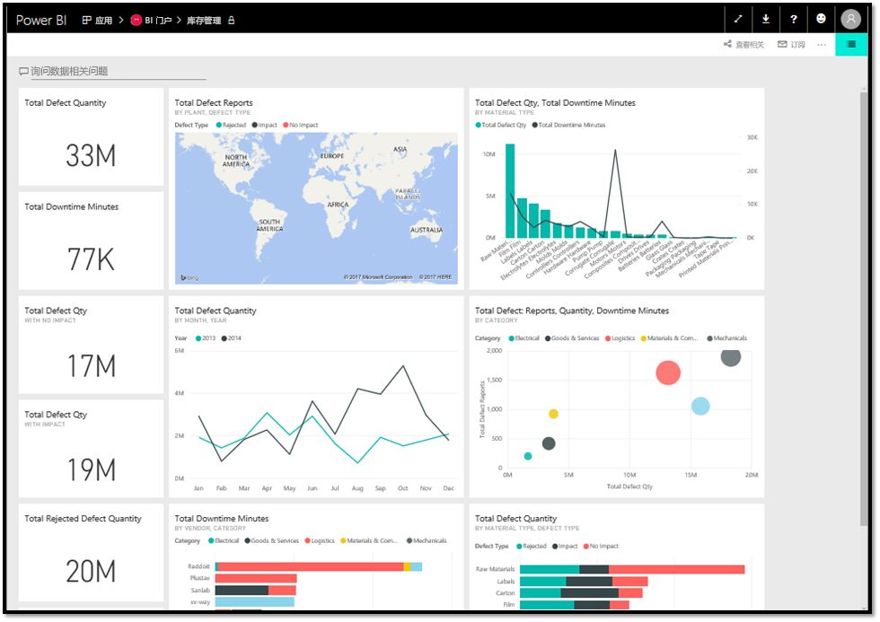

    然后，来宾用户可以通过单击电子邮件中的链接或书签链接来访问 Contoso 的应用。 Contoso 还可以通过将此链接添加到来宾用户已使用的任何现有 extranet 门户来使来宾用户更容易。

4. 后续步骤

    Contoso 可以使用 Power BI 应用和 Azure AD B2B，以无代码方式为其供应商快速创建 BI 门户。 这极大地简化了将标准化分析分发给需要它的所有供应商。

    尽管此示例演示了如何在供应商之间分布单个常见报告，Power BI 可以进一步进一步。 若要确保每个伙伴只看到与其自身相关的数据，可以轻松地将行级别安全性添加到报表和数据模型。 本文档后面的 "外部合作伙伴的数据安全" 部分详细介绍了此过程。

    通常，需要将单个报表和仪表板嵌入到现有门户。 这还可以使用示例中所示的许多方法来实现。 但是，在这种情况下，直接从工作区嵌入报表或仪表板可能会更容易。 邀请用户的安全权限并将其分配给需要用户的过程保持不变。

## 在幕后： Lucy 如何从 Contoso 的租户访问 Power BI 内容？

现在，我们已经了解了 Contoso 如何才能向合作伙伴组织中的来宾用户无缝分发 Power BI 内容，接下来我们来看看这是如何工作的。

当 Contoso 邀请[lucy@supplier1.com](mailto:lucy@supplier1.com)到其目录时，Azure AD 会在[Lucy@supplier1.com](mailto:Lucy@supplier1.com)与 Contoso Azure AD 租户之间创建链接。 此链接使 Azure AD 知道 Lucy@supplier1.com 可以访问 Contoso 租户中的内容。

当 Lucy 尝试访问 Contoso 的 Power BI 应用程序时，Azure AD 会验证 Lucy 是否可以访问 Contoso 租户，然后提供 Power BI 令牌，该令牌指示 Lucy 通过身份验证访问 Contoso 租户中的内容。 Power BI 使用此令牌授权，并确保 Lucy 有权访问 Contoso 的 Power BI 应用。

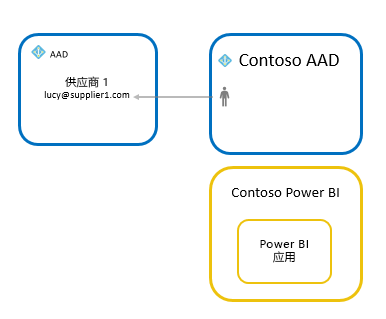

Power BI 与 Azure AD B2B 的集成适用于所有业务电子邮件地址。 如果用户没有 Azure AD 标识，系统可能会提示他们创建一个标识。 下图显示了详细的流：

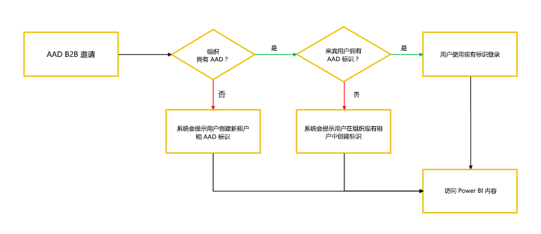

务必认识到将在外部方的 Azure AD 中使用或创建 Azure AD 帐户，这将使 Lucy 可以使用其自己的用户名和密码，并在每次当公司的组织也使用 Azure AD 时，Lucy 离开了公司。

## 许可

Contoso 可以选择以下三种方法之一，让来宾用户从其供应商和合作伙伴组织那里获得 Power BI 内容的访问权限。

> [!NOTE]
> _Azure AD B2B's 免费层足以与 AZURE AD B2B 一起使用 Power BI。某些高级 Azure AD B2B 功能（如动态组）需要额外的许可。有关其他信息，请参阅 Azure AD B2B 文档：_ [ _https://docs.microsoft.com/azure/active-directory/b2b/licensing-guidance_](https://docs.microsoft.com/azure/active-directory/b2b/licensing-guidance)

### 方法1： Contoso 使用 Power BI Premium

通过此方法，Contoso 购买 Power BI Premium 容量，并将其 BI 门户内容分配给此容量。 这允许合作伙伴组织中的来宾用户访问 Contoso 的 Power BI 应用，而无需任何 Power BI 许可证。

当使用 Power BI Premium 中的内容时，外部用户还受 Power BI 中的 "免费" 用户的使用情况。

Contoso 还可以利用对其应用的其他 Power BI 高级功能，如提高刷新率、专用容量和大型模型大小。

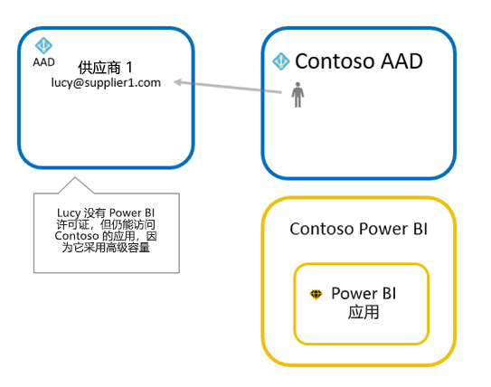

### 方法2： Contoso 向来宾用户分配 Power BI Pro 许可证

通过这种方法，Contoso 将 pro 许可证分配给合作伙伴组织中的来宾用户-可以从 Contoso Microsoft 365 管理中心完成此操作。 这允许合作伙伴组织中的来宾用户访问 Contoso 的 Power BI 应用，而无需购买许可证。 这可能适合与组织尚未采用 Power BI 的外部用户共享。

> [!NOTE]
> 仅当来宾用户访问 Contoso 租户中的内容时，Contoso 的 pro 许可证才适用。 Pro 许可证允许访问不在 Power BI Premium 容量的内容。 但是，默认情况下，具有 Pro 许可证的外部用户将被限制为仅消耗体验。 这可以使用本文档后面的 "在_Power BI 中启用外部用户来编辑和管理内容_" 部分中所述的方法进行更改。

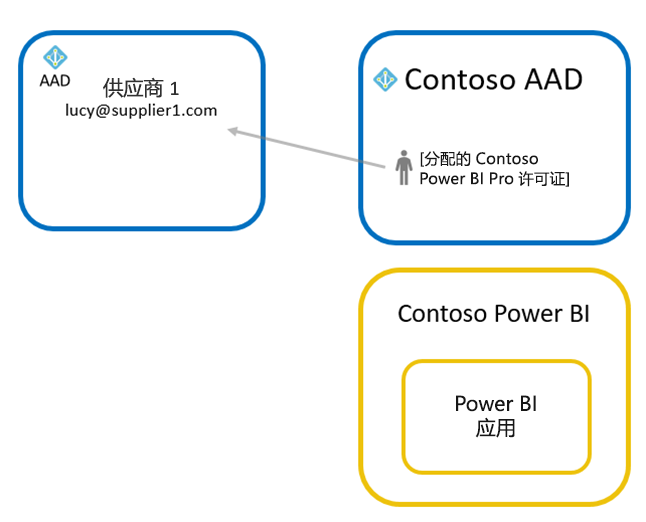

### 方法3：来宾用户自带 Power BI Pro 许可证

使用此方法时，供应商1将 Power BI Pro 许可证分配给 Lucy。 然后，他们可以使用此许可证访问 Contoso 的 Power BI 应用。 由于在访问外部 Power BI 环境时，Lucy 可以使用其自己的组织中的 Pro 许可证，因此此方法有时称为_自带许可证_（BYOL）。 如果两个组织都在使用 Power BI，则这将为整体分析解决方案提供有利的许可，并将向外部用户分配许可证的开销降到最低。

> [!NOTE]
> 向 Lucy 提供的由供应商1提供的 pro 许可证适用于任何 Power BI 租户，其中 Lucy 是来宾用户。 Pro 许可证允许访问不在 Power BI Premium 容量的内容。 但是，默认情况下，具有 Pro 许可证的外部用户将被限制为仅消耗体验。 这可以通过使用本文档后面的 "在_Power BI 中启用外部用户来编辑和管理内容_" 部分中所述的方法更改。

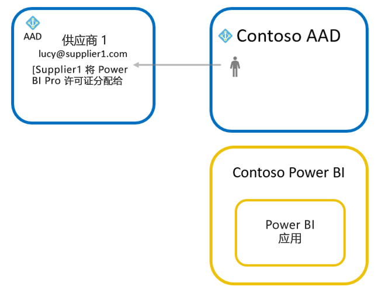

## 外部合作伙伴的数据安全性

通常，当与多个外部供应商合作时，Contoso 需要确保每个供应商只看到自己的产品数据。 基于用户的安全和动态行级别安全性使其能够在 Power BI 中轻松完成。

### 基于用户的安全性

行级别安全性 Power BI 最强大的功能之一。 此功能允许 Contoso 创建单个报表和数据集，但仍对每个用户应用不同的安全规则。 有关详细说明，请参阅[行级安全性（RLS）](https://powerbi.microsoft.com/documentation/powerbi-admin-rls/)。

Power BI 与 Azure AD B2B 的集成，Contoso 可以在将客户邀请到 Contoso 租户后立即将行级别安全性规则分配给来宾用户。 如前所述，Contoso 可以通过计划或即席邀请添加来宾用户。 如果 Contoso 希望强制执行行级别安全性，则强烈建议使用计划的邀请提前添加来宾用户，并将其分配到安全角色，然后再共享内容。 如果 Contoso 改为使用即席邀请，则可能会有一小段时间，来宾用户将无法查看任何数据。

> [!NOTE]
> 使用即席邀请时访问受 RLS 保护的数据的这一延迟可能会导致对你的 IT 团队发出支持请求，因为当在他们收到的电子邮件中打开共享链接时，用户将看到空白或已损坏的报表/仪表板。 因此，在这种情况下，强烈建议使用计划的邀请。 * *

让我们看一个示例。

如前所述，Contoso 拥有全球各地的供应商，他们想要确保其供应商组织的用户从其区域的数据中获得见解。  但 Contoso 的用户可以访问所有数据。 Contoso 不创建多个不同的报表，而是创建一个报表，并基于用户查看数据对其进行筛选。

若要确保 Contoso 可以基于谁正在连接来筛选数据，请在 Power BI 桌面中创建两个角色。 一个用于筛选 SalesTerritory "欧洲" 中的所有数据，另一个用于 "北美"。

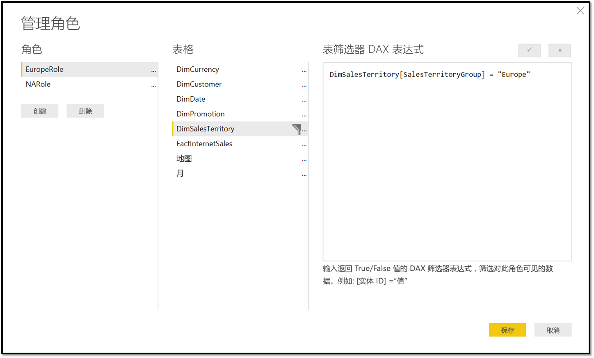

当在报表中定义角色时，必须为用户分配特定角色才能访问任何数据。 角色分配发生在 Power BI 服务内（**数据集 > 安全性**）

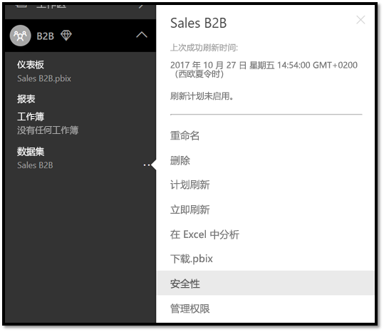

这会打开一个页面，在该页面中，Contoso 的 BI 团队可以查看他们所创建的两个角色。  Contoso 的 BI 团队现在可以将用户分配到角色。

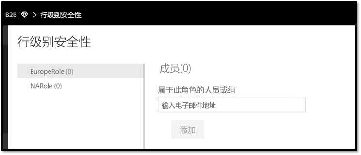

在示例中，Contoso 正在将具有电子邮件地址 "[adam@themeasuredproduct.com](mailto:adam@themeasuredproduct.com)" 的合作伙伴组织中的用户添加到欧洲角色：

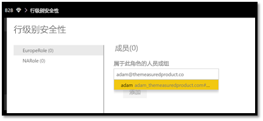

Azure AD 解决此情况后，Contoso 可以看到该名称显示在 "准备添加" 窗口中：

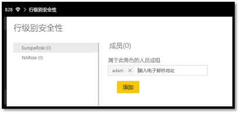

现在，当此用户打开与之共享的应用时，他们将只看到包含欧洲数据的报表：

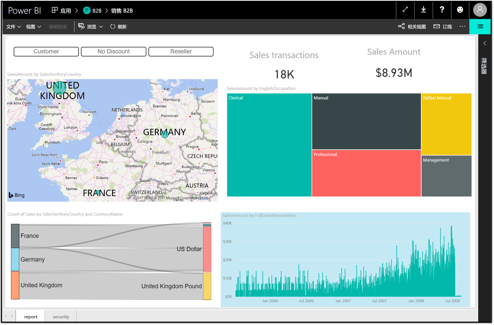

### 动态行级别安全性

另一个有趣的主题是了解动态行级别安全性（RLS）如何与 Azure AD B2B 一起工作。

简而言之，动态行级别安全性的工作方式是根据连接到 Power BI 的用户的用户名筛选模型中的数据。 您可以在模型中定义用户，而不是为用户组添加多个角色。 本文不会详细介绍此模式。 Kasper de Jong 提供[Power BI Desktop 动态安全](https://www.kasperonbi.com/power-bi-desktop-dynamic-security-cheat-sheet/)备忘单和[此白皮书](https://msdn.microsoft.com/library/jj127437.aspx)中的所有行级别安全性的风格的详细信息。

我们来看一个小示例-Contoso 提供了一个关于按组销售的简单报表：

现在，此报表需要与两个来宾用户和内部用户共享-内部用户可以看到所有内容，但来宾用户只能看到他们有权访问的组。 这意味着我们必须仅为来宾用户筛选数据。 为了适当地筛选数据，Contoso 使用白皮书和博客文章中所述的动态 RLS 模式。 也就是说，Contoso 将用户名添加到数据本身：

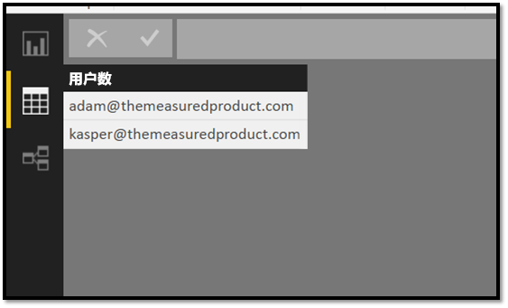

然后，Contoso 会创建适当的数据模型，以适当的关系筛选数据：

若要基于登录用户自动筛选数据，Contoso 需要创建一个在连接的用户中传递的角色。 在这种情况下，Contoso 会创建两个角色–第一个是 "securityrole"，它使用登录到 Power BI 的用户的当前用户名对用户表进行筛选（这甚至适用于 Azure AD B2B 来宾用户）。

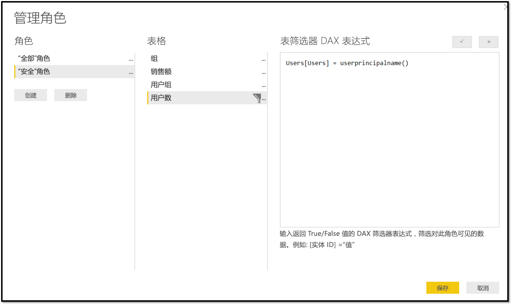

Contoso 还会为可查看所有内容的内部用户创建另一个 "AllRole" –此角色没有任何安全谓词。

将 Power BI 桌面文件上传到服务后，Contoso 可以将来宾用户分配给 "SecurityRole"，将内部用户分配给 "AllRole"

现在，当来宾用户打开该报表时，他们只能查看组 A 中的 sales：

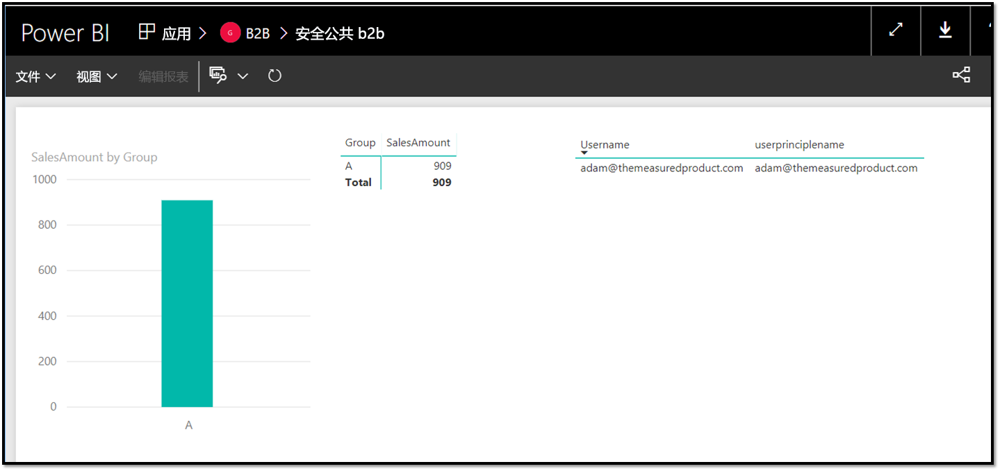

在右侧的矩阵中，可以看到 USERNAME （）和 USERPRINCIPALNAME （）函数的结果都返回来宾用户电子邮件地址。

现在，内部用户可查看所有数据：

如您所见，动态 RLS 适用于内部用户或来宾用户。

> [!NOTE]
> 此方案还适用于在 Azure Analysis Services 中使用模型。 通常，你的 Azure Analysis Service 连接到与你的 Power BI 相同的 Azure AD-在这种情况下，Azure Analysis Services 还知道通过 Azure AD B2B 邀请的来宾用户。

## 连接到本地数据源

Power BI 为 Contoso 提供[SQL Server Analysis Services](https://powerbi.microsoft.com/documentation/powerbi-gateway-enterprise-manage-ssas/)或[SQL Server](https://powerbi.microsoft.com/documentation/powerbi-gateway-kerberos-for-sso-pbi-to-on-premises-data/)的本地数据源（如[本地数据网关）](https://powerbi.microsoft.com/documentation/powerbi-gateway-onprem/)的功能。 甚至可以使用与 Power BI 一起使用的相同凭据登录到这些数据源。

> [!NOTE]
> 在安装网关以连接到 Power BI 租户时，必须使用在租户中创建的用户。 外部用户无法安装网关并将其连接到你的租户. _

对于外部用户，这可能更复杂，因为外部用户通常对本地 AD 是未知的。 Power BI 提供了一种解决方法，允许 Contoso 管理员将外部用户名映射到内部用户名，如[管理数据源-Analysis Services](https://powerbi.microsoft.com/documentation/powerbi-gateway-enterprise-manage-ssas/)中所述。 例如，可以将[lucy@supplier1.com](mailto:lucy@supplier1.com)映射到[lucy\_supplier1\_com #EXT@contoso.com](mailto:lucy_supplier1_com)。

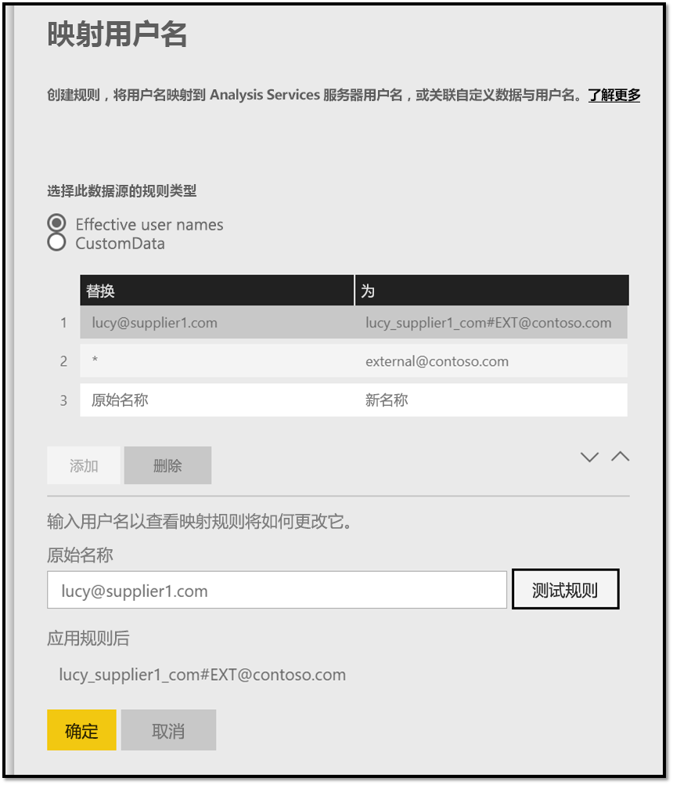

如果 Contoso 仅有少量用户或 Contoso 可以将所有外部用户映射到单个内部帐户，则此方法很合适。 对于更复杂的方案，其中每个用户都需要自己的凭据，还有一种更高级的方法，它使用[自定义 AD 特性](https://technet.microsoft.com/library/cc961737.aspx)来完成映射，如[管理数据源-Analysis Services](https://powerbi.microsoft.com/documentation/powerbi-gateway-enterprise-manage-ssas/)中所述。 这将允许 Contoso 管理员为 Azure AD 中的每个用户（也是外部 B2B 用户）定义一个映射。  这些属性可以通过使用脚本或代码的 AD 对象模型进行设置，因此 Contoso 可以完全自动完成邀请或计划节奏上的映射。

## 使外部用户能够编辑和管理 Power BI 中的内容

Contoso 可允许外部用户在组织内提供内容，如前文所组织编辑和管理 Power BI 内容 "部分中所述。

> [!NOTE]
> 若要编辑和管理组织的 Power BI 中的内容，用户必须在工作区之外的工作区中具有 Power BI Pro 许可证。 用户可以获取本文档的 "_许可_" 部分中介绍的 Pro 许可证。

Power BI 管理门户在租户设置中的 "组织" 设置中提供 "**允许外部来宾用户编辑和管理内容**"。 默认情况下，此设置设置为 "已禁用"，表示外部用户默认情况下会获得受限制的只读体验。 此设置适用于在 Azure AD 中将 UserType 设置为 Guest 的用户。 下表描述了用户体验的行为，具体取决于用户的 UserType 和配置设置的方式。

| **Azure AD 中的用户类型** | **允许外部来宾用户编辑和管理内容设置** | **操作** |
| --- | --- | --- |
| 来宾 | 为用户禁用（默认值） | 按项仅消耗视图。 通过发送给来宾用户的 URL 查看报表、仪表板和应用时，允许对报表、仪表板和应用进行只读访问。 Power BI 移动版应用为来宾用户提供只读视图。 |
| 来宾 | 已为用户启用 | 外部用户可以访问完整的 Power BI 体验，不过某些功能不可用于这些功能。 外部用户必须使用包含租户信息的 Power BI 服务 URL 登录到 Power BI。 用户获取家庭体验、"我的工作区"，并根据权限来浏览、查看和创建内容。    Power BI 移动版应用为来宾用户提供只读视图。 |

> [!NOTE]
> Azure AD 中的外部用户也可以设置为 UserType 成员。 Power BI 当前不支持此项。

在 Power BI 管理门户中，下图显示了该设置。

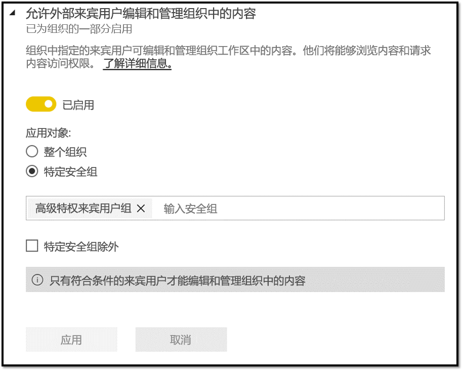

来宾用户获得只读默认体验，可以编辑和管理内容。 默认值为 "禁用"，表示所有来宾用户都具有只读体验。 Power BI 管理员可以为组织中的所有来宾用户或 Azure AD 中定义的特定安全组启用设置。 在下图中，Contoso Power BI 管理员在 Azure AD 中创建了一个安全组，以管理可在 Contoso 租户中编辑和管理内容的外部用户。

若要帮助这些用户登录到 Power BI，请为他们提供租户 URL。 要查找租户 URL，请执行以下步骤。

1. 在 Power BI 服务的顶部菜单中，选择 "帮助" （ **？** ），然后**就 Power BI**。
2. 查找 "**租户 URL**" 旁边的值。 这是你可以与来宾用户共享的租户 URL。

    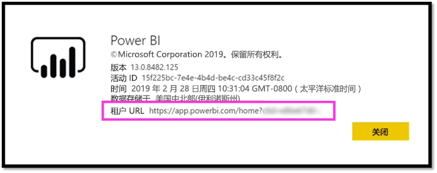

当使用 "允许外部来宾用户编辑和管理组织中的内容" 时，指定的来宾用户可以访问你的组织的 Power BI 并查看他们有权访问的任何内容。 他们可以访问主页、浏览内容并向工作区提供内容、在访问列表中安装应用，以及创建我的工作区。 还可以创建或成为使用新工作区体验的工作区管理员。

> [!NOTE]
> 使用此选项时，请务必查看此文档的监管部分，因为默认情况下 Azure AD 设置阻止来宾用户使用某些功能，如人员选取器，这可能会导致精简体验。 * *

对于通过 "组织租户" 设置中的 "允许外部来宾用户编辑和管理内容" 启用的来宾用户，一些经验不适用于他们。 若要更新或发布报表，来宾用户需要使用 Power BI 服务 web UI，包括获取数据以上传 Power BI Desktop 文件。 不支持以下体验：

- 从 Power BI Desktop 直接向 Power BI 服务发布
- 来宾用户不能使用 Power BI Desktop 连接 Power BI 服务中的服务数据集
- 与 Office 365 组关联的经典工作区： Guest 用户不能创建或不是这些工作区的管理员。 可以是成员。
- 对于工作区访问列表，不支持发送临时邀请
- 不支持来宾用户使用 Power BI Publisher for Excel
- 来宾用户不能安装 Power BI Gateway，也不能将它连接到组织
- 来宾用户不能安装发布到整个组织的应用
- 来宾用户不能使用、创建、更新或安装组织内容包
- 来宾用户不能使用“在 Excel 中分析”
- 来宾用户不能在注释中 @mentioned （此功能将在即将发布的版本中添加）
- 来宾用户不能使用订阅（此功能将在即将发布的版本中添加）
- 使用此功能的来宾用户应具有工作或学校帐户。 由于登录限制，使用个人帐户的来宾用户会遇到更多的限制。

## 调控

### 影响与 Azure AD B2B 相关的 Power BI 体验的其他 Azure AD 设置

当使用 Azure AD B2B 共享时，Azure Active Directory 管理员控制外部用户体验的各个方面。 这些设置是在租户 Azure Active Directory 设置内的 "外部协作设置" 页上控制的。

有关设置的详细信息，请参阅：

[https://docs.microsoft.com/azure/active-directory/b2b/delegate-invitations](https://docs.microsoft.com/azure/active-directory/b2b/delegate-invitations)

> [!NOTE]
> 默认情况下，"来宾用户权限受限" 选项设置为 "是"，因此，Power BI 中的 "来宾用户" 具有有限体验，特别是在用户选取器 Ui 对于这些用户而言不起作用的地方。 与 Azure AD 管理员一起将其设置为 "否" 很重要，如下所示，以确保获得良好的体验。 * *

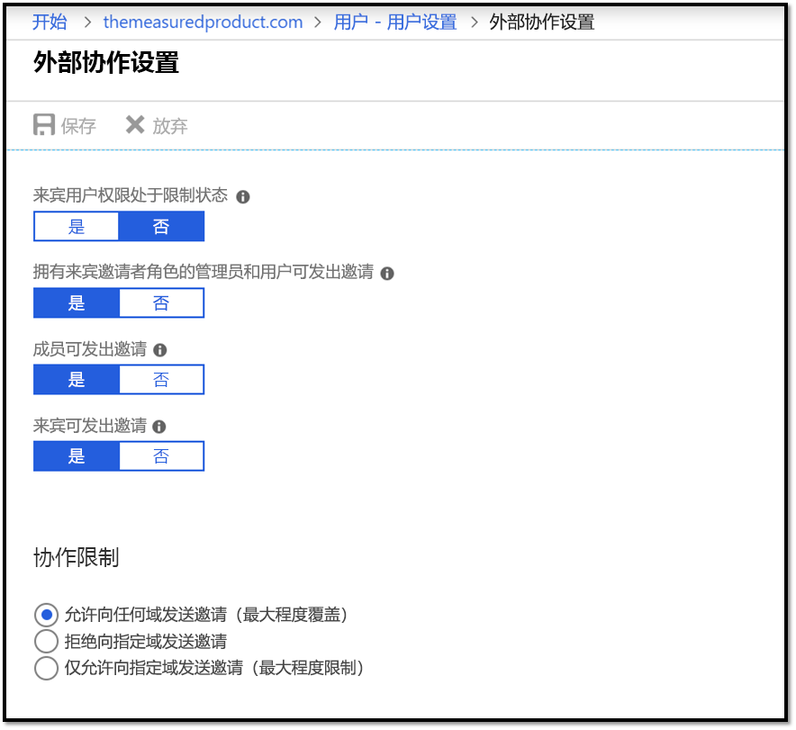

### 控制来宾邀请

Power BI 管理员可以通过访问 Power BI 管理门户来仅控制 Power BI 的外部共享。 但租户管理员还可以通过各种 Azure AD 策略来控制外部共享。  这些策略允许租户管理员

- 关闭最终用户的邀请
- 只有来宾邀请者角色中的管理员和用户可以邀请
- 管理员、来宾邀请者角色和成员可以邀请
- 所有用户（包括来宾）都可以邀请

有关这些策略的详细信息，请参阅[AZURE ACTIVE DIRECTORY B2B 协作的委托邀请](https://docs.microsoft.com/azure/active-directory/active-directory-b2b-delegate-invitations)。

外部用户的所有 Power BI 操作也[在我们的审核门户中](https://powerbi.microsoft.com/documentation/powerbi-admin-auditing/)进行了审核。

### 来宾用户的条件性访问策略

Contoso 可以为访问 Contoso 租户内容的来宾用户强制实施条件性访问策略。 可在[B2B 协作用户的条件访问](https://docs.microsoft.com/azure/active-directory/active-directory-b2b-mfa-instructions)中找到详细说明。

## 常见备选方法

虽然 Azure AD B2B 使你可以轻松地跨组织共享数据和报告，但在某些情况下，也可以使用多种其他方法。

### 替代选项1：为合作伙伴用户创建重复标识

如果选择此选项，Contoso 必须为 Contoso 租户中的每个合作伙伴用户手动创建重复标识，如下图所示。 然后，在 Power BI 中，Contoso 可以在适当的报告、仪表板或应用中共享到分配的标识。

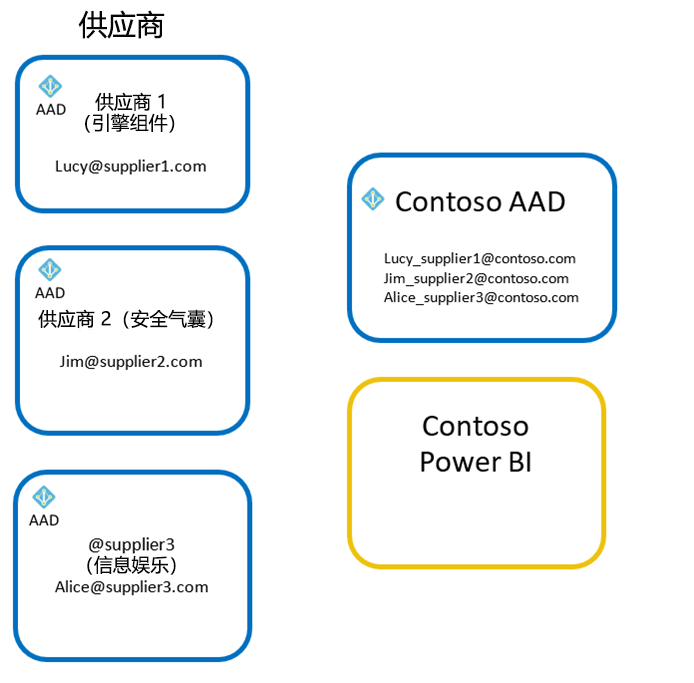

选择此替代项的原因：

- 由于用户的标识由您的组织控制，因此任何相关服务（如电子邮件、SharePoint 等）也在您的组织控制范围内。 你的 IT 管理员可以重置密码、禁止对帐户的访问或审核这些服务中的活动。
- 通常，为其业务使用个人帐户的用户不能访问某些服务，因此可能需要组织帐户。
- 某些服务仅适用于组织的用户。 例如，可能无法使用 Intune 来管理外部用户使用 Azure B2B 的个人/移动设备上的内容。

不选择这种替代方法的原因：

- 合作伙伴组织中的用户必须记住两组凭据–一个用于访问自己组织的内容，另一个用于从 Contoso 访问内容。 这对于这些来宾用户非常麻烦，并且很多来宾用户会感到困惑。
- Contoso 必须购买并将每用户许可证分配给这些用户。 如果用户需要接收电子邮件或使用 office 应用程序，则他们需要相应的许可证，包括 Power BI Pro 在 Power BI 中编辑和共享内容。
- Contoso 可能想要与内部用户相比，为外部用户强制实施更严格的授权和管理策略。 为实现此目的，Contoso 需要为外部用户创建内部命名法，并且需要为所有 Contoso 用户提供有关此命名法的教育。
- 当用户离开组织时，他们可以继续访问 Contoso 的资源，直到 Contoso 管理员手动删除其帐户
- Contoso 管理员必须管理来宾的身份，包括创建、重置密码等。

### 替代选项2：使用自定义身份验证创建自定义 Power BI Embedded 应用程序

Contoso 的另一种选择是通过自定义身份验证（["应用拥有数据"](https://docs.microsoft.com/power-bi/developer/embed-sample-for-customers)）构建自己的自定义嵌入 Power BI 应用程序。 尽管许多组织没有时间或资源来创建自定义应用程序以将 Power BI 内容分发给其外部合作伙伴，但对于某些组织来说，这是最佳方法，值得认真考虑。

通常，组织具有可集中访问合作伙伴的所有组织资源的现有合作伙伴门户，提供与内部组织资源的隔离，并为合作伙伴提供简化的体验，以支持多个合作伙伴和各自的用户。

在上面的示例中，每个供应商的用户登录到 Contoso 的合作伙伴门户，该门户使用 AAD 作为标识提供者。 它可以使用 AAD B2B、Azure B2C、本机标识或与任意数量的其他标识提供者联合。 用户使用 Azure Web 应用或类似的基础结构登录并访问合作伙伴门户生成。

在 web 应用中，Power BI 报表嵌入 Power BI Embedded 部署。 Web 应用将简化对报表和任何相关服务的访问，旨在使供应商能够轻松地与 Contoso 交互。 此门户环境将与 Contoso 内部 AAD 和 Contoso 内部 Power BI 环境隔离，以确保供应商无法访问这些资源。 通常，数据将存储在单独的合作伙伴数据仓库中，以确保数据的隔离。 此隔离具有一些优点，因为它限制了可直接访问你的组织数据的外部用户的数量，从而限制了可能向外部用户提供的数据，以及限制与外部用户的意外共享。

使用 Power BI Embedded，门户可以利用应用令牌、主用户和 Azure 模型中购买的高级容量来利用有利的许可，这简化了向最终用户分配许可证，并可基于预期使用量增加/减少的问题。 门户可以提供整体上质量和一致的体验，因为合作伙伴可访问单个门户，该门户旨在满足合作伙伴的所有需求。 最后，由于基于 Power BI Embedded 的解决方案通常设计为多租户，因此可以更轻松地确保合作伙伴组织之间的隔离。

选择此替代项的原因：

- 随着合作伙伴组织数量的增加，更易于管理。 由于合作伙伴被添加到独立于 Contoso 的内部 AAD 目录的单独目录，因此它简化了管理任务，并帮助防止意外将内部数据共享给外部用户。
- 典型的合作伙伴门户是高度品牌丰富的经验，具有跨合作伙伴的一致体验，并简化了以满足典型合作伙伴的需求。 因此，Contoso 可以通过将所有所需的服务集成到单个门户，为合作伙伴提供更好的总体体验。
- 高级方案（例如编辑 Power BI Embedded 中的内容）的许可成本包含在 Azure 购买的 Power BI Premium 中，不需要将 Power BI Pro 许可证分配给这些用户。
- 如果构建为多租户解决方案，则可在合作伙伴之间提供更好的隔离。
- 合作伙伴门户通常包含其他工具，供合作伙伴以外的其他工具 Power BI 报表、仪表板和应用。

不选择这种替代方法的原因：

- 构建、操作和维护此类门户需要大量精力，使其对资源和时间投入巨大的投入。
- 解决方案的时间比使用 B2B 共享长得多，因为需要在多个工作流中进行仔细规划和执行。
- 如果有较少数量的合作伙伴，此替代选项所需的工作量可能太大，无法证明。
- 与即席共享的协作是组织面临的主要方案。
- 每个合作伙伴的报表和仪表板均不同。 除了直接与合作伙伴共享以外，此替代方法还引入了管理开销。

## 常见问题

**Contoso 是否可以发送自动兑换的邀请，使用户只需 "准备就绪"？或者，用户是否始终需要单击到兑换 URL？**

最终用户必须始终单击许可体验才能访问内容。

如果你将邀请多个来宾用户，则我们建议你通过[将用户添加到资源组织中的来宾邀请者角色](https://docs.microsoft.com/azure/active-directory/active-directory-b2b-add-guest-to-role)，从核心 Azure AD 管理员委托此项。 此用户可以使用登录 UI、PowerShell 脚本或 Api 邀请合作伙伴组织中的其他用户。 这会减少 Azure AD 管理员向合作伙伴组织的用户邀请或重新发送邀请的管理负担。

**如果来宾用户的合作伙伴没有多重身份验证，Contoso 用户是否可以强制使用多因素身份验证？**

可以。 有关详细信息，请参阅[B2B 协作用户的条件性访问](https://docs.microsoft.com/azure/active-directory/active-directory-b2b-mfa-instructions)。

**当受邀伙伴使用联合添加自己的本地身份验证时，B2B 协作的工作原理是什么？**

如果合作伙伴具有联合到本地身份验证基础结构的 Azure AD 租户，则会自动实现本地单一登录（SSO）。 如果合作伙伴没有 Azure AD 租户，则可能会为新用户创建 Azure AD 帐户。

**是否可以邀请来宾用户使用使用者电子邮件帐户？**

Power BI 中支持邀请具有使用者电子邮件帐户的来宾用户。 这包括域，如 hotmail.com、outlook.com 和 gmail.com。 但是，这些用户可能会遇到除使用工作或学校帐户的用户所遇到的限制。
