# 部署和管理 Power BI Premium 容量

**摘要：** Power BI Premium 提供更一致的性能、支持大型数据卷, 并为组织中的每个人提供统一的自助服务和企业 BI 平台的灵活性。 此级别的300技术白皮书专门为 Power BI 管理员和内容作者和出版商编写。 它旨在帮助他们了解 Power BI Premium 的潜力, 并说明如何设计、部署、监视可伸缩解决方案并对其进行故障排除。

**主持**[Peter Myers](https://www.linkedin.com/in/peterjsmyers)(包含按位解决方案的数据平台 MVP 和独立 BI 专家)

**技术评审人员：** Adam Saxton、Akshai Mirchandani、Bhavik 商人、David Magar、Josh Caplan、Michael Blythe、Nimrod Shalit、Marc-olivier Matrat、Swati Gupta

**适用于：** Power BI 服务、Power BI Premium 和 Azure Power BI Embedded 容量

> [!NOTE]
> 可以从浏览器中选择“打印”，然后选择“另存为 PDF”文件，以保存或打印此白皮书。

## Power BI 简介

Power BI 是一种业务分析服务, 旨在提供快速、明智的决策。 由于它在2015中的版本, 它很快就成为了一个常用的服务, 用于将最小组织的解决方案交付到最大的企业。

它通过两种方式提供:作为云服务, 作为名为**Power BI 报表服务器**的本地报表解决方案。 \[[2](#endnote-01)\]

作为云服务 Power BI 是软件即服务 (SaaS) \[ [2](#endnote-02)\]。 它代表一组服务和应用程序, 使组织能够开发、部署、管理和共享解决方案来监视其业务。

这不是此白皮书旨在提供 Power BI 服务的综合说明。 而是侧重于与 Power BI Premium 主题相关的主题。 有关 Power BI 的常规信息, 请参阅综合性[Power BI 文档](service-admin-premium-multi-geo.md)。 有关 Power BI 服务的更详细说明, 其中重点介绍如何实现良好的企业部署, 请参阅全面[规划 Power BI 企业部署](https://aka.ms/pbienterprisedeploy)白皮书。

本白皮书主题的上下文中介绍了容量、Power BI 内容类型、模型存储模式和授权。 了解这些主题对于成功部署和管理 Power BI Premium 至关重要。

### 容量

**容量**是一种核心 Power BI 概念, 表示用于托管和提供 Power BI 内容的一组资源 (存储、处理器和内存)。 容量是共享的, 或者是专用的。 **共享容量**与其他 Microsoft 客户共享, 而**专用容量**完全提交给单个客户。 [高级容量](#premium-capacities)主题中引入了专用容量。

在共享容量中, 工作负荷在与其他客户共享的计算资源上运行。 由于容量必须共享资源, 因此会施加限制以确保 "公平扮演", 如最大模型大小 (1 GB) 和每日最大刷新频率 (每天8次)。

### 工作区

Power BI 工作区驻留在容量范围内, 它们表示安全性、协作和部署容器。 每个 Power BI 用户都有一个称为“我的工作区”的个人工作区。 可创建其他工作区以启用协作和部署，这些工作区称为“应用工作区”。 默认情况下, 将在共享容量中创建工作区 (包括个人工作区)。

### Power BI 内容类型

若要引入 Power BI Premium 主题, 请首先全面讨论 Power BI 体系结构, 其中包括基本内容类型。

所有 Power BI 内容都在工作区中进行存储和管理, 这些工作区是用于 Power BI 内容的容器。 每个 Power BI 用户都有自己的个人工作区, 但一般的最佳做法是创建应用工作区。 应用工作区可实现内容的共同所有权, 并能够在内容上进行协作。 它们还提供将内容暂存并分发给广大受众的能力, 作为应用。

以下 Power BI 内容存储在工作区中:

- 数据流
- 数据集
- 工作簿
- 报表
- 仪表板

#### 数据流

Power BI 数据流帮助组织统一来自不同源的数据。 它们可被视为准备好并暂存在模型中使用的数据, 但不能直接将它们用作报表的源。 它们利用 Microsoft 数据连接器的广泛集合, 使你能够从本地和基于云的数据源引入数据。

只能在应用工作区中创建和管理数据流, 它们作为实体存储在 Azure Data Lake Storage Gen2 的通用数据模型 (CDM) 中。 通常, 它们计划定期刷新, 以存储最新的数据。

有关详细信息, 请参阅[Power BI (预览版) 文档中的自助服务数据准备](service-dataflows-overview.md)。

#### 数据集

Power BI 数据集表示可用于报告和可视化的数据源。 有多种类型的数据集, 由创建:

- 连接到未托管在 Power BI 容量中的现有数据模型
- 上载包含模型的 Power BI Desktop 文件
- 上载 Excel 工作簿 (其中包含一个或多个 Excel 表和/或工作簿数据模型) 或上传逗号分隔值 (CSV) 文件
- 使用 Power BI 服务创建推送、流式处理或混合流式处理数据集

除流式处理数据\[集[3](#endnote-03)\]外, 数据集表示利用 Analysis Services 的成熟建模技术的数据模型。

请注意, 在文档中, 有时术语数据集和模型是可互换的。 通常, 从 Power BI 服务角度来看, 它称为**数据集**, 从开发角度来看, 它称为**模型**。 在此白皮书的上下文中, 这些内容的意思大致相同。

##### 外部托管的模型

连接到外部托管的模型时, 需要安装[本地数据网关](service-gateway-onprem.md)以连接到 SQL Server Analysis Services, 无论该模型是本地还是 VM 托管的基础结构即服务 (IaaS)。 Azure Analysis Services 不需要网关。 当存在现有模型投资时, 这种情况通常很有意义, 通常构成企业数据仓库 (EDW) 的一部分。 它允许 Power BI 通过使用 Power BI 报表用户的标识强制数据权限, 来执行到 Analysis Services 的**实时连接**(LC) 并执行此操作。 对于 SQL Server Analysis Services, 同时支持多维模型 (多维数据集) 和表格模型。 如下图所示, 实时连接数据集将查询传递到外部承载的模型。

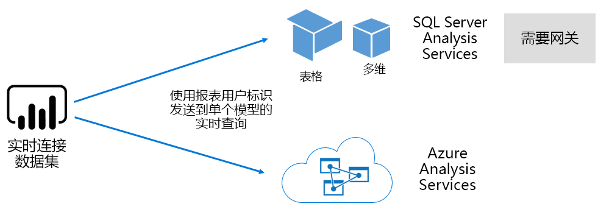

##### Power BI Desktop 开发的模型

Power BI Desktop-用于开发 Power BI 的客户端应用程序-可用于开发有效地成为 Analysis Services 表格模型的模型。 可以通过从数据流导入数据, 然后将其与其他数据源集成, 来开发模型。 尽管有关建模如何实现的具体内容超出了本白皮书的范围, 但请务必了解, 可以使用 Power BI Desktop 开发三种不同类型的模型或模式模型。 这些模式将确定是将数据导入到模型中, 还是将数据保留在数据源中。 这三种模式如下:导入、DirectQuery 和复合。 [模型存储模式](#model-storage-modes)主题中介绍了每种模式的完整讨论。

在 Power BI 桌面开发的外部托管模型和模型可以强制执行行级别安全性 (RLS), 以限制可为某个用户检索的数据。 例如, 分配给销售人员安全组的用户只能查看为其分配的销售区域的报表数据。 RLS 角色可以是动态的或静态的。 **动态角色**按报表用户进行筛选, 而**静态角色**则为分配给该角色的所有用户应用相同的筛选器。

##### Excel 工作簿模型

基于 Excel 工作簿或 CSV 文件创建数据集将导致自动创建模型。 Excel 表和 CSV 数据将导入以创建模型表, 而 Excel 工作簿数据模型将被转置为创建 Power BI 模型。 在所有情况下, 都会将文件数据导入到模型中。

然后, 可以对表示模型的 Power BI 数据集进行区别:

- 它们要么托管在 Power BI 服务中, 要么位于外部 Analysis Services
- 它们可以存储导入的数据, 也可以向基础数据源发出传递查询请求, 或同时执行这两种查询

下面总结了有关表示模型的 Power BI 数据集的重要事实:

- SQL Server Analysis Services 托管模型需要使用网关执行 LC 查询
- 导入数据的 Power BI 承载的模型
  - 必须完全加载到内存中, 以便可以对其进行查询
  - 需要刷新以使数据保持最新, 并且当无法通过 Internet 直接访问源数据时, 必须包含网关
- 使用 DirectQuery (DQ) 存储模式 Power BI 承载的模型需要连接到源数据。 查询模型时, Power BI 向源数据发出查询以检索当前数据。 当无法通过 Internet 直接访问源数据时, 此模式必须包含网关。
- 模型可能强制执行 RLS 规则, 并强制筛选器限制特定用户的数据访问

若要成功地部署和管理 Power BI Premium, 必须了解模型的托管位置、存储模式、网关的任何依赖关系、已导入数据的大小以及刷新类型和频率。 这些都可能对 Power BI Premium 资源有重大影响。 此外, 模型设计本身包括其数据准备查询和计算, 还可以增加注意事项。

还必须了解 Power BI 托管的导入模型可以根据计划进行刷新, 或按用户在 Power BI 服务中按需触发。

[优化模型](#optimizing-models)主题的此技术文章中稍后将介绍设计优化模型。

#### 工作簿

Power BI 工作簿是 Power BI 的内容\[类型[4](#endnote-04)\]。 它们是已上载到 Power BI 服务的 Excel 工作簿, 不应与创建数据集 (模型) 的已上载 Excel 工作簿混淆。 工作簿内容类型代表与工作簿的连接, 该工作簿可以上载到 Power BI 服务或保留在 OneDrive 或 SharePoint Online 上的云存储中。

必须了解的是, 此内容类型不可用作 Power BI 数据可视化的数据源。 相反, 它可以通过使用 Excel Online 作为 Power BI 服务中的工作簿打开。 此内容类型的主要目的是允许旧 Excel 工作簿报表可以从 Power BI 服务内访问, 并允许其数据可视化对象固定到 Power BI 仪表板。

有关详细信息, 请参阅[从 Excel 工作簿文件中获取数据](service-excel-workbook-files.md)文档。

#### 报表

有两种类型的报表:Power BI 报表和分页报表。

**Power BI 报表**提供仅连接到单个数据集的交互式数据可视化体验。 报表通常用于鼓励用户参与, 使其能够与一组特别功能进行交互, 包括筛选、切片、交叉筛选和突出显示、向上钻取、向下钻取、向下钻取、Q & 自然语言质疑、聚焦、页面导航、spotlighting、查看书签等。

在此白皮书的上下文中, 务必了解 Power BI 体系结构、Power BI 报表设计和用户交互如何对 Power BI 服务资源造成影响:

- 若要加载基于导入模型的报表并与之进行交互, 该模型必须完全加载到内存中 (无论是托管在 Power BI 服务中还是托管在外部)
- 每个报表视觉对象通过查询模型发出查询以检索数据
- 通常, 筛选器和切片器交互涉及查询模型。 例如, 默认情况下, 更改切片器选择时, 需要在页面\[ [5](#endnote-05)上重新加载每个视觉对象\]
- Power BI 报表不保证显示当前数据, 可能需要用户刷新报表以重新加载报表页及其视觉对象
- 用户可以使用 Q & 自然语言功能来提问、提供 Power BI 报表设计允许它, 数据集表示 Power BI 承载的数据导入模型, 或配置为启用 Q &

**分页报表**允许发布和呈现 SQL Server Reporting Services (SSRS) 报表 (\*.rdl 格式)。 顾名思义, 当要求要求打印到固定页面大小时, 或者当存在必须完全展开的数据的变量列表时, 通常使用分页报表。 例如, 为多页面呈现而设计的发票 (而不是在视觉对象中滚动) 和打印。

两种支持的报表类型为报表作者提供了选择, 使他们能够根据要求和预期用途选择类型。 通常情况下, Power BI 报表适用于交互式体验, 使用户能够浏览和发现数据中的见解, 而分页报表则更适合参数驱动的页面布局。

不管报表类型如何, 实现响应式报表加载和数据更新 (筛选器或参数发生更改时) 都是强制性的, 以便提供可靠且性能良好的用户体验。

#### 仪表板

Power BI 仪表板旨在提供监视体验, 与 Power BI 报表在概念上非常不同。 面板专用于在单个窗格上显示, 以表示磁贴中的值和数据可视化。 通常, 仪表板与 Power BI 报表相比提供更少的交互体验, 某些仪表板设计不应交互。 例如, 在服务器房间内的非触摸屏上显示了一个无人参与的仪表板。 另一个重要区别是, 仪表板可能会显示来自多个数据集的源数据, 而 Power BI 报表只能基于单个数据集。

必须了解的是, 仪表板设计为快速加载并随时表示最新的数据 (已知为 Power BI 服务)。 它通过缓存磁贴查询结果实现此功能, 并对每个仪表板执行此功能。 事实上, 对于有权访问基于强制执行动态 RLS 的模型的仪表板的每个用户, 它必须执行此操作。

在刷新 Power BI 托管的导入模型之后, Power BI 服务会立即自动更新仪表板查询缓存。 对于 LC 和 DQ 模型, 数据集所有者对 Power BI 服务更新缓存的频率进行了一定程度的控制, 可将其配置为每隔15分钟一次, 或在一周内经常进行一次。 请注意, LC 查询缓存更新首先会查询模型元数据, 以确定自上次缓存更新后是否发生了模型刷新, 并且在发生刷新后, 不会继续更新缓存。 此检查不适用于 DQ 模型, 因此, 无论源数据是否已更改, 都将发生缓存更新。

基于 DQ 和 LC 模型的仪表板查询缓存更新会显著影响 Power BI 服务资源和外部数据源。 请考虑一个具有20个磁贴的仪表板, 所有这些磁贴都基于一个实施动态 RLS 的 Azure Analysis Services 模型, 每小时刷新一次, 并与100用户共享此仪表板。 如果数据集配置为每小时刷新一次, 则这将导致至少 2000 (20 x 100) LC 查询。 这可能会给 Power BI 服务和外部数据源带来巨大负载, 还会超出对可用资源施加的限制。 容量资源和限制在[容量节点](#capacity-nodes)主题中进行了介绍。

用户可以通过多种方式与仪表板进行交互, 这需要 Power BI 服务的资源。 具体而言, 他们可以:

- 触发仪表板磁贴刷新, 这可能会导致按需刷新所有相关的 Power BI 承载的数据导入模型
- 与 Q & 自然语言功能来提问 (提供仪表板设计允许它, 数据集是 Power BI 托管的数据导入模型, 或配置为启用 Q & A 的 LC 数据集)
- 使用快速见解功能 Power BI 从基础数据集发现见解, 并使用显示和描述它们的视觉对象 (提供磁贴基于 Power BI 托管数据导入模型的数据集) 进行响应
- 配置仪表板磁贴上的警报, 要求 Power BI 服务将阈值与平铺值进行比较 (可能频率为每小时), 并在超过阈值时通知用户 (提供磁贴显示单个数值并且基于Power BI 承载的数据导入模型的数据集)

### 模型存储模式

请记住, Power BI Desktop 允许在三种模式下开发模型。 务必了解每个数据模型存储模式的基本原理, 并可能对 Power BI 服务资源造成影响。 本部分介绍了所有这三种模式。 本白皮书后面的 "优化模型" 主题中将进一步详细讨论这些内容。

#### 导入模式

导入模式是用于开发模型的最常见模式, 因为与内存中查询相关联的性能极快, 建模者可以使用设计灵活性, 并支持特定 Power BI 服务功能 (Q & A 快速见解, 等等)。 这是创建新的 Power BI Desktop 解决方案时的默认模式。

重要的是要了解导入的数据始终存储到磁盘中, 并且必须将其完全加载到内存中以供查询或刷新。 在内存中, 导入模型实现超快快速查询结果。 还必须了解, 将导入模型部分加载到内存中没有任何概念。

刷新后, VertiPaq 存储引擎对数据进行压缩和优化, 然后将其存储到磁盘。 从磁盘加载到内存中时, 可以看到10倍压缩, 因此, 如果 10 GB 的源数据可以压缩到大约 1 GB 的大小, 则合理。 磁盘上的存储大小可以使其达到 20% 的上限。 \[[6](#endnote-06)\]

可以通过三种方式实现设计灵活性。 数据建模者可以:

- 通过缓存多个数据源中的数据来集成数据-无论数据源类型和格式如何
- 创建数据准备查询时, 请利用整组 Power Query 公式语言 (非正式称为 M) 函数
- 在使用计算列、计算表和度量值增强模型时, 利用整个数据分析表达式 (DAX) 函数集

如下图所示, 导入模型可以集成任意数量受支持的数据源类型的数据。

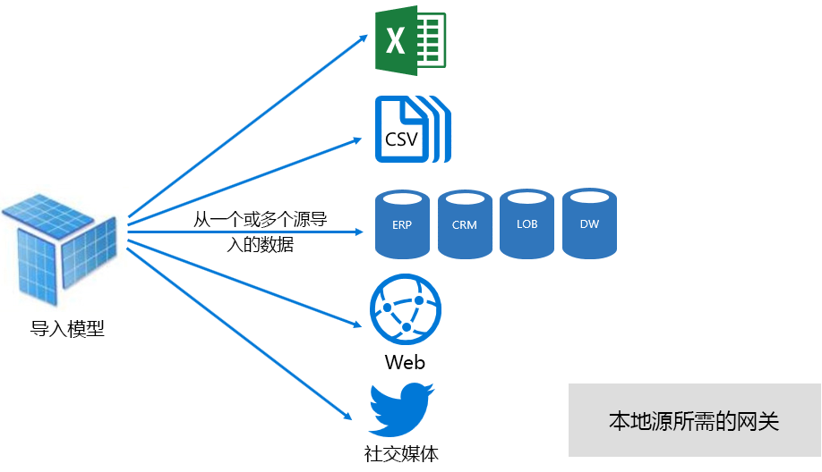

不过, 虽然与导入模型关联的优势有说服力, 但也存在一些缺点:

- 在 Power BI 可以查询模型之前, 必须将整个模型加载到内存中, 这可能会对可用资源施加压力, 因为模型的数量和大小会增长
- 模型数据仅与最新刷新相同, 因此需要刷新导入模型, 最好按计划进行刷新
- 完全刷新会从所有表中删除所有数据, 并从数据源重新加载数据。 对于 Power BI 服务和数据源而言, 这可能会占用大量的时间和资源。 Power BI 确实支持增量刷新, 这可以避免截断和重新加载整个表, 并在[优化 Power BI 托管模型](#optimizing-power-bi-hosted-models)主题中进行了介绍。

从 Power BI 服务资源的角度来看, 导入模型需要:

- 用于在查询或刷新模型时加载模型的足够内存
- 处理资源和额外的内存资源以刷新数据

#### DirectQuery 模式

以 DirectQuery (DQ) 模式开发的模型不会导入数据。 相反, 它们仅包含查询时对基础数据源发出本机查询的元数据。

考虑开发 DQ 模型有两个主要原因。 第一个原因是数据量太大, 甚至当应用了数据缩减方法时, 也会加载到模型中或实际刷新。 第二个原因是, 报表和仪表板需要提供 "接近实时" 数据, 超过计划的刷新限制 (一天48次用于专用容量) 中可达到的数据。

DQ 模型有以下几个优点:

- 导入模型大小限制不适用
- 模型不需要刷新
- 当与报表筛选器和切片器交互时, 报表用户将看到最新的数据, 并且可以刷新整个报表以检索当前数据
- 如果仪表板磁贴基于 DQ 模型, 则可以每隔15分钟自动更新一次

但有许多与 DQ 模型关联的缺点和限制:

- 模型必须基于单个受支持的数据源, 因此, 必须已在数据源中实现任何数据集成。 支持的数据源是关系和分析系统, 支持多种热门数据存储\[ [7](#endnote-07)\]。
- 性能可能很慢, 可能对 Power BI 服务 (查询可能占用大量 CPU) 和数据源 (可能未针对分析查询进行优化) 产生负面影响
- Power Query 查询不太复杂, 并且限制为 M 个表达式和函数, 可转换为数据源所理解的本机查询
- DAX 函数仅限于那些可转到数据源所理解的本机查询的函数, 不支持计算表或内置时间智能功能
- 默认情况下, 需要检索超过1000000行的模型查询将失败
- 具有多个视觉对象的报表和仪表板可能显示不一致的结果, 尤其是当数据源可变时
- 问: 不支持和快速见解 &

从 Power BI 服务资源的角度来看, DQ 模型需要:

- 查询时加载模型的最小内存 (仅元数据)
- 用于生成和处理发送到数据源的查询的大量处理器资源

有关详细信息, 请参阅[在 Power BI Desktop 文档中使用直接查询](desktop-use-directquery.md)。

#### 复合模式

复合模式下开发的模型允许为单独的模型表配置存储模式。 因此, 它支持导入和 DQ 表的混合。 它还支持计算表 (通过 DAX 定义) 和多个 DQ 数据源。

表存储模式可以配置为 "导入"、"DirectQuery" 或 "双"。 配置为双存储模式的表同时是导入和 DirectQuery, 这允许 Power BI 服务确定查询所使用的最有效模式。

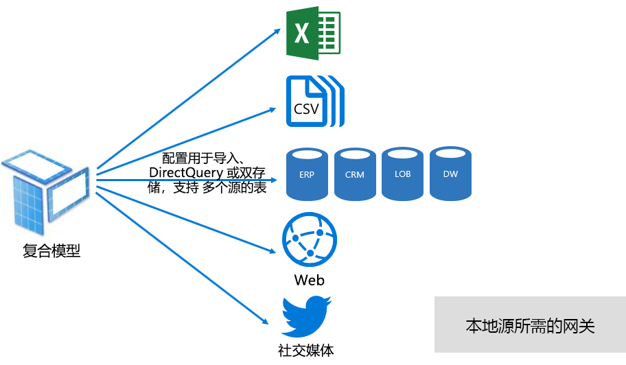

复合模型致力于提供最理想的导入模式和 DirectQuery 模式。 如果正确配置, 则可以将内存中模型的高查询性能与从数据源中检索近乎实时的数据的能力结合起来。

开发复合模型的数据建模者可能会在 "导入" 或 "双存储" 模式下配置维度类型表, 并在 DirectQuery 模式下配置事实类型表。 例如, 考虑一个模型, 该模型的产品维度类型为双重模式, 并且在 DirectQuery 模式下为销售事实类型表。 可以从内存中有效且快速地查询 Product 表以呈现报表切片器。 然后, 可以在已联接到相关产品表的 DirectQuery 模式下查询 Sales 表。 后一种查询可以生成单个高效的本机查询来联接产品和销售表, 并按切片器值进行筛选。

通常, 可以将与每个模型模式关联的优点和缺点视为适用于复合模型中的表存储模式。

有关详细信息, 请参阅[使用复合模型 Power BI Desktop](desktop-composite-models.md)文档。

### 许可

Power BI 有三个许可证:

- Power BI（免费）
- Power BI Pro
- Power BI Premium

使用**Power BI 免费**许可证, 个人可以通过发布模型和报表来登录到 Power BI 服务并在其个人工作区中工作。 务必要了解, 不能使用此许可证来共享 Power BI 内容。 此许可证的名称建议, 是免费的。

**Power BI Pro**许可证允许个人在应用工作区内创建和协作, 并共享和分发 Power BI 内容。 它们还可以为其数据集配置刷新, 以自动使数据保持最新 (包括从本地数据源)。 此外, 他们还可以审核和管理数据的访问和使用方式。 除非用户与 Power BI Premium 专用容量相关联, 否则从其他人那里接收共享内容需要此许可证。

**Power BI Premium**许可证是租户级许可证, 并在[Power BI Premium 简介](#introducing-power-bi-premium)部分中进行了介绍。

有关 Power BI 许可的详细信息, 请参阅[Power BI 定价](https://powerbi.microsoft.com/pricing/)页。

## 简介 Power BI Premium

Power BI Premium 提供了一个统一的自助服务和企业 BI 平台, 具有规模、可靠的性能和可预测的成本。 它主要通过提供专用资源来为你的组织运行 Power BI 服务。

此外, Power BI Premium 提供了许多企业功能:

- 经济高效的内容分发, 允许将 Power BI 内容共享到无限制的免费用户 Power BI, 包括外部用户
- 支持较大的数据\[集大小[8](#endnote-08)\]
- 数据流和数据集的刷新率较高 (每天最多48次)
- 增量刷新数据流和数据集
- 数据流链接实体和并行执行转换
- 分页报表
- Power BI 报表服务器, 用于本地报表
- 能够代表应用用户 (PaaS) 在应用中嵌入内容

其中的许多功能可用于提供高效且可缩放的企业解决方案, 并在 "[优化高级容量](#optimizing-premium-capacities)" 部分中介绍。

### 订阅和授权

Power BI Premium 是租户级别的 Office 365 订阅，可在两个 SKU（库存单位）系列中使用：

- **EM**用于嵌入的 Sku (EM1-EM3), 需要每年承诺, 每月计费
- **P** Sku (P1-P3) 用于嵌入和企业功能, 需要每月或每年承诺, 每月计费, 并包括在本地安装 Power BI 报表服务器的许可证

另一种方法是购买包含单个 SKU 系列的 Azure Power BI Embedded 订阅:**Sku (** A1-A6) 仅用于嵌入和容量测试目的。

所有 sku 均提供了双核来创建容量\[ [9](#endnote-09)\], 但全身 sku 限制为嵌入较小的范围。 尽管此白皮书的重点是在 P Sku 上, 但讨论的很多内容也与 Sku 相关。

与 Premium 订阅 SKU 相反，Azure SKU 不需要时间承诺，并按小时计费。 它们提供完全的灵活性，可实现纵向扩展、横向扩展、暂停、恢复和删除。

Azure Power BI Embedded 很大程度上超出了本白皮书的范围, 但在测试方法主题中讨论了如何测试和度量工作负荷。

有关 Azure Sku 的详细信息, 请参阅[azure Power BI Embedded 文档](/azure/power-bi-embedded/)。

Power BI Premium 订阅由 Microsoft 365 管理中心的管理员购买。 具体而言, 只有 Office 365 全局管理员或计费管理员才能购买 Sku。

购买后, 租户会收到相应数量的需要分配给容量的 v 内核, 这称为 " **v 核心池**"。 例如，购买 P3 SKU 会为租户提供 32 个 V 核心。

有关详细信息, 请参阅[如何购买 Power BI Premium](service-admin-premium-purchase.md)文档。

### 高级容量

与在与其他客户共享的计算资源上运行工作负荷的共享容量相反,**专用的容量**由组织独占使用。 它与专用的计算资源隔离, 这些资源为托管内容提供可靠且一致的性能。

本白皮书的重点是**高级容量**, 这意味着它与任意全身或 P sku 相关联。

#### 容量节点

如订阅和授权主题中所述, 有两个 Power BI Premium SKU 系列:EM 和 P。所有 Power BI Premium Sku 均可用作容量节点, 每个 Sku 表示由处理器、内存和存储组成的一组资源。 除资源以外, 每个 SKU 的操作限制为每秒 DirectQuery (DQ) 和实时连接 (LC) 连接数, 以及并行模型刷新次数。

处理由一定数量的 V 核心实现，并在后端和前端之间平均分配。

**后端 V 核心**负责核心 Power BI 功能，包括查询处理、缓存管理、运行 R 服务、模型刷新、自然语言处理（问答）以及在服务器端呈现报表和图像。 后端内核分配固定内存量, 此内存主要用于托管模型, 这些模型也称为活动数据集。

**前端端核心**负责 web 服务、仪表板和报表文档管理、访问权限管理、计划、api、上传和下载, 通常是与用户体验相关的所有内容。

存储设置为每个容量节点 100 TB。

下表介绍了每个高级 SKU 的资源和限制 (与 SKU 大小相同)。

| 容量节点 | 总虚拟核心 | 后端 V 核心 | RAM (GB) | 前端 V 核心 | DQ/LC (每秒) | 模型刷新并行度 |
| --- | --- | --- | --- | --- | --- | --- |
| EM1/A1 | 1 | 0.5 | 2.5 | 0.5 | 3.75 | 1 |
| EM2/A2 | 2 | 1 | 5 | 1 | 7.5 | 2 |
| EM3/A3 | 4 | 2 | 10 | 2 | 15 | 3 |
| P1/A4 | 8 | 4 | 25 | 4 | 30 | 6 |
| P2/A5 | 16 | 8 | 50 | 8 | 60 | 12 |
| P3/A6 | 32 | 16 | 100 | 16 | 120 | 24 |
| | | | | | | |

#### 容量工作负荷

容量工作负载是为用户提供的服务。 默认情况下, 高级和 Azure 容量仅支持与正在运行的、无法禁用 Power BI 查询相关联的数据集工作负荷。

可以为分页报表、数据流和 AI 启用附加工作负荷。 每个附加工作负荷都需要配置工作负荷可以使用的最大内存量 (以总可用内存的百分比表示)。

#### 容量功能

在任何时候, Power BI 服务都努力充分利用容量资源, 同时不超过对容量施加的限制。

容量操作归类为 "交互" 或 "背景"。 交互式操作包括呈现请求和响应用户交互（筛选、问答查询等）。 通常, 导入模型查询会占用大量内存资源, 同时查询 LC/DQ 模型会占用大量 CPU。 后台操作包括数据流和导入模型刷新，以及仪表板查询缓存。

必须了解, 交互式操作始终优先于后台操作, 以确保尽可能获得最佳的用户体验。 如果资源不足，则会在释放资源时将后台操作添加到队列中进行处理。 后台操作 (如数据集刷新和 AI 函数) 可以由 Power BI 服务停止并添加到队列中。

导入模型必须完全加载到内存中, 以便可以对其进行查询或刷新。 Power BI 服务使用复杂的算法管理内存使用情况, 以确保最大程度地使用可用内存, 并可实现容量的过载:尽管容量可以存储许多导入模型 (每个高级容量高达 100 TB), 但当其合并的磁盘存储超过支持的内存时 (和查询和刷新需要额外的内存), 则它们无法全部加载到内存中相同时间。

因此, 导入模型会根据使用情况加载到内存中, 并从内存中删除。 导入模型在查询时加载 (交互式操作), 而不是在内存中, 或者要刷新 (后台操作) 时。

从内存中删除模型称为**逐出**, 它是 Power BI 可以根据模型大小快速执行的操作。 如果容量没有遇到任何内存压力，则模型只需加载到内存中并保持原位。 \[[10然而,](#endnote-10)如果内存不足, 无法加载模型, Power BI 服务首先需要释放内存。\] 它通过查找过去三分钟\[ [11](#endnote-11)\]中未使用的模型, 然后将其逐出, 来释放已变为非活动状态的模型, 以释放内存。 如果没有要逐出的非活动模型，则 Power BI 服务会尝试逐出为后台操作加载的模型。 这可能包括逐出后台工作负荷, 如 AI 工作负荷。 最后一种手段是, 30 秒后失败\[的尝试[11](#endnote-11)\]将导致交互操作失败。 在这种情况下, 报表用户会得到错误通知, 并在稍后再次尝试尝试。

很重要的一点是, 数据集逐出是正常和预期的行为。 它致力于通过加载和卸载组合大小可能超过可用内存的模型来最大化内存使用率。 这是设计使然，并且对报表用户完全透明。 高逐出率并不一定意味着容量分配到的资源不足。 然而，如果因高逐出率而导致查询或刷新响应性受到影响，则它们可能会成为问题。

刷新导入模型始终会消耗大量内存, 因为模型必须加载到内存中, 并且需要额外的内存来进行处理。 完全刷新可能会使用大约两倍的模型所需内存量。 这样可确保即使在处理模型时也可对其进行查询 (将查询发送到现有模型, 直到刷新完成并且新的模型数据可用)。 请注意, 增量刷新需要的内存较少, 并且可以更快地完成, 因此可以显著降低容量资源的压力。 对于模型，刷新也可能为 CPU 密集型，特别是那些具有复杂 Power Query 转换的模型，或者复杂或基于大型表的计算表/列。

类似刷新的查询-要求将模型加载到内存。 如果内存不足，Power BI 服务将尝试逐出非活动模型；如果无法这样做（因为所有模型都处于活动状态），刷新作业将排队。 刷新通常占用大量 CPU, 甚至比查询更多。 因此，并发刷新数量存在容量限制，其向上舍入设置为后端 V 核心数量的 1.5 倍。 如果并发刷新过多，则计划的刷新将排队。 发生这些情况时，刷新需要更长的时间才能完成。 请注意, 按需刷新 (由用户请求或 API 调用触发) 将重试三次\[ [11](#endnote-11)\], 如果仍没有足够的资源, 则会失败。

## 管理 Power BI Premium

管理 Power BI Premium 涉及到购买订阅、创建、管理和监视高级容量。

### 创建和管理容量

在**Power BI 管理**门户的 "**容量设置**" 页上, 将显示已购买且可用的 v 核心数 (即, 还会分配给容量) 并列出高级容量。 使用此页, Office 365 全局管理员或 Power BI 服务管理员可以从可用的 i 核创建高级容量, 或修改现有的高级容量。

创建高级容量时, 需要管理员定义:

- 容量名称 (在租户中唯一)
- 容量管理员
- 容量大小
- 数据驻留\[ [12](#endnote-12)的区域\]

至少必须分配一个容量管理员。 分配为容量管理员的用户可以:

- 将工作区分配到容量
- 管理用户权限, 添加额外的容量管理员或具有分配权限的用户 (使其能够将工作区分配到容量)
- 管理工作负荷, 为分页报表和数据流工作负荷配置最大内存使用情况
- 重新启动容量, 以便在系统超载\[ [13](#endnote-13)时重置所有操作\]

容量管理员无法访问工作区内容 (除非显式分配的工作区权限), 并且他们无权访问所有 Power BI 管理区域 (除非显式分配), 如使用情况指标、审核日志或租户设置。 重要的是, 容量管理员不具备创建新容量或扩展现有容量的权限。 而且, 它们按每个容量分配, 确保它们只能查看和管理为其分配的容量。

必须从可用的 SKU 选项列表中选择容量大小, 此列表受池中可用的 v 核心数限制。 可以从一个或多个购买的 Sku 创建来自池的多个容量。 例如, P3 SKU (32) 可用于创建三个容量: 一个 P2 (16 个内核) 和两个 P1 (2 x 8 个内核)。 可以通过创建更小的容量来提高性能和缩放性, 此主题将在 "[优化高级容量](#optimizing-premium-capacities)" 一节中讨论。 下图显示了虚构的 Contoso 组织的示例设置, 其中每个应用工作区包含5个高级容量 (3 x P1, 2 x P3) 和多个共享容量工作区。

可以将高级容量分配到 Power BI 租户的主区域以外的区域, 从而提供对 Power BI 内容驻留的数据中心的管理控制。 \[[10](#endnote-12)\]

Power BI 服务管理员和 Office 365 全局管理员可以修改高级容量。 具体而言, 他们可以:

- 更改容量大小, 增加或减少资源。 但是, 不能将 P SKU 降级到 EM SKU, 反之亦然。
- 添加或删除容量管理员
- 添加或删除具有分配权限的用户
- 添加或删除其他工作负荷
- 更改区域

向特定的高级容量分配工作区需要分配权限。 可以向整个组织、特定用户或组授予权限。

默认情况下, 高级容量支持与运行 Power BI 查询相关联的工作负载。 它还支持三个额外的工作负载:**分页报表**、**数据流**和**AI**。 每个工作负荷都需要配置工作负荷可以使用的最大内存 (以总可用内存的百分比表示)。 必须了解, 增加的最大内存分配可能会影响可托管的活动模型的数量, 以及刷新的吞吐量。

内存动态分配给数据流，但静态分配给分页报表。 静态分配最大内存的原因是分页报表在容量的安全包含空间中运行。 设置分页报表内存时应谨慎, 因为它减少了用于加载模型的可用内存。

|                     | EM3                      | P1                       | P2                      | P3                       |
|---------------------|--------------------------|--------------------------|-------------------------|--------------------------|
| 分页报表 | 不可用 | 默认为 20%，最低为 10% | 默认为 20%，最低为 5% | 默认为 20%，最低为 2.5% |
| 数据流 | 默认为 20%，最低为 8%  | 默认为 20%，最低为 4%  | 默认为 20%，最低为 2% | 默认为 20%，最低为 1%  |
| AI | 不可用 | 默认为 20%;最小 20%  | 默认为 20%，最低为 10% | 默认为 20%，最低为 5%  |
| | | | | |

删除高级容量可能会导致删除其工作区和内容。 相反, 它会将任何分配的工作区移动到共享容量。 当在不同区域中创建高级容量时, 工作区将被移动到主区域的共享容量。

### 将工作区分配到容量

可以在 " **Power BI 管理**  **门户**" 或 "应用程序" 工作区的 "**工作**区" 窗格中将工作区分配到高级容量。

容量管理员以及 Office 365 全局管理员或 Power BI 服务管理员可以在**Power BI 管理**  **门户**中大容量分配工作区。 大容量分配可以应用于:

- **按用户的工作区**:这些用户拥有的所有工作区 (包括个人工作区) 都分配到高级容量。 如果已将工作区分配给不同的高级容量, 则会重新分配工作区。 此外, 还会为用户分配工作区分配权限。

- 特定工作区
- **整个组织的工作区**:所有工作区 (包括个人工作区) 都分配到高级容量。 此外, 所有当前和未来的用户都分配有工作区分配权限。 \[[毫米](#endnote-14)\]

可以通过使用**工作**区窗格向高级容量添加工作区, 该工作区窗格提供用户既是工作区管理员, 又具有分配权限。

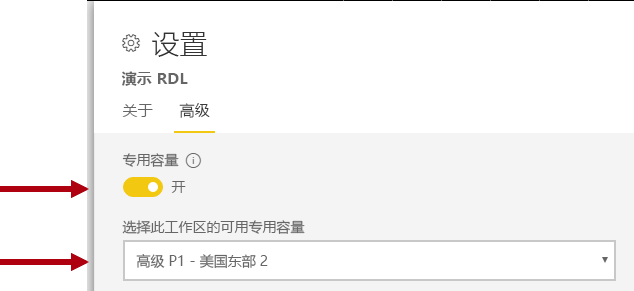

工作区管理员可以从容量 (到共享容量) 中删除工作区, 而无需分配权限。 从专用容量中删除工作区会有效地将工作区重定位到共享容量。 请注意, 从高级容量中删除工作区可能会产生负面后果, 例如, 在无法 Power BI 免费许可用户的共享内容中, 或在超过所支持的补助时暂停计划的刷新按共享容量。

在 Power BI 服务中, 分配给高级容量的工作区可以通过装饰工作区名称的菱形图标来进行识别。

### 监视容量

监视高级容量使管理员能够理解容量的执行情况。 可以通过使用[Power BI Premium 容量指标应用](service-admin-premium-monitor-capacity.md)或[Power BI 管理门户](service-admin-premium-monitor-portal.md)来监视容量。

#### 解释指标

应监视指标, 以了解资源使用情况和工作负荷活动。 如果容量变慢, 请务必了解要监视哪些指标以及可以进行的结论。

理想情况下, 查询应在一秒钟内完成, 以便向报表用户提供响应体验并实现更高的查询吞吐量。 当后台进程 (包括刷新) 需要更长时间才能完成时, 这通常是很少的问题。

通常, 较慢的报表可能表示过度加热的容量。 当报表无法加载时, 这表明出现过多的容量。 在任一情况下, 根本原因可能由多种因素引起, 其中包括:

- 如果**查询失败**, 则表示内存不足, 并且无法将模型加载到内存中。 Power BI 服务将在失败前的30秒内尝试加载一个模型。

- **过长的查询等待时间**可能是由于以下几个原因:
  - Power BI 服务首先逐出模型, 然后加载要查询的模型 (回想一下, 单独的数据集逐出率并不是容量压力的指示, 除非附带长时间查询等待时间来表明内存已失效)
  - 模型加载时间 (尤其是等待将大型模型加载到内存中)
  - 长时间运行的查询
  - LC\DQ 连接太多 (超出容量限制)
  - CPU 饱和
  - 页面上具有大量视觉对象的复杂报表设计 (回想一下, 每个视觉对象都是一个查询)
- **长查询持续时间**可能指示模型设计未进行优化, 特别是在容量中有多个数据集处于活动状态, 而只是一个数据集产生长查询持续时间时。 这表明, 容量足以获得足够的资源, 而问题的数据集是不变的, 也是很慢。 长时间运行的查询可能会出现问题, 因为它们会阻止对其他进程所需的资源的访问。
- **长时间刷新等待时间或 AI 调用等待时间**表示内存不足, 因为有大量消耗内存的活动模型, 或者有问题的刷新阻止了其他刷新 (超出了并行刷新限制)。

"[优化高级容量](#optimizing-premium-capacities)" 一节中介绍了如何使用指标的更详细说明。

## 优化高级容量

当出现高级容量性能问题时, 一种常见的第一种方法是优化或调整已部署的解决方案, 以还原可接受的响应时间。 重写的基本原理是为了避免购买额外的高级容量, 除非可以进行调整。

需要额外的高级容量时, 将在本节后面部分将讨论以下两个选项:

- 纵向扩展容量
- 添加新的高级容量

最后, 测试方法和高级容量调整将在此部分结束。

### 一般最佳实践

在努力实现最佳利用率和性能时, 有一些最佳实践可作为一般建议在板上执行。 这些问题包括：

- 使用应用工作区而不是个人工作区
- 将业务关键和自助服务 BI (SSBI) 分成不同的容量

  

- 如果仅与 Power BI Pro 用户共享内容, 则可能无需将内容存储在专用容量中
- 要实现特定的刷新时间时, 或在需要特定功能 (例如大型数据集或分页报表) 时使用专用容量

### 解决常见问题

优化 Power BI Premium 部署是一个复杂的主题, 涉及了解工作负荷要求、可用资源及其有效使用。

本主题介绍7个常见的支持问题, 其中描述了可能的问题和解释, 以及有关如何识别和解决这些问题的信息。

#### 为什么容量较慢, 我该怎么办？

有很多原因会导致较慢的高级容量。 此问题需要进一步的信息, 以了解什么是慢速的。 报表加载速度太慢？ 或者是否无法加载？ 当用户与报表进行交互时, 报表视觉对象的加载或更新速度较慢？ 刷新完成时间比预期时间长, 或以前是否有经验？

了解原因后, 便可以开始调查。 对以下六个问题的响应将帮助你解决更具体的问题。

#### 哪些内容使用了我的容量？

你可以使用**Power BI Premium 容量指标**应用按容量筛选, 并查看工作区内容的性能度量值。 对于存储在高级容量中的所有内容, 可以查看过去7天内的时间的性能指标和资源使用情况。 这通常是在解决有关高级容量性能的一般问题时要采取的第一步。

要监视的关键指标包括:

- 平均 CPU 和高利用率计数
- 特定数据集、数据流和分页报表的平均内存和高利用率计数以及内存使用情况
- 在内存中加载的活动数据集
- 平均查询持续时间和最大持续时间
- 平均查询等待时间
- 数据集和数据流的平均刷新时间
- AI 调用时间和等待时间的平均值

此外, 在 Power BI Premium 容量度量值应用中, 活动内存显示分配给无法逐出的报表的内存总量, 因为在过去三分钟内正在使用该报表。 刷新等待时间的高峰值可能与大和/或活动数据集相关联。

"按平均持续时间列出的前5个" 图表突出显示了使用容量资源的前5个数据集、分页报表、数据流和 AI 调用。 前五个列表中的内容是调查和可能优化的候选项。

#### 为什么报表的速度较慢？

下表显示了可能出现的问题以及如何识别和处理它们。

##### 容量资源不足

| 可能的解释 | 如何识别 | 如何解决 |
| --- | --- | --- |
| 高总活动内存 (无法逐出模型, 因为它在过去3分钟内正在使用)   查询等待时间有多大峰值   刷新等待时间有多大峰值 | 监视内存度量\[值[18](#endnote-18)\], 逐出计数\[为[19](#endnote-19)\] | 减小模型大小或转换为 DirectQuery 模式-请参阅本节中的[优化模型](#optimizing-models)主题   增加容量   将内容分配到不同的容量 |

##### 低效报表设计

| 可能的解释 | 如何识别 | 如何解决 |
| --- | --- | --- |
| 报表页面包含大量视觉对象 (交互式筛选每个视觉对象至少可触发一个查询)   视觉对象检索的数据多于必要 | 查看报表设计   会见报表用户, 了解他们如何与报表进行交互   监视器数据集查询\[指标[20](#endnote-20)\] | 重新设计每页视觉对象更少的报表 |

##### 数据集缓慢 (特别是报表以前已正常执行时)

| 可能的解释 | 如何识别 | 如何解决 |
| --- | --- | --- |
| 导入数据量越来越大   复杂或低效的计算逻辑, 包括 RLS 角色   模型未完全优化   (DQ/LC)网关延迟   缓慢的 DQ 源查询响应时间 | 查看模型设计   监视网关性能计数器 | 请参阅本节中的[优化模型](#optimizing-models)主题 |

##### 高并发报表使用情况

| 可能的解释 | 如何识别 | 如何解决 |
| --- | --- | --- |
| 较长的查询等待时间   CPU 饱和   超过 DQ/LC 连接限制 | 监视 CPU 利用率\[ [21](#endnote-21)\], 查询等待时间, 以及 DQ/LC 利用率\[ [22](#endnote-22) \]指标 + 查询持续时间-如果波动可能表示存在并发问题 | 增加容量, 或将内容分配给不同的容量   重新设计每页视觉对象更少的报表 |

#### 为什么报表无法加载？

当报表无法加载时, 这是最坏的情况, 请确保该容量的容量不足, 并通过加热。 如果正在主动查询所有加载的模型, 并且这些模型都已暂停或延迟, 则可能会发生这种情况。 Power BI 服务将尝试加载数据集30秒, 并向用户发出错误通知, 并稍后重试。

当前没有用于监视报表加载失败的指标。 可以通过监视系统内存 (特别是最高利用率和最高利用率时间) 来确定此问题的可能。 数据集逐出和长数据集刷新平均等待时间可能表明出现了此问题。

如果只是偶尔发生, 则不会将其视为优先问题。 系统会通知报表用户服务忙, 并应在短时间后重试。 如果这种情况过于频繁, 可以通过增加高级容量或通过将内容分配到不同的容量来解决该问题。

容量管理员 (和 Power BI 服务管理员) 可以监视**查询故障**指标来确定发生此情况的时间。 它们还可以重新启动容量, 并在系统过载情况下重置所有操作。

#### 为什么刷新不是按计划启动？

不保证计划的刷新开始时间。 回忆一下, Power BI 服务将始终优先处理后台操作的交互操作。 刷新是在满足以下两个条件时可能发生的后台操作:

- 内存充足
- 不超过高级容量支持的并发刷新数

如果不满足条件, 则刷新将排队, 直到满足条件。

若要进行完整刷新, 请记住至少需要两个当前数据集内存大小。 如果没有足够的内存可用, 则在模型逐出释放内存之前无法开始刷新-这意味着延迟, 直到一个或多个数据集处于非活动状态并且可以逐出。

请记住, 支持的最大并发刷新数设置为后端内核的1.5 倍, 向上舍入。

如果在下一次计划的刷新开始之前无法开始, 计划的刷新将失败。 从 UI 手动触发的按需刷新将在失败之前最多尝试运行三次。

容量管理员 (和 Power BI 服务管理员) 可以监视**平均刷新等待时间 (分钟)** 指标, 以确定计划时间和操作开始之间的平均滞后时间。

虽然通常不是管理优先级, 但要影响时间数据刷新, 请确保有足够的内存可用。 这可能涉及到具有已知足够资源的容量的数据集。 管理员也可以与数据集所有者协调, 以帮助错开或缩小计划的数据刷新时间, 以最大程度地减少冲突。 请注意, 管理员无法查看刷新队列, 也无法检索数据集计划。

#### 为什么刷新速度很慢？

刷新速度很慢, 或被视为速度缓慢 (如前面的常见问题)。

如果刷新的速度很慢, 则可能是由于以下几个原因:

- CPU 不足 (刷新可能占用大量 CPU)
- 内存不足, 导致刷新刷新 (这需要在条件适用于 recommence 时进行刷新)
- 非容量原因, 包括数据源系统响应能力、网络延迟、权限无效或网关吞吐量
- 数据量-配置增量刷新的合理原因, 如下所述

容量管理员 (和 Power BI 服务管理员) 可以监视**平均刷新持续时间 (分钟)** 指标, 以确定一段时间内进行比较的基准, 并使用**平均刷新等待时间 (分钟)** 指标来确定平均滞后时间计划时间与开始操作之间平均滞后时间。

增量刷新可显著减少数据刷新持续时间, 尤其是对于大型模型表。 增量刷新有四个优点:

- **刷新速度更快**:只有表的子集需要加载、减少 CPU 和内存使用率, 并且在刷新多个分区时并行性会更高
- **仅在需要时才进行刷新**:增量刷新策略可以配置为仅在数据已更改时加载
- **刷新更可靠**:与易失性数据源系统的更短的运行连接不太容易断开连接
- **模型仍是剪裁**的:增量刷新策略可以配置为在滑动时间范围外自动删除历史记录

有关详细信息, 请参阅[Power BI Premium 文档中的增量刷新](service-premium-incremental-refresh.md)。

#### 为什么无法完成数据刷新？

当数据刷新开始但无法完成时, 可能是由于以下几个原因:

- 内存不足, 即使高级容量中只有一个模型, 即模型大小太大
- 非容量原因, 包括数据源系统断开连接、权限无效或网关错误

容量管理员 (和 Power BI 服务管理员) 可以监视**因内存不足而导致的刷新失败**。

#### 为什么 AI 调用失败？

AI 调用可能会因多种原因而失败。 启动 AI 工作负载所需的最小内存为 5 GB, 但对于某些输入数据集, 这可能不够用。 例如, 自动机器学习模型定型至少需要两次, 有时会多次输入数据集的大小。 此外, 如果 AI 调用完成所需的时间超过两个小时, 则终止调用。 对于在两小时内未完成的自动机器学习模型定型调用, 返回在这两个小时内找到的最佳模型。  AI 调用也可能会被交互式请求中断, 这会优先处理。

管理员应监视 AI 等待时间的其他请求的顺序。 管理员还可以确保对于 AI 工作负荷而言, 相对于输入数据大小有足够的内存可用。 这可能涉及到将 AI 工作负荷隔离到已知资源充足的容量。 管理员也可以与数据流所有者协调, 以帮助错开或减少数据流刷新时间, 以最大程度地减少冲突。 请注意, 管理员无法查看 AI 呼叫队列。

### 优化模型

最佳模型设计对于提供高效且可缩放的解决方案至关重要。 不过, 这超出了本白皮书的范围, 无法提供完整的讨论。 相反, 此部分将提供优化模型时要考虑的关键方面。

#### 优化 Power BI 托管模型

可以在数据源和模型层中实现高级容量中托管的优化模型。

考虑导入模型的优化可能性:

在数据源层:

- 可以通过预先集成数据、应用适当的索引、定义与增量刷新周期对齐的表分区以及具体化计算 (替代计算结果), 对关系数据源进行优化, 以确保尽可能快地进行刷新。为表和列建模, 或将计算逻辑添加到视图
- 非关系数据源可以与关系存储预集成
- 确保网关具有足够的资源, 最好是在专用计算机上, 具有足够的网络带宽, 并接近于数据源

在模型层:

- Power Query 查询设计可以最大程度地减少或删除复杂的转换, 尤其是那些合并不同数据源的转换 (数据仓库在提取-转换-加载阶段实现此目的)。 此外, 请确保设置了适当的数据源隐私级别, 这可以避免需要 Power BI 加载完整结果来跨查询生成合并结果。
- 模型结构确定要加载的数据, 并直接影响模型大小。 它可以通过删除列、删除行 (特别是历史数据) 或通过加载汇总数据 (代价是加载详细数据) 来避免加载不必要的数据。 通过删除高基数列 (特别是文本列) 来实现极大的大小缩减, 这些列不会高效地存储或压缩。
- 可以通过配置单方向关系来改善模型查询性能, 除非存在允许双向筛选的有说服力的原因。 还应考虑使用 CROSSFILTER 函数而不是双向筛选。
- 聚合表可以通过加载预先汇总的数据来实现快速查询响应, 但这会增加模型的大小并导致刷新时间较长。 通常, 应为非常大的模型或复合模型设计保留聚合表。
- 计算表和列增加模型大小并导致刷新时间较长。 通常, 在数据源中具体化或计算数据时, 可以获得较小的存储大小和更快的刷新时间。 如果无法做到这一点, 则使用 Power Query 自定义列可提供改进的存储压缩。
- 可能有机会为度量值和 RLS 规则调整 DAX 表达式, 或许还可以重写逻辑以避免开销较高的公式
- 增量刷新可显著缩短刷新时间, 并节省内存和 CPU。 此外, 还可以将增量刷新配置为删除历史数据, 从而使模型大小剪裁。
- 当存在不同的、冲突的查询模式时, 可以将模型重新设计为两个模型。 例如, 某些报表显示了所有历史记录的高级聚合, 并且可以容忍24小时的延迟。 其他报表与今天的数据相关, 需要对单独的事务进行精细的访问。 为每个要求创建两个优化模型, 而不是设计一个模型来满足所有报表的要求。

请考虑 DirectQuery 模型的优化可能性。 当模型发出对基础数据源的查询请求时, 数据源优化对于提供响应式模型查询至关重要。

 

在数据源层:

- 数据源可以经过优化, 以确保通过预先集成的数据 (这在模型层中不可能) 进行的最快查询, 应用适当的索引, 定义表分区, 具体化汇总数据 (使用索引视图) 和最大程度地减少计算量。 当传递查询只需筛选和执行索引表或视图之间的内部联接时, 就可以获得最佳体验。
- 确保网关具有足够的资源, 最好是在专用计算机上, 具有足够的网络带宽, 并接近于数据源

在模型层:

- Power Query 查询设计应最好地应用无转换, 否则尝试将转换保持为绝对最小值
- 可以通过配置单方向关系来改善模型查询性能, 除非存在允许双向筛选的有说服力的原因。 此外, 模型关系应配置为假设强制实施引用完整性 (如果是这种情况), 并且将导致数据源查询使用更高效的内部联接 (而不是外部联接)。
- 避免创建 Power Query 查询自定义列或模型计算列, 如有可能, 在数据源中具体化这些数据源
- 可能有机会为度量值和 RLS 规则调整 DAX 表达式, 或许还可以重写逻辑以避免开销较高的公式

考虑复合模型的优化可能性。 回忆一下, 复合模型启用了导入和 DirectQuery 表的组合。

- 通常, 适用于导入和 DirectQuery 模型的优化主题适用于使用这些存储模式的复合模型表。
- 通常, 通过将维度类型表 (表示业务实体) 配置为双存储模式并将事实类型表 (通常是大型表, 表示操作事实) 配置为 DirectQuery 存储模式, 从而实现均衡的设计。 双存储模式意味着导入和 DirectQuery 存储模式, 这允许 Power BI 服务确定在生成用于传递的本机查询时要使用的最有效的存储模式。
- 确保网关具有足够的资源, 最好是在专用计算机上, 具有足够的网络带宽, 并接近于数据源
- 在用于汇总 DirectQuery 存储模式事实类型表的情况下, 配置为导入存储模式的聚合表可以提供显著的查询性能增强功能。 在这种情况下, 聚合表会增加模型的大小并增加刷新时间, 这通常是可接受的平衡, 以实现更快的查询。

#### 优化外部托管模型

[优化 Power BI 托管模型](#optimizing-power-bi-hosted-models)主题中所述的许多优化可能还适用于使用 Azure Analysis Services 和 SQL Server Analysis Services 开发的模型。 清除异常是当前不支持的某些功能, 包括复合模型和聚合表。

外部承载的数据集的另一个注意事项是与 Power BI 服务相关的数据库。 对于 Azure Analysis Services, 这意味着在 Power BI 租户 (home 区域) 所在的同一区域中创建 Azure 资源。 对于 SQL Server Analysis Services, 对于 IaaS, 这意味着将 VM 托管在同一区域中, 并在本地托管 VM, 这意味着确保有效的网关设置。

下面可能需要注意的是, Azure Analysis Services 数据库和 SQL Server Analysis Services 表格数据库需要将它们的模型完全加载到内存中, 并且在任何时候都保留它们以支持查询。 与 Power BI 服务一样, 如果模型必须在刷新过程中保持联机状态, 则需要有足够的内存来进行刷新。 与 Power BI 服务不同的是, 模型不会根据使用情况自动老化或内存不足。 因此, Power BI Premium 提供了一种更有效的方法来最大程度地利用更低的内存。

### 容量规划

高级容量的大小决定了其可用的内存和处理器资源以及对容量施加的限制。 还需要考虑高级容量数量, 因为创建多个高级容量有助于隔离工作负荷。 请注意, 存储空间为每个容量节点 100 TB, 这可能会超出任何工作负荷的能力。

确定高级容量的大小和数量可能会很困难, 尤其是对于所创建的初始容量。 容量调整规模的第一步是了解表示预期的日常使用情况的平均工作负载。 必须了解的是, 并非所有工作负荷都相等。 例如, 在一到彩虹-100 的并发用户中, 访问单个包含一个视觉对象的报表页面很容易实现。 然而, 在大范围-100 并行用户访问100个不同的报表 (每个报表都有100视觉对象) 的情况下, 将对容量资源做出非常不同的需求。

因此, 容量管理员需要考虑许多特定于你的环境、内容和预期使用情况的因素。 覆盖目的是在提供一致的查询时间、可接受的等待时间和逐出率的同时, 最大限度地提高容量利用率。 需要考虑的因素包括:

- **模型大小和数据特征**:导入模型必须完全加载到内存中, 以允许查询或刷新。 LC/DQ 数据集可能需要大量处理器时间, 并且可能需要大量内存来评估复杂的度量值或 RLS 规则。 内存和处理器大小以及 LC/DQ 查询吞吐量受容量大小的限制。
- **并发活动模型**:当不同的导入模型保持在内存中时, 并发查询会提供最佳的响应能力和性能。 应该有足够的内存来承载所有查询量大的模型, 并提供额外的内存用于刷新。
- **导入模型刷新**:Power Query 查询和计算表/列逻辑的刷新类型 (完整或增量)、持续时间和复杂性可能会影响内存, 尤其是处理器使用情况。 并发刷新受容量大小限制 (1.5 x 后端子内核, 向上舍入)。
- **并发查询**:当处理器或 LC/DQ 连接超出容量限制时, 许多并发查询可能会导致无响应的报表。 这对于包含多个视觉对象的报表页尤其如此。
- **数据流、分页报表和 AI 函数**:容量可配置为支持数据流、分页报表和 AI 函数, 每个功能都需要可配置的最大容量内存百分比。 内存会动态分配给数据流, 但会静态分配给分页报表和 AI 工作负荷。

除了这些因素以外, 容量管理员还可以考虑创建多个容量。 多个容量允许隔离工作负荷, 并且可以进行配置, 以确保优先级工作负荷有保障的资源。 例如, 可以创建两个容量来区分自助服务 BI (SSBI) 工作负载中的关键业务工作负荷。 业务关键型容量可用于隔离使用有保障资源的大型公司模型, 创作权限仅授予 IT 部门。 SSBI 容量可用于托管增长量更小的模型, 并将访问权限授予业务分析师。 SSBI 容量有时会遇到可容忍的查询或刷新等待。

随着时间的推移, 容量管理员可跨容量平衡工作区, 方法是在工作区之间移动内容, 或者在容量之间移动工作区, 或者通过放大或缩小容量。 通常, 若要承载更大的模型, 可以增加规模, 实现更高的并发性。

请记住, 购买许可证会为租户提供端核心。 购买**P3**订阅可用于创建一个或多达四个高级容量, 即 1 x P3 或 2 x P2, 或 4 x P1。 此外, 在将 P2 容量升迁到 P3 容量之前, 可以考虑将内核拆分为创建两个 P1 容量。

### 测试方法

确定容量大小时, 可以通过创建受控环境执行测试。 切实可行且经济的方法是创建 Azure (A Sku) 容量, 注意, P1 容量大小与 A4 容量相同, P2 和 P3 容量的大小分别为 A5 和 A6 容量相同。 可以快速创建 Azure 容量并按小时计费。 因此, 测试完成后, 可以轻松地将其删除以避免产生费用。

可以将测试内容添加到在 Azure 容量上创建的工作区, 然后, 在单个用户可以运行报表来生成查询的真实和典型工作负荷。 如果有导入模型, 还应同时执行每个模型的刷新。 然后, 可以使用监视工具来查看所有指标, 以了解资源利用率。

测试是可重复的, 这一点很重要:测试应运行多次, 并且每次都应提供大致相同的结果。 在实际的生产条件下, 可以使用这些结果的平均值来推断和估计工作负荷。

如果你已经拥有要为其加载测试的容量和报告, 请使用[PowerShell 负载生成工具](https://aka.ms/PowerBILoadTestingTool)快速生成负载测试。 利用该工具, 您可以估算每个报告的每个报告容量可在一小时内运行的实例数。 您可以使用该工具来评估您的能力, 以确定单个报表呈现的能力, 或者并行呈现几个不同的报表。 有关详细信息, 请参阅视频[Microsoft Power BI:高级容量](https://www.youtube.com/watch?time_continue=1860&v=C6vk6wk9dcw)。

若要生成更复杂的测试, 请考虑开发模拟实际工作负荷的负载测试应用程序。 有关详细信息, 请参阅网络研讨会[负载测试 Power BI 具有 Visual Studio 负载测试的应用程序](https://blogs.msdn.microsoft.com/charles_sterling/2018/04/04/webinar-load-testing-power-bi-applications-with-visual-studio-load-test/)。

## 探索现实情况

在本部分中, 将介绍几种真实的方案, 用于描述常见问题、如何识别问题, 以及如何帮助解决这些问题:

- [使数据集保持最新](#keeping-datasets-up-to-date)
- [标识响应缓慢的数据集](#identifying-slow-responding-datasets)
- [确定偶尔响应缓慢的数据集的原因](#identifying-causes-for-sporadically-slow-responding-datasets)
- [确定是否有足够的内存](#determining-whether-there-is-enough-memory)
- [确定是否有足够的 CPU](#determining-whether-there-is-enough-cpu)

与图表和表示例相关的步骤来自 Power BI 管理员有权访问的**Power BI Premium 容量指标应用**(应用)。

### 使数据集保持最新

在这种情况下, 当抱怨报表数据的用户出现了陈旧或 "过时" 时, 将触发调查。

在应用程序中, 管理员与**刷新**视觉对象进行交互, 并按**最大等待时间**统计信息的降序对数据集进行排序。 这有助于它们显示具有最长等待时间、按工作区名称分组的数据集。

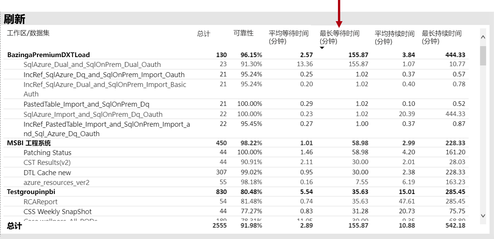

此外, 在每**小时的平均刷新等待时间**视觉上, 它们会注意到, 每日下午4点的刷新等待时间峰值始终为高峰。

对于这些结果, 有几个可能的说明:

- 可能同时发生太多刷新尝试, 超过了容量节点施加的限制 (使用默认内存分配的 P1 上6次并发刷新)

- 要刷新的数据集可能太大, 无法容纳在可用内存中 (至少需要2倍的完全刷新所需的内存)
- 在数据集刷新过程中, 可能会导致内存使用率峰值。 Power Query 在繁忙的容量上, 这可能会达到物理限制, 导致刷新失败, 并且可能会影响容量上的其他报表视图操作。
- 经常查询的需要保留在内存中的数据集可能会影响其他数据集的功能, 因为可用内存有限

为了帮助调查这一点, Power BI 管理员可以查找:

- 数据刷新时的可用内存量小于要刷新的数据集的大小的2倍
- 刷新前未刷新但在内存中不在内存中的数据集, 但在重刷新时间内开始显示交互式流量。 若要查看在任意给定时间将哪些数据集加载到内存中, Power BI 管理员可以通过单击**每小时加载的数据集计数**中的某个条形, 查看应用中 "**数据集**" 选项卡的 "数据集" 区域并交叉筛选到给定的时间。 本地峰值 (如下图所示) 表示将多个数据集加载到内存中时的小时数, 这可能会延迟计划的刷新的开始
- 在数据刷新计划启动时, 增加了数据集逐出, 这表示在刷新之前提供过多的不同交互式报表, 导致内存不足。 **每小时数据集逐出和内存占用**视觉对象可以清楚地指示逐出中的峰值。

下图显示了已加载的数据集中的本地峰值, 这会建议交互式查询延迟启动刷新。 如果选择 "**每小时加载的数据集计数**", 则视觉对象将交叉筛选**数据集大小**视觉对象。

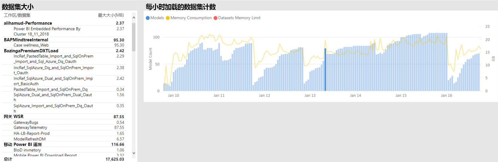

Power BI 管理员可以通过执行以下步骤来解决此问题: 执行以下步骤, 以确保可通过以下步骤来启动数据刷新:

- 联系数据集所有者并要求它们错开和缩小数据刷新计划
- 通过删除不必要的仪表板或仪表板磁贴来减少数据集查询加载, 尤其是强制执行行级别安全性的仪表板
- 通过优化 Power Query 逻辑、模型计算列或表、减少数据集大小或配置更大的数据集以执行增量数据刷新, 加速数据刷新

### 标识响应缓慢的数据集

在此方案中, 当用户抱怨某些报表需要很长时间才能打开时, 就会触发调查, 有时会挂起。

在应用程序中, Power BI 管理员可以使用**查询持续**时间视觉对象通过按**平均持续时间**对数据集进行排序来确定最差的性能数据集。 此视觉对象还显示数据集查询计数, 以便您可以查看数据集的查询频率。

Power BI 管理员可以引用**查询持续时间分布**视觉对象, 该视觉对象显示筛选的时间段内分段查询性能 (< = 30ms, 0-100ms, 等等) 的总体分布。 通常情况下, 使用1秒或更少的查询被视为由大多数用户进行响应;花费较长时间的查询往往会使性能不佳。

**每小时查询持续时间分布**直观允许 Power BI 管理员识别一小时内的容量性能可能会被视为差。 表示查询持续时间超过一秒的条形段越大, 用户将发现性能不佳的风险越大。

视觉对象是交互式的, 当选择一段条形时, 将交叉筛选报表页上的相应**查询持续**时间表视觉对象以显示它表示的数据集。 这种交叉筛选允许 Power BI 管理员轻松地识别哪些数据集响应速度缓慢。

下图显示了按小时**查询持续时间分布**的视觉对象, 它将重点放在一小时的存储桶中最差的性能数据集。 

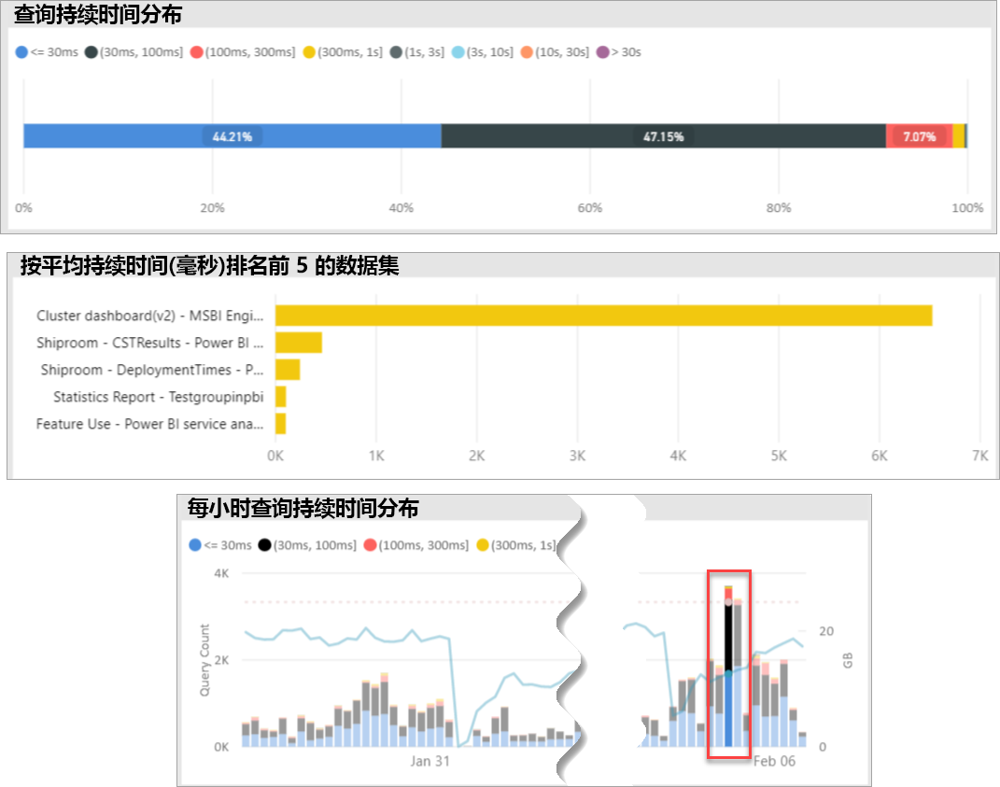

一旦确定了特定1小时的时间跨度中性能不佳的数据集, Power BI 管理员就可以调查性能不佳是否是由重载容量引起的, 或者是由于数据集或报表设计不当造成的。 为此, 他们可以引用**查询等待时间**视觉对象, 并按平均查询等待时间对数据集进行排序。 如果大量的查询正在等待, 则很可能是因为对数据集的需求很高, 原因很多。 如果平均查询等待时间是巨大的 (> 100ms), 则可能需要查看数据集和报告, 以查看是否可以进行优化。 例如, 对于给定的报表页或 DAX 表达式优化, 视觉对象可能更少。

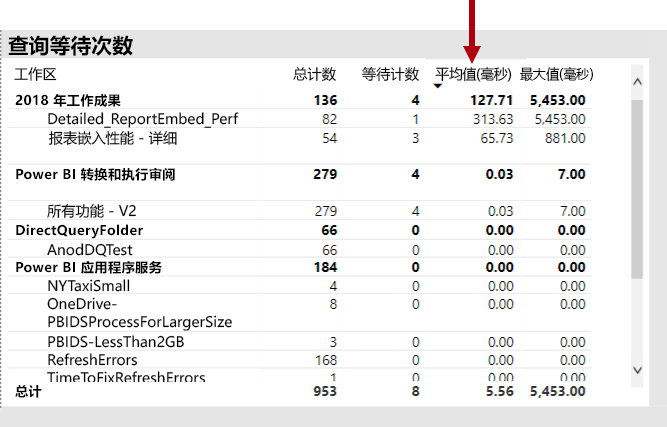

在数据集中生成查询等待时间的可能原因有几个:

- 不太好的模型设计、度量表达式甚至是报表设计-所有可能会影响长时间运行的查询 (消耗高级别 CPU) 的情况。 这会强制新的查询一直等待, 直到 CPU 线程变为可用, 并可以创建一个在高峰时段内经常见到的保护效果 (思考交通堵塞)。 **查询等待**页将是主资源, 以确定数据集的平均查询等待时间是否较长。
- 大量使用同一报表或数据集的并发容量用户 (数百到数千个)。 即使是设计良好的数据集, 也可能会在并发阈值之外执行错误。 这通常由单个数据集指示, 该数据集显示的查询计数值大大高于其他数据集显示的值 (即, 与所有其他数据集的 < 30000 查询相比, 30 万个查询一个数据集)。 在某些时候, 查询等待此数据集将开始错开, 这会在**查询持续**时间视觉对象中出现。
- 并发查询许多不同的数据集, 导致数据集频繁地在内存中出现循环的情况。 这会导致用户在将数据集加载到内存中时性能降低。 为确认这一点, Power BI 管理员可以引用**每小时数据集逐出和内存占用**视觉对象, 这可能表示加载到内存中的大量数据集被反复逐出。

### 确定偶尔响应缓慢的数据集的原因

在这种情况下, 当用户描述报表视觉对象有时感觉速度缓慢或无响应时, 就会触发调查, 但在其他情况下, 他们会可接受响应。

在应用程序中, "**查询持续**时间" 部分用于按以下方式查找操作程序数据集:

- 在**查询期间**, 按数据集直观显示管理员筛选的数据集 (从查询的顶部数据集开始), 并检查**每小时查询分发**视觉对象中的交叉筛选栏。
- 当一小时的时间条显示了所有查询持续时间组与此数据集的其他一个小时条形 (即, 颜色间的比率大幅变化) 之间的比率的重大变化时, 这意味着此数据集在性能.
- 显示性能不佳的查询的不稳定部分的一小时条, 指示数据集受干扰性邻居影响 (由其他数据集活动导致) 影响的 timespan。

下图在1月30日显示了一小时, 在此时间内, 数据集的性能发生了重要的退步, 以 "(3, 数十]" 的执行持续时间存储桶的大小表示。 单击该时间栏将显示在该时间段内加载到内存中的所有数据集, 从而使候选原因数据集呈现导致干扰性的邻居效果。

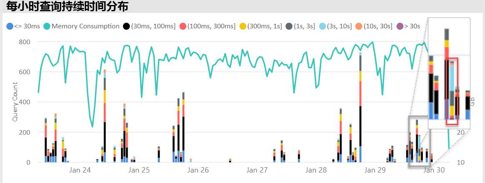

确定问题时间跨度之后 (例如, 在上图中的1月30日), Power BI 管理员可以删除所有数据集筛选器, 然后仅筛选该 timespan, 以确定在此时间内主动查询的数据集。 干扰性邻居效果的原因数据集通常是查询最多的数据集或平均查询持续时间最长的数据集。

此问题的解决方法是在不同高级容量上的不同工作区上分发问题数据集, 或者在支持数据集大小、消耗要求和数据刷新模式时, 在共享容量上分发这些数据集。

反之亦然也是如此。 Power BI 管理员可以确定数据集查询性能大幅提高的时间, 并查找丢失的内容。 如果在该点缺少某些信息, 则可能有助于指出引起的问题。

### 确定是否有足够的内存

若要确定是否有足够的内存来完成其工作负荷, Power BI 管理员可以在应用的 "**数据集**" 选项卡中引用已**使用的内存百分比**视觉对象。 **全部**(total) memory 表示加载到内存中的数据集使用的内存, 而不考虑它们是主动查询还是处理的。 **活动**内存表示当前正在处理的数据集消耗的内存。

在正常容量中, 视觉对象如下所示, 显示所有 (总计) 和活动内存之间的间隔:

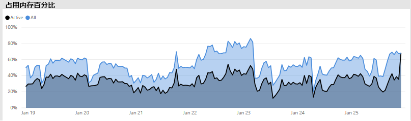

在遇到内存不足的容量的情况下, 相同的视觉对象将清楚地显示活动内存和总内存聚合, 这意味着在该时间点无法将其他数据集加载到内存中。 在这种情况下, Power BI 管理员可以在管理门户的 "容量设置" 区域的 "**高级选项**" 中单击 "**容量重启**"。 重新启动容量将导致从内存中刷新所有数据集, 并根据需要将其重新加载到内存中 (通过查询或数据刷新)。

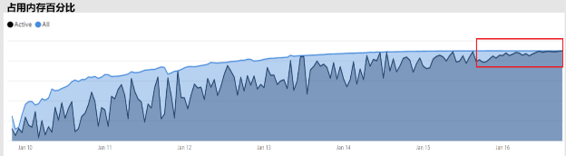

### 确定是否有足够的 CPU

通常, 容量的平均 CPU 使用率应保持低于 80%。 超出此值意味着容量接近 CPU 饱和。

CPU 饱和的影响取决于由于容量在尝试处理所有操作时执行许多 CPU 上下文切换, 操作所用的时间比预期时间长。 在具有大量并发查询的高级容量中, 这种查询等待时间很长。 较长的查询等待时间的结果比平时慢。 通过查看**每小时查询等待时间分布**视觉对象, Power BI 管理员可以轻松地识别 CPU 何时饱和。 查询等待时间计数的定期峰值指示潜在的 CPU 饱和。

如果后台操作导致 CPU 饱和, 有时会在后台操作中检测到类似的模式。 Power BI 管理员可以在刷新时间内查找特定数据集的定期高峰, 这可能指示时间 CPU 饱和 (可能是由于其他正在进行的数据集刷新和/或交互式查询引起)。 在此实例中, 在应用程序中引用**系统**视图可能不一定会显示 CPU 处于 100%。 **系统**视图显示每小时平均值, 但 CPU 可能会变得饱和几分钟, 较长的操作会在等待时间中显示为高峰。

查看 CPU 饱和效果有更多的细微差别。 尽管等待的查询数非常重要, 但查询等待时间将始终发生在某个范围内, 而不会导致明显性能下降。 某些数据集 (具有更长的平均查询时间, 指示复杂性或大小) 比其他数据集更容易出现 CPU 饱和的影响。 为了轻松识别这些数据集, Power BI 管理员可以在**每小时等待时间分布**视觉对象中查找条形的颜色组合中的变化。 在发现为离群栏后, 用户可以在该时间段内查找具有查询等待的数据集, 并查看平均查询等待时间 (与平均查询持续时间相比)。 如果这两个指标的大小相同, 并且该数据集的查询工作负荷不重要, 则很可能是因为该数据集的 CPU 不足。

当多个用户 (即在定型会话中) 的高频突发查询使用数据集时, 这种效果尤其明显, 导致每次突发时出现 CPU 饱和。 在这种情况下, 可能会遇到此数据集的大量查询等待时间, 并对容量中的其他数据集 (干扰邻居效果) 产生影响。

在某些情况下, Power BI 管理员可以通过创建仪表板来请求数据集所有者创建更少的可变查询工作负荷 (使用缓存磁贴的任何数据集刷新来定期查询) 而不是报表。 这有助于防止加载仪表板时出现高峰。 此解决方案对于给定的业务要求并非总是可行的, 但它可能是避免 CPU 饱和的有效方法, 不会更改数据集。

## 结束语

Power BI Premium 提供更一致的性能、支持大型数据卷, 并为组织中的每个人提供统一的自助服务和企业 BI 平台的灵活性。 此级别的300技术白皮书专门为 Power BI 管理员和内容作者和出版商编写。 它旨在帮助他们了解 Power BI Premium 的潜力, 并说明如何设计、部署、监视可伸缩解决方案并对其进行故障排除。

若要部署和管理 Power BI Premium 容量, 管理员和模型开发人员需要非常好地了解容量功能、如何管理和监视这些功能, 以及如何对模型进行优化, 以便适当地响应出现性能问题和瓶颈。

## 结束注释

\[1\]此技术文章涉及的 Power BI Premium 仅 Power BI 云服务支持, 因此 Power BI 报表服务器不在作用域内, 但在某些情况下, 不在范围内 Power BI 报表服务器。Power BI Premium Sku。

\[2\]在代表应用程序用户嵌入内容时, 作为云服务 Power BI 是平台即服务 (PaaS)。 可以通过不同的两种产品来实现这种类型的嵌入, 其中一种是 Power BI Premium。

\[3\]推送、流式传输和混合数据集不会存储在高级容量中, 因此, 在部署、管理和监视高级容量时不会考虑这一点。

\[4\]作为 Power BI 内容类型的 Excel 工作簿不会存储在高级容量中, 因此, 在部署、管理或监视高级容量时不会考虑这一点。

\[5\]视觉对象可配置为忽略切片器交互。 有关详细信息, 请参阅[Power BI 报表文档中的可视化交互](service-reports-visual-interactions.md)。

\[6\]大小的差异可以通过将 Power BI Desktop 文件大小与用于文件的任务管理器内存进行比较来确定。

\[7\]对 Microsoft 数据源的支持包括 SQL Server、azure 数据程序块、Azure HDInsight Spark (测试版)、azure sql 数据库和 azure sql 数据仓库。 有关其他源的信息, 请参阅[Power BI 文档中的直接查询支持的数据源](desktop-directquery-data-sources.md)。

\[8\] Power BI Premium 支持上传 Power BI Desktop (.pbix) 文件, 最大大小为 10 GB。 上传后, 数据集的大小可以增长到最大为 12 GB, 因为进行刷新。 最大上载大小因 SKU 而异。 有关详细信息, 请参阅[Power BI Premium 支持大型数据集](service-premium-large-datasets.md)文档。

\[9\]个小于四个双核的 sku 不在专用基础结构上运行。 这包括 EM1、EM2、A1 和 A2 Sku。

\[10\]虽然很少见, 但由于服务操作的原因, 模型可能会从内存中卸载。

\[11\]这些时间随时可能更改。

\[12\]这称为多地域, 目前为预览版。 多地域部署的基本原理通常适用于公司或政府的符合性, 而不是性能和缩放性。 报表和仪表板加载仍涉及到用于元数据的主区域的请求。 有关详细信息, 请参阅[Power BI Premium (预览版) 文档的多地理支持](service-admin-premium-multi-geo.md)。

\[13\]通过使用作业重载 Power BI 服务、编写过于复杂的查询、创建循环引用等, 用户可能会造成性能问题。

\[14\]建议不要使用分配整个组织的工作区的选项, 而最好的方法是使用更有针对性的方法。 通常情况下, 将个人工作区用于生产内容并不是最佳做法。

\[15\]可以在应用或 Azure 门户中监视 sku, 但不能在 Power BI 管理门户中监视 sku。 若要监视 Sku, 如果未将应用添加到资源的 "读取者" 角色, 则报表刷新将失败。 有关详细信息, 请参阅[监视器 Power BI Premium 和 Power BI Embedded 容量](service-admin-premium-monitor-capacity.md)文档。

\[当\] CPU 或内存不足以启动时, 16 次刷新可能会等待。

\[17\]内存中的数据集大小可以大于磁盘上的大小, 最大为 20%。

\[18\]个平均内存使用率 (gb) 和最高内存消耗 (gb)

\[19\] Dataset 逐出

\[20\]个数据集查询, 数据集平均查询持续时间 (毫秒), 数据集等待计数, 数据集平均等待时间 (毫秒)

\[21\] cpu 高利用率计数和使用率最高的 cpu 时间 (过去7天)

\[22\] DQ/lc 高利用率计数和最高利用率的 dq/lc 时间 (过去7天)